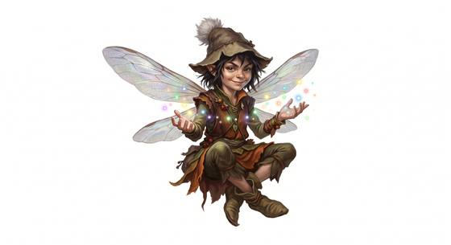

# Fairy folk

{.illus}

*Set: Core*

*aka: ______________________________*

*Family: [Fey](../Species_Families/fey.md)*

Tiny winged people, small enough to sit on a mushroom and quick enough to dart through a keyhole. Their wings may be dragonfly-clear or bright as a butterfly's, and they hum or chime as they fly. They are made of mischief and a little magic: a glamour to make a stone look like gold, a charm to set a traveller dancing, an illusion that turns the forest path in circles.

Most are harmless and some are kind. They guard woodland glades, help lost children home, and reward those who leave out milk and honey. Some are simply naughty, souring milk and tangling horses' manes. A few fairy societies are said to hide deep underground, far more organised than the pixies of village stories, with a strict order of their own and wonders stranger than any village tale. Those rarely show themselves to mortals at all.

## Not to be confused with

*[tiny winged folk](fey-tiny-winged-folk.md)*, small winged people with no fey blood; fairy folk are true fey, full of glamour and mischief.

## What sets this species apart

Small winged fey that fly. Hidden-technology gear of some fairy societies is gear, not species.

## Breeds and races

Each block below is one set of numbers; breeds that share every number share a block (Species rules, rule 9). Attributes are final modifiers, the size trade-off included. Skills, powers and weapon groups are final levels after the family, species and breed layers.

### Hidden-tech fairy folk *(NPC only)*

- **Size:** small · **Body:** biped+winged
- **Attributes:** STR −2 AGI +2 END −1 INT +1 CHA +2
- **Skills:** [Charm & Seduction](../Skills/charm-and-seduction.md) +2, [Otherworldly Dealings](../Skills/otherworldly-dealings.md) +2, [Dance](../Skills/dance.md) +1, [Deception](../Skills/deception.md) +1, [Wit & Mockery](../Skills/wit-and-mockery.md) +1, [Bookkeeping](../Skills/bookkeeping.md) −1, [Religion & Theology](../Skills/religion-and-theology.md) −1, [Blacksmithing](../Skills/blacksmithing.md) Foreign Concept
- **Powers:** [Flight](../Powers/flight.md) 2, [Glamour](../Powers/glamour.md) 2, [Second Sight](../Powers/second-sight.md) 1
- **For the Game Master only, this race as an NPC guard or soldier (not your character's numbers):** Attack 14 · Parry 11 · Dodge 11 · Damage longsword 1d6+1 · Armour 2 · Life 14 · Threat 1 ([Bestiary roles](../bestiary.md))
- *Why:* Same as its species; their hidden technology is gear.

### No. 431 Tiny winged fey *(genres: fairy tale and folklore; starter)*

- **Size:** tiny · **Body:** biped+winged
- **What it's like:** Tiny winged sprites who fly, play tricks and weave small illusions. (looks like: fairy; good at: flying, powers and magic, people and talk)
- **Attributes:** STR −3 AGI +3 END −1 CHA +2
- **Skills:** [Charm & Seduction](../Skills/charm-and-seduction.md) +2, [Otherworldly Dealings](../Skills/otherworldly-dealings.md) +2, [Dance](../Skills/dance.md) +1, [Deception](../Skills/deception.md) +1, [Wit & Mockery](../Skills/wit-and-mockery.md) +1, [Bookkeeping](../Skills/bookkeeping.md) −1, [Religion & Theology](../Skills/religion-and-theology.md) −1, [Blacksmithing](../Skills/blacksmithing.md) Foreign Concept
- **Powers:** [Flight](../Powers/flight.md) 2, [Glamour](../Powers/glamour.md) 2, [Minor Illusion](../Powers/minor-illusion.md) 1, [Second Sight](../Powers/second-sight.md) 1
- **For the Game Master only, this race as an NPC guard or soldier (not your character's numbers):** Attack 14 · Parry 11 · Dodge 13 · Damage longsword 1d6+1 · Armour 2 · Life 12 · Threat 1 ([Bestiary roles](../bestiary.md))
- *Why:* Minor illusions to lead travellers astray.

