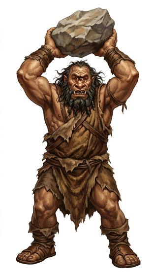

# Cyclops-kind

{.illus}

*Set: Expansion*

*aka: ______________________________*

*Family: [Giant-kind](../Species_Families/giant-kind.md)*

Giants with a single great eye in the middle of the forehead. In the old stories they are master smiths, hammering out thunder at the roots of volcanoes, or lonely shepherds on island cliffs who are best defeated by cleverness, since fighting them is hopeless. Some are cursed to know the day they will die, and are driven away by their own kind for it, and wander in melancholy.

The single eye sees sharply but cannot judge distance well. A cyclops misjudges a jump, reaches past a cup, and throws stones that miss by a stride. Smaller cyclops folk living among other peoples are famous for being clumsy and near-sighted, and famous too for the strength that makes up for it. They make patient, careful craftsmen, and poor archers.

## Not to be confused with

*[giant-kind](../Species_Families/giant-kind.md)*, the broad family of true giants; the cyclopes are marked by one eye and the poor sense of distance that comes with it.

## What sets this species apart

One central eye gives poor depth perception. One eye: poor depth perception spoils hurling too.

## Breeds and races

Each block below is one set of numbers; breeds that share every number share a block (Species rules, rule 9). Attributes are final modifiers, the size trade-off included. Skills, powers and weapon groups are final levels after the family, species and breed layers.

### One-eyed smith giant *(NPC only)*

- **Size:** huge · **Body:** biped
- **Attributes:** STR +7 AGI −4 END +2 INT −1
- **Skills:** [Lifting & Carrying](../Skills/lifting-and-carrying.md) +3, [Blacksmithing](../Skills/blacksmithing.md) +2, [Intimidation](../Skills/intimidation.md) +2, [Construction](../Skills/construction.md) +1, [Herding & Husbandry](../Skills/herding-and-husbandry.md) +1, [Metallurgy](../Skills/metallurgy.md) +1, [Stonemasonry](../Skills/stonemasonry.md) +1, Perception (attribute) −1, [Disguise](../Skills/disguise.md) −2, [Sleight of Hand](../Skills/sleight-of-hand.md) −2, [Throwing](../Skills/throwing.md) −2, [Stealth](../Skills/stealth.md) −3, [Riding](../Skills/riding.md) Foreign Concept
- **Powers:** [Toughness](../Powers/toughness.md) 2
- **Weapon groups:** [Thrown Weapons](../Weapon_Groups/thrown-weapons.md) −1
- **For the Game Master only, this race as an NPC guard or soldier (not your character's numbers):** Attack 15 · Parry 12 · Dodge 2 · Damage longsword 1d6+2 · Armour 2 · Life 31 · Threat 2 ([Bestiary roles](../bestiary.md))
- *Why:* Master smiths of the forge.

### One-eyed cyclops (cursed) *(NPC only)*

- **Size:** large · **Body:** biped
- **Attributes:** STR +5 AGI −2 END +2 INT −1
- **Skills:** [Lifting & Carrying](../Skills/lifting-and-carrying.md) +3, [Intimidation](../Skills/intimidation.md) +2, [Construction](../Skills/construction.md) +1, [Herding & Husbandry](../Skills/herding-and-husbandry.md) +1, [Stonemasonry](../Skills/stonemasonry.md) +1, Perception (attribute) −1, [Disguise](../Skills/disguise.md) −2, [Sleight of Hand](../Skills/sleight-of-hand.md) −2, [Throwing](../Skills/throwing.md) −2, [Stealth](../Skills/stealth.md) −3, [Riding](../Skills/riding.md) Foreign Concept
- **Powers:** [Toughness](../Powers/toughness.md) 2
- **Weapon groups:** [Thrown Weapons](../Weapon_Groups/thrown-weapons.md) −1
- **For the Game Master only, this race as an NPC guard or soldier (not your character's numbers):** Attack 15 · Parry 12 · Dodge 5 · Damage longsword 1d6+2 · Armour 2 · Life 27 · Threat 2 ([Bestiary roles](../bestiary.md))
- *Why:* Differs only in the curse of knowing his own death day and his exile (lexicon matter).

### One-eyed giant shepherd *(NPC only)*

- **Size:** huge · **Body:** biped
- **Attributes:** STR +7 AGI −4 END +2 INT −3
- **Skills:** [Lifting & Carrying](../Skills/lifting-and-carrying.md) +3, [Herding & Husbandry](../Skills/herding-and-husbandry.md) +2, [Intimidation](../Skills/intimidation.md) +2, [Construction](../Skills/construction.md) +1, [Stonemasonry](../Skills/stonemasonry.md) +1, Perception (attribute) −1, [Disguise](../Skills/disguise.md) −2, [Sleight of Hand](../Skills/sleight-of-hand.md) −2, [Throwing](../Skills/throwing.md) −2, [Stealth](../Skills/stealth.md) −3, [Riding](../Skills/riding.md) Foreign Concept
- **Powers:** [Toughness](../Powers/toughness.md) 2
- **Weapon groups:** [Thrown Weapons](../Weapon_Groups/thrown-weapons.md) −1
- **For the Game Master only, this race as an NPC guard or soldier (not your character's numbers):** Attack 15 · Parry 12 · Dodge 2 · Damage longsword 1d6+2 · Armour 2 · Life 31 · Threat 2 ([Bestiary roles](../bestiary.md))
- *Why:* Giant shepherds of flocks.

### No. 468 Clumsy one-eyed cyclops folk *(genres: myth and legend)*

- **Size:** medium · **Body:** biped
- **What it's like:** A one-eyed cyclops, clumsy and short-sighted but strong enough to make up for it. (looks like: giant; good at: strength, toughness)
- **Attributes:** STR +3 AGI −3 END +2 INT −1
- **Skills:** [Lifting & Carrying](../Skills/lifting-and-carrying.md) +3, [Intimidation](../Skills/intimidation.md) +2, [Construction](../Skills/construction.md) +1, [Herding & Husbandry](../Skills/herding-and-husbandry.md) +1, [Stonemasonry](../Skills/stonemasonry.md) +1, [Balance](../Skills/balance.md) −1, Perception (attribute) −1, [Disguise](../Skills/disguise.md) −2, [Sleight of Hand](../Skills/sleight-of-hand.md) −2, [Throwing](../Skills/throwing.md) −2, [Stealth](../Skills/stealth.md) −3, [Riding](../Skills/riding.md) Foreign Concept
- **Powers:** [Toughness](../Powers/toughness.md) 2
- **Weapon groups:** [Thrown Weapons](../Weapon_Groups/thrown-weapons.md) −1
- **For the Game Master only, this race as an NPC guard or soldier (not your character's numbers):** Attack 14 · Parry 11 · Dodge 5 · Damage longsword 1d6+2 · Armour 2 · Life 23 · Threat 2 ([Bestiary roles](../bestiary.md))
- *Why:* Near-sighted, clumsy modern cyclopes.

