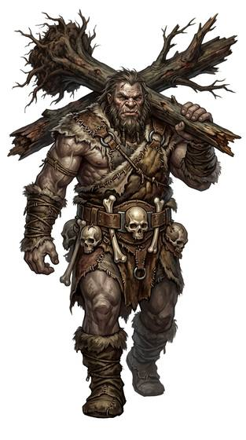

# Giant-kind

{.illus}

*Set: Expansion*

*aka: ______________________________*

*Family: [Giant-kind](../Species_Families/giant-kind.md)*

The true giants: people as tall as a house or taller, with the strength to pull up a tree or throw a boulder across a valley. They come in many kinds. Hill giants are dim, lazy and dangerous; frost giants rule the ice in stern hierarchies and hate the gods of warmer lands; fire and stone giants are forge-masters or berserkers; two-headed giants argue with themselves. There are shaggy wild men who herd goats on the high moors, and gentle artisan giants who sing their buildings into being and weep for felled forests.

Most giants live far from smaller peoples, and with reason. Legends credit them with raising standing stones in a single night, and blame them for many a missing flock. Smaller folk fear them, hire them, trick them, and are forever telling stories about them.

## Not to be confused with

*[titan-kind](giant-kind-titan-kind.md)*, the primordial giants of cosmic power; true giants are mortal, earthy people, however huge.

## What sets this species apart

The true giants the family describes; no species-wide differences.

## Breeds and races

Each block below is one set of numbers; breeds that share every number share a block (Species rules, rule 9). Attributes are final modifiers, the size trade-off included. Skills, powers and weapon groups are final levels after the family, species and breed layers.

### Brutish hill giant · Brutish castle-dwelling giants *(NPC only)*

- **Size:** huge · **Body:** biped
- **Attributes:** STR +7 AGI −4 END +2 INT −3 WIS −1
- **Skills:** [Lifting & Carrying](../Skills/lifting-and-carrying.md) +3, [Intimidation](../Skills/intimidation.md) +2, [Construction](../Skills/construction.md) +1, [Herding & Husbandry](../Skills/herding-and-husbandry.md) +1, [Stonemasonry](../Skills/stonemasonry.md) +1, [Disguise](../Skills/disguise.md) −2, [Sleight of Hand](../Skills/sleight-of-hand.md) −2, [Stealth](../Skills/stealth.md) −3, [Riding](../Skills/riding.md) Foreign Concept
- **Powers:** [Toughness](../Powers/toughness.md) 2
- **Weapon groups:** [Thrown Weapons](../Weapon_Groups/thrown-weapons.md) +1
- **For the Game Master only, this race as an NPC guard or soldier (not your character's numbers):** Attack 15 · Parry 12 · Dodge 2 · Damage longsword 1d6+2 · Armour 2 · Life 31 · Threat 2 ([Bestiary roles](../bestiary.md))
- *Brutish hill giant:* Differs only in lower intellect and a brutish, tribal temperament (attribute and lexicon matters).
- *Brutish castle-dwelling giants:* Differs only in dim wits, violent appetite and remote strongholds (attribute and lexicon matters).

### Frost giant *(NPC only)*

- **Size:** huge · **Body:** biped
- **Attributes:** STR +7 AGI −4 END +2 INT −1
- **Skills:** [Lifting & Carrying](../Skills/lifting-and-carrying.md) +3, [Intimidation](../Skills/intimidation.md) +2, [Survival: Arctic](../Skills/survival-arctic.md) +2, [Construction](../Skills/construction.md) +1, [Herding & Husbandry](../Skills/herding-and-husbandry.md) +1, [Stonemasonry](../Skills/stonemasonry.md) +1, [Disguise](../Skills/disguise.md) −2, [Sleight of Hand](../Skills/sleight-of-hand.md) −2, [Stealth](../Skills/stealth.md) −3, [Riding](../Skills/riding.md) Foreign Concept
- **Powers:** [Resist Element](../Powers/resist-element.md) 2, [Toughness](../Powers/toughness.md) 2, [Frost](../Powers/frost.md) 1
- **Weapon groups:** [Thrown Weapons](../Weapon_Groups/thrown-weapons.md) +1
- **For the Game Master only, this race as an NPC guard or soldier (not your character's numbers):** Attack 15 · Parry 12 · Dodge 2 · Damage longsword 1d6+2 · Armour 2 · Life 31 · Threat 2 ([Bestiary roles](../bestiary.md))
- *Why:* Cold-adapted giants with innate frost magic.
- *Note:* Resist Element is cold.

### Fire/stone giant *(NPC only)*

- **Size:** huge · **Body:** biped
- **Attributes:** STR +7 AGI −4 END +2 INT −1
- **Skills:** [Lifting & Carrying](../Skills/lifting-and-carrying.md) +3, [Intimidation](../Skills/intimidation.md) +2, [Construction](../Skills/construction.md) +1, [Herding & Husbandry](../Skills/herding-and-husbandry.md) +1, [Stonemasonry](../Skills/stonemasonry.md) +1, [Disguise](../Skills/disguise.md) −2, [Sleight of Hand](../Skills/sleight-of-hand.md) −2, [Stealth](../Skills/stealth.md) −3, [Riding](../Skills/riding.md) Foreign Concept
- **Powers:** [Resist Element](../Powers/resist-element.md) 2, [Toughness](../Powers/toughness.md) 2
- **Weapon groups:** [Thrown Weapons](../Weapon_Groups/thrown-weapons.md) +1
- **For the Game Master only, this race as an NPC guard or soldier (not your character's numbers):** Attack 15 · Parry 12 · Dodge 2 · Damage longsword 1d6+2 · Armour 2 · Life 31 · Threat 2 ([Bestiary roles](../bestiary.md))
- *Why:* Elemental giants who shrug off their own element.
- *Note:* Resist Element is fire for fire giants, or blows and earth-shock for stone giants; one element per character.

### Colossal giant *(NPC only)*

- **Size:** huge · **Body:** biped
- **Attributes:** STR +9 AGI −4 END +2 INT −1
- **Skills:** [Lifting & Carrying](../Skills/lifting-and-carrying.md) +3, [Intimidation](../Skills/intimidation.md) +2, [Construction](../Skills/construction.md) +1, [Herding & Husbandry](../Skills/herding-and-husbandry.md) +1, [Stonemasonry](../Skills/stonemasonry.md) +1, [Disguise](../Skills/disguise.md) −2, [Sleight of Hand](../Skills/sleight-of-hand.md) −2, [Stealth](../Skills/stealth.md) −3, [Riding](../Skills/riding.md) Foreign Concept
- **Powers:** [Toughness](../Powers/toughness.md) 2
- **Weapon groups:** [Thrown Weapons](../Weapon_Groups/thrown-weapons.md) +1
- **For the Game Master only, this race as an NPC guard or soldier (not your character's numbers):** Attack 15 · Parry 12 · Dodge 2 · Damage longsword 1d6+2 · Armour 2 · Life 31 · Threat 2 ([Bestiary roles](../bestiary.md))
- *Why:* Differs only in even greater size and strength and great age (attribute and lexicon matters).

### Two-headed ettin *(NPC only)*

- **Size:** huge · **Body:** biped
- **Attributes:** STR +7 AGI −4 END +2 INT −2 PER +1
- **Skills:** [Lifting & Carrying](../Skills/lifting-and-carrying.md) +3, [Intimidation](../Skills/intimidation.md) +2, [Construction](../Skills/construction.md) +1, [Herding & Husbandry](../Skills/herding-and-husbandry.md) +1, [Stonemasonry](../Skills/stonemasonry.md) +1, [Disguise](../Skills/disguise.md) −2, [Sleight of Hand](../Skills/sleight-of-hand.md) −2, [Stealth](../Skills/stealth.md) −3, [Riding](../Skills/riding.md) Foreign Concept
- **Powers:** [Toughness](../Powers/toughness.md) 2
- **Weapon groups:** [Thrown Weapons](../Weapon_Groups/thrown-weapons.md) +1
- **For the Game Master only, this race as an NPC guard or soldier (not your character's numbers):** Attack 15 · Parry 12 · Dodge 2 · Damage longsword 1d6+2 · Armour 2 · Life 31 · Threat 2 ([Bestiary roles](../bestiary.md))
- *Why:* Two heads keep watch in two directions at once.

### No. 451 Giant-blooded half-breed *(genres: classic fantasy)*

- **Size:** large · **Body:** biped
- **What it's like:** A gentle, immensely strong half-giant, more docile than fierce despite the muscle. (looks like: giant; good at: strength, toughness)
- **Attributes:** STR +5 AGI −2 END +2 INT −1
- **Skills:** [Lifting & Carrying](../Skills/lifting-and-carrying.md) +3, [Intimidation](../Skills/intimidation.md) +2, [Construction](../Skills/construction.md) +1, [Herding & Husbandry](../Skills/herding-and-husbandry.md) +1, [Stonemasonry](../Skills/stonemasonry.md) +1, [Disguise](../Skills/disguise.md) −2, [Sleight of Hand](../Skills/sleight-of-hand.md) −2, [Stealth](../Skills/stealth.md) −3, [Riding](../Skills/riding.md) Foreign Concept
- **Powers:** [Toughness](../Powers/toughness.md) 2
- **Weapon groups:** [Thrown Weapons](../Weapon_Groups/thrown-weapons.md) +1
- **For the Game Master only, this race as an NPC guard or soldier (not your character's numbers):** Attack 15 · Parry 12 · Dodge 5 · Damage longsword 1d6+2 · Armour 2 · Life 27 · Threat 2 ([Bestiary roles](../bestiary.md))
- *Why:* Differs only in being large rather than huge, with a docile temperament (size and lexicon matters).

### No. 452 Horned imposing warrior race *(genres: classic fantasy)*

- **Size:** large · **Body:** biped
- **What it's like:** Grey-skinned, horned giants raised in a rigid military society, physically imposing and trained to hide all emotion. (looks like: giant; good at: fighting, strength)
- **Attributes:** STR +5 AGI −2 END +2 INT −1 CHA −1 COU +1
- **Skills:** [Lifting & Carrying](../Skills/lifting-and-carrying.md) +3, [Composure](../Skills/composure.md) +2, [Intimidation](../Skills/intimidation.md) +2, [Construction](../Skills/construction.md) +1, [Formation Fighting](../Skills/formation-fighting.md) +1, [Herding & Husbandry](../Skills/herding-and-husbandry.md) +1, [Stonemasonry](../Skills/stonemasonry.md) +1, [Disguise](../Skills/disguise.md) −2, [Sleight of Hand](../Skills/sleight-of-hand.md) −2, [Stealth](../Skills/stealth.md) −3, [Riding](../Skills/riding.md) Foreign Concept
- **Powers:** [Toughness](../Powers/toughness.md) 2
- **Weapon groups:** [Thrown Weapons](../Weapon_Groups/thrown-weapons.md) +1
- **Natural attacks:** horns 1d6+3
- **For the Game Master only, this race as an NPC guard or soldier (not your character's numbers):** Attack 15 · Parry 12 · Dodge 5 · Damage horns 2d6; longsword 1d6+5 · Armour 2 · Life 27 · Threat 2 ([Bestiary roles](../bestiary.md))
- *Why:* A rigidly disciplined, emotion-suppressing military people.

### Ancient seafaring giant *(NPC only)*

- **Size:** large · **Body:** biped
- **Attributes:** STR +5 AGI −2 END +2 INT −1
- **Skills:** [Lifting & Carrying](../Skills/lifting-and-carrying.md) +3, [Intimidation](../Skills/intimidation.md) +2, [Construction](../Skills/construction.md) +1, [Herding & Husbandry](../Skills/herding-and-husbandry.md) +1, [Sailing & Seamanship](../Skills/sailing-and-seamanship.md) +1, [Stonemasonry](../Skills/stonemasonry.md) +1, [Survival: Coast & Sea](../Skills/survival-coast-and-sea.md) +1, [Disguise](../Skills/disguise.md) −2, [Sleight of Hand](../Skills/sleight-of-hand.md) −2, [Stealth](../Skills/stealth.md) −3, [Riding](../Skills/riding.md) Foreign Concept
- **Powers:** [Toughness](../Powers/toughness.md) 2
- **Weapon groups:** [Thrown Weapons](../Weapon_Groups/thrown-weapons.md) +1
- **For the Game Master only, this race as an NPC guard or soldier (not your character's numbers):** Attack 15 · Parry 12 · Dodge 5 · Damage longsword 1d6+2 · Armour 2 · Life 27 · Threat 2 ([Bestiary roles](../bestiary.md))
- *Why:* Ancient giants who lived by the sea and ship.

### No. 453 Sterile warrior giant *(genres: classic fantasy)*

- **Size:** large · **Body:** biped
- **What it's like:** Huge, stoic giant warriors who cannot have children naturally, instead renewing their kind through an ancient crystal ritual. (looks like: giant; good at: strength, toughness)
- **Attributes:** STR +5 AGI −2 END +2 INT −1
- **Skills:** [Lifting & Carrying](../Skills/lifting-and-carrying.md) +3, [Intimidation](../Skills/intimidation.md) +2, [Composure](../Skills/composure.md) +1, [Construction](../Skills/construction.md) +1, [Herding & Husbandry](../Skills/herding-and-husbandry.md) +1, [Stonemasonry](../Skills/stonemasonry.md) +1, [Disguise](../Skills/disguise.md) −2, [Sleight of Hand](../Skills/sleight-of-hand.md) −2, [Stealth](../Skills/stealth.md) −3, [Riding](../Skills/riding.md) Foreign Concept
- **Powers:** [Toughness](../Powers/toughness.md) 2
- **Weapon groups:** [Thrown Weapons](../Weapon_Groups/thrown-weapons.md) +1
- **For the Game Master only, this race as an NPC guard or soldier (not your character's numbers):** Attack 15 · Parry 12 · Dodge 5 · Damage longsword 1d6+2 · Armour 2 · Life 27 · Threat 2 ([Bestiary roles](../bestiary.md))
- *Why:* A stoic, disciplined people who reproduce by ritual rather than birth.

### No. 454 Viking seafaring giant-folk *(genres: classic fantasy)*

- **Size:** large · **Body:** biped
- **What it's like:** Tall, muscular giant-folk raiders and sailors, at home on rough seas and rougher battles. (looks like: giant; good at: strength, swimming)
- **Attributes:** STR +5 AGI −2 END +2 INT −1
- **Skills:** [Lifting & Carrying](../Skills/lifting-and-carrying.md) +3, [Intimidation](../Skills/intimidation.md) +2, [Construction](../Skills/construction.md) +1, [Herding & Husbandry](../Skills/herding-and-husbandry.md) +1, [Sailing & Seamanship](../Skills/sailing-and-seamanship.md) +1, [Stonemasonry](../Skills/stonemasonry.md) +1, [Disguise](../Skills/disguise.md) −2, [Sleight of Hand](../Skills/sleight-of-hand.md) −2, [Stealth](../Skills/stealth.md) −3, [Riding](../Skills/riding.md) Foreign Concept
- **Powers:** [Toughness](../Powers/toughness.md) 2
- **Weapon groups:** [Thrown Weapons](../Weapon_Groups/thrown-weapons.md) +1
- **For the Game Master only, this race as an NPC guard or soldier (not your character's numbers):** Attack 15 · Parry 12 · Dodge 5 · Damage longsword 1d6+2 · Armour 2 · Life 27 · Threat 2 ([Bestiary roles](../bestiary.md))
- *Why:* A seafaring warrior people.

### Irradiated mutant giant *(NPC only)*

- **Size:** huge · **Body:** biped
- **Attributes:** STR +8 AGI −4 END +2 INT −3
- **Skills:** [Lifting & Carrying](../Skills/lifting-and-carrying.md) +3, [Intimidation](../Skills/intimidation.md) +2, [Construction](../Skills/construction.md) +1, [Herding & Husbandry](../Skills/herding-and-husbandry.md) +1, [Stonemasonry](../Skills/stonemasonry.md) +1, [Disguise](../Skills/disguise.md) −2, [Sleight of Hand](../Skills/sleight-of-hand.md) −2, [Stealth](../Skills/stealth.md) −3, [Riding](../Skills/riding.md) Foreign Concept
- **Powers:** [Poison & Disease Immunity](../Powers/poison-and-disease-immunity.md) 2, [Toughness](../Powers/toughness.md) 2, [Environmental Immunity](../Powers/environmental-immunity.md) 1
- **Weapon groups:** [Thrown Weapons](../Weapon_Groups/thrown-weapons.md) +1
- **For the Game Master only, this race as an NPC guard or soldier (not your character's numbers):** Attack 15 · Parry 12 · Dodge 2 · Damage longsword 1d6+2 · Armour 2 · Life 31 · Threat 2 ([Bestiary roles](../bestiary.md))
- *Why:* Mutated by radiation into giants immune to radiation and disease.
- *Note:* Environmental Immunity is radiation.

### Augmented penal giant *(NPC only)*

- **Size:** large · **Body:** biped
- **Attributes:** STR +7 AGI −2 END +2 INT −4 WIS −1
- **Skills:** [Lifting & Carrying](../Skills/lifting-and-carrying.md) +3, [Intimidation](../Skills/intimidation.md) +2, [Construction](../Skills/construction.md) +1, [Herding & Husbandry](../Skills/herding-and-husbandry.md) +1, [Stonemasonry](../Skills/stonemasonry.md) +1, [Disguise](../Skills/disguise.md) −2, [Sleight of Hand](../Skills/sleight-of-hand.md) −2, [Stealth](../Skills/stealth.md) −3, [Riding](../Skills/riding.md) Foreign Concept
- **Powers:** [Toughness](../Powers/toughness.md) 2
- **Weapon groups:** [Thrown Weapons](../Weapon_Groups/thrown-weapons.md) +1
- **For the Game Master only, this race as an NPC guard or soldier (not your character's numbers):** Attack 15 · Parry 12 · Dodge 5 · Damage longsword 1d6+2 · Armour 2 · Life 27 · Threat 2 ([Bestiary roles](../bestiary.md))
- *Why:* Differs only in surgically boosted strength and reduced cognition (attribute matters; any implants are gear).

### Elemental colossus guardian *(NPC only)*

- **Size:** huge · **Body:** biped
- **Attributes:** STR +7 AGI −4 END +2 INT −1
- **Skills:** [Lifting & Carrying](../Skills/lifting-and-carrying.md) +3, [Intimidation](../Skills/intimidation.md) +2, [Construction](../Skills/construction.md) +1, [Herding & Husbandry](../Skills/herding-and-husbandry.md) +1, [Stonemasonry](../Skills/stonemasonry.md) +1, [Disguise](../Skills/disguise.md) −2, [Sleight of Hand](../Skills/sleight-of-hand.md) −2, [Stealth](../Skills/stealth.md) −3, [Riding](../Skills/riding.md) Foreign Concept
- **Powers:** [Armour Skin](../Powers/armour-skin.md) 2, [Toughness](../Powers/toughness.md) 2
- **Weapon groups:** [Thrown Weapons](../Weapon_Groups/thrown-weapons.md) +1
- **Natural attacks:** stone fist 1d6+1
- **For the Game Master only, this race as an NPC guard or soldier (not your character's numbers):** Attack 15 · Parry 12 · Dodge 2 · Damage stone fist 2d6; longsword 1d6+5 · Armour 2 · Life 31 · Threat 2 ([Bestiary roles](../bestiary.md))
- *Why:* A stone- or metal-skinned guardian giant.

### Embittered ancient tyrant race *(NPC only)*

- **Size:** large · **Body:** biped
- **Attributes:** STR +5 AGI −2 END +2 INT +2 CHA −1
- **Skills:** [Lifting & Carrying](../Skills/lifting-and-carrying.md) +3, [Arcana](../Skills/arcana.md) +2, [Intimidation](../Skills/intimidation.md) +2, [Construction](../Skills/construction.md) +1, [Herding & Husbandry](../Skills/herding-and-husbandry.md) +1, [Stonemasonry](../Skills/stonemasonry.md) +1, [Disguise](../Skills/disguise.md) −2, [Sleight of Hand](../Skills/sleight-of-hand.md) −2, [Stealth](../Skills/stealth.md) −3, [Riding](../Skills/riding.md) Foreign Concept
- **Powers:** [Toughness](../Powers/toughness.md) 2
- **Weapon groups:** [Thrown Weapons](../Weapon_Groups/thrown-weapons.md) +1
- **For the Game Master only, this race as an NPC guard or soldier (not your character's numbers):** Attack 15 · Parry 12 · Dodge 5 · Damage longsword 1d6+2 · Armour 2 · Life 27 · Threat 2 ([Bestiary roles](../bestiary.md))
- *Why:* An extremely long-lived ancient race steeped in deep magical knowledge.
- *Note:* Lifespan (very long-lived) is a lexicon detail, not a game number.

### Metal-boned mutated giant *(NPC only)*

- **Size:** large · **Body:** biped
- **Attributes:** STR +5 AGI −2 END +2 INT −2
- **Skills:** [Lifting & Carrying](../Skills/lifting-and-carrying.md) +3, [Intimidation](../Skills/intimidation.md) +2, [Construction](../Skills/construction.md) +1, [Herding & Husbandry](../Skills/herding-and-husbandry.md) +1, [Stonemasonry](../Skills/stonemasonry.md) +1, [Disguise](../Skills/disguise.md) −2, [Sleight of Hand](../Skills/sleight-of-hand.md) −2, [Stealth](../Skills/stealth.md) −3, [Riding](../Skills/riding.md) Foreign Concept
- **Powers:** [Armour Skin](../Powers/armour-skin.md) 2, [Toughness](../Powers/toughness.md) 2
- **Weapon groups:** [Thrown Weapons](../Weapon_Groups/thrown-weapons.md) +1
- **Natural attacks:** spikes 1d6+1
- **For the Game Master only, this race as an NPC guard or soldier (not your character's numbers):** Attack 15 · Parry 12 · Dodge 5 · Damage longsword 1d6+2; spikes 1d6+4 · Armour 2 · Life 27 · Threat 2 ([Bestiary roles](../bestiary.md))
- *Why:* Armoured giants grown with metal spikes and plates.

### Near-extinct brutish giants · No. 456 Warrior giant island folk · Hybrid ancient giant *(NPC only)*

- **Size:** huge · **Body:** biped
- **Attributes:** STR +7 AGI −4 END +2 INT −1
- **Skills:** [Lifting & Carrying](../Skills/lifting-and-carrying.md) +3, [Intimidation](../Skills/intimidation.md) +2, [Construction](../Skills/construction.md) +1, [Herding & Husbandry](../Skills/herding-and-husbandry.md) +1, [Stonemasonry](../Skills/stonemasonry.md) +1, [Disguise](../Skills/disguise.md) −2, [Sleight of Hand](../Skills/sleight-of-hand.md) −2, [Stealth](../Skills/stealth.md) −3, [Riding](../Skills/riding.md) Foreign Concept
- **Powers:** [Toughness](../Powers/toughness.md) 2
- **Weapon groups:** [Thrown Weapons](../Weapon_Groups/thrown-weapons.md) +1
- **For the Game Master only, this race as an NPC guard or soldier (not your character's numbers):** Attack 15 · Parry 12 · Dodge 2 · Damage longsword 1d6+2 · Armour 2 · Life 31 · Threat 2 ([Bestiary roles](../bestiary.md))
- *Near-extinct brutish giants:* Differs only in dwindling numbers and how others treat them (lexicon matters).
- *Warrior giant island folk:* Long-lived island giants.
- *Note (Warrior giant island folk):* Their dueling tradition is culture and weapon groups. Lifespan (long-lived) is a lexicon detail, not a game number.
- *Hybrid ancient giant:* Differs only in heavenly parentage and renown (lexicon matters).

### No. 455 Song-singing artisan giant *(genres: classic fantasy)*

- **Size:** large · **Body:** biped
- **What it's like:** Very tall, long-lived giants who build, sing and keep old lore, gentle and green-fingered until pushed into a terrifying rage. (looks like: giant; good at: making and fixing, people and talk)
- **Attributes:** STR +5 AGI −2 END +2 INT −1 WIS +1
- **Skills:** [Lifting & Carrying](../Skills/lifting-and-carrying.md) +3, [Intimidation](../Skills/intimidation.md) +2, [Singing](../Skills/singing.md) +2, [Construction](../Skills/construction.md) +1, [Herding & Husbandry](../Skills/herding-and-husbandry.md) +1, [Nature Lore](../Skills/nature-lore.md) +1, [Stonemasonry](../Skills/stonemasonry.md) +1, [Disguise](../Skills/disguise.md) −2, [Sleight of Hand](../Skills/sleight-of-hand.md) −2, [Stealth](../Skills/stealth.md) −3, [Riding](../Skills/riding.md) Foreign Concept
- **Powers:** [Toughness](../Powers/toughness.md) 2
- **Weapon groups:** [Thrown Weapons](../Weapon_Groups/thrown-weapons.md) +1
- **For the Game Master only, this race as an NPC guard or soldier (not your character's numbers):** Attack 15 · Parry 12 · Dodge 5 · Damage longsword 1d6+2 · Armour 2 · Life 27 · Threat 2 ([Bestiary roles](../bestiary.md))
- *Why:* Gentle, centuries-lived singers and lorekeepers with a deep bond to growing things.
- *Note:* The destructive frenzy when enraged is a flaw or roleplay trait, not a power. Lifespan (long-lived) is a lexicon detail, not a game number.

### Tusked nomadic giant-folk *(NPC only)*

- **Size:** large · **Body:** biped
- **Attributes:** STR +5 AGI −2 END +2 INT −1
- **Skills:** [Lifting & Carrying](../Skills/lifting-and-carrying.md) +3, [Intimidation](../Skills/intimidation.md) +2, [Construction](../Skills/construction.md) +1, [Herding & Husbandry](../Skills/herding-and-husbandry.md) +1, [Stonemasonry](../Skills/stonemasonry.md) +1, [Survival: Plains & Steppe](../Skills/survival-plains-and-steppe.md) +1, [Disguise](../Skills/disguise.md) −2, [Sleight of Hand](../Skills/sleight-of-hand.md) −2, [Stealth](../Skills/stealth.md) −3, [Riding](../Skills/riding.md) Foreign Concept
- **Powers:** [Toughness](../Powers/toughness.md) 2
- **Weapon groups:** [Thrown Weapons](../Weapon_Groups/thrown-weapons.md) +1
- **Natural attacks:** tusks 1d6+3
- **For the Game Master only, this race as an NPC guard or soldier (not your character's numbers):** Attack 15 · Parry 12 · Dodge 5 · Damage tusks 2d6; longsword 1d6+5 · Armour 2 · Life 27 · Threat 2 ([Bestiary roles](../bestiary.md))
- *Why:* Tusked nomads of open country.

### Wild giant *(NPC only)*

- **Size:** large · **Body:** biped
- **Attributes:** STR +5 AGI −2 END +2 INT −1
- **Skills:** [Lifting & Carrying](../Skills/lifting-and-carrying.md) +3, [Herding & Husbandry](../Skills/herding-and-husbandry.md) +2, [Intimidation](../Skills/intimidation.md) +2, [Construction](../Skills/construction.md) +1, [Stonemasonry](../Skills/stonemasonry.md) +1, [Survival: Forest (Woodcraft)](../Skills/survival-forest-woodcraft.md) +1, [Disguise](../Skills/disguise.md) −2, [Sleight of Hand](../Skills/sleight-of-hand.md) −2, [Stealth](../Skills/stealth.md) −3, [Riding](../Skills/riding.md) Foreign Concept
- **Powers:** [Toughness](../Powers/toughness.md) 2
- **Weapon groups:** [Thrown Weapons](../Weapon_Groups/thrown-weapons.md) +1
- **For the Game Master only, this race as an NPC guard or soldier (not your character's numbers):** Attack 15 · Parry 12 · Dodge 5 · Damage longsword 1d6+2 · Armour 2 · Life 27 · Threat 2 ([Bestiary roles](../bestiary.md))
- *Why:* Hairy wild giants of the woods who herd livestock apart from society.

### Megalith-building giant *(NPC only)*

- **Size:** huge · **Body:** biped
- **Attributes:** STR +7 AGI −4 END +2 INT −1
- **Skills:** [Lifting & Carrying](../Skills/lifting-and-carrying.md) +3, [Stonemasonry](../Skills/stonemasonry.md) +3, [Construction](../Skills/construction.md) +2, [Intimidation](../Skills/intimidation.md) +2, [Herding & Husbandry](../Skills/herding-and-husbandry.md) +1, [Disguise](../Skills/disguise.md) −2, [Sleight of Hand](../Skills/sleight-of-hand.md) −2, [Stealth](../Skills/stealth.md) −3, [Riding](../Skills/riding.md) Foreign Concept
- **Powers:** [Toughness](../Powers/toughness.md) 2
- **Weapon groups:** [Thrown Weapons](../Weapon_Groups/thrown-weapons.md) +1
- **For the Game Master only, this race as an NPC guard or soldier (not your character's numbers):** Attack 15 · Parry 12 · Dodge 2 · Damage longsword 1d6+2 · Armour 2 · Life 31 · Threat 2 ([Bestiary roles](../bestiary.md))
- *Why:* Ancient raisers of standing stones and dolmens.

### Primitive tribal giant *(NPC only)*

- **Size:** huge · **Body:** biped
- **Attributes:** STR +7 AGI −4 END +2 INT −2
- **Skills:** [Lifting & Carrying](../Skills/lifting-and-carrying.md) +3, [Herding & Husbandry](../Skills/herding-and-husbandry.md) +2, [Intimidation](../Skills/intimidation.md) +2, [Construction](../Skills/construction.md) +1, [Stonemasonry](../Skills/stonemasonry.md) +1, [Disguise](../Skills/disguise.md) −2, [Sleight of Hand](../Skills/sleight-of-hand.md) −2, [Stealth](../Skills/stealth.md) −3, [Riding](../Skills/riding.md) Foreign Concept
- **Powers:** [Toughness](../Powers/toughness.md) 2
- **Weapon groups:** [Thrown Weapons](../Weapon_Groups/thrown-weapons.md) +1
- **For the Game Master only, this race as an NPC guard or soldier (not your character's numbers):** Attack 15 · Parry 12 · Dodge 2 · Damage longsword 1d6+2 · Armour 2 · Life 31 · Threat 2 ([Bestiary roles](../bestiary.md))
- *Why:* Primitive giants who herd mammoths far from civilisation.

### Wild giant sloth-folk *(NPC only)*

- **Size:** huge · **Body:** biped
- **Attributes:** STR +7 AGI −4 END +2 INT −2
- **Skills:** [Lifting & Carrying](../Skills/lifting-and-carrying.md) +3, [Intimidation](../Skills/intimidation.md) +2, [Construction](../Skills/construction.md) +1, [Herding & Husbandry](../Skills/herding-and-husbandry.md) +1, [Stonemasonry](../Skills/stonemasonry.md) +1, [Survival: Forest (Woodcraft)](../Skills/survival-forest-woodcraft.md) +1, Perception (attribute) −1, [Disguise](../Skills/disguise.md) −2, [Sleight of Hand](../Skills/sleight-of-hand.md) −2, [Throwing](../Skills/throwing.md) −2, [Stealth](../Skills/stealth.md) −3, [Riding](../Skills/riding.md) Foreign Concept
- **Powers:** [Toughness](../Powers/toughness.md) 2
- **Weapon groups:** [Thrown Weapons](../Weapon_Groups/thrown-weapons.md) +1
- **Natural attacks:** claws 1d6+1
- **For the Game Master only, this race as an NPC guard or soldier (not your character's numbers):** Attack 15 · Parry 12 · Dodge 2 · Damage claws 2d6; longsword 1d6+5 · Armour 2 · Life 31 · Threat 2 ([Bestiary roles](../bestiary.md))
- *Why:* A one-eyed forest giant with the cyclops's poor depth perception.
- *Note:* Great ground-sloth claws.

### Monstrous sea-raider giant *(NPC only)*

- **Size:** huge · **Body:** varies
- **Attributes:** STR +7 AGI −4 END +2 INT −2 WIS −1
- **Skills:** [Lifting & Carrying](../Skills/lifting-and-carrying.md) +3, [Intimidation](../Skills/intimidation.md) +2, [Construction](../Skills/construction.md) +1, [Herding & Husbandry](../Skills/herding-and-husbandry.md) +1, [Stonemasonry](../Skills/stonemasonry.md) +1, [Survival: Coast & Sea](../Skills/survival-coast-and-sea.md) +1, [Swimming](../Skills/swimming.md) +1, [Disguise](../Skills/disguise.md) −2, [Sleight of Hand](../Skills/sleight-of-hand.md) −2, [Stealth](../Skills/stealth.md) −3, [Riding](../Skills/riding.md) Foreign Concept
- **Powers:** [Toughness](../Powers/toughness.md) 2
- **Weapon groups:** [Thrown Weapons](../Weapon_Groups/thrown-weapons.md) +1
- **For the Game Master only, this race as an NPC guard or soldier (not your character's numbers):** Attack 15 · Parry 12 · Dodge 2 · Damage longsword 1d6+2 · Armour 2 · Life 31 · Threat 2 ([Bestiary roles](../bestiary.md))
- *Why:* Monstrous raiders who come out of the sea.

### No. 457 Giant buccaneer caste *(genres: myth and legend)*

- **Size:** huge · **Body:** biped
- **What it's like:** The biggest and strongest of all giant-kind, a buccaneer caste famous for its savage battle-frenzies. (looks like: giant; good at: strength, fighting)
- **Attributes:** STR +7 AGI −4 END +2 INT −1 WIS −1 COU +1
- **Skills:** [Intimidation](../Skills/intimidation.md) +3, [Lifting & Carrying](../Skills/lifting-and-carrying.md) +3, [Construction](../Skills/construction.md) +1, [Herding & Husbandry](../Skills/herding-and-husbandry.md) +1, [Sailing & Seamanship](../Skills/sailing-and-seamanship.md) +1, [Stonemasonry](../Skills/stonemasonry.md) +1, [Disguise](../Skills/disguise.md) −2, [Sleight of Hand](../Skills/sleight-of-hand.md) −2, [Stealth](../Skills/stealth.md) −3, [Riding](../Skills/riding.md) Foreign Concept
- **Powers:** [Toughness](../Powers/toughness.md) 2
- **Weapon groups:** [Thrown Weapons](../Weapon_Groups/thrown-weapons.md) +1
- **For the Game Master only, this race as an NPC guard or soldier (not your character's numbers):** Attack 15 · Parry 12 · Dodge 2 · Damage longsword 1d6+2 · Armour 2 · Life 31 · Threat 2 ([Bestiary roles](../bestiary.md))
- *Why:* The largest, most ferocious sea-raiding caste of a giant warrior people.

### Warlord-emperor giant bloodline *(NPC only; NPC-scale)*

- **Size:** huge · **Body:** biped
- **Attributes:** STR +10 AGI −4 END +4 INT −1 CHA +2 COU +2
- **Skills:** [Lifting & Carrying](../Skills/lifting-and-carrying.md) +3, [Intimidation](../Skills/intimidation.md) +2, [Construction](../Skills/construction.md) +1, [Herding & Husbandry](../Skills/herding-and-husbandry.md) +1, [Stonemasonry](../Skills/stonemasonry.md) +1, [Disguise](../Skills/disguise.md) −2, [Sleight of Hand](../Skills/sleight-of-hand.md) −2, [Stealth](../Skills/stealth.md) −3, [Riding](../Skills/riding.md) Foreign Concept
- **Powers:** [Invulnerability](../Powers/invulnerability.md) 3, [Toughness](../Powers/toughness.md) 2
- **Weapon groups:** [Thrown Weapons](../Weapon_Groups/thrown-weapons.md) +1
- **For the Game Master only, this race as an NPC guard or soldier (not your character's numbers):** Attack 16 · Parry 13 · Dodge 2 · Damage longsword 1d6+2 · Armour 4 · Life 33 · Threat 4 ([Bestiary roles](../bestiary.md))
- *Why:* A singular bred bloodline with a near-invulnerable hide.
- *Note:* NPC-scale.

