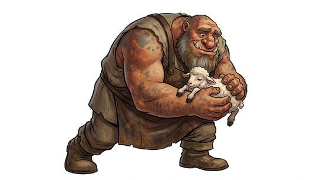

# Ogre-kind

{.illus}

*Set: Core*

*aka: ______________________________*

*Family: [Giant-kind](../Species_Families/giant-kind.md)*

Big, heavy people with big appetites, wide mouths and very little interest in building anything. Where giants raise halls, ogres find a cave or a swamp and settle in. Some are solitary and grumpy, and turn out, if left in peace, to be surprisingly decent. Some are mountain-dwellers with shaggy coats against the cold. Some are horned and fanged demon-ogres with red or blue skin, who stride in with the thunder carrying iron clubs.

Ogre war-bands trail a mob of small, quick scavengers who cook, steal and scamper. Half-ogres, born between ogre and orc, belong to neither side and prove themselves the hard way. There are tales of ogre tribes transformed by being named, rising into fierce, clever near-human warriors with magic in their blood.

## Not to be confused with

*[troll-kind](dwarf-kind-troll-kind.md)*, whose hides are stony and who may regenerate or fear sunlight; ogres are simply huge, strong and hungry.

## What sets this species apart

Brutes rather than builders: no giant stonework tradition.

## Breeds and races

Each block below is one set of numbers; breeds that share every number share a block (Species rules, rule 9). Attributes are final modifiers, the size trade-off included. Skills, powers and weapon groups are final levels after the family, species and breed layers.

### No. 465 Ogre *(genres: fairy tale and folklore; starter)*

- **Size:** large · **Body:** biped
- **What it's like:** Huge, strong and gruff on the outside, but often kind at heart. (looks like: giant; good at: strength, toughness, fighting)
- **Attributes:** STR +5 AGI −2 END +2 INT −1
- **Skills:** [Lifting & Carrying](../Skills/lifting-and-carrying.md) +3, [Intimidation](../Skills/intimidation.md) +2, [Construction](../Skills/construction.md) +1, [Herding & Husbandry](../Skills/herding-and-husbandry.md) +1, [Survival: Jungle & Swamp](../Skills/survival-jungle-and-swamp.md) +1, [Disguise](../Skills/disguise.md) −2, [Sleight of Hand](../Skills/sleight-of-hand.md) −2, [Stealth](../Skills/stealth.md) −3, [Riding](../Skills/riding.md) Foreign Concept
- **Powers:** [Toughness](../Powers/toughness.md) 2
- **Weapon groups:** [Thrown Weapons](../Weapon_Groups/thrown-weapons.md) +1
- **For the Game Master only, this race as an NPC guard or soldier (not your character's numbers):** Attack 15 · Parry 12 · Dodge 5 · Damage longsword 1d6+2 · Armour 2 · Life 27 · Threat 2 ([Bestiary roles](../bestiary.md))
- *Why:* Solitary swamp-dwellers.

### Horned demon ogre *(NPC only)*

- **Size:** large · **Body:** biped
- **Attributes:** STR +5 AGI −2 END +2 INT −1
- **Skills:** [Lifting & Carrying](../Skills/lifting-and-carrying.md) +3, [Intimidation](../Skills/intimidation.md) +2, [Construction](../Skills/construction.md) +1, [Herding & Husbandry](../Skills/herding-and-husbandry.md) +1, [Disguise](../Skills/disguise.md) −2, [Sleight of Hand](../Skills/sleight-of-hand.md) −2, [Stealth](../Skills/stealth.md) −3, [Riding](../Skills/riding.md) Foreign Concept
- **Powers:** [Toughness](../Powers/toughness.md) 2
- **Weapon groups:** [Thrown Weapons](../Weapon_Groups/thrown-weapons.md) +1
- **Natural attacks:** horns 1d6+3, bite 1d6+1
- **For the Game Master only, this race as an NPC guard or soldier (not your character's numbers):** Attack 15 · Parry 12 · Dodge 5 · Damage horns 2d6; longsword 1d6+5 · Armour 2 · Life 27 · Threat 2 ([Bestiary roles](../bestiary.md))
- *Why:* Horned, fanged demon-ogres.

### Brutish ogre *(NPC only)*

- **Size:** large · **Body:** biped
- **Attributes:** STR +5 AGI −2 END +2 INT −3
- **Skills:** [Lifting & Carrying](../Skills/lifting-and-carrying.md) +3, [Intimidation](../Skills/intimidation.md) +2, [Construction](../Skills/construction.md) +1, [Herding & Husbandry](../Skills/herding-and-husbandry.md) +1, [Disguise](../Skills/disguise.md) −2, [Sleight of Hand](../Skills/sleight-of-hand.md) −2, [Stealth](../Skills/stealth.md) −3, [Riding](../Skills/riding.md) Foreign Concept
- **Powers:** [Toughness](../Powers/toughness.md) 2, [Armour Skin](../Powers/armour-skin.md) 1
- **Weapon groups:** [Thrown Weapons](../Weapon_Groups/thrown-weapons.md) +1
- **For the Game Master only, this race as an NPC guard or soldier (not your character's numbers):** Attack 15 · Parry 12 · Dodge 5 · Damage longsword 1d6+2 · Armour 2 · Life 27 · Threat 2 ([Bestiary roles](../bestiary.md))
- *Why:* Tough-hided brutes.
- *Note:* Two-headed variants are a separate stat block if used (add Perception Mod+1 as for the ettin).

### No. 466 Half-ogre outcast *(genres: classic fantasy)*

- **Size:** large · **Body:** biped
- **What it's like:** A strong, cunning half-ogre, never quite welcomed by either side of the family. (looks like: giant; good at: strength, toughness)
- **Attributes:** STR +4 AGI −2 END +2
- **Skills:** [Lifting & Carrying](../Skills/lifting-and-carrying.md) +3, [Intimidation](../Skills/intimidation.md) +2, [Construction](../Skills/construction.md) +1, [Herding & Husbandry](../Skills/herding-and-husbandry.md) +1, [Disguise](../Skills/disguise.md) −2, [Sleight of Hand](../Skills/sleight-of-hand.md) −2, [Stealth](../Skills/stealth.md) −3, [Riding](../Skills/riding.md) Foreign Concept
- **Powers:** [Toughness](../Powers/toughness.md) 2
- **Weapon groups:** [Thrown Weapons](../Weapon_Groups/thrown-weapons.md) +1
- **For the Game Master only, this race as an NPC guard or soldier (not your character's numbers):** Attack 14 · Parry 11 · Dodge 5 · Damage longsword 1d6+2 · Armour 2 · Life 27 · Threat 2 ([Bestiary roles](../bestiary.md))
- *Why:* Differs only in being a smaller, cunning half-blood caught between two peoples (attribute and lexicon matters).

### No. 467 Evolved oni-kin (named ogre) *(genres: classic fantasy)*

- **Size:** medium · **Body:** biped
- **What it's like:** An ogre who, once given a true name, transforms into a powerful oni-kin with great strength and magic. (looks like: giant; good at: strength, powers and magic)
- **Attributes:** STR +3 AGI −2 END +2 INT −1
- **Skills:** [Lifting & Carrying](../Skills/lifting-and-carrying.md) +3, [Arcana](../Skills/arcana.md) +2, [Intimidation](../Skills/intimidation.md) +2, [Construction](../Skills/construction.md) +1, [Herding & Husbandry](../Skills/herding-and-husbandry.md) +1, [Sleight of Hand](../Skills/sleight-of-hand.md) −2, [Stealth](../Skills/stealth.md) −3, [Riding](../Skills/riding.md) Foreign Concept
- **Powers:** [Toughness](../Powers/toughness.md) 2
- **Weapon groups:** [Thrown Weapons](../Weapon_Groups/thrown-weapons.md) +1
- **For the Game Master only, this race as an NPC guard or soldier (not your character's numbers):** Attack 14 · Parry 11 · Dodge 6 · Damage longsword 1d6+2 · Armour 2 · Life 23 · Threat 2 ([Bestiary roles](../bestiary.md))
- *Why:* Once named, the ogre evolves into a near-human form with strong magical aptitude.
- *Note:* Near-human form cancels the giant disguise penalty; applies after the naming.

### Ogre-camp scavenger folk *(NPC only)*

- **Size:** small · **Body:** biped
- **Attributes:** STR −2 AGI +2
- **Skills:** [Scavenging](../Skills/scavenging.md) +2, [Stealth](../Skills/stealth.md) +2, [Construction](../Skills/construction.md) +1, [Herding & Husbandry](../Skills/herding-and-husbandry.md) +1, [Sleight of Hand](../Skills/sleight-of-hand.md) +1
- **For the Game Master only, this race as an NPC guard or soldier (not your character's numbers):** Attack 14 · Parry 11 · Dodge 11 · Damage longsword 1d6+1 · Armour 2 · Life 15 · Threat 1 ([Bestiary roles](../bestiary.md))
- *Why:* Small, quick, sneaky camp followers with none of a giant's bulk or menace.
- *Note:* Small body undoes the family's giant-body lines.

### Shaggy mountain ogre-kin *(NPC only)*

- **Size:** large · **Body:** biped
- **Attributes:** STR +5 AGI −2 END +2 INT −1
- **Skills:** [Lifting & Carrying](../Skills/lifting-and-carrying.md) +3, [Intimidation](../Skills/intimidation.md) +2, [Construction](../Skills/construction.md) +1, [Herding & Husbandry](../Skills/herding-and-husbandry.md) +1, [Survival: Mountain](../Skills/survival-mountain.md) +1, [Disguise](../Skills/disguise.md) −2, [Sleight of Hand](../Skills/sleight-of-hand.md) −2, [Stealth](../Skills/stealth.md) −3, [Riding](../Skills/riding.md) Foreign Concept
- **Powers:** [Toughness](../Powers/toughness.md) 2, [Resist Element](../Powers/resist-element.md) 1
- **Weapon groups:** [Thrown Weapons](../Weapon_Groups/thrown-weapons.md) +1
- **For the Game Master only, this race as an NPC guard or soldier (not your character's numbers):** Attack 15 · Parry 12 · Dodge 5 · Damage longsword 1d6+2 · Armour 2 · Life 27 · Threat 2 ([Bestiary roles](../bestiary.md))
- *Why:* Shaggy, cold-proof mountain ogres.
- *Note:* Resist Element is cold.

### Warband ogre sub-tribe *(NPC only)*

- **Size:** large · **Body:** biped
- **Attributes:** STR +5 AGI −2 END +2 INT −1
- **Skills:** [Lifting & Carrying](../Skills/lifting-and-carrying.md) +3, [Intimidation](../Skills/intimidation.md) +2, [Construction](../Skills/construction.md) +1, [Herding & Husbandry](../Skills/herding-and-husbandry.md) +1, [Disguise](../Skills/disguise.md) −2, [Sleight of Hand](../Skills/sleight-of-hand.md) −2, [Stealth](../Skills/stealth.md) −3, [Riding](../Skills/riding.md) Foreign Concept
- **Powers:** [Toughness](../Powers/toughness.md) 2
- **Weapon groups:** [Thrown Weapons](../Weapon_Groups/thrown-weapons.md) +1
- **For the Game Master only, this race as an NPC guard or soldier (not your character's numbers):** Attack 15 · Parry 12 · Dodge 5 · Damage longsword 1d6+2 · Armour 2 · Life 27 · Threat 2 ([Bestiary roles](../bestiary.md))
- *Why:* Differs only in its tribal warband culture (lexicon matter).

