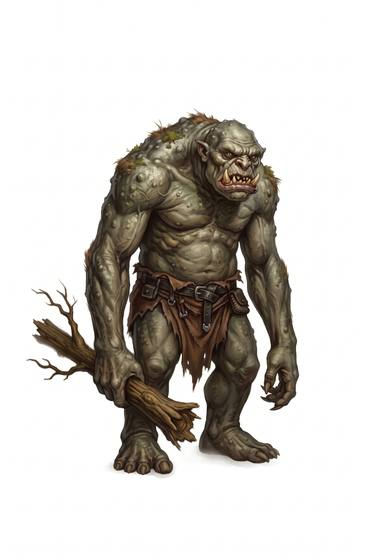

# Troll-kind

{.illus}

*Set: Expansion*

*aka: ______________________________*

*Family: [Giant-kind](../Species_Families/giant-kind.md)*

Big, hard-hided people of caves and mountains, whose skin is thick as leather or rough as rock. Some are brutes, ambushing travellers at bridges and dragging them underground. Others live in proud clans with codes of honour, stern mining societies ruled by matriarchs, or ancient empires steeped in spirit magic. Many are slow-witted in warm weather and startlingly sharp in the cold.

Two things are told of trolls everywhere, though not every troll bears them out. Some heal almost any wound, closing cuts and regrowing flesh until fire or acid stops them. Others fear the sun, because daylight turns them to stone, and the hills are dotted with lumpy boulders that once were careless trolls. Sensible travellers carry a torch and try to reach shelter by dawn, whichever sort they meet.

## Not to be confused with

*[ogre-kind](giant-kind-ogre-kind.md)*, big brutish people of swamp and hill; trolls are harder-hided, more at home underground, and often heal or turn to stone.

## What sets this species apart

Trolls with thick stony or leathery hides, at home in caves and mountains. Regeneration and turning to stone in sunlight vary by Breed/Race.

## Breeds and races

Each block below is one set of numbers; breeds that share every number share a block (Species rules, rule 9). Attributes are final modifiers, the size trade-off included. Skills, powers and weapon groups are final levels after the family, species and breed layers.

### No. 458 Silicon-based rock beings *(genres: underworld and wild places)*

- **Size:** large · **Body:** biped
- **What it's like:** Silicon-bodied rock giants who think slow in heat and sharp in cold, able to turn themselves as solid as stone. (looks like: rock; good at: strength, toughness)
- **Attributes:** STR +5 AGI −3 END +2
- **Skills:** [Lifting & Carrying](../Skills/lifting-and-carrying.md) +3, [Intimidation](../Skills/intimidation.md) +2, [Construction](../Skills/construction.md) +1, [Herding & Husbandry](../Skills/herding-and-husbandry.md) +1, [Stonemasonry](../Skills/stonemasonry.md) +1, [Survival: Caves & Underground](../Skills/survival-caves-and-underground.md) +1, [Disguise](../Skills/disguise.md) −2, [Sleight of Hand](../Skills/sleight-of-hand.md) −2, [Stealth](../Skills/stealth.md) −3, [Riding](../Skills/riding.md) Foreign Concept
- **Powers:** [Armour Skin](../Powers/armour-skin.md) 2, [Toughness](../Powers/toughness.md) 2
- **Weapon groups:** [Thrown Weapons](../Weapon_Groups/thrown-weapons.md) +1
- **Natural attacks:** stone fist 1d6+1
- **For the Game Master only, this race as an NPC guard or soldier (not your character's numbers):** Attack 14 · Parry 11 · Dodge 4 · Damage longsword 1d6+2; stone fist 1d6+4 · Armour 2 · Life 27 · Threat 2 ([Bestiary roles](../bestiary.md))
- *Why:* Silicon rock bodies that can harden to solid stone.
- *Note:* Slow thinking in heat and sharp wits in cold is an attribute matter.

### Stone-skinned mountain trolls *(NPC only)*

- **Size:** large · **Body:** biped
- **Attributes:** STR +5 AGI −2 END +3 INT −1
- **Skills:** [Lifting & Carrying](../Skills/lifting-and-carrying.md) +3, [Intimidation](../Skills/intimidation.md) +2, [Construction](../Skills/construction.md) +1, [Herding & Husbandry](../Skills/herding-and-husbandry.md) +1, [Stonemasonry](../Skills/stonemasonry.md) +1, [Survival: Caves & Underground](../Skills/survival-caves-and-underground.md) +1, [Survival: Mountain](../Skills/survival-mountain.md) +1, [Disguise](../Skills/disguise.md) −2, [Sleight of Hand](../Skills/sleight-of-hand.md) −2, [Stealth](../Skills/stealth.md) −3, [Riding](../Skills/riding.md) Foreign Concept
- **Powers:** [Toughness](../Powers/toughness.md) 2, [Armour Skin](../Powers/armour-skin.md) 1
- **Weapon groups:** [Thrown Weapons](../Weapon_Groups/thrown-weapons.md) +1
- **For the Game Master only, this race as an NPC guard or soldier (not your character's numbers):** Attack 15 · Parry 12 · Dodge 5 · Damage longsword 1d6+2 · Armour 2 · Life 28 · Threat 2 ([Bestiary roles](../bestiary.md))
- *Why:* Hardy mountain-dwelling trolls.

### Subterranean ambush giants *(NPC only)*

- **Size:** huge · **Body:** biped
- **Attributes:** STR +7 AGI −4 END +2 INT −1
- **Skills:** [Lifting & Carrying](../Skills/lifting-and-carrying.md) +3, [Intimidation](../Skills/intimidation.md) +2, [Construction](../Skills/construction.md) +1, [Herding & Husbandry](../Skills/herding-and-husbandry.md) +1, [Stonemasonry](../Skills/stonemasonry.md) +1, [Survival: Caves & Underground](../Skills/survival-caves-and-underground.md) +1, [Disguise](../Skills/disguise.md) −2, [Sleight of Hand](../Skills/sleight-of-hand.md) −2, [Stealth](../Skills/stealth.md) −2, [Riding](../Skills/riding.md) Foreign Concept
- **Powers:** [Toughness](../Powers/toughness.md) 2, [Armour Skin](../Powers/armour-skin.md) 1
- **Weapon groups:** [Thrown Weapons](../Weapon_Groups/thrown-weapons.md) +1
- **For the Game Master only, this race as an NPC guard or soldier (not your character's numbers):** Attack 15 · Parry 12 · Dodge 2 · Damage longsword 1d6+2 · Armour 2 · Life 31 · Threat 2 ([Bestiary roles](../bestiary.md))
- *Why:* Deep-cave ambush predators that turn to stone in sunlight.
- *Note:* Turning to stone in sunlight is a flaw.

### Sun-hardy bred giants *(NPC only)*

- **Size:** huge · **Body:** biped
- **Attributes:** STR +7 AGI −4 END +2 COU +1
- **Skills:** [Lifting & Carrying](../Skills/lifting-and-carrying.md) +3, [Intimidation](../Skills/intimidation.md) +2, [Construction](../Skills/construction.md) +1, [Formation Fighting](../Skills/formation-fighting.md) +1, [Herding & Husbandry](../Skills/herding-and-husbandry.md) +1, [Stonemasonry](../Skills/stonemasonry.md) +1, [Survival: Caves & Underground](../Skills/survival-caves-and-underground.md) +1, [Disguise](../Skills/disguise.md) −2, [Sleight of Hand](../Skills/sleight-of-hand.md) −2, [Stealth](../Skills/stealth.md) −3, [Riding](../Skills/riding.md) Foreign Concept
- **Powers:** [Toughness](../Powers/toughness.md) 2, [Armour Skin](../Powers/armour-skin.md) 1
- **Weapon groups:** [Thrown Weapons](../Weapon_Groups/thrown-weapons.md) +1
- **For the Game Master only, this race as an NPC guard or soldier (not your character's numbers):** Attack 15 · Parry 12 · Dodge 2 · Damage longsword 1d6+2 · Armour 2 · Life 31 · Threat 2 ([Bestiary roles](../bestiary.md))
- *Why:* Trolls bred to bear sunlight, drilled as siege troops and heavy infantry.
- *Note:* No sunlight flaw.

### Sunlight-vulnerable stone giants · Upland brute giants *(NPC only)*

- **Size:** huge · **Body:** biped
- **Attributes:** STR +7 AGI −4 END +2 INT −3
- **Skills:** [Lifting & Carrying](../Skills/lifting-and-carrying.md) +3, [Intimidation](../Skills/intimidation.md) +2, [Construction](../Skills/construction.md) +1, [Herding & Husbandry](../Skills/herding-and-husbandry.md) +1, [Stonemasonry](../Skills/stonemasonry.md) +1, [Survival: Caves & Underground](../Skills/survival-caves-and-underground.md) +1, [Disguise](../Skills/disguise.md) −2, [Sleight of Hand](../Skills/sleight-of-hand.md) −2, [Stealth](../Skills/stealth.md) −3, [Riding](../Skills/riding.md) Foreign Concept
- **Powers:** [Toughness](../Powers/toughness.md) 2, [Armour Skin](../Powers/armour-skin.md) 1
- **Weapon groups:** [Thrown Weapons](../Weapon_Groups/thrown-weapons.md) +1
- **For the Game Master only, this race as an NPC guard or soldier (not your character's numbers):** Attack 15 · Parry 12 · Dodge 2 · Damage longsword 1d6+2 · Armour 2 · Life 31 · Threat 2 ([Bestiary roles](../bestiary.md))
- *Sunlight-vulnerable stone giants:* Differs only in turning to stone in sunlight (a flaw) and simple speech (lexicon matter).
- *Upland brute giants:* Differs only in dim wits and turning to stone in sunlight (attribute and flaw matters).

### Brutish mercenary troll *(NPC only)*

- **Size:** large · **Body:** biped
- **Attributes:** STR +5 AGI −2 END +2 INT −2
- **Skills:** [Lifting & Carrying](../Skills/lifting-and-carrying.md) +3, [Intimidation](../Skills/intimidation.md) +2, [Construction](../Skills/construction.md) +1, [Herding & Husbandry](../Skills/herding-and-husbandry.md) +1, [Stonemasonry](../Skills/stonemasonry.md) +1, [Survival: Caves & Underground](../Skills/survival-caves-and-underground.md) +1, [Disguise](../Skills/disguise.md) −2, [Sleight of Hand](../Skills/sleight-of-hand.md) −2, [Stealth](../Skills/stealth.md) −3, [Riding](../Skills/riding.md) Foreign Concept
- **Powers:** [Toughness](../Powers/toughness.md) 2, [Armour Skin](../Powers/armour-skin.md) 1
- **Weapon groups:** [Thrown Weapons](../Weapon_Groups/thrown-weapons.md) +1
- **For the Game Master only, this race as an NPC guard or soldier (not your character's numbers):** Attack 15 · Parry 12 · Dodge 5 · Damage longsword 1d6+2 · Armour 2 · Life 27 · Threat 2 ([Bestiary roles](../bestiary.md))

### No. 459 Disciplined mining troll *(genres: underworld and wild places)*

- **Size:** large · **Body:** biped
- **What it's like:** Stone-grey trolls with tough hides, raised in a disciplined culture that prizes both mining and war. (looks like: giant; good at: strength, making and fixing)
- **Attributes:** STR +5 AGI −2 END +2 INT −1
- **Skills:** [Lifting & Carrying](../Skills/lifting-and-carrying.md) +3, [Intimidation](../Skills/intimidation.md) +2, [Mining & Quarrying](../Skills/mining-and-quarrying.md) +2, [Construction](../Skills/construction.md) +1, [Formation Fighting](../Skills/formation-fighting.md) +1, [Herding & Husbandry](../Skills/herding-and-husbandry.md) +1, [Stonemasonry](../Skills/stonemasonry.md) +1, [Survival: Caves & Underground](../Skills/survival-caves-and-underground.md) +1, [Disguise](../Skills/disguise.md) −2, [Sleight of Hand](../Skills/sleight-of-hand.md) −2, [Stealth](../Skills/stealth.md) −3, [Riding](../Skills/riding.md) Foreign Concept
- **Powers:** [Toughness](../Powers/toughness.md) 2, [Armour Skin](../Powers/armour-skin.md) 1
- **Weapon groups:** [Thrown Weapons](../Weapon_Groups/thrown-weapons.md) +1
- **For the Game Master only, this race as an NPC guard or soldier (not your character's numbers):** Attack 15 · Parry 12 · Dodge 5 · Damage longsword 1d6+2 · Armour 2 · Life 27 · Threat 2 ([Bestiary roles](../bestiary.md))
- *Why:* A disciplined warrior and mining people.

### No. 460 Regenerating cave troll *(genres: fairy tale and folklore, underworld and wild places)*

- **Size:** large · **Body:** biped
- **What it's like:** A hugely strong cave troll that heals from almost any wound in moments, though fire keeps the damage from closing. (looks like: giant; good at: strength, toughness)
- **Attributes:** STR +5 AGI −2 END +2 INT −2
- **Skills:** [Lifting & Carrying](../Skills/lifting-and-carrying.md) +3, [Intimidation](../Skills/intimidation.md) +2, [Construction](../Skills/construction.md) +1, [Herding & Husbandry](../Skills/herding-and-husbandry.md) +1, [Stonemasonry](../Skills/stonemasonry.md) +1, [Survival: Caves & Underground](../Skills/survival-caves-and-underground.md) +1, [Disguise](../Skills/disguise.md) −2, [Sleight of Hand](../Skills/sleight-of-hand.md) −2, [Stealth](../Skills/stealth.md) −3, [Riding](../Skills/riding.md) Foreign Concept
- **Powers:** [Healing Factor](../Powers/healing-factor.md) 2, [Toughness](../Powers/toughness.md) 2, [Armour Skin](../Powers/armour-skin.md) 1
- **Weapon groups:** [Thrown Weapons](../Weapon_Groups/thrown-weapons.md) +1
- **For the Game Master only, this race as an NPC guard or soldier (not your character's numbers):** Attack 15 · Parry 12 · Dodge 5 · Damage longsword 1d6+2 · Armour 2 · Life 27 · Threat 2 ([Bestiary roles](../bestiary.md))
- *Why:* Trolls whose flesh regenerates, though fire stops it.
- *Note:* Fire halts the regeneration; that weakness is a flaw.

### No. 461 Advanced tribal troll empire *(genres: classic fantasy)*

- **Size:** large · **Body:** biped
- **What it's like:** Tall, tusked, self-healing trolls of a proud old empire, steeped in a rich spiritual and voodoo tradition. (looks like: giant; good at: toughness, powers and magic)
- **Attributes:** STR +5 AGI −2 END +2 INT −1
- **Skills:** [Lifting & Carrying](../Skills/lifting-and-carrying.md) +3, [Intimidation](../Skills/intimidation.md) +2, [Construction](../Skills/construction.md) +1, [Herding & Husbandry](../Skills/herding-and-husbandry.md) +1, [Stonemasonry](../Skills/stonemasonry.md) +1, [Survival: Caves & Underground](../Skills/survival-caves-and-underground.md) +1, [Survival: Jungle & Swamp](../Skills/survival-jungle-and-swamp.md) +1, [Trance & Spirit Work](../Skills/trance-and-spirit-work.md) +1, [Disguise](../Skills/disguise.md) −2, [Sleight of Hand](../Skills/sleight-of-hand.md) −2, [Stealth](../Skills/stealth.md) −3, [Riding](../Skills/riding.md) Foreign Concept
- **Powers:** [Healing Factor](../Powers/healing-factor.md) 2, [Toughness](../Powers/toughness.md) 2, [Armour Skin](../Powers/armour-skin.md) 1
- **Weapon groups:** [Thrown Weapons](../Weapon_Groups/thrown-weapons.md) +1
- **Natural attacks:** tusks 1d6+3
- **For the Game Master only, this race as an NPC guard or soldier (not your character's numbers):** Attack 15 · Parry 12 · Dodge 5 · Damage tusks 2d6; longsword 1d6+5 · Armour 2 · Life 27 · Threat 2 ([Bestiary roles](../bestiary.md))
- *Why:* Regenerating jungle trolls with a strong spirit-working tradition.

### No. 462 Matriarchal cave troll society *(genres: underworld and wild places)*

- **Size:** large · **Body:** biped
- **What it's like:** Tough cave trolls who see in the dark and live in a society led entirely by its women. (looks like: giant; good at: toughness, keen senses)
- **Attributes:** STR +5 AGI −2 END +2 INT −1
- **Skills:** [Lifting & Carrying](../Skills/lifting-and-carrying.md) +3, [Intimidation](../Skills/intimidation.md) +2, [Construction](../Skills/construction.md) +1, [Herding & Husbandry](../Skills/herding-and-husbandry.md) +1, [Stonemasonry](../Skills/stonemasonry.md) +1, [Survival: Caves & Underground](../Skills/survival-caves-and-underground.md) +1, [Disguise](../Skills/disguise.md) −2, [Sleight of Hand](../Skills/sleight-of-hand.md) −2, [Stealth](../Skills/stealth.md) −3, [Riding](../Skills/riding.md) Foreign Concept
- **Powers:** [Night & Spectrum Sight](../Powers/night-and-spectrum-sight.md) 2, [Toughness](../Powers/toughness.md) 2, [Armour Skin](../Powers/armour-skin.md) 1
- **Weapon groups:** [Thrown Weapons](../Weapon_Groups/thrown-weapons.md) +1
- **For the Game Master only, this race as an NPC guard or soldier (not your character's numbers):** Attack 15 · Parry 12 · Dodge 5 · Damage longsword 1d6+2 · Armour 2 · Life 27 · Threat 2 ([Bestiary roles](../bestiary.md))
- *Why:* Cave trolls who see in the dark.

### No. 463 Massive tusked metahuman troll *(genres: near future and cyberpunk)*

- **Size:** large · **Body:** biped
- **What it's like:** A massive, tusked troll-blooded person, immensely strong and tough, often unfairly judged by others because of it. (looks like: giant; good at: strength, toughness)
- **Attributes:** STR +5 AGI −2 END +2 INT −2
- **Skills:** [Lifting & Carrying](../Skills/lifting-and-carrying.md) +3, [Intimidation](../Skills/intimidation.md) +2, [Construction](../Skills/construction.md) +1, [Herding & Husbandry](../Skills/herding-and-husbandry.md) +1, [Stonemasonry](../Skills/stonemasonry.md) +1, [Disguise](../Skills/disguise.md) −2, [Sleight of Hand](../Skills/sleight-of-hand.md) −2, [Stealth](../Skills/stealth.md) −3, [Riding](../Skills/riding.md) Foreign Concept
- **Powers:** [Toughness](../Powers/toughness.md) 2, [Armour Skin](../Powers/armour-skin.md) 1, [Night & Spectrum Sight](../Powers/night-and-spectrum-sight.md) 1
- **Weapon groups:** [Thrown Weapons](../Weapon_Groups/thrown-weapons.md) +1
- **Natural attacks:** tusks 1d6+3
- **For the Game Master only, this race as an NPC guard or soldier (not your character's numbers):** Attack 15 · Parry 12 · Dodge 5 · Damage tusks 2d6; longsword 1d6+5 · Armour 2 · Life 27 · Threat 2 ([Bestiary roles](../bestiary.md))
- *Why:* Tusked, low-light-seeing trolls of the modern city rather than the caves.

### No. 464 Regenerating half-troll *(genres: classic fantasy)*

- **Size:** large · **Body:** biped
- **What it's like:** A huge half-troll who heals almost any wound in seconds, though fire or acid can stop the healing cold. (looks like: giant; good at: strength, toughness)
- **Attributes:** STR +5 AGI −2 END +2 INT −1
- **Skills:** [Lifting & Carrying](../Skills/lifting-and-carrying.md) +3, [Intimidation](../Skills/intimidation.md) +2, [Construction](../Skills/construction.md) +1, [Herding & Husbandry](../Skills/herding-and-husbandry.md) +1, [Stonemasonry](../Skills/stonemasonry.md) +1, [Survival: Caves & Underground](../Skills/survival-caves-and-underground.md) +1, [Disguise](../Skills/disguise.md) −2, [Sleight of Hand](../Skills/sleight-of-hand.md) −2, [Stealth](../Skills/stealth.md) −3, [Riding](../Skills/riding.md) Foreign Concept
- **Powers:** [Healing Factor](../Powers/healing-factor.md) 2, [Toughness](../Powers/toughness.md) 2, [Armour Skin](../Powers/armour-skin.md) 1
- **Weapon groups:** [Thrown Weapons](../Weapon_Groups/thrown-weapons.md) +1
- **For the Game Master only, this race as an NPC guard or soldier (not your character's numbers):** Attack 15 · Parry 12 · Dodge 5 · Damage longsword 1d6+2 · Armour 2 · Life 27 · Threat 2 ([Bestiary roles](../bestiary.md))
- *Why:* Half-trolls whose flesh regenerates, though fire or acid stops it.
- *Note:* Fire or acid halts the regeneration; that weakness is a flaw.

### Mountain troll (huge variant) *(NPC only)*

- **Size:** huge · **Body:** biped
- **Attributes:** STR +7 AGI −4 END +3 INT −1
- **Skills:** [Lifting & Carrying](../Skills/lifting-and-carrying.md) +3, [Intimidation](../Skills/intimidation.md) +2, [Construction](../Skills/construction.md) +1, [Herding & Husbandry](../Skills/herding-and-husbandry.md) +1, [Stonemasonry](../Skills/stonemasonry.md) +1, [Survival: Caves & Underground](../Skills/survival-caves-and-underground.md) +1, [Survival: Mountain](../Skills/survival-mountain.md) +1, [Disguise](../Skills/disguise.md) −2, [Sleight of Hand](../Skills/sleight-of-hand.md) −2, [Stealth](../Skills/stealth.md) −3, [Riding](../Skills/riding.md) Foreign Concept
- **Powers:** [Toughness](../Powers/toughness.md) 2, [Armour Skin](../Powers/armour-skin.md) 1
- **Weapon groups:** [Thrown Weapons](../Weapon_Groups/thrown-weapons.md) +1
- **For the Game Master only, this race as an NPC guard or soldier (not your character's numbers):** Attack 15 · Parry 12 · Dodge 2 · Damage longsword 1d6+2 · Armour 2 · Life 32 · Threat 2 ([Bestiary roles](../bestiary.md))
- *Why:* A larger, territorial high-mountain troll.

