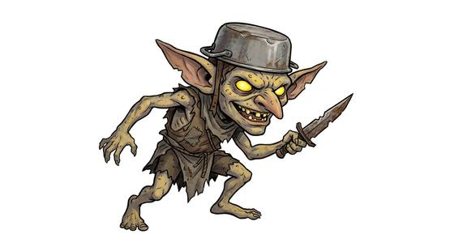

# Goblin

{.illus}

*Set: Core*

*aka: ______________________________*

*Family: [Goblinoid and orc-kind](../Species_Families/goblinoid-and-orc-kind.md)*

Small, wiry, sharp-toothed and quick, goblins live wherever there is a dark hole and something to steal. Alone, a goblin is weak and knows it. It will run, hide, beg and lie its way out of trouble, and it is very good at all four. In numbers they grow bolder, and a goblin warren in the hills can bring misery to a whole valley with ambushes, trapped paths and nighttime raids.

They see well in the dark and slip free of grips and nets that would hold anyone else. Some tribes brew mushroom concoctions and go half-mad on them; some are compulsive tinkerers with a love of loud bangs; some are money-lenders with a gift for metal magic; some are horned trickster spirits who wrestle travellers for wishes. Rarely a champion rises, big and cunning, and then even orcs take notice.

## Not to be confused with

*[hobgoblin](goblinoid-and-orc-kind-hobgoblin.md)*, the goblins' taller, disciplined kin who fight in ranks; goblins prefer tricks, traps and a quick escape.

## What sets this species apart

Small, sneaky and slippery; more likely to escape than to frighten.

## Breeds and races

Each block below is one set of numbers; breeds that share every number share a block (Species rules, rule 9). Attributes are final modifiers, the size trade-off included. Skills, powers and weapon groups are final levels after the family, species and breed layers.

### No. 469 Cave/tribal goblin folk *(genres: classic fantasy; starter)*

- **Size:** small · **Body:** biped
- **What it's like:** Small, sneaky cave dwellers who see in the dark and slip away fast. (looks like: goblin; good at: sneaking, keen senses, toughness)
- **Attributes:** STR −2 AGI +2 END +1 INT −1 CHA −1
- **Skills:** [Scavenging](../Skills/scavenging.md) +2, [Escape Artistry](../Skills/escape-artistry.md) +1, [Intimidation](../Skills/intimidation.md) +1, [Pain Tolerance](../Skills/pain-tolerance.md) +1, [Stealth](../Skills/stealth.md) +1, [Survival: Ruins & Wasteland](../Skills/survival-ruins-and-wasteland.md) +1, [Diplomacy](../Skills/diplomacy.md) −1, [Court Etiquette & Protocol](../Skills/court-etiquette-and-protocol.md) −2, [Etiquette](../Skills/etiquette.md) −2
- **Powers:** [Night & Spectrum Sight](../Powers/night-and-spectrum-sight.md) 2
- **For the Game Master only, this race as an NPC guard or soldier (not your character's numbers):** Attack 14 · Parry 11 · Dodge 11 · Damage longsword 1d6+1 · Armour 2 · Life 16 · Threat 1 ([Bestiary roles](../bestiary.md))

### No. 470 Fungal trickster goblin folk *(genres: classic fantasy, underworld and wild places)*

- **Size:** small · **Body:** biped
- **What it's like:** Sneaky, mushroom-loving goblins who lay clever traps, brave in numbers but quick to run alone. (looks like: goblin; good at: sneaking, making and fixing)
- **Attributes:** STR −2 AGI +2 END +1 INT −1 CHA −1
- **Skills:** [Scavenging](../Skills/scavenging.md) +2, [Escape Artistry](../Skills/escape-artistry.md) +1, [Intimidation](../Skills/intimidation.md) +1, [Pain Tolerance](../Skills/pain-tolerance.md) +1, [Stealth](../Skills/stealth.md) +1, [Survival: Caves & Underground](../Skills/survival-caves-and-underground.md) +1, [Survival: Ruins & Wasteland](../Skills/survival-ruins-and-wasteland.md) +1, [Traps](../Skills/traps.md) +1, [Diplomacy](../Skills/diplomacy.md) −1, [Court Etiquette & Protocol](../Skills/court-etiquette-and-protocol.md) −2, [Etiquette](../Skills/etiquette.md) −2
- **Powers:** [Night & Spectrum Sight](../Powers/night-and-spectrum-sight.md) 2
- **For the Game Master only, this race as an NPC guard or soldier (not your character's numbers):** Attack 14 · Parry 11 · Dodge 11 · Damage longsword 1d6+1 · Armour 2 · Life 16 · Threat 1 ([Bestiary roles](../bestiary.md))
- *Why:* Cave-dwelling trap-layers.

### Banking-guild goblin folk *(NPC only)*

- **Size:** small · **Body:** biped
- **Attributes:** STR −2 AGI +2 END +1 INT +2 CHA −1
- **Skills:** [Weaponsmithing & Armouring](../Skills/weaponsmithing-and-armouring.md) +2, [Escape Artistry](../Skills/escape-artistry.md) +1, [Intimidation](../Skills/intimidation.md) +1, [Pain Tolerance](../Skills/pain-tolerance.md) +1, [Stealth](../Skills/stealth.md) +1, [Survival: Ruins & Wasteland](../Skills/survival-ruins-and-wasteland.md) +1, [Diplomacy](../Skills/diplomacy.md) −1, [Court Etiquette & Protocol](../Skills/court-etiquette-and-protocol.md) −2, [Etiquette](../Skills/etiquette.md) −2
- **Powers:** [Night & Spectrum Sight](../Powers/night-and-spectrum-sight.md) 2, [Lasting Enchantment](../Powers/lasting-enchantment.md) 1
- **For the Game Master only, this race as an NPC guard or soldier (not your character's numbers):** Attack 14 · Parry 11 · Dodge 11 · Damage longsword 1d6+1 · Armour 2 · Life 16 · Threat 1 ([Bestiary roles](../bestiary.md))
- *Why:* Civilized master metalworkers whose goblin-made work holds lasting magic.
- *Note:* Lasting Enchantment is on metalwork they forge themselves.

### Small orc-kin cave goblin *(NPC only)*

- **Size:** small · **Body:** biped
- **Attributes:** STR −2 AGI +2 END +1 INT −1 CHA −1
- **Skills:** [Scavenging](../Skills/scavenging.md) +2, [Escape Artistry](../Skills/escape-artistry.md) +1, [Intimidation](../Skills/intimidation.md) +1, [Pain Tolerance](../Skills/pain-tolerance.md) +1, [Stealth](../Skills/stealth.md) +1, [Survival: Caves & Underground](../Skills/survival-caves-and-underground.md) +1, [Survival: Ruins & Wasteland](../Skills/survival-ruins-and-wasteland.md) +1, [Diplomacy](../Skills/diplomacy.md) −1, [Court Etiquette & Protocol](../Skills/court-etiquette-and-protocol.md) −2, [Etiquette](../Skills/etiquette.md) −2
- **Powers:** [Night & Spectrum Sight](../Powers/night-and-spectrum-sight.md) 2
- **For the Game Master only, this race as an NPC guard or soldier (not your character's numbers):** Attack 14 · Parry 11 · Dodge 11 · Damage longsword 1d6+1 · Armour 2 · Life 16 · Threat 1 ([Bestiary roles](../bestiary.md))
- *Why:* Mountain-warren dwellers.

### No. 471 Horned trickster goblin folk *(genres: fairy tale and folklore)*

- **Size:** medium · **Body:** biped
- **What it's like:** Horned trickster spirits born from ordinary objects, who love games and wrestling and grant a wish to whoever beats them. (looks like: goblin; good at: fighting, people and talk)
- **Attributes:** STR +1 AGI +1 END +1 INT −1 CHA −1 COU +1
- **Skills:** [Games & Gambling](../Skills/games-and-gambling.md) +2, [Scavenging](../Skills/scavenging.md) +2, [Escape Artistry](../Skills/escape-artistry.md) +1, [Intimidation](../Skills/intimidation.md) +1, [Otherworldly Dealings](../Skills/otherworldly-dealings.md) +1, [Pain Tolerance](../Skills/pain-tolerance.md) +1, [Stealth](../Skills/stealth.md) +1, [Survival: Ruins & Wasteland](../Skills/survival-ruins-and-wasteland.md) +1, [Diplomacy](../Skills/diplomacy.md) −1, [Court Etiquette & Protocol](../Skills/court-etiquette-and-protocol.md) −2, [Etiquette](../Skills/etiquette.md) −2
- **Powers:** [Night & Spectrum Sight](../Powers/night-and-spectrum-sight.md) 2
- **Natural attacks:** horns 1d6+3
- **For the Game Master only, this race as an NPC guard or soldier (not your character's numbers):** Attack 15 · Parry 12 · Dodge 9 · Damage longsword 1d6+2; horns 1d6+2 · Armour 2 · Life 18 · Threat 2 ([Bestiary roles](../bestiary.md))
- *Why:* Object-born trickster spirits who love games and contests.
- *Note:* Wish-granting comes from its club, which is gear.

### No. 472 Tinkerer goblin folk *(genres: classic fantasy)*

- **Size:** small · **Body:** biped
- **What it's like:** Fast-talking, greedy goblin tinkerers who love explosives and wild magic just as much as clever machines. (looks like: goblin; good at: making and fixing, people and talk)
- **Attributes:** STR −2 AGI +2 END +1 INT +1 CHA −1
- **Skills:** [Scavenging](../Skills/scavenging.md) +2, [Escape Artistry](../Skills/escape-artistry.md) +1, [Explosives](../Skills/explosives.md) +1, [Intimidation](../Skills/intimidation.md) +1, [Jury-Rigging](../Skills/jury-rigging.md) +1, [Pain Tolerance](../Skills/pain-tolerance.md) +1, [Stealth](../Skills/stealth.md) +1, [Survival: Ruins & Wasteland](../Skills/survival-ruins-and-wasteland.md) +1, [Diplomacy](../Skills/diplomacy.md) −1, [Court Etiquette & Protocol](../Skills/court-etiquette-and-protocol.md) −2, [Etiquette](../Skills/etiquette.md) −2
- **Powers:** [Night & Spectrum Sight](../Powers/night-and-spectrum-sight.md) 2
- **For the Game Master only, this race as an NPC guard or soldier (not your character's numbers):** Attack 14 · Parry 11 · Dodge 11 · Damage longsword 1d6+1 · Armour 2 · Life 16 · Threat 1 ([Bestiary roles](../bestiary.md))
- *Why:* Explosives-loving mechanical tinkerers.
- *Note:* Wild magic surges of some lines are a flaw or Power choice.

### Goblin champion/lord *(NPC only)*

- **Size:** medium · **Body:** biped
- **Attributes:** STR +2 AGI +2 END +2 CHA −1 COU +2
- **Skills:** [Intimidation](../Skills/intimidation.md) +2, [Scavenging](../Skills/scavenging.md) +2, [Escape Artistry](../Skills/escape-artistry.md) +1, [Leadership](../Skills/leadership.md) +1, [Pain Tolerance](../Skills/pain-tolerance.md) +1, [Stealth](../Skills/stealth.md) +1, [Survival: Ruins & Wasteland](../Skills/survival-ruins-and-wasteland.md) +1, [Diplomacy](../Skills/diplomacy.md) −1, [Court Etiquette & Protocol](../Skills/court-etiquette-and-protocol.md) −2, [Etiquette](../Skills/etiquette.md) −2
- **Powers:** [Night & Spectrum Sight](../Powers/night-and-spectrum-sight.md) 2
- **For the Game Master only, this race as an NPC guard or soldier (not your character's numbers):** Attack 16 · Parry 13 · Dodge 10 · Damage longsword 1d6+2 · Armour 2 · Life 19 · Threat 2 ([Bestiary roles](../bestiary.md))
- *Why:* A rare elite who commands war-bands.
- *Note:* Size and strength are attributes.

