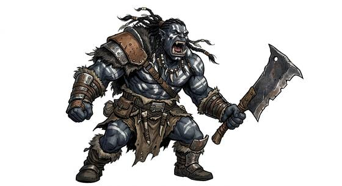

# Orc

{.illus}

*Set: Core*

*aka: ______________________________*

*Family: [Goblinoid and orc-kind](../Species_Families/goblinoid-and-orc-kind.md)*

The orcs of the tales: strong, tusked, grey or green of skin, and made for war. They live in clans under chiefs and shamans, respect strength above all things and settle quarrels with fists or axes. They see well in the dark and heal fast, and they are tough enough to march all night and fight in the morning. Some were bred for war by dark masters, hating the sun and each other; some are elite shock troops who can stand the daylight; some are the smallest and weakest, kept as runners and treated as dirt.

Not all orcs are villains. Some clans live by fierce honour, and many half-orcs find a place among other peoples. But the old stories are hard to live down, and an orc who walks into a town will find every door closing.

## Not to be confused with

*[orc-kind](goblinoid-and-orc-kind-orc-kind.md)*, tusked tribal folk with a strong honour tradition; the orc is the family's baseline warrior, with all the grim legends attached.

## What sets this species apart

The family's baseline orcs; no species-wide differences.

## Breeds and races

Each block below is one set of numbers; breeds that share every number share a block (Species rules, rule 9). Attributes are final modifiers, the size trade-off included. Skills, powers and weapon groups are final levels after the family, species and breed layers.

### No. 478 Tribal warrior orc folk *(genres: classic fantasy; starter)*

- **Size:** medium · **Body:** biped
- **What it's like:** Big, tough tribal warriors who hit hard and never back down. (looks like: orc; good at: strength, fighting, toughness)
- **Attributes:** STR +2 END +1 INT −1 CHA −1 COU +1
- **Skills:** [Intimidation](../Skills/intimidation.md) +2, [Scavenging](../Skills/scavenging.md) +2, [Pain Tolerance](../Skills/pain-tolerance.md) +1, [Survival: Ruins & Wasteland](../Skills/survival-ruins-and-wasteland.md) +1, [Diplomacy](../Skills/diplomacy.md) −1, [Court Etiquette & Protocol](../Skills/court-etiquette-and-protocol.md) −2, [Etiquette](../Skills/etiquette.md) −2
- **Powers:** [Night & Spectrum Sight](../Powers/night-and-spectrum-sight.md) 2, [Toughness](../Powers/toughness.md) 1
- **For the Game Master only, this race as an NPC guard or soldier (not your character's numbers):** Attack 15 · Parry 12 · Dodge 8 · Damage longsword 1d6+2 · Armour 2 · Life 20 · Threat 2 ([Bestiary roles](../bestiary.md))
- *Why:* Tough warrior bodies.

### No. 479 Half-orc civilized orc folk *(genres: classic fantasy)*

- **Size:** medium · **Body:** biped
- **What it's like:** Strong, resilient orc-folk fully at home in wider society, unlike their wilder cousins. (looks like: orc; good at: strength, toughness)
- **Attributes:** STR +1 END +1 INT −1 COU +1
- **Skills:** [Intimidation](../Skills/intimidation.md) +2, [Scavenging](../Skills/scavenging.md) +2, [Pain Tolerance](../Skills/pain-tolerance.md) +1, [Survival: Ruins & Wasteland](../Skills/survival-ruins-and-wasteland.md) +1, [Diplomacy](../Skills/diplomacy.md) −1, [Court Etiquette & Protocol](../Skills/court-etiquette-and-protocol.md) −2
- **Powers:** [Night & Spectrum Sight](../Powers/night-and-spectrum-sight.md) 2, [Toughness](../Powers/toughness.md) 1
- **For the Game Master only, this race as an NPC guard or soldier (not your character's numbers):** Attack 14 · Parry 11 · Dodge 8 · Damage longsword 1d6+2 · Armour 2 · Life 20 · Threat 1 ([Bestiary roles](../bestiary.md))
- *Why:* Resilient, and at home in polite society.

### Corrupted mannish soldiery *(NPC only)*

- **Size:** medium · **Body:** biped
- **Attributes:** STR +2 END +1 INT −1 CHA −2 COU +1
- **Skills:** [Intimidation](../Skills/intimidation.md) +2, [Scavenging](../Skills/scavenging.md) +2, [Pain Tolerance](../Skills/pain-tolerance.md) +1, [Survival: Ruins & Wasteland](../Skills/survival-ruins-and-wasteland.md) +1, [Diplomacy](../Skills/diplomacy.md) −1, [Court Etiquette & Protocol](../Skills/court-etiquette-and-protocol.md) −2, [Etiquette](../Skills/etiquette.md) −2
- **Powers:** [Night & Spectrum Sight](../Powers/night-and-spectrum-sight.md) 2, [Toughness](../Powers/toughness.md) 1
- **For the Game Master only, this race as an NPC guard or soldier (not your character's numbers):** Attack 15 · Parry 12 · Dodge 8 · Damage longsword 1d6+2 · Armour 2 · Life 20 · Threat 2 ([Bestiary roles](../bestiary.md))
- *Why:* Bred for war: tough and cruel.
- *Note:* Hatred of sunlight is a flaw. Short lifespan goes on the lexicon entry.

### Forest-raiding dark elf kin *(NPC only)*

- **Size:** medium · **Body:** biped
- **Attributes:** AGI +2 INT −1 WIS +1 PER +2 CHA −1 COU +1
- **Skills:** [Intimidation](../Skills/intimidation.md) +2, [Pain Tolerance](../Skills/pain-tolerance.md) +1, [Survival: Forest (Woodcraft)](../Skills/survival-forest-woodcraft.md) +1, [Survival: Ruins & Wasteland](../Skills/survival-ruins-and-wasteland.md) +1, [Diplomacy](../Skills/diplomacy.md) −1, [Court Etiquette & Protocol](../Skills/court-etiquette-and-protocol.md) −2, [Etiquette](../Skills/etiquette.md) −2
- **Powers:** [Night & Spectrum Sight](../Powers/night-and-spectrum-sight.md) 2
- **For the Game Master only, this race as an NPC guard or soldier (not your character's numbers):** Attack 15 · Parry 12 · Dodge 10 · Damage longsword 1d6+2 · Armour 2 · Life 17 · Threat 2 ([Bestiary roles](../bestiary.md))
- *Why:* Elf-kin forest raiders: keen-sensed, at home in woods, not scavengers.
- *Note:* Archery belongs to the weapon-group pass.

### Orc messenger-slaves *(NPC only)*

- **Size:** small · **Body:** biped
- **Attributes:** STR −2 AGI +2 END +1 INT −1 CHA −1 COU −1
- **Skills:** [Running](../Skills/running.md) +2, [Scavenging](../Skills/scavenging.md) +2, [Intimidation](../Skills/intimidation.md) +1, [Pain Tolerance](../Skills/pain-tolerance.md) +1, [Survival: Ruins & Wasteland](../Skills/survival-ruins-and-wasteland.md) +1, [Diplomacy](../Skills/diplomacy.md) −1, [Court Etiquette & Protocol](../Skills/court-etiquette-and-protocol.md) −2, [Etiquette](../Skills/etiquette.md) −2
- **Powers:** [Night & Spectrum Sight](../Powers/night-and-spectrum-sight.md) 2
- **For the Game Master only, this race as an NPC guard or soldier (not your character's numbers):** Attack 13 · Parry 10 · Dodge 11 · Damage longsword 1d6+1 · Armour 2 · Life 16 · Threat 1 ([Bestiary roles](../bestiary.md))
- *Why:* The smallest orc-kin, used as runners.

### Sun-tolerant super-soldiery *(NPC only)*

- **Size:** large · **Body:** biped
- **Attributes:** STR +5 AGI −2 END +2 INT −1 CHA −1 COU +2
- **Skills:**, [Formation Fighting](../Skills/formation-fighting.md) +2, [Intimidation](../Skills/intimidation.md) +2, [Scavenging](../Skills/scavenging.md) +2, [Pain Tolerance](../Skills/pain-tolerance.md) +1, [Survival: Ruins & Wasteland](../Skills/survival-ruins-and-wasteland.md) +1, [Diplomacy](../Skills/diplomacy.md) −1, [Court Etiquette & Protocol](../Skills/court-etiquette-and-protocol.md) −2, [Etiquette](../Skills/etiquette.md) −2
- **Powers:** [Night & Spectrum Sight](../Powers/night-and-spectrum-sight.md) 2
- **For the Game Master only, this race as an NPC guard or soldier (not your character's numbers):** Attack 15 · Parry 12 · Dodge 5 · Damage longsword 1d6+2 · Armour 2 · Life 23 · Threat 2 ([Bestiary roles](../bestiary.md))
- *Why:* Disciplined elite troops who march far, even in sunlight.
- *Note:* They take no sunlight flaw. Size and strength are attributes.

### No. 480 Fel-corrupted clan warrior orc *(genres: dark fantasy, classic fantasy)*

- **Size:** large · **Body:** biped
- **What it's like:** Tusked green orc warriors bound by clan and honour, whose shamanic magic grows more corrupting the longer they use it. (looks like: orc; good at: strength, fighting)
- **Attributes:** STR +5 AGI −2 END +1 INT −1 CHA −1 COU +1
- **Skills:** [Intimidation](../Skills/intimidation.md) +2, [Scavenging](../Skills/scavenging.md) +2, [Pain Tolerance](../Skills/pain-tolerance.md) +1, [Survival: Ruins & Wasteland](../Skills/survival-ruins-and-wasteland.md) +1, [Trance & Spirit Work](../Skills/trance-and-spirit-work.md) +1, [Diplomacy](../Skills/diplomacy.md) −1, [Court Etiquette & Protocol](../Skills/court-etiquette-and-protocol.md) −2, [Etiquette](../Skills/etiquette.md) −2
- **Powers:** [Night & Spectrum Sight](../Powers/night-and-spectrum-sight.md) 2
- **Natural attacks:** tusks 1d6+3
- **For the Game Master only, this race as an NPC guard or soldier (not your character's numbers):** Attack 15 · Parry 12 · Dodge 5 · Damage tusks 2d6; longsword 1d6+5 · Armour 2 · Life 22 · Threat 2 ([Bestiary roles](../bestiary.md))
- *Why:* A shamanic people.
- *Note:* Demonic corruption is a flaw. Strength is an attribute.

