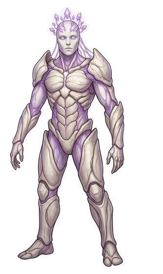

# Assimilation collective

{.illus}

*Set: Expansion*

*aka: ______________________________*

*Family: [Hive and collective](../Species_Families/hive-and-collective.md)*

A single mind with a million bodies, and always hungry for more. The collective does not conquer peoples; it absorbs them. Captives are fitted with implants and wired into the shared network, and within days the person they were is gone, their knowledge and skills added to the whole. The bodies keep walking, working and fighting, but they no longer speak for themselves.

Most of the collective moves like a swarm of pale, silent drones. Here and there a single body is set aside as its voice, speaking for the whole with something that almost resembles personality. There is no bargaining, only terms of surrender. Worlds that have met it are haunted by what they lost, and by the knowledge that their friends are still out there, marching.

## Not to be confused with

*[network/hive-mind machine kind](constructs-and-synthetics-network-hive-mind-machine-kind.md)*, which are machine minds from the start; the assimilation collective is built out of captured living peoples.

## What sets this species apart

Bodies wired into one networked consciousness that swallows other peoples; individuality is suppressed. NPC-scale. Cybernetic implants and nanoprobes are gear, not powers; only the shared network is Set.

## Breeds and races

Each block below is one set of numbers; breeds that share every number share a block (Species rules, rule 9). Attributes are final modifiers, the size trade-off included. Skills, powers and weapon groups are final levels after the family, species and breed layers.

### Assimilating hive-mind · Assimilated networked drone *(NPC only; NPC-scale)*

- **Size:** medium · **Body:** biped
- **Attributes:** END +1 INT +1 WIS +1 CHA −3 COU +3
- **Skills:** [Composure](../Skills/composure.md) +3, [Formation Fighting](../Skills/formation-fighting.md) +3, [Logistics](../Skills/logistics.md) +2, [Signals](../Skills/signals.md) +2, [Insight](../Skills/insight.md) −1, [Storytelling & Conversation](../Skills/storytelling-and-conversation.md) −1, [Deception](../Skills/deception.md) −2
- **Powers:** [Hive Mind](../Powers/hive-mind.md) 3, [Mind Link](../Powers/mind-link.md) 3
- **For the Game Master only, this race as an NPC guard or soldier (not your character's numbers):** Attack 15 · Parry 12 · Dodge 8 · Damage longsword 1d6+2 · Armour 2 · Life 18 · Threat 2 ([Bestiary roles](../bestiary.md))
- *Note (Assimilating hive-mind):* NPC-scale.
- *Note (Assimilated networked drone):* NPC-scale. Implants and nanoprobes are gear.

### Central-node collective voice *(NPC only; NPC-scale)*

- **Size:** medium · **Body:** biped
- **Attributes:** END +1 INT +2 WIS +1 CHA −1 COU +3
- **Skills:** [Composure](../Skills/composure.md) +3, [Formation Fighting](../Skills/formation-fighting.md) +3, [Leadership](../Skills/leadership.md) +2, [Logistics](../Skills/logistics.md) +2, [Signals](../Skills/signals.md) +2, [Insight](../Skills/insight.md) −1, [Deception](../Skills/deception.md) −2
- **Powers:** [Hive Mind](../Powers/hive-mind.md) 3, [Mind Link](../Powers/mind-link.md) 3
- **For the Game Master only, this race as an NPC guard or soldier (not your character's numbers):** Attack 15 · Parry 12 · Dodge 8 · Damage longsword 1d6+2 · Armour 2 · Life 18 · Threat 2 ([Bestiary roles](../bestiary.md))
- *Why:* Speaks and coordinates for the hive, keeping more personality than a drone.
- *Note:* NPC-scale.

