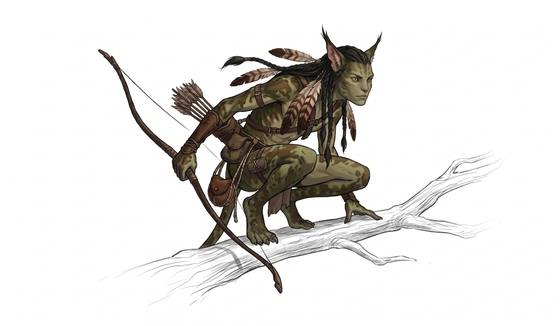

# Blue tribal folk

{.illus}

*Set: Expansion*

*aka: ______________________________*

*Family: [Humankind](../Species_Families/humankind.md)*

Tall, lean, blue-skinned natives with long tails, large golden eyes and a braided cord of living nerves at the back of the head. Through that cord they bond with the animals they ride and with the tangled life of their world, whose trees and roots seem to carry a kind of memory. Forest clans hunt among giant trees and ride winged beasts; reef clans have broader tails and stronger lungs and ride the sea's great swimmers.

They are hunters and weavers, patient and fierce, with little patience for strangers who come to dig up their land. Outsiders who stay long enough and learn to listen are sometimes adopted. Those who come to take are remembered for generations, and not kindly.

## Not to be confused with

the *[psychic/telepathic human](humankind-psychic-telepathic-human.md)*, whose bond is a mind talent; these folk make their bond through a living cord of the body.

## What sets this species apart

Tall, tailed natives with a neural link that bonds them to animals and to their world's living network.

## Breeds and races

Each block below is one set of numbers; breeds that share every number share a block (Species rules, rule 9). Attributes are final modifiers, the size trade-off included. Skills, powers and weapon groups are final levels after the family, species and breed layers.

### No. 62 Forest clan tribal folk *(genres: pulp planets and lost worlds, space opera: near-humans)*

- **Size:** large · **Body:** biped
- **What it's like:** Ten-foot-tall, blue-tailed forest folk who bond deeply with animals and the trees. (looks like: alien; good at: climbing, wilderness, powers and magic)
- **Attributes:** STR +2 AGI −1
- **Skills:** [Climbing](../Skills/climbing.md) +2, [Animal Handling](../Skills/animal-handling.md) +1, [Balance](../Skills/balance.md) +1, [Survival: Forest (Woodcraft)](../Skills/survival-forest-woodcraft.md) +1
- **Powers:** [Beast Bonding](../Powers/beast-bonding.md) 2, [Nature Sense](../Powers/nature-sense.md) 1
- **For the Game Master only, this race as an NPC guard or soldier (not your character's numbers):** Attack 14 · Parry 11 · Dodge 6 · Damage longsword 1d6+2 · Armour 2 · Life 21 · Threat 2 ([Bestiary roles](../bestiary.md))
- *Why:* Agile climbers of the great forest.

### No. 63 Reef clan tribal folk *(genres: pulp planets and lost worlds, space opera: near-humans)*

- **Size:** large · **Body:** biped
- **What it's like:** Webbed, glowing reef-dwellers who swim beautifully and bond with sea creatures. (looks like: alien; good at: swimming, wilderness, powers and magic)
- **Attributes:** STR +2 AGI −1
- **Skills:** [Diving](../Skills/diving.md) +2, [Swimming](../Skills/swimming.md) +2, [Animal Handling](../Skills/animal-handling.md) +1, [Balance](../Skills/balance.md) +1, [Survival: Coast & Sea](../Skills/survival-coast-and-sea.md) +1
- **Powers:** [Beast Bonding](../Powers/beast-bonding.md) 2, [Nature Sense](../Powers/nature-sense.md) 1
- **For the Game Master only, this race as an NPC guard or soldier (not your character's numbers):** Attack 14 · Parry 11 · Dodge 6 · Damage longsword 1d6+2 · Armour 2 · Life 21 · Threat 2 ([Bestiary roles](../bestiary.md))
- *Why:* Broader tails and webbed hands and feet make them excellent swimmers and divers.

