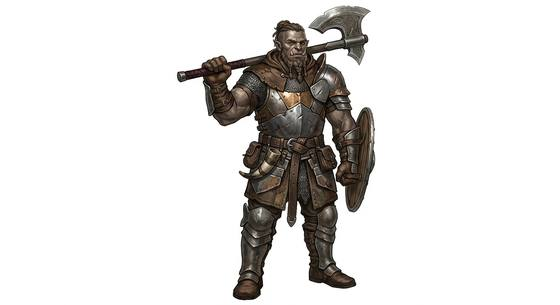

# Hybrid bloodline human

{.illus}

*Set: Expansion*

*aka: ______________________________*

*Family: [Humankind](../Species_Families/humankind.md)*

Humans with something else in the family. A god or hero in the line, an elf or orc grandparent, a giant somewhere back, a spirit or demon who left a mark on the blood. Each bloodline carries its own signature: long life and sharp eyes, a strong jaw and a hard temper, a knack for sorcery or healing fire, the ability to hunt ghosts or to come back after death. Some can pass as ordinary people for as long as they like; others have glowing eyes that give them away in any crowd.

Most of them straddle two worlds and belong fully to neither. The human side calls them strange, the other side calls them diluted, and both are eager to use them when it suits.

## Not to be confused with

the *[divinely-ascended human](humankind-divinely-ascended-human.md)*, who was chosen and empowered during life; the hybrid inherited the gift from a parent.

## What sets this species apart

Each bloodline carries a different signature trait from its other parent, so the lines are set at Breed/Race level (often by copying from the parent family).

## Breeds and races

Each block below is one set of numbers; breeds that share every number share a block (Species rules, rule 9). Attributes are final modifiers, the size trade-off included. Skills, powers and weapon groups are final levels after the family, species and breed layers.

### Demigod hero-blooded humans · Elf-kin blooded seafarer folk · Abyss-cursed delver folk *(same numbers as a baseline human: play as one (Species rule 18))*

- **Size:** medium · **Body:** biped
- **Attributes:** none
- **For the Game Master only, this race as an NPC guard or soldier (not your character's numbers):** Attack 14 · Parry 11 · Dodge 8 · Damage longsword 1d6+2 · Armour 2 · Life 17 · Threat 1 ([Bestiary roles](../bestiary.md))
- *Demigod hero-blooded humans:* The signature gift depends on the divine parent, so none is fixed here.
- *Note (Demigod hero-blooded humans):* The GM Sets one power at 2 matching the parent.
- *Elf-kin blooded seafarer folk:* Blessed with lifespans well beyond ordinary humans.
- *Note (Elf-kin blooded seafarer folk):* Seafaring and learning are culture. Lifespan (long-lived) is a lexicon detail, not a game number.
- *Abyss-cursed delver folk:* Same as its species; the curse is a condition gained from exposure, not an innate trait.

### No. 48 Half-elf hybrid folk *(genres: classic fantasy; starter)*

- **Size:** medium · **Body:** biped
- **What it's like:** Children of human and elf, at home in both worlds and in neither. (looks like: elf; good at: speed and agility, keen senses)
- **Attributes:** AGI +1 PER +1
- **Skills:** - **Powers:** [Night & Spectrum Sight](../Powers/night-and-spectrum-sight.md) 1
- **For the Game Master only, this race as an NPC guard or soldier (not your character's numbers):** Attack 14 · Parry 11 · Dodge 9 · Damage longsword 1d6+2 · Armour 2 · Life 17 · Threat 1 ([Bestiary roles](../bestiary.md))
- *Why:* Elf blood gives keener eyes, sight in dim light and a longer life.
- *Note:* Lifespan (long-lived) is a lexicon detail, not a game number.

### No. 49 Half-orc hybrid folk *(genres: classic fantasy; starter)*

- **Size:** medium · **Body:** biped
- **What it's like:** Children of human and orc: strong, tough, and often misjudged. (looks like: orc; good at: strength, fighting, keen senses)
- **Attributes:** STR +1
- **Skills:** [Intimidation](../Skills/intimidation.md) +1
- **Powers:** [Night & Spectrum Sight](../Powers/night-and-spectrum-sight.md) 2
- **For the Game Master only, this race as an NPC guard or soldier (not your character's numbers):** Attack 14 · Parry 11 · Dodge 8 · Damage longsword 1d6+2 · Armour 2 · Life 17 · Threat 1 ([Bestiary roles](../bestiary.md))
- *Why:* Orc blood gives darkvision and a fearsome look.
- *Note:* Strong build is an attribute matter.

### No. 50 War-wizard bloodline folk *(genres: classic fantasy)*

- **Size:** medium · **Body:** biped
- **What it's like:** A rare, hunted bloodline gifted with both battle magic and healing hands. (looks like: human; good at: powers and magic, healing)
- **Attributes:** none
- **Powers:** [Energy Bolt](../Powers/energy-bolt.md) 2, [Healing Touch](../Powers/healing-touch.md) 1
- **For the Game Master only, this race as an NPC guard or soldier (not your character's numbers):** Attack 14 · Parry 11 · Dodge 8 · Damage longsword 1d6+2 · Armour 2 · Life 17 · Threat 1 ([Bestiary roles](../bestiary.md))
- *Why:* Born with both destructive and healing magic.

### No. 51 Sorcerer-blooded longlived folk *(genres: classic fantasy)*

- **Size:** medium · **Body:** biped
- **What it's like:** Long-lived sorcerers who move objects with nothing but a thought. (looks like: human; good at: powers and magic, knowledge)
- **Attributes:** none
- **Powers:** [Telekinesis](../Powers/telekinesis.md) 2
- **For the Game Master only, this race as an NPC guard or soldier (not your character's numbers):** Attack 14 · Parry 11 · Dodge 8 · Damage longsword 1d6+2 · Armour 2 · Life 17 · Threat 1 ([Bestiary roles](../bestiary.md))
- *Why:* Innate sorcery by will and word, and lives of millennia.
- *Note:* Telekinesis stands for the will-and-word gift; the GM may swap it for an equivalent power. Lifespan (very long-lived) is a lexicon detail, not a game number.

### No. 52 Half-giant folk *(genres: myth and legend, classic fantasy)*

- **Size:** large · **Body:** biped
- **What it's like:** Gentle-natured half-giants, taller and stronger than any ordinary person. (looks like: giant; good at: strength, toughness)
- **Attributes:** STR +3 AGI −2
- **Powers:** [Toughness](../Powers/toughness.md) 1
- **For the Game Master only, this race as an NPC guard or soldier (not your character's numbers):** Attack 14 · Parry 11 · Dodge 5 · Damage longsword 1d6+2 · Armour 2 · Life 23 · Threat 2 ([Bestiary roles](../bestiary.md))
- *Why:* Giant blood gives a harder body.
- *Note:* Copied at half the giant-kind family value; size and strength are attribute matters.

### Half-beast assassin folk *(NPC only)*

- **Size:** medium · **Body:** biped
- **Attributes:** AGI +1 END +1
- **Powers:** [Toughness](../Powers/toughness.md) 1
- **For the Game Master only, this race as an NPC guard or soldier (not your character's numbers):** Attack 14 · Parry 11 · Dodge 9 · Damage longsword 1d6+2 · Armour 2 · Life 20 · Threat 1 ([Bestiary roles](../bestiary.md))
- *Why:* Beast-bred stock that is unnaturally resilient.
- *Note:* Assassin training is Profession.

### No. 53 Divinity-touched hybrid folk *(genres: myth and legend, heavens, hells and other planes)*

- **Size:** medium · **Body:** biped
- **What it's like:** Outsiders marked by faint divine blood, with glowing eyes and a touch of foresight. (looks like: human; good at: powers and magic, keen senses)
- **Attributes:** none
- **Powers:** [Second Sight](../Powers/second-sight.md) 1
- **For the Game Master only, this race as an NPC guard or soldier (not your character's numbers):** Attack 14 · Parry 11 · Dodge 8 · Damage longsword 1d6+2 · Armour 2 · Life 17 · Threat 1 ([Bestiary roles](../bestiary.md))
- *Why:* A minor divine or spirit trait in the blood.
- *Note:* Second Sight stands for the minor gift; the GM may swap it for a power matching the patron.

### No. 54 Death-marked revenant folk *(genres: dark fantasy, gothic horror)*

- **Size:** medium · **Body:** biped
- **What it's like:** Dark-marked outcasts who keep rising again after they die. (looks like: human; good at: powers and magic, toughness)
- **Attributes:** none
- **Powers:** [Cheat Death](../Powers/cheat-death.md) 2
- **For the Game Master only, this race as an NPC guard or soldier (not your character's numbers):** Attack 14 · Parry 11 · Dodge 8 · Damage longsword 1d6+2 · Armour 2 · Life 17 · Threat 1 ([Bestiary roles](../bestiary.md))
- *Why:* Marked by dark power, they come back after death.

### No. 55 Reincarnating crystal-lineage folk *(genres: super-powered: cosmic and mythic, myth and legend)*

- **Size:** medium · **Body:** biped
- **What it's like:** Descendants of a lost kingdom, reborn again and again across the centuries. (looks like: human; good at: powers and magic, knowledge)
- **Attributes:** none
- **Powers:** [Renewal at Death](../Powers/renewal-at-death.md) 1
- **For the Game Master only, this race as an NPC guard or soldier (not your character's numbers):** Attack 14 · Parry 11 · Dodge 8 · Damage longsword 1d6+2 · Armour 2 · Life 17 · Threat 1 ([Bestiary roles](../bestiary.md))
- *Why:* They are reborn across the centuries.
- *Note:* Renewal stands for reincarnation. Powers unlocked by crystals are gear.

### No. 56 Spirit-hunter bloodline folk *(genres: gothic horror)*

- **Size:** medium · **Body:** biped
- **What it's like:** A hunted bloodline who conjure spirit-bows and armour out of thin air. (looks like: human; good at: powers and magic, fighting)
- **Attributes:** none
- **Powers:** [Conjure Weapon & Armour](../Powers/conjure-weapon-and-armour.md) 2, [Second Sight](../Powers/second-sight.md) 1
- **For the Game Master only, this race as an NPC guard or soldier (not your character's numbers):** Attack 14 · Parry 11 · Dodge 8 · Damage longsword 1d6+2 · Armour 2 · Life 17 · Threat 1 ([Bestiary roles](../bestiary.md))
- *Why:* A hereditary gift for shaping spirit particles into bows and arrows, and for seeing spirits.

### No. 57 Half-Atlantean hybrid folk *(genres: super-powered: cosmic and mythic, sea and sky)*

- **Size:** medium · **Body:** biped
- **What it's like:** Half-sea-kingdom folk carrying a little of the deep ocean's strength and breath. (looks like: human; good at: swimming, strength)
- **Attributes:** none
- **Skills:** [Swimming](../Skills/swimming.md) +1
- **Powers:** [Super Strength](../Powers/super-strength.md) 1, [Water Breathing](../Powers/water-breathing.md) 1
- **For the Game Master only, this race as an NPC guard or soldier (not your character's numbers):** Attack 14 · Parry 11 · Dodge 8 · Damage longsword 2d6 · Armour 2 · Life 17 · Threat 2 ([Bestiary roles](../bestiary.md))
- *Why:* Part of an undersea people's strength and breath, with less endurance underwater.

