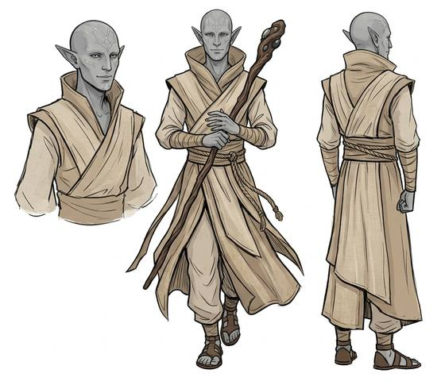

# Logical ascetic folk

{.illus}

*Set: Expansion*

*aka: ______________________________*

*Family: [Humankind](../Species_Families/humankind.md)*

A proud desert-world people with green, copper-tinged blood, pointed ears, keen hearing and more strength than their slender build suggests. Their inner lives are fierce, and their culture answers that ferocity with discipline: long training in logic and restraint, calm speech and a studied lack of display. A few adepts can join minds by touch. Their minds are hard to force, and prying into them is thought a grave insult.

Their cousins went another way. One line kept the blood and dropped the restraint, and became a cunning, aggressive empire under dim night skies. Another was driven underground and made into slave-soldiers, pale and sharp-eyed in the dark. All three are cool with strangers. Only one of them pretends it is a virtue.

## Not to be confused with

the *[psychic/telepathic human](humankind-psychic-telepathic-human.md)*, for whom the mind sense is the whole point; here it is a latent gift behind a wall of discipline.

## What sets this species apart

A shared bloodline with minds hard to invade and a latent gift for telepathy. Telepathy is affinity; the ascetic breed Sets its touch telepathy at Breed/Race level. Emotional discipline is culture.

## Breeds and races

Each block below is one set of numbers; breeds that share every number share a block (Species rules, rule 9). Attributes are final modifiers, the size trade-off included. Skills, powers and weapon groups are final levels after the family, species and breed layers.

### No. 65 Logical ascetic desert-world folk *(genres: space opera: near-humans)*

- **Size:** medium · **Body:** biped
- **What it's like:** Calm desert logicians, strong and sharp-eared, who read minds through touch. (looks like: alien; good at: powers and magic, keen senses, toughness)
- **Attributes:** STR +1 END +1
- **Skills:** [Survival: Desert](../Skills/survival-desert.md) +1
- **Powers:** [Mind Meld](../Powers/mind-meld.md) 2, [Enhanced Senses](../Powers/enhanced-senses.md) 1, [Mind Shield](../Powers/mind-shield.md) 1
- **For the Game Master only, this race as an NPC guard or soldier (not your character's numbers):** Attack 14 · Parry 11 · Dodge 8 · Damage longsword 1d6+2 · Armour 2 · Life 18 · Threat 1 ([Bestiary roles](../bestiary.md))
- *Why:* Touch telepathy, acute hearing and a desert body.
- *Note:* Carries out the species note (touch telepathy). The atavist strain without emotional control has the same numbers; the discipline is culture. Great strength is an attribute matter.

### No. 66 Warrior-empire offshoot folk *(genres: space opera: near-humans)*

- **Size:** medium · **Body:** biped
- **What it's like:** Cunning, aggressive warrior-kin, tough and resistant to having their minds read. (looks like: alien; good at: fighting, toughness, powers and magic)
- **Attributes:** STR +1 END +1
- **Powers:** [Mind Shield](../Powers/mind-shield.md) 1
- **For the Game Master only, this race as an NPC guard or soldier (not your character's numbers):** Attack 14 · Parry 11 · Dodge 8 · Damage longsword 1d6+2 · Armour 2 · Life 18 · Threat 1 ([Bestiary roles](../bestiary.md))
- *Why:* Same as its species; the cunning culture is Culture and light sensitivity is a flaw.
- *Note:* They lack the touch telepathy of their ascetic kin; the species' Telepathy affinity stays.

### No. 67 Subterranean warrior caste folk *(genres: space opera: near-humans)*

- **Size:** medium · **Body:** biped
- **What it's like:** Pale underground soldiers with sharp night eyes and minds shut tight against intrusion. (looks like: alien; good at: keen senses, toughness, powers and magic)
- **Attributes:** STR +1 END +1
- **Skills:** [Survival: Caves & Underground](../Skills/survival-caves-and-underground.md) +1
- **Powers:** [Night & Spectrum Sight](../Powers/night-and-spectrum-sight.md) 2, [Mind Shield](../Powers/mind-shield.md) 1
- **For the Game Master only, this race as an NPC guard or soldier (not your character's numbers):** Attack 14 · Parry 11 · Dodge 8 · Damage longsword 1d6+2 · Armour 2 · Life 18 · Threat 1 ([Bestiary roles](../bestiary.md))
- *Why:* Generations underground gave them keen low-light vision.

