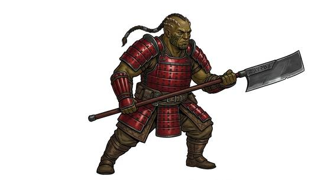

# Ridged warrior folk

{.illus}

*Set: Expansion*

*aka: ______________________________*

*Family: [Humankind](../Species_Families/humankind.md)*

Big, broad and hard to kill. These peoples wear heavy ridges of bone across the brow and skull, thick hides that shrug off cold and scratches, and sometimes a spare organ or two in case the first fails. Pain is a thing they notice and then ignore. Their faces look fierce even at rest, and most of them are happy to confirm the impression.

Many of their societies run on honour, blood-debts and loud feasts, and they sing about battles the way other people sing about love. Some lines are slavers and arena brutes rather than knights. Neighbours rarely trust them and almost always respect them, the way one respects a storm coming off the mountains.

## Not to be confused with

the *[warrior/combat near-human folk](humankind-warrior-combat-near-human-folk.md)*, whose edge comes from training; these folk are built for battle in the body itself.

## What sets this species apart

Heavily built, tough-hided peoples who shrug off pain and look fearsome. The honour code is culture; natural weapons and redundant organs are per Breed/Race.

## Breeds and races

Each block below is one set of numbers; breeds that share every number share a block (Species rules, rule 9). Attributes are final modifiers, the size trade-off included. Skills, powers and weapon groups are final levels after the family, species and breed layers.

### No. 64 Ridged warrior folk *(genres: space opera: near-humans)*

- **Size:** large · **Body:** biped
- **What it's like:** Honour-bound warriors with ridged skulls, thick skin and an iron will to fight through pain. (looks like: alien; good at: fighting, toughness)
- **Attributes:** STR +2 AGI −2 END +1
- **Skills:** [Pain Tolerance](../Skills/pain-tolerance.md) +2, [Intimidation](../Skills/intimidation.md) +1
- **Powers:** [Toughness](../Powers/toughness.md) 1
- **For the Game Master only, this race as an NPC guard or soldier (not your character's numbers):** Attack 14 · Parry 11 · Dodge 5 · Damage longsword 1d6+2 · Armour 2 · Life 24 · Threat 2 ([Bestiary roles](../bestiary.md))
- *Why:* Redundant organs make many of them hard to kill.
- *Note:* Lines with tusks add attack tusks Set 1d6+3, and lines with a tongue-spike add attack tongue-spike Set 1d6+1, as different stat blocks.

### Hulking gladiatorial slaver folk *(NPC only)*

- **Size:** large · **Body:** biped
- **Attributes:** STR +4 AGI −2 END +1 INT −2
- **Skills:** [Pain Tolerance](../Skills/pain-tolerance.md) +2, [Intimidation](../Skills/intimidation.md) +1
- **For the Game Master only, this race as an NPC guard or soldier (not your character's numbers):** Attack 14 · Parry 11 · Dodge 5 · Damage longsword 1d6+2 · Armour 2 · Life 22 · Threat 2 ([Bestiary roles](../bestiary.md))
- *Why:* Same as its species; a hulking build is an attribute matter and the arenas are culture.

