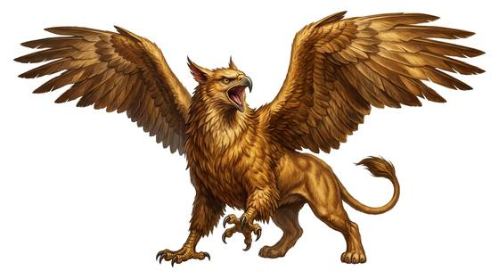
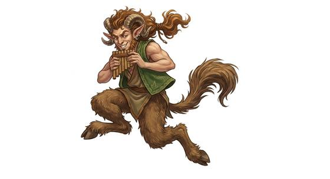

# Chimeric folk

{.illus} {.illus}

*Set: Core*

*aka: ______________________________*

*Family: [Hybrid and chimeric](../Species_Families/hybrid-and-chimeric.md)*

The fusion beings of legend, each assembled from two or three creatures that nature never meant to share a body. There are lion-bodied sphinxes with human faces and a fondness for riddles, eagle-headed lions that guard gold, bull-headed giants in labyrinths, goat-legged pipers, serpent-bodied queens, and humans with the heads of jackals, cats or crocodiles who serve at temples of death and birth. There are winged guardians of palace gates, stone-skinned watchers that sleep all day, and gentle furry monsters who only pretend to be frightening.

They share almost nothing except the fact of their fusion. Each borrows its strengths and habits from the creatures it was made of, and each carries a story about how it came to be. Some are wise, some are beasts, and many are simply lonely.

## Not to be confused with

*[engineered hybrid folk](hybrid-and-chimeric-engineered-hybrid-folk.md)*, which are made in laboratories; chimeric folk are the fusion beings of myth and nature.

## What sets this species apart

No shared difference: each chimera fuses different creatures, so parent-family lines are chosen per Breed/Race. Copy lines from each parent family (e.g. Avian, Feline, Serpentine) at Breed/Race level. Attributes copied per Breed/Race from the parent families (e.g. Feline, Avian, Serpentine), since the Hybrid family has no attribute layer of its own.

## Breeds and races

Each block below is one set of numbers; breeds that share every number share a block (Species rules, rule 9). Attributes are final modifiers, the size trade-off included. Skills, powers and weapon groups are final levels after the family, species and breed layers.

### Sphinx-folk *(NPC only)*

- **Size:** large · **Body:** biped+winged
- **Attributes:** STR +2 AGI −1 INT +3 WIS +3 PER +1 CHA +1
- **Skills:** [Riddling](../Skills/riddling.md) +2, [Animal Handling](../Skills/animal-handling.md) +1, [Etiquette](../Skills/etiquette.md) −1, [Disguise](../Skills/disguise.md) −2
- **Powers:** [Beast Aspect](../Powers/beast-aspect.md) 2, [Night & Spectrum Sight](../Powers/night-and-spectrum-sight.md) 2
- **Natural attacks:** claws 1d6+1
- **For the Game Master only, this race as an NPC guard or soldier (not your character's numbers):** Attack 14 · Parry 11 · Dodge 6 · Damage longsword 1d6+2; claws 1d6+4 · Armour 2 · Life 21 · Threat 2 ([Bestiary roles](../bestiary.md))
- *Why:* A lion-bodied riddler and guardian: it copies the Feline family's night sight and adds a riddler's wit.
- *Note:* Night & Spectrum Sight copied from the Feline family. Flight is affinity only, since only some sphinxes are winged. NPC only.

### Manticore-folk *(beast)*

- **Size:** large · **Body:** quadruped+winged
- **Attributes:** STR +2 END +1 INT −2 WIS +1 CHA −2
- **Skills:** [Stealth](../Skills/stealth.md) +2, [Animal Handling](../Skills/animal-handling.md) +1, [Etiquette](../Skills/etiquette.md) −1, [Disguise](../Skills/disguise.md) −2
- **Powers:** [Beast Aspect](../Powers/beast-aspect.md) 2, [Flight](../Powers/flight.md) 2, [Poison Touch](../Powers/poison-touch.md) 2
- **Natural attacks:** claws 1d6+1, bite 1d6+1, stinger 1d6+1
- **For the Game Master only, this race as an NPC guard or soldier (not your character's numbers):** Attack 14 · Parry — · Dodge 7 · Damage claws 1d6+2; bite 1d6+4 · Armour 0 · Life 20 · Threat minor ([Bestiary roles](../bestiary.md))
- *Why:* A winged lion with a venomous scorpion tail that launches spines.

### Griffon/griffin-folk *(beast)*

- **Size:** large · **Body:** quadruped+winged
- **Attributes:** STR +2 INT −2 WIS +2 PER +2
- **Skills:** [Animal Handling](../Skills/animal-handling.md) +1, [Etiquette](../Skills/etiquette.md) −1, [Disguise](../Skills/disguise.md) −2
- **Powers:** [Flight](../Powers/flight.md) 3, [Beast Aspect](../Powers/beast-aspect.md) 2
- **Natural attacks:** beak 1d6, talons 1d6+1
- **For the Game Master only, this race as an NPC guard or soldier (not your character's numbers):** Attack 14 · Parry — · Dodge 7 · Damage talons 1d6+2; beak 1d6+3 · Armour 0 · Life 19 · Threat minor ([Bestiary roles](../bestiary.md))
- *Why:* Eagle foreparts and lion hindquarters: an eagle's eyes and a strong flier's wings.

### Hippogriff-folk *(beast)*

- **Size:** large · **Body:** quadruped+winged
- **Attributes:** STR +2 AGI −1 INT −2 WIS +1 PER +2
- **Skills:** [Animal Handling](../Skills/animal-handling.md) +1, [Etiquette](../Skills/etiquette.md) −1, [Disguise](../Skills/disguise.md) −2
- **Powers:** [Flight](../Powers/flight.md) 3, [Beast Aspect](../Powers/beast-aspect.md) 2
- **Natural attacks:** beak 1d6, talons 1d6+1, hooves 1d6+2
- **For the Game Master only, this race as an NPC guard or soldier (not your character's numbers):** Attack 14 · Parry — · Dodge 6 · Damage hooves 1d6+2; talons 1d6+4 · Armour 0 · Life 19 · Threat 1 ([Bestiary roles](../bestiary.md))
- *Why:* Eagle foreparts on a horse's body: an eagle's eyes and a strong flier's wings.

### Lamia-folk *(NPC only)*

- **Size:** medium · **Body:** serpentine
- **Attributes:** AGI +1 END −1 CHA +3
- **Skills:** [Charm & Seduction](../Skills/charm-and-seduction.md) +2, [Stealth](../Skills/stealth.md) +2, [Animal Handling](../Skills/animal-handling.md) +1, [Etiquette](../Skills/etiquette.md) −1, [Disguise](../Skills/disguise.md) −2, [Jumping](../Skills/jumping.md) −3, [Riding](../Skills/riding.md) Foreign Concept
- **Powers:** [Beast Aspect](../Powers/beast-aspect.md) 2
- **Weapon groups:** [Wrestling & Grappling](../Weapon_Groups/wrestling-and-grappling.md) +2
- **For the Game Master only, this race as an NPC guard or soldier (not your character's numbers):** Attack 14 · Parry 11 · Dodge 9 · Damage longsword 1d6+2 · Armour 2 · Life 16 · Threat 1 ([Bestiary roles](../bestiary.md))
- *Why:* A serpent's lower body under a seductive human upper half.
- *Note:* Stealth, Jumping and Riding copied from the Serpentine family. Poison Touch is affinity only, since only some lamias are venomous. NPC only. Wrestling & Grappling is the serpent coils, copied from the Serpentine family.

### Harpy-folk *(NPC only)*

- **Size:** medium · **Body:** winged biped
- **Attributes:** STR −2 AGI +2 END −1 WIS +1 PER +2
- **Skills:** [Animal Handling](../Skills/animal-handling.md) +1, [Scavenging](../Skills/scavenging.md) +1, [Etiquette](../Skills/etiquette.md) −1, [Disguise](../Skills/disguise.md) −2
- **Powers:** [Beast Aspect](../Powers/beast-aspect.md) 2, [Flight](../Powers/flight.md) 2, [Sonic Scream](../Powers/sonic-scream.md) 1
- **Natural attacks:** talons 1d6+1
- **For the Game Master only, this race as an NPC guard or soldier (not your character's numbers):** Attack 14 · Parry 11 · Dodge 10 · Damage longsword 1d6+1; talons 1d6 · Armour 2 · Life 16 · Threat 1 ([Bestiary roles](../bestiary.md))
- *Why:* Bird legs and wings on a human upper body, with a shrill, stunning cry.
- *Note:* Perception and Flight follow the Avian family. NPC only.

### No. 490 Naga-folk *(genres: myth and legend)*

- **Size:** medium · **Body:** serpentine
- **What it's like:** Serpent-bodied naga with a human upper body, wise and regal, said to hold dominion over water and rain. (looks like: snake; good at: swimming, people and talk)
- **Attributes:** AGI +1 END −1 CHA +1
- **Skills:** [Swimming](../Skills/swimming.md) +2, [Animal Handling](../Skills/animal-handling.md) +1, [Etiquette](../Skills/etiquette.md) −1, [Disguise](../Skills/disguise.md) −2, [Jumping](../Skills/jumping.md) −3, [Riding](../Skills/riding.md) Foreign Concept
- **Powers:** [Beast Aspect](../Powers/beast-aspect.md) 2
- **Weapon groups:** [Wrestling & Grappling](../Weapon_Groups/wrestling-and-grappling.md) +2
- **For the Game Master only, this race as an NPC guard or soldier (not your character's numbers):** Attack 14 · Parry 11 · Dodge 9 · Damage longsword 1d6+2 · Armour 2 · Life 16 · Threat 1 ([Bestiary roles](../bestiary.md))
- *Why:* A serpent's lower body with a regal human torso, at home in water.
- *Note:* Jumping and Riding copied from the Serpentine family. Wrestling & Grappling is the serpent coils, copied from the Serpentine family.

### Arachne-folk *(NPC only)*

- **Size:** medium · **Body:** other
- **Attributes:** STR +1 AGI +1 END +2 CHA −1
- **Skills:** [Climbing](../Skills/climbing.md) +3, [Spinning & Weaving](../Skills/spinning-and-weaving.md) +2, [Animal Handling](../Skills/animal-handling.md) +1, [Etiquette](../Skills/etiquette.md) −1, [Disguise](../Skills/disguise.md) −2, [Riding](../Skills/riding.md) Foreign Concept
- **Powers:** [Beast Aspect](../Powers/beast-aspect.md) 2, [Entangle](../Powers/entangle.md) 2, [Wall Walking](../Powers/wall-walking.md) 2
- **For the Game Master only, this race as an NPC guard or soldier (not your character's numbers):** Attack 14 · Parry 11 · Dodge 9 · Damage longsword 1d6+2 · Armour 2 · Life 19 · Threat 1 ([Bestiary roles](../bestiary.md))
- *Why:* A spider's lower body under a human torso: a wall-walking web-spinner and weaver.
- *Note:* Climbing and Wall Walking copied from the Insectoid and arachnid family; Entangle is the web. NPC only.

### No. 491 Minotaur-folk *(genres: myth and legend)*

- **Size:** large · **Body:** biped+tailed
- **What it's like:** Bull-headed minotaur-folk of immense strength and an even bigger temper. (looks like: bull; good at: strength, fighting)
- **Attributes:** STR +5 AGI −2 END +1 INT −1 WIS −1
- **Skills:** [Intimidation](../Skills/intimidation.md) +2, [Animal Handling](../Skills/animal-handling.md) +1, [Composure](../Skills/composure.md) −1, [Etiquette](../Skills/etiquette.md) −1, [Disguise](../Skills/disguise.md) −2
- **Powers:** [Beast Aspect](../Powers/beast-aspect.md) 2
- **Natural attacks:** horns 1d6+3
- **For the Game Master only, this race as an NPC guard or soldier (not your character's numbers):** Attack 15 · Parry 12 · Dodge 5 · Damage horns 2d6; longsword 1d6+5 · Armour 2 · Life 22 · Threat 2 ([Bestiary roles](../bestiary.md))
- *Why:* A bull-headed giant with horns and a short temper.
- *Note:* Its great strength belongs to the attribute step.

### No. 492 Satyr *(genres: myth and legend; starter)*

- **Size:** medium · **Body:** biped+tailed
- **What it's like:** A nimble goat-legged wanderer who loves music, mischief and the wild hills. (looks like: goat; good at: strength, fighting, wilderness)
- **Attributes:** STR +1 END +1
- **Skills:** [Instrument (per instrument)](../Skills/instrument-per-instrument.md) +2, [Animal Handling](../Skills/animal-handling.md) +1, [Balance](../Skills/balance.md) +1, [Etiquette](../Skills/etiquette.md) −1, [Disguise](../Skills/disguise.md) −2
- **Powers:** [Beast Aspect](../Powers/beast-aspect.md) 2
- **Natural attacks:** horns 1d6+3, hooves 1d6+2
- **For the Game Master only, this race as an NPC guard or soldier (not your character's numbers):** Attack 14 · Parry 11 · Dodge 8 · Damage longsword 1d6+2; hooves 1d6+3 · Armour 2 · Life 18 · Threat 1 ([Bestiary roles](../bestiary.md))
- *Why:* Goat-legged pipers, sure-footed on rough ground.
- *Note:* Instrument applies to the pipes: a way of life inseparable from the people.

### Gorgon-folk *(NPC only)*

- **Size:** medium · **Body:** biped+tailed
- **Attributes:** AGI +1 WIS +1 CHA −1
- **Skills:** [Intimidation](../Skills/intimidation.md) +2, [Animal Handling](../Skills/animal-handling.md) +1, [Etiquette](../Skills/etiquette.md) −1, [Disguise](../Skills/disguise.md) −2
- **Powers:** [Petrification](../Powers/petrification.md) 3, [Beast Aspect](../Powers/beast-aspect.md) 2, [Poison Touch](../Powers/poison-touch.md) 1
- **Natural attacks:** snake hair 1d6
- **For the Game Master only, this race as an NPC guard or soldier (not your character's numbers):** Attack 14 · Parry 11 · Dodge 9 · Damage longsword 1d6+2; snake hair 1d6+1 · Armour 2 · Life 17 · Threat 1 ([Bestiary roles](../bestiary.md))
- *Why:* Venomous living snakes for hair and a gaze that turns flesh to stone.
- *Note:* Petrification is the gaze; Poison Touch is the snake-hair's bite. NPC only.

### Chimera-folk *(beast)*

- **Size:** large · **Body:** quadruped
- **Attributes:** STR +3 AGI −2 END +2 INT −2 WIS +1 PER +1
- **Skills:** [Animal Handling](../Skills/animal-handling.md) +1, [Etiquette](../Skills/etiquette.md) −1, [Disguise](../Skills/disguise.md) −2
- **Powers:** [Beast Aspect](../Powers/beast-aspect.md) 2, [Fire Blast](../Powers/fire-blast.md) 2
- **Natural attacks:** claws 1d6+1, bite 1d6+1
- **For the Game Master only, this race as an NPC guard or soldier (not your character's numbers):** Attack 14 · Parry — · Dodge 5 · Damage claws 1d6+2; bite 1d6+4 · Armour 0 · Life 21 · Threat minor ([Bestiary roles](../bestiary.md))
- *Why:* A many-headed lion-goat-serpent beast that breathes fire.

### Cockatrice-folk *(beast)*

- **Size:** small · **Body:** biped+winged
- **Attributes:** STR −2 AGI +2 INT −2 CHA −1
- **Skills:** [Animal Handling](../Skills/animal-handling.md) +1, [Etiquette](../Skills/etiquette.md) −1, [Disguise](../Skills/disguise.md) −2
- **Powers:** [Beast Aspect](../Powers/beast-aspect.md) 2, [Petrification](../Powers/petrification.md) 2
- **Natural attacks:** beak 1d6
- **For the Game Master only, this race as an NPC guard or soldier (not your character's numbers):** Attack 14 · Parry — · Dodge 11 · Damage beak 1d6 · Armour 0 · Life 13 · Threat minor ([Bestiary roles](../bestiary.md))
- *Why:* A small rooster-serpent whose glance turns flesh to stone.

### Crocodile-lion-hippo devourer folk *(beast)*

- **Size:** medium · **Body:** other
- **Attributes:** STR +2 AGI −1 END +2 INT −2
- **Skills:** [Animal Handling](../Skills/animal-handling.md) +1, [Swimming](../Skills/swimming.md) +1, [Etiquette](../Skills/etiquette.md) −1, [Disguise](../Skills/disguise.md) −2
- **Powers:** [Beast Aspect](../Powers/beast-aspect.md) 2
- **Natural attacks:** bite 1d6+1, claws 1d6+1
- **For the Game Master only, this race as an NPC guard or soldier (not your character's numbers):** Attack 14 · Parry — · Dodge 7 · Damage bite 1d6+1; claws 1d6+2 · Armour 0 · Life 17 · Threat minor ([Bestiary roles](../bestiary.md))
- *Why:* A crocodile-jawed river devourer with lion and hippo body parts.

### Vulture-lizard lord folk *(NPC only)*

- **Size:** large · **Body:** biped
- **Attributes:** STR +2 AGI −2 END −1 INT +1 COU −2
- **Skills:** [Animal Handling](../Skills/animal-handling.md) +1, [Intrigue & Politics](../Skills/intrigue-and-politics.md) +1, [Etiquette](../Skills/etiquette.md) −1, [Disguise](../Skills/disguise.md) −2
- **Powers:** [Beast Aspect](../Powers/beast-aspect.md) 2, [Life Drain](../Powers/life-drain.md) 2
- **Natural attacks:** beak 1d6
- **For the Game Master only, this race as an NPC guard or soldier (not your character's numbers):** Attack 13 · Parry 10 · Dodge 5 · Damage longsword 1d6+2; beak 1d6+3 · Armour 2 · Life 20 · Threat 1 ([Bestiary roles](../bestiary.md))
- *Why:* Decadent vulture-reptile aristocrats who drain other beings' essence to live on.
- *Note:* Intrigue & Politics is their courtly way of life. NPC only. Lifespan (very long-lived while they keep draining others) is a lexicon detail, not a game number.

### Gentle giant beast-man folk *(NPC only)*

- **Size:** huge · **Body:** biped
- **Attributes:** STR +7 AGI −4 END +2
- **Skills:** [Animal Handling](../Skills/animal-handling.md) +1, [Etiquette](../Skills/etiquette.md) −1, [Disguise](../Skills/disguise.md) −2
- **Powers:** [Beast Aspect](../Powers/beast-aspect.md) 2, [Stone Projectiles](../Powers/stone-projectiles.md) 2
- **Natural attacks:** horns 1d6+3
- **For the Game Master only, this race as an NPC guard or soldier (not your character's numbers):** Attack 15 · Parry 12 · Dodge 2 · Damage horns 2d6+1; longsword 1d6+5 · Armour 2 · Life 27 · Threat 2 ([Bestiary roles](../bestiary.md))
- *Why:* A huge, shaggy, horned beast-man who can call up rocks to hurl.
- *Note:* Its immense strength and size belong to the attribute step. NPC only.

### Ancient lion-turtle *(NPC only; NPC-scale)*

- **Size:** gigantic · **Body:** other
- **Attributes:** STR +6 AGI −6 END +3 INT +3 WIS +3 CHA +2
- **Skills:** [Swimming](../Skills/swimming.md) +2, [Animal Handling](../Skills/animal-handling.md) +1, [Etiquette](../Skills/etiquette.md) −1, [Disguise](../Skills/disguise.md) −2
- **Powers:** [Power Granting](../Powers/power-granting.md) 5, [Power Theft](../Powers/power-theft.md) 3, [Beast Aspect](../Powers/beast-aspect.md) 2
- **Natural attacks:** bite 1d6+1
- **For the Game Master only, this race as an NPC guard or soldier (not your character's numbers):** Attack 14 · Parry — · Dodge -2 · Damage bite 2d6+1 · Armour 0 · Life 34 · Threat 2 ([Bestiary roles](../bestiary.md))
- *Why:* An island-sized ancient turtle-lion that can grant or take away special abilities.

### No. 493 Gargoyle folk *(genres: gothic horror)*

- **Size:** medium · **Body:** winged biped
- **What it's like:** Winged gargoyle-folk who fly through the night in long-lived clans, but turn to stone and freeze solid by day. (looks like: gargoyle; good at: flying, toughness)
- **Attributes:** STR +1 AGI −1 END +2 CHA −1
- **Skills:** [Animal Handling](../Skills/animal-handling.md) +1, [Etiquette](../Skills/etiquette.md) −1, [Disguise](../Skills/disguise.md) −2
- **Powers:** [Beast Aspect](../Powers/beast-aspect.md) 2, [Flight](../Powers/flight.md) 2
- **For the Game Master only, this race as an NPC guard or soldier (not your character's numbers):** Attack 14 · Parry 11 · Dodge 7 · Damage longsword 1d6+2 · Armour 2 · Life 19 · Threat 1 ([Bestiary roles](../bestiary.md))
- *Why:* Long-lived winged night-flyers who turn to stone by day.
- *Note:* Flight works only at night; by day they are stone and cannot act. Lifespan (long-lived) is a lexicon detail, not a game number.

### No. 494 Big furry scarer folk *(genres: fairy tale and folklore)*

- **Size:** large · **Body:** biped
- **What it's like:** A big, horned, many-limbed furry monster who scares children for a living, though it's really gentle at heart. (looks like: monster; good at: strength, people and talk)
- **Attributes:** STR +3 AGI −2 END +1
- **Skills:** [Intimidation](../Skills/intimidation.md) +2, [Animal Handling](../Skills/animal-handling.md) +1, [Etiquette](../Skills/etiquette.md) −1, [Disguise](../Skills/disguise.md) −2
- **Powers:** [Beast Aspect](../Powers/beast-aspect.md) 2
- **Natural attacks:** horns 1d6+3
- **For the Game Master only, this race as an NPC guard or soldier (not your character's numbers):** Attack 14 · Parry 11 · Dodge 5 · Damage horns 2d6; longsword 1d6+5 · Armour 2 · Life 22 · Threat 2 ([Bestiary roles](../bestiary.md))
- *Why:* Big horned furry monsters whose bodies are made for scaring, though they are gentle at heart.

### No. 495 Diverse monster-folk citizen · Procedurally-created hybrid species *(genres: fairy tale and folklore)*

- **Size:** varies · **Body:** other
- **What it's like:** A monster-folk citizen of wildly varied looks — many eyes, tentacles or scales — holding down an ordinary working life. (looks like: monster; good at: people and talk, making and fixing)
- **Attributes:** none
- **Skills:** [Animal Handling](../Skills/animal-handling.md) +1, [Etiquette](../Skills/etiquette.md) −1, [Disguise](../Skills/disguise.md) −2
- **Powers:** [Beast Aspect](../Powers/beast-aspect.md) 2
- **For the Game Master only, this race as an NPC guard or soldier (not your character's numbers):** Attack 14 · Parry 11 · Dodge 8 · Damage longsword 1d6+2 · Armour 2 · Life 17 · Threat 1 ([Bestiary roles](../bestiary.md))
- *Note (Diverse monster-folk citizen):* Bodies vary wildly; the Game Master can copy lines from a parent family for a given individual.
- *Note (Procedurally-created hybrid species):* Fully custom: the Game Master copies lines from the parent families of whatever parts were chosen.

### No. 496 Whatnot folk *(genres: animal fable)*

- **Size:** medium · **Body:** biped
- **What it's like:** Soft-bodied, endlessly varied puppet-folk with no fixed shape, born performers in comedy and variety shows. (looks like: puppet; good at: people and talk, sneaking)
- **Attributes:** STR −1 CHA +1
- **Skills:** [Acting](../Skills/acting.md) +1, [Animal Handling](../Skills/animal-handling.md) +1, [Etiquette](../Skills/etiquette.md) −1, [Disguise](../Skills/disguise.md) −2
- **Powers:** [Beast Aspect](../Powers/beast-aspect.md) 2
- **For the Game Master only, this race as an NPC guard or soldier (not your character's numbers):** Attack 13 · Parry 10 · Dodge 8 · Damage longsword 1d6+2 · Armour 2 · Life 17 · Threat 1 ([Bestiary roles](../bestiary.md))
- *Why:* Soft puppet-like folk of no fixed species, raised in a variety-show performing culture.

### Bird-footed water fey *(NPC only)*

- **Size:** medium · **Body:** biped
- **Attributes:** STR −1 AGI +1 END −1 CHA +2
- **Skills:** [Animal Handling](../Skills/animal-handling.md) +1, [Swimming](../Skills/swimming.md) +1, [Etiquette](../Skills/etiquette.md) −1, [Disguise](../Skills/disguise.md) −2
- **Powers:** [Beast Aspect](../Powers/beast-aspect.md) 2, [Water-Spirit Allure](../Powers/water-spirit-allure.md) 2
- **For the Game Master only, this race as an NPC guard or soldier (not your character's numbers):** Attack 14 · Parry 11 · Dodge 9 · Damage longsword 1d6+2 · Armour 2 · Life 16 · Threat 1 ([Bestiary roles](../bestiary.md))
- *Why:* A bird-footed spring spirit who lures travellers.
- *Note:* NPC only.

### Jackal-headed folk *(NPC only)*

- **Size:** medium · **Body:** biped
- **Attributes:** END +1 WIS +2 COU +1
- **Skills:** [Animal Handling](../Skills/animal-handling.md) +1, [Mortuary Arts](../Skills/mortuary-arts.md) +1, [Etiquette](../Skills/etiquette.md) −1, [Disguise](../Skills/disguise.md) −2
- **Powers:** [Beast Aspect](../Powers/beast-aspect.md) 2, [Enhanced Senses](../Powers/enhanced-senses.md) 2, [Guide of Souls](../Powers/guide-of-souls.md) 2
- **Natural attacks:** bite 1d6+1
- **For the Game Master only, this race as an NPC guard or soldier (not your character's numbers):** Attack 14 · Parry 11 · Dodge 8 · Damage longsword 1d6+2; bite 1d6+2 · Armour 2 · Life 18 · Threat 1 ([Bestiary roles](../bestiary.md))
- *Why:* Jackal-headed guides of the dead, with a jackal's nose.
- *Note:* Enhanced Senses copied from the Canine family. NPC only.

### Cat-headed folk *(NPC only)*

- **Size:** medium · **Body:** biped
- **Attributes:** STR −1 AGI +2 END −1 WIS +1
- **Skills:** [Balance](../Skills/balance.md) +2, [Acrobatics](../Skills/acrobatics.md) +1, [Animal Handling](../Skills/animal-handling.md) +1, [Etiquette](../Skills/etiquette.md) −1, [Disguise](../Skills/disguise.md) −2
- **Powers:** [Beast Aspect](../Powers/beast-aspect.md) 2, [Night & Spectrum Sight](../Powers/night-and-spectrum-sight.md) 2
- **Natural attacks:** bite 1d6+1
- **For the Game Master only, this race as an NPC guard or soldier (not your character's numbers):** Attack 14 · Parry 11 · Dodge 10 · Damage longsword 1d6+2; bite 1d6+2 · Armour 2 · Life 16 · Threat 1 ([Bestiary roles](../bestiary.md))
- *Why:* Cat-headed guardians with a cat's agility and night eyes.
- *Note:* Copied from the Feline family. NPC only.

### Crocodile-headed folk *(NPC only)*

- **Size:** large · **Body:** biped
- **Attributes:** STR +3 AGI −2 END +1 CHA −1
- **Skills:** [Swimming](../Skills/swimming.md) +2, [Animal Handling](../Skills/animal-handling.md) +1, [Intimidation](../Skills/intimidation.md) +1, [Etiquette](../Skills/etiquette.md) −1, [Disguise](../Skills/disguise.md) −2
- **Powers:** [Beast Aspect](../Powers/beast-aspect.md) 2
- **Natural attacks:** bite 1d6+1
- **For the Game Master only, this race as an NPC guard or soldier (not your character's numbers):** Attack 14 · Parry 11 · Dodge 5 · Damage longsword 1d6+2; bite 1d6+4 · Armour 2 · Life 22 · Threat 2 ([Bestiary roles](../bestiary.md))
- *Why:* Crocodile-headed river beings with jaws to match.
- *Note:* Bite copied from the Reptilian family. NPC only.

### Palace lamassu folk *(NPC only)*

- **Size:** huge · **Body:** quadruped+winged
- **Attributes:** STR +6 AGI −4 END +2 WIS +2 PER +2
- **Skills:** [Animal Handling](../Skills/animal-handling.md) +1, [Etiquette](../Skills/etiquette.md) −1, [Disguise](../Skills/disguise.md) −2, [Riding](../Skills/riding.md) Foreign Concept
- **Powers:** [Beast Aspect](../Powers/beast-aspect.md) 2, [Flight](../Powers/flight.md) 2, [Threshold Guarding](../Powers/threshold-guarding.md) 2
- **Natural attacks:** hooves 1d6+2
- **For the Game Master only, this race as an NPC guard or soldier (not your character's numbers):** Attack 14 · Parry — · Dodge 2 · Damage hooves 2d6 · Armour 0 · Life 25 · Threat 1 ([Bestiary roles](../bestiary.md))
- *Why:* Huge human-headed winged bulls or lions that watch over gateways.
- *Note:* NPC only. No hands: held weapons unusable.

### Night-stalking rakshasa folk *(NPC only)*

- **Size:** large · **Body:** biped
- **Attributes:** STR +2 INT +1 WIS +1 CHA +2
- **Skills:** [Animal Handling](../Skills/animal-handling.md) +1, [Etiquette](../Skills/etiquette.md) −1
- **Powers:** [Beast Aspect](../Powers/beast-aspect.md) 2, [Major Illusion](../Powers/major-illusion.md) 2, [Night & Spectrum Sight](../Powers/night-and-spectrum-sight.md) 2, [Self-Alteration](../Powers/self-alteration.md) 2
- **Natural attacks:** claws 1d6+1, bite 1d6+1
- **For the Game Master only, this race as an NPC guard or soldier (not your character's numbers):** Attack 14 · Parry 11 · Dodge 7 · Damage longsword 1d6+2; claws 1d6+4 · Armour 2 · Life 21 · Threat 2 ([Bestiary roles](../bestiary.md))
- *Why:* Night-hunting shapeshifting demons with powerful illusions.
- *Note:* Disguise Set 0 cancels the family's penalty, since they take other shapes. NPC only.

### No. 497 Heavenly gandharva folk *(genres: heavens, hells and other planes, myth and legend)*

- **Size:** medium · **Body:** biped
- **What it's like:** Celestial musician-spirits, sometimes touched by horse or bird features, masters of music and magic alike. (looks like: human with wings; good at: powers and magic, people and talk)
- **Attributes:** STR −1 CHA +2
- **Skills:** [Instrument (per instrument)](../Skills/instrument-per-instrument.md) +2, [Animal Handling](../Skills/animal-handling.md) +1, [Arcana](../Skills/arcana.md) +1, [Singing](../Skills/singing.md) +1, [Etiquette](../Skills/etiquette.md) −1, [Disguise](../Skills/disguise.md) −2
- **Powers:** [Beast Aspect](../Powers/beast-aspect.md) 2
- **For the Game Master only, this race as an NPC guard or soldier (not your character's numbers):** Attack 13 · Parry 10 · Dodge 8 · Damage longsword 1d6+2 · Armour 2 · Life 17 · Threat 1 ([Bestiary roles](../bestiary.md))
- *Why:* Celestial musician-spirits, masters of music and magic.

### No. 498 Lotus-voiced kinnara folk *(genres: myth and legend)*

- **Size:** small · **Body:** biped+winged
- **What it's like:** Small half-bird, half-human celestial dancers and singers, famous as devoted lovers and gifted performers. (looks like: human with wings; good at: flying, people and talk)
- **Attributes:** STR −2 AGI +2 END −1 WIS +1 CHA +1
- **Skills:** [Singing](../Skills/singing.md) +2, [Animal Handling](../Skills/animal-handling.md) +1, [Dance](../Skills/dance.md) +1, [Etiquette](../Skills/etiquette.md) −1, [Disguise](../Skills/disguise.md) −2
- **Powers:** [Beast Aspect](../Powers/beast-aspect.md) 2, [Flight](../Powers/flight.md) 2
- **Natural attacks:** talons 1d6+1
- **For the Game Master only, this race as an NPC guard or soldier (not your character's numbers):** Attack 14 · Parry 11 · Dodge 11 · Damage longsword 1d6+1; talons 1d6-1 · Armour 2 · Life 14 · Threat 1 ([Bestiary roles](../bestiary.md))
- *Why:* Small half-bird celestial singers and dancers who fly.
- *Note:* Its small size belongs to the attribute step.

### Benevolent qilin folk *(NPC only)*

- **Size:** large · **Body:** quadruped
- **Attributes:** STR +3 AGI −2 END +1 WIS +3 CHA +1
- **Skills:** [Running](../Skills/running.md) +2, [Animal Handling](../Skills/animal-handling.md) +1, [Etiquette](../Skills/etiquette.md) −1, [Disguise](../Skills/disguise.md) −2
- **Powers:** [Beast Aspect](../Powers/beast-aspect.md) 2, [Truth-Sensing](../Powers/truth-sensing.md) 2, [Armour Skin](../Powers/armour-skin.md) 1
- **Natural attacks:** hooves 1d6+2, bite 1d6+1
- **For the Game Master only, this race as an NPC guard or soldier (not your character's numbers):** Attack 14 · Parry — · Dodge 5 · Damage hooves 1d6+2; bite 1d6+4 · Armour 0 · Life 20 · Threat 1 ([Bestiary roles](../bestiary.md))
- *Why:* A scaled, hooved beast that knows the worthy and wise when it sees them.
- *Note:* Running copied from the Ungulate family. NPC only. No hands: held weapons unusable.

### Treasure-hoarding pixiu folk *(beast)*

- **Size:** medium · **Body:** quadruped+winged
- **Attributes:** STR +1 AGI +1 INT −2
- **Skills:** [Animal Handling](../Skills/animal-handling.md) +1, [Etiquette](../Skills/etiquette.md) −1, [Disguise](../Skills/disguise.md) −2
- **Powers:** [Beast Aspect](../Powers/beast-aspect.md) 2, [Flight](../Powers/flight.md) 2
- **Natural attacks:** claws 1d6+1, bite 1d6+1
- **For the Game Master only, this race as an NPC guard or soldier (not your character's numbers):** Attack 14 · Parry — · Dodge 9 · Damage claws 1d6+1; bite 1d6+2 · Armour 0 · Life 15 · Threat minor ([Bestiary roles](../bestiary.md))
- *Why:* A winged lion-dragon beast that swallows and hoards wealth.

### Treasure-guarding grootslang folk *(NPC only)*

- **Size:** huge · **Body:** serpentine
- **Attributes:** STR +6 AGI −4 END +2 INT +1 WIS +1
- **Skills:** [Animal Handling](../Skills/animal-handling.md) +1, [Deception](../Skills/deception.md) +1, [Etiquette](../Skills/etiquette.md) −1, [Disguise](../Skills/disguise.md) −2, [Jumping](../Skills/jumping.md) Foreign Concept
- **Powers:** [Beast Aspect](../Powers/beast-aspect.md) 2
- **Weapon groups:** [Wrestling & Grappling](../Weapon_Groups/wrestling-and-grappling.md) +2
- **Natural attacks:** tusks 1d6+3
- **For the Game Master only, this race as an NPC guard or soldier (not your character's numbers):** Attack 14 · Parry 11 · Dodge 2 · Damage tusks 2d6+1; longsword 1d6+5 · Armour 2 · Life 27 · Threat 2 ([Bestiary roles](../bestiary.md))
- *Why:* A huge, cunning elephant-serpent that cannot leap.
- *Note:* Jumping and tusks copied from the Pachyderm family; Wrestling & Grappling is the serpent coils, from the Serpentine family. NPC only.

### Lake-guarding panther-spirit folk *(NPC only)*

- **Size:** large · **Body:** quadruped+other
- **Attributes:** STR +2 END +1 WIS +2 CHA +1
- **Skills:** [Swimming](../Skills/swimming.md) +2, [Animal Handling](../Skills/animal-handling.md) +1, [Etiquette](../Skills/etiquette.md) −1, [Disguise](../Skills/disguise.md) −2
- **Powers:** [Water Control](../Powers/water-control.md) 3, [Beast Aspect](../Powers/beast-aspect.md) 2, [Water Breathing](../Powers/water-breathing.md) 2, [Weather-Working](../Powers/weather-working.md) 2
- **Natural attacks:** claws 1d6+1, bite 1d6+1, horns 1d6+3
- **For the Game Master only, this race as an NPC guard or soldier (not your character's numbers):** Attack 14 · Parry — · Dodge 7 · Damage claws 1d6+2; bite 1d6+4 · Armour 0 · Life 20 · Threat minor ([Bestiary roles](../bestiary.md))
- *Why:* A horned, scaled water-panther that commands lakes and storms.
- *Note:* NPC only. No hands: held weapons unusable.

### Red-eyed moth-man *(beast)*

- **Size:** medium · **Body:** biped+winged
- **Attributes:** AGI +1 INT −2 WIS +1 CHA −2
- **Skills:** [Animal Handling](../Skills/animal-handling.md) +1, [Etiquette](../Skills/etiquette.md) −1, [Disguise](../Skills/disguise.md) −2
- **Powers:** [Beast Aspect](../Powers/beast-aspect.md) 2, [Flight](../Powers/flight.md) 2
- **For the Game Master only, this race as an NPC guard or soldier (not your character's numbers):** Attack 14 · Parry — · Dodge 9 · Damage slam 1d4 · Armour 0 · Life 15 · Threat minor ([Bestiary roles](../bestiary.md))
- *Why:* A grey moth-winged humanoid that flies.

### Spined chupacabra *(beast)*

- **Size:** medium · **Body:** biped+other
- **Attributes:** AGI +2 END +1 INT −2 CHA −2
- **Skills:** [Jumping](../Skills/jumping.md) +2, [Animal Handling](../Skills/animal-handling.md) +1, [Etiquette](../Skills/etiquette.md) −1, [Disguise](../Skills/disguise.md) −2
- **Powers:** [Beast Aspect](../Powers/beast-aspect.md) 2, [Night & Spectrum Sight](../Powers/night-and-spectrum-sight.md) 1
- **Natural attacks:** bite 1d6+1, kick 1d6+1
- **For the Game Master only, this race as an NPC guard or soldier (not your character's numbers):** Attack 14 · Parry — · Dodge 10 · Damage bite 1d6+1; kick 1d6+2 · Armour 0 · Life 16 · Threat minor ([Bestiary roles](../bestiary.md))
- *Why:* A spined, fanged night hunter with leaping kangaroo legs.

### Kangaroo-hooved devil *(beast)*

- **Size:** small · **Body:** biped+winged
- **Attributes:** STR −2 AGI +2 INT −2 CHA −2
- **Skills:** [Animal Handling](../Skills/animal-handling.md) +1, [Etiquette](../Skills/etiquette.md) −1, [Disguise](../Skills/disguise.md) −2
- **Powers:** [Beast Aspect](../Powers/beast-aspect.md) 2, [Flight](../Powers/flight.md) 2
- **Natural attacks:** hooves 1d6+2, horns 1d6+3
- **For the Game Master only, this race as an NPC guard or soldier (not your character's numbers):** Attack 14 · Parry — · Dodge 11 · Damage horns 1d6; hooves 1d6 · Armour 0 · Life 13 · Threat minor ([Bestiary roles](../bestiary.md))
- *Why:* A small winged, hooved devil-beast that flies.

### Serpent-leopard questing beast *(beast)*

- **Size:** large · **Body:** quadruped
- **Attributes:** STR +2 AGI +1 END +2 INT −2
- **Skills:** [Running](../Skills/running.md) +3, [Danger Sense](../Skills/danger-sense.md) +2, [Animal Handling](../Skills/animal-handling.md) +1, [Etiquette](../Skills/etiquette.md) −1, [Disguise](../Skills/disguise.md) −2
- **Powers:** [Beast Aspect](../Powers/beast-aspect.md) 2
- **Natural attacks:** bite 1d6+1, hooves 1d6+2
- **For the Game Master only, this race as an NPC guard or soldier (not your character's numbers):** Attack 15 · Parry — · Dodge 8 · Damage hooves 1d6+2; bite 1d6+4 · Armour 0 · Life 21 · Threat 1 ([Bestiary roles](../bestiary.md))
- *Why:* A patchwork beast that endlessly outruns and evades pursuit.

### Nightmare-eating baku folk *(NPC only)*

- **Size:** medium · **Body:** quadruped
- **Attributes:** AGI −1 END +1 WIS +2
- **Skills:** [Animal Handling](../Skills/animal-handling.md) +1, [Etiquette](../Skills/etiquette.md) −1, [Disguise](../Skills/disguise.md) −2
- **Powers:** [Beast Aspect](../Powers/beast-aspect.md) 2, [Dream Walking](../Powers/dream-walking.md) 2
- **Natural attacks:** claws 1d6+1, bite 1d6+1
- **For the Game Master only, this race as an NPC guard or soldier (not your character's numbers):** Attack 13 · Parry — · Dodge 7 · Damage claws 1d6+1; bite 1d6+2 · Armour 0 · Life 16 · Threat minor ([Bestiary roles](../bestiary.md))
- *Why:* An elephant-tiger chimera that eats nightmares.
- *Note:* Works when it is called on to devour a dream. NPC only. No hands: held weapons unusable.

### No. 499 Pompom flying mouse-creature *(genres: fairy tale and folklore)*

- **Size:** small · **Body:** biped+winged
- **What it's like:** A round, bat-winged little creature with a fluffy antenna, cheerfully carrying mail and crafting things in its own funny speech. (looks like: bat; good at: flying, making and fixing)
- **Attributes:** STR −2 AGI +2 WIS +1 COU −1
- **Skills:** [Animal Handling](../Skills/animal-handling.md) +1, [Wayfinding](../Skills/wayfinding.md) +1, [Etiquette](../Skills/etiquette.md) −1, [Disguise](../Skills/disguise.md) −2
- **Powers:** [Beast Aspect](../Powers/beast-aspect.md) 2, [Flight](../Powers/flight.md) 2
- **Natural attacks:** bite 1d6+1
- **For the Game Master only, this race as an NPC guard or soldier (not your character's numbers):** Attack 13 · Parry 10 · Dodge 11 · Damage longsword 1d6+1; bite 1d6-1 · Armour 2 · Life 15 · Threat 1 ([Bestiary roles](../bestiary.md))
- *Why:* Small bat-winged flyers with a mail-carrying culture.

### Single-eyed floating aberration *(NPC only)*

- **Size:** large · **Body:** amorphous
- **Attributes:** STR −1 AGI −2 INT +3 WIS +2 PER +2 CHA −2
- **Skills:** [Animal Handling](../Skills/animal-handling.md) +1, [Etiquette](../Skills/etiquette.md) −1, [Disguise](../Skills/disguise.md) −2
- **Powers:** [Beast Aspect](../Powers/beast-aspect.md) 2, [Energy Bolt](../Powers/energy-bolt.md) 2, [Levitation](../Powers/levitation.md) 2
- **For the Game Master only, this race as an NPC guard or soldier (not your character's numbers):** Attack 13 · Parry — · Dodge 5 · Damage slam 1d6 · Armour 0 · Life 19 · Threat minor ([Bestiary roles](../bestiary.md))
- *Why:* A floating eye-body ringed by eyestalks that fire magical gaze rays.
- *Note:* NPC only. No hands: held weapons unusable.

### Four-armed insectoid trader race *(NPC only)*

- **Size:** medium · **Body:** biped
- **Attributes:** AGI +1 END +1 CHA −1
- **Skills:** [Animal Handling](../Skills/animal-handling.md) +1, [Scavenging](../Skills/scavenging.md) +1, [Trading & Business](../Skills/trading-and-business.md) +1, [Etiquette](../Skills/etiquette.md) −1, [Disguise](../Skills/disguise.md) −2
- **Powers:** [Beast Aspect](../Powers/beast-aspect.md) 2, [Armour Skin](../Powers/armour-skin.md) 1
- **Weapon groups:** [Shields](../Weapon_Groups/shields.md) +1
- **For the Game Master only, this race as an NPC guard or soldier (not your character's numbers):** Attack 14 · Parry 11 · Dodge 9 · Damage longsword 1d6+2 · Armour 2 · Life 18 · Threat 2 ([Bestiary roles](../bestiary.md))
- *Why:* Four-armed, part-chitinous traders from a scavenger fleet culture.
- *Note:* Armour Skin follows the Insectoid and arachnid family, reduced for partial chitin. NPC only. Four arms make a shield or second weapon easy to use.

### No. 500 Hippo-headed militaristic mercenary folk *(genres: beast-folk: fur, space opera: beast-like aliens)*

- **Size:** large · **Body:** biped
- **What it's like:** Hippo-headed mercenaries of immense strength, drilled hard in a rigid military culture and fond of gunpowder weapons. (looks like: hippo; good at: strength, fighting)
- **Attributes:** STR +4 AGI −3 END +2
- **Skills:** [Animal Handling](../Skills/animal-handling.md) +1, [Formation Fighting](../Skills/formation-fighting.md) +1, [Swimming](../Skills/swimming.md) +1, [Etiquette](../Skills/etiquette.md) −1, [Disguise](../Skills/disguise.md) −2
- **Powers:** [Beast Aspect](../Powers/beast-aspect.md) 2
- **Natural attacks:** bite 1d6+1
- **For the Game Master only, this race as an NPC guard or soldier (not your character's numbers):** Attack 14 · Parry 11 · Dodge 4 · Damage longsword 1d6+2; bite 1d6+4 · Armour 2 · Life 23 · Threat 2 ([Bestiary roles](../bestiary.md))
- *Why:* Hippo-headed soldiers from a rigid military culture, at ease in water.
- *Note:* Their strength belongs to the attribute step; firearms are gear.

### No. 501 Bird-reptile mercenary hunter folk *(genres: space opera: beast-like aliens)*

- **Size:** medium · **Body:** biped
- **What it's like:** A bird-headed mercenary hunter with keen eyesight and a mighty leap, gaining new traits from whatever it eats. (looks like: bird; good at: keen senses, speed and agility)
- **Attributes:** AGI +2 END −2 WIS +1 PER +2
- **Skills:** [Jumping](../Skills/jumping.md) +2, [Animal Handling](../Skills/animal-handling.md) +1, [Etiquette](../Skills/etiquette.md) −1, [Pain Tolerance](../Skills/pain-tolerance.md) −1, [Disguise](../Skills/disguise.md) −2
- **Powers:** [Beast Aspect](../Powers/beast-aspect.md) 2, [Power Mimicry](../Powers/power-mimicry.md) 1
- **Natural attacks:** beak 1d6
- **For the Game Master only, this race as an NPC guard or soldier (not your character's numbers):** Attack 14 · Parry 11 · Dodge 10 · Damage longsword 1d6+2; beak 1d6+1 · Armour 2 · Life 15 · Threat 1 ([Bestiary roles](../bestiary.md))
- *Why:* Keen-eyed, leaping bird-reptiles with fragile hollow bones who take on traits of what they eat.
- *Note:* Power Mimicry works only by eating the creature, and the trait gained is partial and slow to come.

### Multi-limbed predator monster *(beast)*

- **Size:** huge · **Body:** varies
- **Attributes:** STR +6 AGI −3 END +2 INT −2
- **Skills:** [Animal Handling](../Skills/animal-handling.md) +1, [Etiquette](../Skills/etiquette.md) −1, [Disguise](../Skills/disguise.md) −2
- **Powers:** [Beast Aspect](../Powers/beast-aspect.md) 2, [Invisibility](../Powers/invisibility.md) 2
- **Natural attacks:** bite 1d6+1, claws 1d6+1
- **For the Game Master only, this race as an NPC guard or soldier (not your character's numbers):** Attack 15 · Parry — · Dodge 3 · Damage bite 2d6; claws 1d6+6 · Armour 0 · Life 25 · Threat 1 ([Bestiary roles](../bestiary.md))
- *Why:* A grotesque many-limbed child-eater that most adults cannot see.

### Three-eyed fox *(beast)*

- **Size:** small · **Body:** quadruped
- **Attributes:** STR −2 AGI +2 END +1 INT −2 WIS +2
- **Skills:** [Tracking](../Skills/tracking.md) +2, [Animal Handling](../Skills/animal-handling.md) +1, [Stealth](../Skills/stealth.md) +1, [Etiquette](../Skills/etiquette.md) −1, [Disguise](../Skills/disguise.md) −2
- **Powers:** [Beast Aspect](../Powers/beast-aspect.md) 2, [Second Sight](../Powers/second-sight.md) 1
- **Natural attacks:** bite 1d6+1
- **For the Game Master only, this race as an NPC guard or soldier (not your character's numbers):** Attack 14 · Parry — · Dodge 11 · Damage bite 1d4 · Armour 0 · Life 14 · Threat minor ([Bestiary roles](../bestiary.md))
- *Why:* An ordinary fox with a third eye that sees the uncanny.

### Monstrous rat-folk *(NPC only)*

- **Size:** large · **Body:** biped
- **Attributes:** STR +2 AGI −1 END +1 INT −1 WIS +1 CHA −1
- **Skills:** [Scavenging](../Skills/scavenging.md) +2, [Animal Handling](../Skills/animal-handling.md) +1, [Etiquette](../Skills/etiquette.md) −1, [Disguise](../Skills/disguise.md) −2
- **Powers:** [Beast Aspect](../Powers/beast-aspect.md) 2, [Poison & Disease Immunity](../Powers/poison-and-disease-immunity.md) 1
- **Natural attacks:** bite 1d6+1
- **For the Game Master only, this race as an NPC guard or soldier (not your character's numbers):** Attack 14 · Parry 11 · Dodge 6 · Damage longsword 1d6+2; bite 1d6+4 · Armour 2 · Life 22 · Threat 2 ([Bestiary roles](../bestiary.md))
- *Why:* Big fanged, ever-hungry rat monsters.
- *Note:* Scavenging and Poison & Disease Immunity copied from the Rodent family. NPC only.

### Alchemically-fused chimera *(NPC only)*

- **Size:** varies · **Body:** varies
- **Attributes:** STR +1 END +1 WIS −2
- **Skills:** [Animal Handling](../Skills/animal-handling.md) +1, [Etiquette](../Skills/etiquette.md) −1, [Composure](../Skills/composure.md) −2, [Disguise](../Skills/disguise.md) −2
- **Powers:** [Beast Aspect](../Powers/beast-aspect.md) 2
- **For the Game Master only, this race as an NPC guard or soldier (not your character's numbers):** Attack 14 · Parry 11 · Dodge 8 · Damage longsword 1d6+2 · Armour 2 · Life 18 · Threat 1 ([Bestiary roles](../bestiary.md))
- *Why:* Unstable fusions troubled by mixed instincts and memories.
- *Note:* Other lines are copied from the parent families of the creatures fused. NPC only.

### Bred hunter-beast *(beast)*

- **Size:** large · **Body:** quadruped
- **Attributes:** STR +2 AGI −2 END +1 INT −2 WIS +2 COU +1
- **Skills:** [Tracking](../Skills/tracking.md) +3, [Animal Handling](../Skills/animal-handling.md) +1, [Etiquette](../Skills/etiquette.md) −1, [Disguise](../Skills/disguise.md) −2
- **Powers:** [Beast Aspect](../Powers/beast-aspect.md) 2, [Enhanced Senses](../Powers/enhanced-senses.md) 2, [Armour Skin](../Powers/armour-skin.md) 1
- **Natural attacks:** bite 1d6+1
- **For the Game Master only, this race as an NPC guard or soldier (not your character's numbers):** Attack 14 · Parry — · Dodge 5 · Damage bite 1d6+2 · Armour 0 · Life 20 · Threat 1 ([Bestiary roles](../bestiary.md))
- *Why:* An armoured wolf-like beast bred to track prey across dimensions.

### Telepathic beast-alien *(NPC only)*

- **Size:** huge · **Body:** biped
- **Attributes:** STR +7 AGI −4 END +2 INT +1 WIS +2
- **Skills:** [Animal Handling](../Skills/animal-handling.md) +1, [Etiquette](../Skills/etiquette.md) −1, [Disguise](../Skills/disguise.md) −2
- **Powers:** [Mind Control](../Powers/mind-control.md) 3, [Telepathy](../Powers/telepathy.md) 3, [Beast Aspect](../Powers/beast-aspect.md) 2
- **Natural attacks:** horns 1d6+3
- **For the Game Master only, this race as an NPC guard or soldier (not your character's numbers):** Attack 15 · Parry 12 · Dodge 2 · Damage horns 2d6+1; longsword 1d6+5 · Armour 2 · Life 27 · Threat 2 ([Bestiary roles](../bestiary.md))
- *Why:* Towering furred aliens with strong telepathy and mind control.
- *Note:* NPC only.

