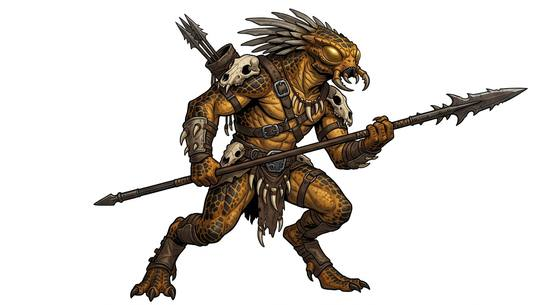

# Alien insectoid folk

{.illus}

*Set: Expansion*

*aka: ______________________________*

*Family: [Insectoid and arachnid](../Species_Families/insectoid-and-arachnid.md)*

The insect-shaped peoples of the stars, each one a world of its own. One is an ancient, towering people who long ruled the trade routes and still expect elaborate courtesies of scent and gesture. Another can walk briefly through vacuum without a suit and thinks in mathematics. Another is a pacifist race of physicians; another hunts big game for honour with invisible armour and a trophy wall; another hides long feeding tubes in its cheeks and drinks the life out of its victims.

They share little beyond chitin, jointed limbs and alien faces. They are traders, pirates, bureaucrats, healers and hunters, as varied as any people. Travellers who have met one tend to assume they know the rest, and are usually wrong.

## Not to be confused with

*[insect folk](insectoid-and-arachnid-insect-folk.md)*, the upright insect peoples who share many traits; the alien insectoid folk are unrelated star peoples who only share a body plan.

## What sets this species apart

No different from the family: these one-off alien peoples share only the family body plan. Each is too distinct to share species lines; their differences are at Breed/Race level or cultural.

## Breeds and races

Each block below is one set of numbers; breeds that share every number share a block (Species rules, rule 9). Attributes are final modifiers, the size trade-off included. Skills, powers and weapon groups are final levels after the family, species and breed layers.

### Ancient patron insectoid folk *(NPC only)*

- **Size:** large · **Body:** other
- **Attributes:** STR +3 AGI −2 END +2 INT +2 WIS +1 PER +1 CHA −2
- **Skills:** [Climbing](../Skills/climbing.md) +3, [Court Etiquette & Protocol](../Skills/court-etiquette-and-protocol.md) +1, [Pain Tolerance](../Skills/pain-tolerance.md) +1, [Sign Language & Gesture](../Skills/sign-language-and-gesture.md) +1, [Charm & Seduction](../Skills/charm-and-seduction.md) −2, [Insight](../Skills/insight.md) −2, [Swimming](../Skills/swimming.md) −2
- **Powers:** [Armour Skin](../Powers/armour-skin.md) 2
- **Weapon groups:** [Wrestling & Grappling](../Weapon_Groups/wrestling-and-grappling.md) +1
- **Natural attacks:** mandibles 1d6+1
- **For the Game Master only, this race as an NPC guard or soldier (not your character's numbers):** Attack 14 · Parry 11 · Dodge 5 · Damage longsword 1d6+2; mandibles 1d6+4 · Armour 2 · Life 23 · Threat 2 ([Bestiary roles](../bestiary.md))
- *Why:* Imposing ancient patrons with an elaborate scent-and-gesture etiquette.
- *Note:* NPC only.

### Carapace-shifting singer folk *(NPC only)*

- **Size:** medium · **Body:** biped
- **Attributes:** STR +1 END +2 PER +1 CHA −1
- **Skills:** [Climbing](../Skills/climbing.md) +3, [Pain Tolerance](../Skills/pain-tolerance.md) +1, [Singing](../Skills/singing.md) +1, [Charm & Seduction](../Skills/charm-and-seduction.md) −2, [Insight](../Skills/insight.md) −2, [Swimming](../Skills/swimming.md) −2
- **Powers:** [Armour Skin](../Powers/armour-skin.md) 2, [Self-Alteration](../Powers/self-alteration.md) 1
- **Weapon groups:** [Wrestling & Grappling](../Weapon_Groups/wrestling-and-grappling.md) +1
- **For the Game Master only, this race as an NPC guard or soldier (not your character's numbers):** Attack 14 · Parry 11 · Dodge 8 · Damage longsword 1d6+2 · Armour 2 · Life 19 · Threat 2 ([Bestiary roles](../bestiary.md))
- *Why:* Carapaces that change form when bonded to a spirit; emotions expressed in rhythms.
- *Note:* Self-Alteration works only by bonding a spirit to take a new form. NPC only.

### Docile carapace laborer folk *(NPC only)*

- **Size:** medium · **Body:** biped
- **Attributes:** STR +2 END +2 INT −2 WIS −1 PER +1 CHA −2 COU −2
- **Skills:** [Climbing](../Skills/climbing.md) +3, [Pain Tolerance](../Skills/pain-tolerance.md) +1, [Charm & Seduction](../Skills/charm-and-seduction.md) −2, [Insight](../Skills/insight.md) −2, [Swimming](../Skills/swimming.md) −2
- **Powers:** [Armour Skin](../Powers/armour-skin.md) 2
- **Weapon groups:** [Wrestling & Grappling](../Weapon_Groups/wrestling-and-grappling.md) +1
- **For the Game Master only, this race as an NPC guard or soldier (not your character's numbers):** Attack 14 · Parry 11 · Dodge 8 · Damage longsword 1d6+2 · Armour 2 · Life 19 · Threat 2 ([Bestiary roles](../bestiary.md))
- *Why:* The same people locked in a dull working form: no change of form and no rhythms.
- *Note:* The dulled, docile mind is an attribute and role matter. NPC only.

### Methane-breathing trader folk *(NPC only)*

- **Size:** medium · **Body:** biped
- **Attributes:** STR +1 END +2 PER +1 CHA −2
- **Skills:** [Climbing](../Skills/climbing.md) +3, [Pain Tolerance](../Skills/pain-tolerance.md) +1, [Trading & Business](../Skills/trading-and-business.md) +1, [Etiquette](../Skills/etiquette.md) −1, [Charm & Seduction](../Skills/charm-and-seduction.md) −2, [Insight](../Skills/insight.md) −2, [Swimming](../Skills/swimming.md) −2
- **Powers:** [Armour Skin](../Powers/armour-skin.md) 2
- **Weapon groups:** [Wrestling & Grappling](../Weapon_Groups/wrestling-and-grappling.md) +1
- **Natural attacks:** mandibles 1d6+1
- **For the Game Master only, this race as an NPC guard or soldier (not your character's numbers):** Attack 14 · Parry 11 · Dodge 8 · Damage longsword 1d6+2; mandibles 1d6+2 · Armour 2 · Life 19 · Threat 2 ([Bestiary roles](../bestiary.md))
- *Why:* Blunt, opportunistic methane-breathing traders.
- *Note:* Their breathing suits are gear. NPC only.

### Scarab-headed artisan folk *(NPC only)*

- **Size:** medium · **Body:** biped
- **Attributes:** STR +1 AGI +1 END +2 PER +1 CHA −2
- **Skills:** [Climbing](../Skills/climbing.md) +3, [Sculpture](../Skills/sculpture.md) +2, [Pain Tolerance](../Skills/pain-tolerance.md) +1, [Charm & Seduction](../Skills/charm-and-seduction.md) −2, [Insight](../Skills/insight.md) −2, [Swimming](../Skills/swimming.md) −2
- **Powers:** [Armour Skin](../Powers/armour-skin.md) 2
- **Weapon groups:** [Wrestling & Grappling](../Weapon_Groups/wrestling-and-grappling.md) +1
- **Natural attacks:** mandibles 1d6+1
- **For the Game Master only, this race as an NPC guard or soldier (not your character's numbers):** Attack 14 · Parry 11 · Dodge 9 · Damage longsword 1d6+2; mandibles 1d6+2 · Armour 2 · Life 19 · Threat 2 ([Bestiary roles](../bestiary.md))
- *Why:* Scarab-headed sculptors with a proud craft culture.
- *Note:* NPC only.

### Living-ship spider-insect precursor folk *(NPC only; NPC-scale)*

- **Size:** gigantic · **Body:** other
- **Attributes:** STR +7 AGI −6 END +5 INT +3 WIS +3 PER +1 CHA −2
- **Skills:** [Climbing](../Skills/climbing.md) +3, [Low & Zero Gravity](../Skills/low-and-zero-gravity.md) +3, [Pain Tolerance](../Skills/pain-tolerance.md) +1, [Charm & Seduction](../Skills/charm-and-seduction.md) −2, [Insight](../Skills/insight.md) −2, [Swimming](../Skills/swimming.md) −2, [Running](../Skills/running.md) Foreign Concept
- **Powers:** [Armour Skin](../Powers/armour-skin.md) 3
- **Weapon groups:** [Wrestling & Grappling](../Weapon_Groups/wrestling-and-grappling.md) +1
- **Natural attacks:** mandibles 1d6+1
- **For the Game Master only, this race as an NPC guard or soldier (not your character's numbers):** Attack 14 · Parry — · Dodge -2 · Damage mandibles 2d6+1 · Armour 2 · Life 36 · Threat 2 ([Bestiary roles](../bestiary.md))
- *Why:* Ancient precursors whose true form is a living spider-insect starship.
- *Note:* NPC-scale. Lifespan (ageless or immortal) is a lexicon detail, not a game number. No hands: held weapons unusable. Size set to gigantic: its true form is a living starship.

### No. 544 Mandibled hunter folk *(genres: space opera: strange aliens)*

- **Size:** large · **Body:** biped
- **What it's like:** Mandibled big-game hunters bound by a strict honour code, armed with cloaking and plasma technology far beyond most worlds. (looks like: insect; good at: fighting, sneaking)
- **Attributes:** STR +3 AGI −1 END +2 PER +1 CHA −2 COU +1
- **Skills:** [Climbing](../Skills/climbing.md) +3, [Hunting](../Skills/hunting.md) +2, [Pain Tolerance](../Skills/pain-tolerance.md) +1, [Tracking](../Skills/tracking.md) +1, [Charm & Seduction](../Skills/charm-and-seduction.md) −2, [Insight](../Skills/insight.md) −2, [Swimming](../Skills/swimming.md) −2
- **Powers:** [Armour Skin](../Powers/armour-skin.md) 2, [Night & Spectrum Sight](../Powers/night-and-spectrum-sight.md) 1
- **Weapon groups:** [Wrestling & Grappling](../Weapon_Groups/wrestling-and-grappling.md) +1
- **Natural attacks:** mandibles 1d6+1
- **For the Game Master only, this race as an NPC guard or soldier (not your character's numbers):** Attack 15 · Parry 12 · Dodge 6 · Damage longsword 1d6+2; mandibles 1d6+4 · Armour 2 · Life 23 · Threat 2 ([Bestiary roles](../bestiary.md))
- *Why:* Honour-bound big-game hunters with heat-sensing eyes.
- *Note:* Cloaks and plasma weapons are gear.

### Disguised giant cockroach folk *(NPC only)*

- **Size:** large · **Body:** biped
- **Attributes:** STR +5 AGI −2 END +3 PER +1 CHA −2
- **Skills:** [Climbing](../Skills/climbing.md) +3, [Disguise](../Skills/disguise.md) +2, [Pain Tolerance](../Skills/pain-tolerance.md) +1, [Charm & Seduction](../Skills/charm-and-seduction.md) −2, [Insight](../Skills/insight.md) −2, [Swimming](../Skills/swimming.md) −2
- **Powers:** [Armour Skin](../Powers/armour-skin.md) 2
- **Weapon groups:** [Wrestling & Grappling](../Weapon_Groups/wrestling-and-grappling.md) +1
- **Natural attacks:** mandibles 1d6+1
- **For the Game Master only, this race as an NPC guard or soldier (not your character's numbers):** Attack 15 · Parry 12 · Dodge 5 · Damage longsword 1d6+2; mandibles 1d6+4 · Armour 2 · Life 24 · Threat 2 ([Bestiary roles](../bestiary.md))
- *Why:* A giant cockroach that hides inside a human skin.
- *Note:* Its strength belongs to the attribute step. NPC only.

### Bureaucratic enforcer insectoid folk *(NPC only)*

- **Size:** medium · **Body:** biped
- **Attributes:** STR +1 END +2 PER +1 CHA −2
- **Skills:** [Climbing](../Skills/climbing.md) +3, [Administration](../Skills/administration.md) +1, [Law](../Skills/law.md) +1, [Pain Tolerance](../Skills/pain-tolerance.md) +1, [Charm & Seduction](../Skills/charm-and-seduction.md) −2, [Insight](../Skills/insight.md) −2, [Swimming](../Skills/swimming.md) −2
- **Powers:** [Armour Skin](../Powers/armour-skin.md) 2
- **Weapon groups:** [Wrestling & Grappling](../Weapon_Groups/wrestling-and-grappling.md) +1
- **Natural attacks:** mandibles 1d6+1
- **For the Game Master only, this race as an NPC guard or soldier (not your character's numbers):** Attack 14 · Parry 11 · Dodge 8 · Damage longsword 1d6+2; mandibles 1d6+2 · Armour 2 · Life 19 · Threat 2 ([Bestiary roles](../bestiary.md))
- *Why:* Enforcers from a bureaucratic, authoritarian culture.
- *Note:* NPC only.

### No. 545 Vacuum-hardy mathematician folk *(genres: space opera: strange aliens)*

- **Size:** medium · **Body:** biped
- **What it's like:** Skeletal, exoskeleton-framed folk who can survive brief exposure to open vacuum and have a natural gift for mathematics. (looks like: insect; good at: knowledge, toughness)
- **Attributes:** STR +1 END +2 INT +1 PER +1 CHA −2
- **Skills:** [Climbing](../Skills/climbing.md) +3, [Mathematics](../Skills/mathematics.md) +2, [Pain Tolerance](../Skills/pain-tolerance.md) +1, [Charm & Seduction](../Skills/charm-and-seduction.md) −2, [Insight](../Skills/insight.md) −2, [Swimming](../Skills/swimming.md) −2
- **Powers:** [Armour Skin](../Powers/armour-skin.md) 2, [Environmental Immunity](../Powers/environmental-immunity.md) 1
- **Weapon groups:** [Wrestling & Grappling](../Weapon_Groups/wrestling-and-grappling.md) +1
- **Natural attacks:** mandibles 1d6+1
- **For the Game Master only, this race as an NPC guard or soldier (not your character's numbers):** Attack 14 · Parry 11 · Dodge 8 · Damage longsword 1d6+2; mandibles 1d6+2 · Armour 2 · Life 19 · Threat 2 ([Bestiary roles](../bestiary.md))
- *Why:* Can survive brief hard vacuum unaided; natural mathematicians.
- *Note:* Environmental Immunity covers brief vacuum exposure only.

### No. 546 Heat-resistant volcanic folk *(genres: space opera: strange aliens)*

- **Size:** medium · **Body:** biped
- **What it's like:** Tough insectoid folk native to a volcanic world, entirely unbothered by heat that would kill most anyone else. (looks like: insect; good at: toughness, wilderness)
- **Attributes:** STR +1 END +2 PER +1 CHA −2
- **Skills:** [Climbing](../Skills/climbing.md) +3, [Pain Tolerance](../Skills/pain-tolerance.md) +1, [Charm & Seduction](../Skills/charm-and-seduction.md) −2, [Insight](../Skills/insight.md) −2, [Swimming](../Skills/swimming.md) −2
- **Powers:** [Armour Skin](../Powers/armour-skin.md) 2, [Resist Element](../Powers/resist-element.md) 2
- **Weapon groups:** [Wrestling & Grappling](../Weapon_Groups/wrestling-and-grappling.md) +1
- **Natural attacks:** mandibles 1d6+1
- **For the Game Master only, this race as an NPC guard or soldier (not your character's numbers):** Attack 14 · Parry 11 · Dodge 8 · Damage longsword 1d6+2; mandibles 1d6+2 · Armour 2 · Life 19 · Threat 2 ([Bestiary roles](../bestiary.md))
- *Why:* Natural heat resistance from a volcanic world.
- *Note:* Resist Element applies to heat only.

### Organic-tech hive engineer folk *(NPC only)*

- **Size:** medium · **Body:** other
- **Attributes:** STR +1 END +2 INT +1 PER +1 CHA −3
- **Skills:** [Climbing](../Skills/climbing.md) +3, [Biotechnology](../Skills/biotechnology.md) +2, [Pain Tolerance](../Skills/pain-tolerance.md) +1, [Charm & Seduction](../Skills/charm-and-seduction.md) −2, [Insight](../Skills/insight.md) −2, [Swimming](../Skills/swimming.md) −2
- **Powers:** [Armour Skin](../Powers/armour-skin.md) 2
- **Weapon groups:** [Shields](../Weapon_Groups/shields.md) +1, [Wrestling & Grappling](../Weapon_Groups/wrestling-and-grappling.md) +1
- **Natural attacks:** mandibles 1d6+1
- **For the Game Master only, this race as an NPC guard or soldier (not your character's numbers):** Attack 14 · Parry 11 · Dodge 8 · Damage longsword 1d6+2; mandibles 1d6+2 · Armour 2 · Life 19 · Threat 2 ([Bestiary roles](../bestiary.md))
- *Why:* Cold engineers of living war-machines.
- *Note:* NPC only. Extra arms make a shield or second weapon easy to use.

### No. 547 Pacifist medic insectoid folk *(genres: space opera: strange aliens)*

- **Size:** medium · **Body:** biped
- **What it's like:** Peaceable insectoid folk devoted to healing, gifted bio-medical practitioners who avoid violence on principle. (looks like: insect; good at: healing, toughness)
- **Attributes:** STR +1 END +2 PER +1 CHA −2
- **Skills:** [Climbing](../Skills/climbing.md) +3, [Medicine](../Skills/medicine.md) +1, [Pain Tolerance](../Skills/pain-tolerance.md) +1, [Surgery](../Skills/surgery.md) +1, [Charm & Seduction](../Skills/charm-and-seduction.md) −2, [Insight](../Skills/insight.md) −2, [Swimming](../Skills/swimming.md) −2
- **Powers:** [Armour Skin](../Powers/armour-skin.md) 2
- **Weapon groups:** [Wrestling & Grappling](../Weapon_Groups/wrestling-and-grappling.md) +1
- **Natural attacks:** mandibles 1d6+1
- **For the Game Master only, this race as an NPC guard or soldier (not your character's numbers):** Attack 14 · Parry 11 · Dodge 8 · Damage longsword 1d6+2; mandibles 1d6+2 · Armour 2 · Life 19 · Threat 2 ([Bestiary roles](../bestiary.md))
- *Why:* Pacifist healers from a culture of bio-medicine.

### No. 548 Proboscis assassin folk *(genres: space opera: near-humans)*

- **Size:** medium · **Body:** biped
- **What it's like:** Insectoid assassins hiding a life-draining proboscis in their cheeks, masters of stealth and close combat. (looks like: insect; good at: sneaking, fighting)
- **Attributes:** STR +1 AGI +1 END +2 PER +1 CHA −2
- **Skills:** [Climbing](../Skills/climbing.md) +3, [Pain Tolerance](../Skills/pain-tolerance.md) +1, [Stealth](../Skills/stealth.md) +1, [Charm & Seduction](../Skills/charm-and-seduction.md) −2, [Insight](../Skills/insight.md) −2, [Swimming](../Skills/swimming.md) −2
- **Powers:** [Armour Skin](../Powers/armour-skin.md) 2, [Life Drain](../Powers/life-drain.md) 2
- **Weapon groups:** [Wrestling & Grappling](../Weapon_Groups/wrestling-and-grappling.md) +1
- **Natural attacks:** mandibles 1d6+1
- **For the Game Master only, this race as an NPC guard or soldier (not your character's numbers):** Attack 14 · Parry 11 · Dodge 9 · Damage longsword 1d6+2; mandibles 1d6+2 · Armour 2 · Life 19 · Threat 2 ([Bestiary roles](../bestiary.md))
- *Why:* Stealthy killers who drain life through hidden proboscises.

### Reshaped insectoid faction folk · No. 551 Generic arthropoid civilization folk *(NPC only)*

- **Size:** medium · **Body:** biped
- **Attributes:** STR +1 END +2 PER +1 CHA −2
- **Skills:** [Climbing](../Skills/climbing.md) +3, [Pain Tolerance](../Skills/pain-tolerance.md) +1, [Charm & Seduction](../Skills/charm-and-seduction.md) −2, [Insight](../Skills/insight.md) −2, [Swimming](../Skills/swimming.md) −2
- **Powers:** [Armour Skin](../Powers/armour-skin.md) 2
- **Weapon groups:** [Wrestling & Grappling](../Weapon_Groups/wrestling-and-grappling.md) +1
- **Natural attacks:** mandibles 1d6+1
- **For the Game Master only, this race as an NPC guard or soldier (not your character's numbers):** Attack 14 · Parry 11 · Dodge 8 · Damage longsword 1d6+2; mandibles 1d6+2 · Armour 2 · Life 19 · Threat 2 ([Bestiary roles](../bestiary.md))
- *Note (Reshaped insectoid faction folk):* NPC only.

### Resonant-language insectoid folk *(NPC only)*

- **Size:** medium · **Body:** biped
- **Attributes:** STR +1 END +2 PER +1 CHA −2
- **Skills:** [Climbing](../Skills/climbing.md) +3, [Pain Tolerance](../Skills/pain-tolerance.md) +1, [Diplomacy](../Skills/diplomacy.md) −1, [Charm & Seduction](../Skills/charm-and-seduction.md) −2, [Insight](../Skills/insight.md) −2, [Swimming](../Skills/swimming.md) −2
- **Powers:** [Armour Skin](../Powers/armour-skin.md) 2
- **Weapon groups:** [Wrestling & Grappling](../Weapon_Groups/wrestling-and-grappling.md) +1
- **Natural attacks:** mandibles 1d6+1
- **For the Game Master only, this race as an NPC guard or soldier (not your character's numbers):** Attack 14 · Parry 11 · Dodge 8 · Damage longsword 1d6+2; mandibles 1d6+2 · Armour 2 · Life 19 · Threat 2 ([Bestiary roles](../bestiary.md))
- *Why:* Xenophobic isolationists who speak in buzzing patterns.
- *Note:* NPC only.

### Armored overseer insectoid folk *(NPC only)*

- **Size:** medium · **Body:** biped
- **Attributes:** STR +1 END +2 INT +1 PER +1 CHA −2
- **Skills:** [Climbing](../Skills/climbing.md) +3, [Deception](../Skills/deception.md) +1, [Pain Tolerance](../Skills/pain-tolerance.md) +1, [Charm & Seduction](../Skills/charm-and-seduction.md) −2, [Insight](../Skills/insight.md) −2, [Swimming](../Skills/swimming.md) −2
- **Powers:** [Armour Skin](../Powers/armour-skin.md) 2
- **Weapon groups:** [Wrestling & Grappling](../Weapon_Groups/wrestling-and-grappling.md) +1
- **Natural attacks:** mandibles 1d6+1
- **For the Game Master only, this race as an NPC guard or soldier (not your character's numbers):** Attack 14 · Parry 11 · Dodge 8 · Damage longsword 1d6+2; mandibles 1d6+2 · Armour 2 · Life 19 · Threat 2 ([Bestiary roles](../bestiary.md))
- *Why:* Hidden masters of long deception.
- *Note:* Their armour and deceiving technology are gear. NPC only.

### No. 549 Caste-bound precursor insectoid folk *(genres: space opera: strange aliens)*

- **Size:** small · **Body:** biped
- **What it's like:** Small insectoid folk of an ancient precursor civilisation, born into a fixed caste and gifted with quiet psychic power. (looks like: insect; good at: powers and magic, toughness)
- **Attributes:** STR −1 AGI +2 END +2 WIS +1 PER +1 CHA −2
- **Skills:** [Climbing](../Skills/climbing.md) +3, [Pain Tolerance](../Skills/pain-tolerance.md) +1, [Charm & Seduction](../Skills/charm-and-seduction.md) −2, [Insight](../Skills/insight.md) −2, [Swimming](../Skills/swimming.md) −2
- **Powers:** [Armour Skin](../Powers/armour-skin.md) 2, [Telepathy](../Powers/telepathy.md) 1
- **Weapon groups:** [Wrestling & Grappling](../Weapon_Groups/wrestling-and-grappling.md) +1
- **Natural attacks:** mandibles 1d6+1
- **For the Game Master only, this race as an NPC guard or soldier (not your character's numbers):** Attack 14 · Parry 11 · Dodge 11 · Damage longsword 1d6+2; mandibles 1d6+1 · Armour 2 · Life 17 · Threat 2 ([Bestiary roles](../bestiary.md))
- *Why:* Small precursor folk with innate psionics.

### No. 550 Telepathic refugee insectoid folk *(genres: space opera: strange aliens)*

- **Size:** medium · **Body:** biped
- **What it's like:** Calm, chitin-bodied refugee folk who share a limited telepathy across their whole community. (looks like: insect; good at: powers and magic, toughness)
- **Attributes:** STR +1 END +2 WIS +1 PER +1 CHA −2
- **Skills:** [Climbing](../Skills/climbing.md) +3, [Composure](../Skills/composure.md) +1, [Pain Tolerance](../Skills/pain-tolerance.md) +1, [Charm & Seduction](../Skills/charm-and-seduction.md) −2, [Insight](../Skills/insight.md) −2, [Swimming](../Skills/swimming.md) −2
- **Powers:** [Armour Skin](../Powers/armour-skin.md) 2, [Telepathy](../Powers/telepathy.md) 1
- **Weapon groups:** [Wrestling & Grappling](../Weapon_Groups/wrestling-and-grappling.md) +1
- **Natural attacks:** mandibles 1d6+1
- **For the Game Master only, this race as an NPC guard or soldier (not your character's numbers):** Attack 14 · Parry 11 · Dodge 8 · Damage longsword 1d6+2; mandibles 1d6+2 · Armour 2 · Life 19 · Threat 2 ([Bestiary roles](../bestiary.md))
- *Why:* Calm, collective folk with limited hive telepathy.

### Outlaw hunter caste *(NPC only)*

- **Size:** large · **Body:** biped+tailed
- **Attributes:** STR +4 AGI −1 END +2 PER +1 CHA −2 COU +1
- **Skills:** [Climbing](../Skills/climbing.md) +3, [Hunting](../Skills/hunting.md) +2, [Intimidation](../Skills/intimidation.md) +1, [Pain Tolerance](../Skills/pain-tolerance.md) +1, [Tracking](../Skills/tracking.md) +1, [Charm & Seduction](../Skills/charm-and-seduction.md) −2, [Insight](../Skills/insight.md) −2, [Swimming](../Skills/swimming.md) −2
- **Powers:** [Armour Skin](../Powers/armour-skin.md) 2, [Night & Spectrum Sight](../Powers/night-and-spectrum-sight.md) 1
- **Weapon groups:** [Wrestling & Grappling](../Weapon_Groups/wrestling-and-grappling.md) +1
- **Natural attacks:** mandibles 1d6+1
- **For the Game Master only, this race as an NPC guard or soldier (not your character's numbers):** Attack 15 · Parry 12 · Dodge 6 · Damage longsword 1d6+2; mandibles 1d6+4 · Armour 2 · Life 23 · Threat 2 ([Bestiary roles](../bestiary.md))
- *Why:* Outlaw hunters: the mandibled hunter's body with a more brutal streak.
- *Note:* NPC only.

### No. 552 Stinger-limbed bee alien *(genres: space opera: strange aliens)*

- **Size:** small · **Body:** winged biped
- **What it's like:** A winged, buzzing bee-alien with a stinger limb and huge compound eyes, part of a hive yet its own person. (looks like: bee; good at: flying, keen senses)
- **Attributes:** STR −1 AGI +2 END +2 PER +2 CHA −2
- **Skills:** [Climbing](../Skills/climbing.md) +3, [Pain Tolerance](../Skills/pain-tolerance.md) +1, [Charm & Seduction](../Skills/charm-and-seduction.md) −2, [Insight](../Skills/insight.md) −2, [Swimming](../Skills/swimming.md) −2
- **Powers:** [Armour Skin](../Powers/armour-skin.md) 2, [Flight](../Powers/flight.md) 2, [Poison Touch](../Powers/poison-touch.md) 1
- **Weapon groups:** [Wrestling & Grappling](../Weapon_Groups/wrestling-and-grappling.md) +1
- **Natural attacks:** mandibles 1d6+1, stinger 1d6+1
- **For the Game Master only, this race as an NPC guard or soldier (not your character's numbers):** Attack 14 · Parry 11 · Dodge 11 · Damage longsword 1d6+2; mandibles 1d6+1 · Armour 2 · Life 17 · Threat 2 ([Bestiary roles](../bestiary.md))
- *Why:* Small winged bee-aliens with a stinger-tipped limb and compound eyes.

### No. 553 Winged insectoid auxiliary *(genres: space opera: strange aliens)*

- **Size:** medium · **Body:** winged biped
- **What it's like:** Wasp-like winged insectoid soldiers serving a larger empire, weak in a brawl but deadly with support weapons. (looks like: wasp; good at: flying, fighting)
- **Attributes:** STR +1 AGI +1 END +2 PER +1 CHA −2
- **Skills:** [Climbing](../Skills/climbing.md) +3, [Formation Fighting](../Skills/formation-fighting.md) +1, [Pain Tolerance](../Skills/pain-tolerance.md) +1, [Charm & Seduction](../Skills/charm-and-seduction.md) −2, [Insight](../Skills/insight.md) −2, [Swimming](../Skills/swimming.md) −2
- **Powers:** [Armour Skin](../Powers/armour-skin.md) 2, [Flight](../Powers/flight.md) 2
- **Weapon groups:** [Wrestling & Grappling](../Weapon_Groups/wrestling-and-grappling.md) +1
- **Natural attacks:** mandibles 1d6+1
- **For the Game Master only, this race as an NPC guard or soldier (not your character's numbers):** Attack 14 · Parry 11 · Dodge 9 · Damage longsword 1d6+2; mandibles 1d6+2 · Armour 2 · Life 19 · Threat 2 ([Bestiary roles](../bestiary.md))
- *Why:* Wasp-like communal fliers who fight in support.

### Regenerating burrower alien *(NPC only)*

- **Size:** medium · **Body:** biped
- **Attributes:** STR +2 END +3 PER +1 CHA −2
- **Skills:** [Climbing](../Skills/climbing.md) +3, [Pain Tolerance](../Skills/pain-tolerance.md) +1, [Charm & Seduction](../Skills/charm-and-seduction.md) −2, [Insight](../Skills/insight.md) −2, [Swimming](../Skills/swimming.md) −2
- **Powers:** [Armour Skin](../Powers/armour-skin.md) 2, [Burrowing](../Powers/burrowing.md) 2, [Healing Factor](../Powers/healing-factor.md) 2, [Nondetection](../Powers/nondetection.md) 2
- **Weapon groups:** [Wrestling & Grappling](../Weapon_Groups/wrestling-and-grappling.md) +1
- **Natural attacks:** mandibles 1d6+1
- **For the Game Master only, this race as an NPC guard or soldier (not your character's numbers):** Attack 14 · Parry 11 · Dodge 8 · Damage longsword 1d6+2; mandibles 1d6+2 · Armour 2 · Life 20 · Threat 2 ([Bestiary roles](../bestiary.md))
- *Why:* Regenerating burrowers hard to find by psychic means.
- *Note:* Nondetection covers psychic detection only; their burrowing can also pass through other planes. NPC only.

### Hive-caste diplomat folk *(NPC only)*

- **Size:** medium · **Body:** biped
- **Attributes:** STR +1 END +2 PER +1
- **Skills:** [Climbing](../Skills/climbing.md) +3, [Diplomacy](../Skills/diplomacy.md) +2, [Administration](../Skills/administration.md) +1, [Pain Tolerance](../Skills/pain-tolerance.md) +1, [Charm & Seduction](../Skills/charm-and-seduction.md) −2, [Insight](../Skills/insight.md) −2, [Swimming](../Skills/swimming.md) −2
- **Powers:** [Armour Skin](../Powers/armour-skin.md) 2
- **Weapon groups:** [Wrestling & Grappling](../Weapon_Groups/wrestling-and-grappling.md) +1
- **Natural attacks:** mandibles 1d6+1
- **For the Game Master only, this race as an NPC guard or soldier (not your character's numbers):** Attack 14 · Parry 11 · Dodge 8 · Damage longsword 1d6+2; mandibles 1d6+2 · Armour 2 · Life 19 · Threat 2 ([Bestiary roles](../bestiary.md))
- *Why:* A hive caste that produces skilled ambassadors and administrators.
- *Note:* NPC only.

### Moth-adapted trader folk *(NPC only)*

- **Size:** medium · **Body:** winged biped
- **Attributes:** STR +1 END +1 PER +1 CHA −2
- **Skills:** [Climbing](../Skills/climbing.md) +3, [Pain Tolerance](../Skills/pain-tolerance.md) +1, [Parachuting & Gliding](../Skills/parachuting-and-gliding.md) +1, [Trading & Business](../Skills/trading-and-business.md) +1, [Charm & Seduction](../Skills/charm-and-seduction.md) −2, [Insight](../Skills/insight.md) −2, [Swimming](../Skills/swimming.md) −2
- **Powers:** [Armour Skin](../Powers/armour-skin.md) 2
- **Weapon groups:** [Wrestling & Grappling](../Weapon_Groups/wrestling-and-grappling.md) +1
- **Natural attacks:** mandibles 1d6+1
- **For the Game Master only, this race as an NPC guard or soldier (not your character's numbers):** Attack 14 · Parry 11 · Dodge 8 · Damage longsword 1d6+2; mandibles 1d6+2 · Armour 2 · Life 18 · Threat 2 ([Bestiary roles](../bestiary.md))
- *Why:* Moth-winged merchants whose wings let them glide.
- *Note:* NPC only.

### Chittering scavenger folk *(NPC only)*

- **Size:** small · **Body:** biped
- **Attributes:** STR −2 AGI +2 END +2 WIS +1 PER +1 CHA −2
- **Skills:** [Climbing](../Skills/climbing.md) +3, [Scavenging](../Skills/scavenging.md) +2, [Pain Tolerance](../Skills/pain-tolerance.md) +1, [Stealth](../Skills/stealth.md) +1, [Streetwise](../Skills/streetwise.md) +1, [Charm & Seduction](../Skills/charm-and-seduction.md) −2, [Insight](../Skills/insight.md) −2, [Swimming](../Skills/swimming.md) −2
- **Powers:** [Armour Skin](../Powers/armour-skin.md) 2
- **Weapon groups:** [Wrestling & Grappling](../Weapon_Groups/wrestling-and-grappling.md) +1
- **Natural attacks:** mandibles 1d6+1
- **For the Game Master only, this race as an NPC guard or soldier (not your character's numbers):** Attack 14 · Parry 11 · Dodge 11 · Damage longsword 1d6+1; mandibles 1d6-1 · Armour 2 · Life 17 · Threat 1 ([Bestiary roles](../bestiary.md))
- *Why:* Quick, furtive scavengers and information brokers.
- *Note:* NPC only.

### Cybernetic insectoid shapeshifter *(NPC only)*

- **Size:** medium · **Body:** biped
- **Attributes:** STR +1 END +2 INT +1 PER +1 CHA −2
- **Skills:** [Climbing](../Skills/climbing.md) +3, [Pain Tolerance](../Skills/pain-tolerance.md) +1, [Charm & Seduction](../Skills/charm-and-seduction.md) −2, [Insight](../Skills/insight.md) −2, [Swimming](../Skills/swimming.md) −2
- **Powers:** [Armour Skin](../Powers/armour-skin.md) 2, [Self-Alteration](../Powers/self-alteration.md) 1, [Technopathy](../Powers/technopathy.md) 1
- **Weapon groups:** [Wrestling & Grappling](../Weapon_Groups/wrestling-and-grappling.md) +1
- **Natural attacks:** mandibles 1d6+1
- **For the Game Master only, this race as an NPC guard or soldier (not your character's numbers):** Attack 14 · Parry 11 · Dodge 8 · Damage longsword 1d6+2; mandibles 1d6+2 · Armour 2 · Life 19 · Threat 2 ([Bestiary roles](../bestiary.md))
- *Why:* Limited shapeshifters who can merge with machines.
- *Note:* NPC only.

### Multi-limbed trader-slaver folk *(NPC only)*

- **Size:** medium · **Body:** biped
- **Attributes:** STR +1 AGI +1 END +2 PER +1 CHA −2
- **Skills:** [Climbing](../Skills/climbing.md) +3, [Pain Tolerance](../Skills/pain-tolerance.md) +1, [Trading & Business](../Skills/trading-and-business.md) +1, [Charm & Seduction](../Skills/charm-and-seduction.md) −2, [Insight](../Skills/insight.md) −2, [Swimming](../Skills/swimming.md) −2
- **Powers:** [Armour Skin](../Powers/armour-skin.md) 2
- **Weapon groups:** [Shields](../Weapon_Groups/shields.md) +1, [Wrestling & Grappling](../Weapon_Groups/wrestling-and-grappling.md) +1
- **Natural attacks:** mandibles 1d6+1
- **For the Game Master only, this race as an NPC guard or soldier (not your character's numbers):** Attack 14 · Parry 11 · Dodge 9 · Damage longsword 1d6+2; mandibles 1d6+2 · Armour 2 · Life 19 · Threat 2 ([Bestiary roles](../bestiary.md))
- *Why:* Many-limbed interstellar traders.
- *Note:* NPC only. Extra arms make a shield or second weapon easy to use.

### No. 554 Martial-honor insectoid folk *(genres: multiverse and time, space opera: strange aliens)*

- **Size:** medium · **Body:** biped
- **What it's like:** Heavily armoured insectoid folk from a hidden world, bound by a strict warrior honour code, though outsiders call them monsters. (looks like: insect; good at: toughness, fighting)
- **Attributes:** STR +1 AGI −1 END +3 PER +1 CHA −2
- **Skills:** [Climbing](../Skills/climbing.md) +3, [Pain Tolerance](../Skills/pain-tolerance.md) +1, [Charm & Seduction](../Skills/charm-and-seduction.md) −2, [Insight](../Skills/insight.md) −2, [Swimming](../Skills/swimming.md) −2
- **Powers:** [Armour Skin](../Powers/armour-skin.md) 3
- **Weapon groups:** [Wrestling & Grappling](../Weapon_Groups/wrestling-and-grappling.md) +1
- **Natural attacks:** mandibles 1d6+1
- **For the Game Master only, this race as an NPC guard or soldier (not your character's numbers):** Attack 14 · Parry 11 · Dodge 7 · Damage longsword 1d6+2; mandibles 1d6+2 · Armour 2 · Life 20 · Threat 2 ([Bestiary roles](../bestiary.md))
- *Why:* An unusually strong exoskeleton.

