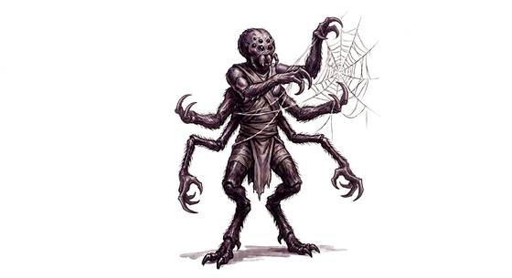

# Arachnid folk

{.illus}

*Set: Core*

*aka: ______________________________*

*Family: [Insectoid and arachnid](../Species_Families/insectoid-and-arachnid.md)*

Spider, scorpion and tick people, built for waiting and catching. Their bodies are long-legged or armoured, their eyes many, their patience endless. A spider-folk hunter spins silk across a path and waits days for the right step; a scorpion warrior guards a sacred gate with pincers and a curling tail full of venom; a tick-folk parasite slips in unnoticed and drinks. They see well in poor light and feel the smallest tremor.

Many have human torsos above an eight-legged body, and some can pass as human altogether. Tales tell of spider women who lure travellers home, clever spider tricksters who own all the world's stories, and whole spider civilisations that speak in drumming and thread. Other peoples admire their craft and dislike their appetite.

## Not to be confused with

*[spider-fey](fey-spider-fey.md)*, a single fey witch of prophecy; arachnid folk are whole peoples of the spider and scorpion kind.

## What sets this species apart

Ambush predators whose bodies are built for lying in wait and snaring prey. Poison Touch is affinity only; web-spinning and venom are Set at Breed/Race level where present.

## Breeds and races

Each block below is one set of numbers; breeds that share every number share a block (Species rules, rule 9). Attributes are final modifiers, the size trade-off included. Skills, powers and weapon groups are final levels after the family, species and breed layers.

### No. 538 Spider-folk *(genres: beast-folk: scales, feathers and shells, underworld and wild places; starter)*

- **Size:** medium · **Body:** octoped/hexapod+biped
- **What it's like:** A many-eyed climber who spins silk webs and bites with venom. (looks like: spider; good at: climbing, fighting, sneaking)
- **Attributes:** STR +1 AGI +1 END +1 WIS +1 PER +2 CHA −2
- **Skills:** [Climbing](../Skills/climbing.md) +3, [Hunting](../Skills/hunting.md) +1, [Pain Tolerance](../Skills/pain-tolerance.md) +1, [Traps](../Skills/traps.md) +1, [Charm & Seduction](../Skills/charm-and-seduction.md) −2, [Insight](../Skills/insight.md) −2, [Swimming](../Skills/swimming.md) −2
- **Powers:** [Armour Skin](../Powers/armour-skin.md) 2, [Entangle](../Powers/entangle.md) 2, [Wall Walking](../Powers/wall-walking.md) 2, [Poison Touch](../Powers/poison-touch.md) 1
- **Weapon groups:** [Wrestling & Grappling](../Weapon_Groups/wrestling-and-grappling.md) +1
- **Natural attacks:** fangs 1d6+1
- **For the Game Master only, this race as an NPC guard or soldier (not your character's numbers):** Attack 14 · Parry 11 · Dodge 9 · Damage longsword 1d6+2; fangs 1d6+2 · Armour 2 · Life 18 · Threat 2 ([Bestiary roles](../bestiary.md))
- *Why:* Many-eyed wall-crawling web-spinners with a venomous bite.
- *Note:* Entangle is the web.

### No. 539 Scorpion-folk *(genres: myth and legend, beast-folk: scales, feathers and shells)*

- **Size:** medium · **Body:** other
- **What it's like:** Scorpion-tailed folk with a human upper body and a venomous sting, tough desert dwellers who often guard sacred gateways. (looks like: scorpion; good at: fighting, toughness)
- **Attributes:** STR +1 END +2 WIS +1 PER +1 CHA −2
- **Skills:** [Climbing](../Skills/climbing.md) +3, [Survival: Desert](../Skills/survival-desert.md) +2, [Hunting](../Skills/hunting.md) +1, [Pain Tolerance](../Skills/pain-tolerance.md) +1, [Traps](../Skills/traps.md) +1, [Charm & Seduction](../Skills/charm-and-seduction.md) −2, [Insight](../Skills/insight.md) −2, [Swimming](../Skills/swimming.md) −2, [Riding](../Skills/riding.md) Foreign Concept
- **Powers:** [Armour Skin](../Powers/armour-skin.md) 2, [Poison Touch](../Powers/poison-touch.md) 1
- **Weapon groups:** [Wrestling & Grappling](../Weapon_Groups/wrestling-and-grappling.md) +1
- **Natural attacks:** fangs 1d6+1, pincers 1d6+2, stinger 1d6+1
- **For the Game Master only, this race as an NPC guard or soldier (not your character's numbers):** Attack 14 · Parry 11 · Dodge 8 · Damage longsword 1d6+2; pincers 1d6+3 · Armour 2 · Life 19 · Threat 2 ([Bestiary roles](../bestiary.md))
- *Why:* Scorpion-bodied desert guards with pincers and a venomous tail.

### Tick/mite-folk *(NPC only)*

- **Size:** tiny · **Body:** other
- **Attributes:** STR −2 AGI +3 END +2 WIS +1 PER +1 CHA −2
- **Skills:** [Climbing](../Skills/climbing.md) +3, [Hunting](../Skills/hunting.md) +1, [Pain Tolerance](../Skills/pain-tolerance.md) +1, [Traps](../Skills/traps.md) +1, [Charm & Seduction](../Skills/charm-and-seduction.md) −2, [Insight](../Skills/insight.md) −2, [Swimming](../Skills/swimming.md) −2
- **Powers:** [Armour Skin](../Powers/armour-skin.md) 2, [Disease](../Powers/disease.md) 1, [Poison & Disease Immunity](../Powers/poison-and-disease-immunity.md) 1
- **Weapon groups:** [Wrestling & Grappling](../Weapon_Groups/wrestling-and-grappling.md) +1
- **Natural attacks:** fangs 1d6+1
- **For the Game Master only, this race as an NPC guard or soldier (not your character's numbers):** Attack 14 · Parry 11 · Dodge 13 · Damage longsword 1d6+1; fangs 1d6-2 · Armour 2 · Life 15 · Threat 1 ([Bestiary roles](../bestiary.md))
- *Why:* Tiny blood-feeders that carry disease.
- *Note:* Disease spreads through the bite. NPC only.

### Tarantula-folk *(NPC only)*

- **Size:** large · **Body:** octoped/hexapod+biped
- **Attributes:** STR +3 AGI −2 END +2 WIS +1 PER +1 CHA −2
- **Skills:** [Climbing](../Skills/climbing.md) +3, [Hunting](../Skills/hunting.md) +1, [Pain Tolerance](../Skills/pain-tolerance.md) +1, [Traps](../Skills/traps.md) +1, [Charm & Seduction](../Skills/charm-and-seduction.md) −2, [Insight](../Skills/insight.md) −2, [Swimming](../Skills/swimming.md) −2
- **Powers:** [Armour Skin](../Powers/armour-skin.md) 2, [Burrowing](../Powers/burrowing.md) 1, [Poison Touch](../Powers/poison-touch.md) 1
- **Weapon groups:** [Wrestling & Grappling](../Weapon_Groups/wrestling-and-grappling.md) +1
- **Natural attacks:** fangs 1d6+1
- **For the Game Master only, this race as an NPC guard or soldier (not your character's numbers):** Attack 14 · Parry 11 · Dodge 5 · Damage longsword 1d6+2; fangs 1d6+4 · Armour 2 · Life 23 · Threat 2 ([Bestiary roles](../bestiary.md))
- *Why:* Large hairy burrowers with a mild venom.
- *Note:* NPC only.

### Harvestman-folk *(NPC only)*

- **Size:** medium · **Body:** other
- **Attributes:** STR +1 AGI +1 PER +1 CHA −2
- **Skills:** [Climbing](../Skills/climbing.md) +3, [Hunting](../Skills/hunting.md) +1, [Pain Tolerance](../Skills/pain-tolerance.md) +1, [Charm & Seduction](../Skills/charm-and-seduction.md) −2, [Insight](../Skills/insight.md) −2, [Swimming](../Skills/swimming.md) −2
- **Powers:** [Armour Skin](../Powers/armour-skin.md) 2
- **Weapon groups:** [Wrestling & Grappling](../Weapon_Groups/wrestling-and-grappling.md) +1
- **For the Game Master only, this race as an NPC guard or soldier (not your character's numbers):** Attack 14 · Parry 11 · Dodge 9 · Damage longsword 1d6+2 · Armour 2 · Life 17 · Threat 2 ([Bestiary roles](../bestiary.md))
- *Why:* Long-legged skitterers with no venom and no webs.
- *Note:* Set 0 removes the species' snaring and venom affinity. NPC only.

### Uplifted spider civilization folk *(NPC only)*

- **Size:** medium · **Body:** other
- **Attributes:** STR +1 END +2 INT +1 WIS +1 PER +1 CHA −2
- **Skills:** [Climbing](../Skills/climbing.md) +3, [Hunting](../Skills/hunting.md) +1, [Pain Tolerance](../Skills/pain-tolerance.md) +1, [Signals](../Skills/signals.md) +1, [Traps](../Skills/traps.md) +1, [Charm & Seduction](../Skills/charm-and-seduction.md) −2, [Insight](../Skills/insight.md) −2, [Swimming](../Skills/swimming.md) −2
- **Powers:** [Armour Skin](../Powers/armour-skin.md) 2, [Wall Walking](../Powers/wall-walking.md) 2
- **Weapon groups:** [Wrestling & Grappling](../Weapon_Groups/wrestling-and-grappling.md) +1
- **Natural attacks:** fangs 1d6+1
- **For the Game Master only, this race as an NPC guard or soldier (not your character's numbers):** Attack 14 · Parry 11 · Dodge 8 · Damage longsword 1d6+2; fangs 1d6+2 · Armour 2 · Life 19 · Threat 2 ([Bestiary roles](../bestiary.md))
- *Why:* Technological wall-crawling spiders who talk through vibration and scent.
- *Note:* NPC only.

### Predatory shapeshifting spider folk *(NPC only)*

- **Size:** medium · **Body:** biped+other
- **Attributes:** STR +1 END +2 WIS +1 PER +1
- **Skills:** [Climbing](../Skills/climbing.md) +3, [Hunting](../Skills/hunting.md) +1, [Pain Tolerance](../Skills/pain-tolerance.md) +1, [Traps](../Skills/traps.md) +1, [Insight](../Skills/insight.md) −2, [Swimming](../Skills/swimming.md) −2
- **Powers:** [Armour Skin](../Powers/armour-skin.md) 2, [Self-Alteration](../Powers/self-alteration.md) 2, [Poison Touch](../Powers/poison-touch.md) 1
- **Weapon groups:** [Wrestling & Grappling](../Weapon_Groups/wrestling-and-grappling.md) +1
- **Natural attacks:** fangs 1d6+1
- **For the Game Master only, this race as an NPC guard or soldier (not your character's numbers):** Attack 14 · Parry 11 · Dodge 8 · Damage longsword 1d6+2; fangs 1d6+2 · Armour 2 · Life 19 · Threat 2 ([Bestiary roles](../bestiary.md))
- *Why:* A giant spider that takes a beautiful woman's form to lure prey.
- *Note:* Self-Alteration is limited to its one human guise. NPC only.

### Monstrous cave spider folk *(NPC only)*

- **Size:** large · **Body:** biped+other
- **Attributes:** STR +4 AGI −2 END +2 INT −2 WIS +1 PER +1 CHA −2
- **Skills:** [Climbing](../Skills/climbing.md) +3, [Survival: Caves & Underground](../Skills/survival-caves-and-underground.md) +2, [Hunting](../Skills/hunting.md) +1, [Pain Tolerance](../Skills/pain-tolerance.md) +1, [Traps](../Skills/traps.md) +1, [Charm & Seduction](../Skills/charm-and-seduction.md) −2, [Insight](../Skills/insight.md) −2, [Swimming](../Skills/swimming.md) −2
- **Powers:** [Armour Skin](../Powers/armour-skin.md) 2, [Entangle](../Powers/entangle.md) 2, [Wall Walking](../Powers/wall-walking.md) 2
- **Weapon groups:** [Wrestling & Grappling](../Weapon_Groups/wrestling-and-grappling.md) +1
- **Natural attacks:** fangs 1d6+1
- **For the Game Master only, this race as an NPC guard or soldier (not your character's numbers):** Attack 14 · Parry 11 · Dodge 5 · Damage longsword 1d6+2; fangs 1d6+4 · Armour 2 · Life 23 · Threat 2 ([Bestiary roles](../bestiary.md))
- *Why:* Huge web-spinning spiders of wild caves.
- *Note:* NPC only.

### No. 540 Trickster spider folk *(genres: fairy tale and folklore, myth and legend)*

- **Size:** medium · **Body:** biped+other
- **What it's like:** A cunning spider-being famed as a trickster and keeper of stories and wisdom. (looks like: spider; good at: people and talk, climbing)
- **Attributes:** END +2 INT +1 WIS +1 PER +1 CHA −1
- **Skills:** [Climbing](../Skills/climbing.md) +3, [Deception](../Skills/deception.md) +2, [Storytelling & Conversation](../Skills/storytelling-and-conversation.md) +2, [Hunting](../Skills/hunting.md) +1, [Pain Tolerance](../Skills/pain-tolerance.md) +1, [Traps](../Skills/traps.md) +1, [Charm & Seduction](../Skills/charm-and-seduction.md) −2, [Insight](../Skills/insight.md) −2, [Swimming](../Skills/swimming.md) −2
- **Powers:** [Armour Skin](../Powers/armour-skin.md) 2
- **Weapon groups:** [Wrestling & Grappling](../Weapon_Groups/wrestling-and-grappling.md) +1
- **Natural attacks:** fangs 1d6+1
- **For the Game Master only, this race as an NPC guard or soldier (not your character's numbers):** Attack 14 · Parry 11 · Dodge 8 · Damage longsword 1d6+2; fangs 1d6+2 · Armour 2 · Life 19 · Threat 2 ([Bestiary roles](../bestiary.md))
- *Why:* Cunning spider-tricksters who keep and spin stories.

### Cursed spider matriarch folk *(NPC only)*

- **Size:** medium · **Body:** biped+tailed
- **Attributes:** STR +1 AGI +1 END +2 INT +1 WIS +1 PER +1 CHA −1
- **Skills:** [Climbing](../Skills/climbing.md) +3, [Hunting](../Skills/hunting.md) +1, [Pain Tolerance](../Skills/pain-tolerance.md) +1, [Traps](../Skills/traps.md) +1, [Charm & Seduction](../Skills/charm-and-seduction.md) −2, [Insight](../Skills/insight.md) −2, [Swimming](../Skills/swimming.md) −2
- **Powers:** [Armour Skin](../Powers/armour-skin.md) 2, [Entangle](../Powers/entangle.md) 2, [Night & Spectrum Sight](../Powers/night-and-spectrum-sight.md) 2, [Wall Walking](../Powers/wall-walking.md) 2, [Poison Touch](../Powers/poison-touch.md) 1
- **Weapon groups:** [Wrestling & Grappling](../Weapon_Groups/wrestling-and-grappling.md) +1
- **Natural attacks:** fangs 1d6+1
- **For the Game Master only, this race as an NPC guard or soldier (not your character's numbers):** Attack 14 · Parry 11 · Dodge 9 · Damage longsword 1d6+2; fangs 1d6+2 · Armour 2 · Life 19 · Threat 2 ([Bestiary roles](../bestiary.md))
- *Why:* Cursed elf-descended spider-folk: venom, webs, many eyes and darksight.
- *Note:* Night & Spectrum Sight kept from their elf-kind and underground origin. NPC only.

### No. 541 Shapeshifting spider-kin folk *(genres: beast-folk: scales, feathers and shells)*

- **Size:** medium · **Body:** biped
- **What it's like:** Patient spider-kin who shift between human and spider shape, spinning webs and waiting out their prey. (looks like: spider; good at: sneaking, climbing)
- **Attributes:** STR +1 END +2 WIS +1 PER +1 CHA −2
- **Skills:** [Climbing](../Skills/climbing.md) +3, [Hunting](../Skills/hunting.md) +1, [Pain Tolerance](../Skills/pain-tolerance.md) +1, [Traps](../Skills/traps.md) +1, [Charm & Seduction](../Skills/charm-and-seduction.md) −2, [Insight](../Skills/insight.md) −2, [Swimming](../Skills/swimming.md) −2
- **Powers:** [Animal Form](../Powers/animal-form.md) 2, [Armour Skin](../Powers/armour-skin.md) 2, [Entangle](../Powers/entangle.md) 1
- **Weapon groups:** [Wrestling & Grappling](../Weapon_Groups/wrestling-and-grappling.md) +1
- **Natural attacks:** fangs 1d6+1
- **For the Game Master only, this race as an NPC guard or soldier (not your character's numbers):** Attack 14 · Parry 11 · Dodge 8 · Damage longsword 1d6+2; fangs 1d6+2 · Armour 2 · Life 19 · Threat 2 ([Bestiary roles](../bestiary.md))
- *Why:* Patient shifters between spider and human shape who spin webs.
- *Note:* Animal Form is limited to the spider.

### Ancient spider hive civilization folk *(NPC only)*

- **Size:** medium · **Body:** insectoid
- **Attributes:** STR +1 END +2 INT +2 WIS +1 PER +1 CHA −3
- **Skills:** [Climbing](../Skills/climbing.md) +3, [Composure](../Skills/composure.md) +1, [Hunting](../Skills/hunting.md) +1, [Pain Tolerance](../Skills/pain-tolerance.md) +1, [Traps](../Skills/traps.md) +1, [Charm & Seduction](../Skills/charm-and-seduction.md) −2, [Insight](../Skills/insight.md) −2, [Swimming](../Skills/swimming.md) −2
- **Powers:** [Armour Skin](../Powers/armour-skin.md) 2, [Entangle](../Powers/entangle.md) 2
- **Weapon groups:** [Wrestling & Grappling](../Weapon_Groups/wrestling-and-grappling.md) +1
- **Natural attacks:** fangs 1d6+1
- **For the Game Master only, this race as an NPC guard or soldier (not your character's numbers):** Attack 14 · Parry 11 · Dodge 8 · Damage longsword 1d6+2; fangs 1d6+2 · Armour 2 · Life 19 · Threat 2 ([Bestiary roles](../bestiary.md))
- *Why:* Cold, calculating web-spinners of an ancient hive.
- *Note:* NPC only.

### Spider-bodied bounty hunter folk *(NPC only)*

- **Size:** large · **Body:** centauroid
- **Attributes:** STR +3 AGI −1 END +2 WIS +1 PER +1 CHA −2
- **Skills:** [Climbing](../Skills/climbing.md) +3, [Traps](../Skills/traps.md) +3, [Hunting](../Skills/hunting.md) +1, [Pain Tolerance](../Skills/pain-tolerance.md) +1, [Charm & Seduction](../Skills/charm-and-seduction.md) −2, [Insight](../Skills/insight.md) −2, [Swimming](../Skills/swimming.md) −2, [Riding](../Skills/riding.md) Foreign Concept
- **Powers:** [Armour Skin](../Powers/armour-skin.md) 2, [Entangle](../Powers/entangle.md) 2
- **Weapon groups:** [Wrestling & Grappling](../Weapon_Groups/wrestling-and-grappling.md) +1
- **For the Game Master only, this race as an NPC guard or soldier (not your character's numbers):** Attack 14 · Parry 11 · Dodge 6 · Damage longsword 1d6+2 · Armour 2 · Life 23 · Threat 2 ([Bestiary roles](../bestiary.md))
- *Why:* A human torso on a spider body: a solitary hunter with webs and traps.
- *Note:* NPC only.

