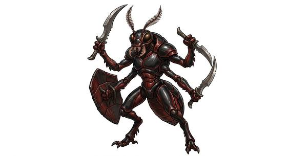

# Hive warrior folk

{.illus}

*Set: Expansion*

*aka: ______________________________*

*Family: [Insectoid and arachnid](../Species_Families/insectoid-and-arachnid.md)*

Warrior castes of insect peoples, bred for battle and trained for nothing else. They are tall and plated in hard chitin, with serrated forelimbs and heads that turn in perfect unison. Workers dig, queens lay eggs, and warriors fight, and from the day they hatch they know which they are. Their drill is precise and their obedience absolute.

In battle they move in close formations that turn and wheel like a single animal. Some hives let them think for themselves; some are drones of a single queen's mind; some wear living armour that is also a weapon. Their loyalty to the hive is total, and they have little to say to outsiders. Enemies learn quickly that killing one simply makes room for the next.

## Not to be confused with

*[insectoid hive folk](hive-and-collective-insectoid-hive-folk.md)*, a peaceful burrowing people with castes; hive warriors are the soldiers, bred and drilled for war.

## What sets this species apart

Warrior castes bred for close drill and battle inside rigid hives. Mind Link is affinity only; the true hive-mind lines Set it at Breed/Race level.

## Breeds and races

Each block below is one set of numbers; breeds that share every number share a block (Species rules, rule 9). Attributes are final modifiers, the size trade-off included. Skills, powers and weapon groups are final levels after the family, species and breed layers.

### Hive-caste warrior folk *(NPC only)*

- **Size:** medium · **Body:** biped
- **Attributes:** STR +1 END +2 PER +1 CHA −2 COU +1
- **Skills:** [Climbing](../Skills/climbing.md) +3, [Formation Fighting](../Skills/formation-fighting.md) +2, [Intimidation](../Skills/intimidation.md) +1, [Pain Tolerance](../Skills/pain-tolerance.md) +1, [Charm & Seduction](../Skills/charm-and-seduction.md) −2, [Insight](../Skills/insight.md) −2, [Swimming](../Skills/swimming.md) −2
- **Powers:** [Armour Skin](../Powers/armour-skin.md) 2
- **Weapon groups:** [Wrestling & Grappling](../Weapon_Groups/wrestling-and-grappling.md) +1
- **Natural attacks:** mandibles 1d6+1
- **For the Game Master only, this race as an NPC guard or soldier (not your character's numbers):** Attack 14 · Parry 11 · Dodge 8 · Damage longsword 1d6+2; mandibles 1d6+2 · Armour 2 · Life 19 · Threat 2 ([Bestiary roles](../bestiary.md))
- *Note:* NPC only.

### Hive-mind drone warrior folk *(NPC only)*

- **Size:** medium · **Body:** biped
- **Attributes:** STR +1 END +2 INT −1 PER +1 CHA −2 COU +2
- **Skills:** [Climbing](../Skills/climbing.md) +3, [Formation Fighting](../Skills/formation-fighting.md) +2, [Intimidation](../Skills/intimidation.md) +1, [Pain Tolerance](../Skills/pain-tolerance.md) +1, [Charm & Seduction](../Skills/charm-and-seduction.md) −2, [Insight](../Skills/insight.md) −2, [Swimming](../Skills/swimming.md) −2
- **Powers:** [Mind Link](../Powers/mind-link.md) 3, [Armour Skin](../Powers/armour-skin.md) 2
- **Weapon groups:** [Wrestling & Grappling](../Weapon_Groups/wrestling-and-grappling.md) +1
- **Natural attacks:** mandibles 1d6+1
- **For the Game Master only, this race as an NPC guard or soldier (not your character's numbers):** Attack 15 · Parry 12 · Dodge 8 · Damage longsword 1d6+2; mandibles 1d6+2 · Armour 2 · Life 19 · Threat 2 ([Bestiary roles](../bestiary.md))
- *Why:* True drones of a single queen mind.
- *Note:* Mind Link matches the Hive and collective family's true hive-mind. Their technology is gear. NPC only.

### Hive drone soldier *(beast)*

- **Size:** large · **Body:** biped
- **Attributes:** STR +3 AGI −2 END +2 INT −2 PER +1 CHA −2 COU +3
- **Skills:** [Climbing](../Skills/climbing.md) +3, [Formation Fighting](../Skills/formation-fighting.md) +2, [Intimidation](../Skills/intimidation.md) +1, [Pain Tolerance](../Skills/pain-tolerance.md) +1, [Charm & Seduction](../Skills/charm-and-seduction.md) −2, [Insight](../Skills/insight.md) −2, [Swimming](../Skills/swimming.md) −2
- **Powers:** [Mind Link](../Powers/mind-link.md) 3, [Armour Skin](../Powers/armour-skin.md) 2
- **Weapon groups:** [Wrestling & Grappling](../Weapon_Groups/wrestling-and-grappling.md) +1
- **Natural attacks:** mandibles 1d6+1
- **For the Game Master only, this race as an NPC guard or soldier (not your character's numbers):** Attack 15 · Parry 12 · Dodge 5 · Damage longsword 1d6+2; mandibles 1d6+4 · Armour 2 · Life 23 · Threat 2 ([Bestiary roles](../bestiary.md))
- *Why:* A hive-directed drone.

### Hive commander caste *(NPC only)*

- **Size:** large · **Body:** biped
- **Attributes:** STR +3 AGI −2 END +2 INT +2 WIS +1 PER +1 CHA −2 COU +1
- **Skills:** [Climbing](../Skills/climbing.md) +3, [Formation Fighting](../Skills/formation-fighting.md) +2, [Strategy](../Skills/strategy.md) +2, [Intimidation](../Skills/intimidation.md) +1, [Pain Tolerance](../Skills/pain-tolerance.md) +1, [Charm & Seduction](../Skills/charm-and-seduction.md) −2, [Insight](../Skills/insight.md) −2, [Swimming](../Skills/swimming.md) −2
- **Powers:** [Mind Link](../Powers/mind-link.md) 3, [Armour Skin](../Powers/armour-skin.md) 2
- **Weapon groups:** [Wrestling & Grappling](../Weapon_Groups/wrestling-and-grappling.md) +1
- **Natural attacks:** mandibles 1d6+1
- **For the Game Master only, this race as an NPC guard or soldier (not your character's numbers):** Attack 14 · Parry 11 · Dodge 5 · Damage longsword 1d6+2; mandibles 1d6+4 · Armour 2 · Life 23 · Threat 2 ([Bestiary roles](../bestiary.md))
- *Why:* The commander caste that directs the whole hive fleet.
- *Note:* NPC only.

### No. 542 Sonic-tech hive warrior folk *(genres: space opera: strange aliens)*

- **Size:** medium · **Body:** biped+winged
- **What it's like:** Winged insectoid hive-warriors organised into castes, wielding a whole technology built on sound. (looks like: insect; good at: fighting, making and fixing)
- **Attributes:** STR +1 AGI +1 END +1 PER +1 CHA −2 COU +1
- **Skills:** [Climbing](../Skills/climbing.md) +3, [Formation Fighting](../Skills/formation-fighting.md) +2, [Intimidation](../Skills/intimidation.md) +1, [Pain Tolerance](../Skills/pain-tolerance.md) +1, [Charm & Seduction](../Skills/charm-and-seduction.md) −2, [Insight](../Skills/insight.md) −2, [Swimming](../Skills/swimming.md) −2
- **Powers:** [Armour Skin](../Powers/armour-skin.md) 2, [Flight](../Powers/flight.md) 1
- **Weapon groups:** [Wrestling & Grappling](../Weapon_Groups/wrestling-and-grappling.md) +1
- **Natural attacks:** mandibles 1d6+1
- **For the Game Master only, this race as an NPC guard or soldier (not your character's numbers):** Attack 15 · Parry 12 · Dodge 9 · Damage longsword 1d6+2; mandibles 1d6+2 · Armour 2 · Life 18 · Threat 2 ([Bestiary roles](../bestiary.md))
- *Why:* Membrane-winged hive warriors capable of short flights.
- *Note:* Their sonic weapons are gear.

### Bio-engineered swarm soldier folk *(NPC only)*

- **Size:** medium · **Body:** biped
- **Attributes:** STR +2 END +2 INT −1 PER +1 CHA −2 COU +2
- **Skills:** [Climbing](../Skills/climbing.md) +3, [Formation Fighting](../Skills/formation-fighting.md) +2, [Intimidation](../Skills/intimidation.md) +1, [Pain Tolerance](../Skills/pain-tolerance.md) +1, [Charm & Seduction](../Skills/charm-and-seduction.md) −2, [Insight](../Skills/insight.md) −2, [Swimming](../Skills/swimming.md) −2
- **Powers:** [Armour Skin](../Powers/armour-skin.md) 2, [Mind Link](../Powers/mind-link.md) 2
- **Weapon groups:** [Wrestling & Grappling](../Weapon_Groups/wrestling-and-grappling.md) +1
- **Natural attacks:** mandibles 1d6+1, claws 1d6+1
- **For the Game Master only, this race as an NPC guard or soldier (not your character's numbers):** Attack 15 · Parry 12 · Dodge 8 · Damage longsword 1d6+2; mandibles 1d6+2 · Armour 2 · Life 19 · Threat 2 ([Bestiary roles](../bestiary.md))
- *Why:* Clawed swarm soldiers bound by hive-mind obedience.
- *Note:* NPC only.

### Parasitic warrior insectoid folk *(NPC only)*

- **Size:** large · **Body:** biped
- **Attributes:** STR +4 AGI −2 END +2 PER +1 CHA −2 COU +2
- **Skills:** [Climbing](../Skills/climbing.md) +3, [Formation Fighting](../Skills/formation-fighting.md) +2, [Intimidation](../Skills/intimidation.md) +1, [Pain Tolerance](../Skills/pain-tolerance.md) +1, [Religion & Theology](../Skills/religion-and-theology.md) +1, [Charm & Seduction](../Skills/charm-and-seduction.md) −2, [Insight](../Skills/insight.md) −2, [Swimming](../Skills/swimming.md) −2
- **Powers:** [Armour Skin](../Powers/armour-skin.md) 2
- **Weapon groups:** [Wrestling & Grappling](../Weapon_Groups/wrestling-and-grappling.md) +1
- **Natural attacks:** mandibles 1d6+1
- **For the Game Master only, this race as an NPC guard or soldier (not your character's numbers):** Attack 15 · Parry 12 · Dodge 5 · Damage longsword 1d6+2; mandibles 1d6+4 · Armour 2 · Life 23 · Threat 2 ([Bestiary roles](../bestiary.md))
- *Why:* Religious zealots who breed by implanting young in hosts.
- *Note:* NPC only.

### Converted harvester drone folk *(NPC only)*

- **Size:** medium · **Body:** insectoid
- **Attributes:** STR +1 END +2 INT −1 PER +1 CHA −3 COU +1
- **Skills:** [Climbing](../Skills/climbing.md) +3, [Formation Fighting](../Skills/formation-fighting.md) +2, [Intimidation](../Skills/intimidation.md) +1, [Pain Tolerance](../Skills/pain-tolerance.md) +1, [Charm & Seduction](../Skills/charm-and-seduction.md) −2, [Insight](../Skills/insight.md) −2, [Swimming](../Skills/swimming.md) −2
- **Powers:** [Armour Skin](../Powers/armour-skin.md) 2, [Mind Link](../Powers/mind-link.md) 2
- **Weapon groups:** [Wrestling & Grappling](../Weapon_Groups/wrestling-and-grappling.md) +1
- **Natural attacks:** mandibles 1d6+1
- **For the Game Master only, this race as an NPC guard or soldier (not your character's numbers):** Attack 14 · Parry 11 · Dodge 8 · Damage longsword 1d6+2; mandibles 1d6+2 · Armour 2 · Life 19 · Threat 2 ([Bestiary roles](../bestiary.md))
- *Why:* Other peoples turned into drones under an ancient master's control.
- *Note:* NPC only.

### Winged stinging soldier caste folk *(NPC only)*

- **Size:** medium · **Body:** insectoid
- **Attributes:** STR +1 AGI +1 END +2 PER +1 CHA −2 COU +1
- **Skills:** [Climbing](../Skills/climbing.md) +3, [Formation Fighting](../Skills/formation-fighting.md) +2, [Intimidation](../Skills/intimidation.md) +1, [Pain Tolerance](../Skills/pain-tolerance.md) +1, [Charm & Seduction](../Skills/charm-and-seduction.md) −2, [Insight](../Skills/insight.md) −2, [Swimming](../Skills/swimming.md) −2
- **Powers:** [Armour Skin](../Powers/armour-skin.md) 2, [Flight](../Powers/flight.md) 2, [Poison Touch](../Powers/poison-touch.md) 1
- **Weapon groups:** [Wrestling & Grappling](../Weapon_Groups/wrestling-and-grappling.md) +1
- **Natural attacks:** mandibles 1d6+1, stinger 1d6+1
- **For the Game Master only, this race as an NPC guard or soldier (not your character's numbers):** Attack 15 · Parry 12 · Dodge 9 · Damage longsword 1d6+2; mandibles 1d6+2 · Armour 2 · Life 19 · Threat 2 ([Bestiary roles](../bestiary.md))
- *Why:* Winged, stinging swarm soldiers.
- *Note:* NPC only.

### Advanced hive conqueror folk *(NPC only)*

- **Size:** medium · **Body:** biped+winged
- **Attributes:** STR +1 END +2 INT +2 PER +1 CHA −2 COU +1
- **Skills:** [Climbing](../Skills/climbing.md) +3, [Formation Fighting](../Skills/formation-fighting.md) +2, [Intimidation](../Skills/intimidation.md) +1, [Pain Tolerance](../Skills/pain-tolerance.md) +1, [Charm & Seduction](../Skills/charm-and-seduction.md) −2, [Insight](../Skills/insight.md) −2, [Swimming](../Skills/swimming.md) −2
- **Powers:** [Armour Skin](../Powers/armour-skin.md) 2
- **Weapon groups:** [Wrestling & Grappling](../Weapon_Groups/wrestling-and-grappling.md) +1
- **Natural attacks:** mandibles 1d6+1
- **For the Game Master only, this race as an NPC guard or soldier (not your character's numbers):** Attack 14 · Parry 11 · Dodge 8 · Damage longsword 1d6+2; mandibles 1d6+2 · Armour 2 · Life 19 · Threat 2 ([Bestiary roles](../bestiary.md))
- *Why:* Only the winged drone sub-caste flies.
- *Note:* Flight is affinity: it matters for the winged drones once they gain it. Their technology is gear. NPC only.

