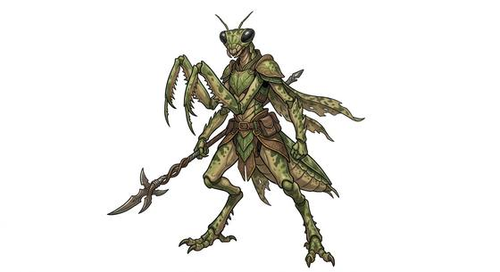

# Insect folk

{.illus}

*Set: Core*

*aka: ______________________________*

*Family: [Insectoid and arachnid](../Species_Families/insectoid-and-arachnid.md)*

Upright insect people, with hard, jointed shells, antennae, compound eyes and often wings. They take every form their smaller cousins do. Ant-folk work tirelessly in great colonies and lift many times their weight. Bee-folk dance their messages and carry pollen. Mantis-folk wait motionless for prey, then strike like lightning. Beetle-folk are slow, stolid and armoured. Moths and butterflies flutter, fireflies glow, locusts swarm and cockroaches outlive everything.

What they share is the body plan: a shell instead of skin, jointed limbs, faces hard to read. Many live in close-knit colonies, many do not, and some go through a change of body that their cultures treat as sacred. Other peoples find them strange at first, then usually respect their industry, and sometimes fear the stingers.

## Not to be confused with

*[arachnid folk](insectoid-and-arachnid-arachnid-folk.md)*, the spider, scorpion and tick peoples with eight legs and a hunter's habits; insect folk have six limbs and far more varied lives.

## What sets this species apart

No different from the family: the broad insect peoples are the family's baseline. Wings, stings, venom, camouflage and similar traits vary by Breed/Race and are set there.

## Breeds and races

Each block below is one set of numbers; breeds that share every number share a block (Species rules, rule 9). Attributes are final modifiers, the size trade-off included. Skills, powers and weapon groups are final levels after the family, species and breed layers.

### No. 527 Ant-folk *(genres: beast-folk: scales, feathers and shells)*

- **Size:** medium · **Body:** biped+chitin
- **What it's like:** Colonial ant-folk organised into castes, astonishingly strong for their size and tireless at whatever work needs doing. (looks like: ant; good at: strength, toughness)
- **Attributes:** STR +2 END +2 PER +1 CHA −2
- **Skills:** [Climbing](../Skills/climbing.md) +3, [Pain Tolerance](../Skills/pain-tolerance.md) +1, [Charm & Seduction](../Skills/charm-and-seduction.md) −2, [Insight](../Skills/insight.md) −2, [Swimming](../Skills/swimming.md) −2
- **Powers:** [Armour Skin](../Powers/armour-skin.md) 2, [Super Strength](../Powers/super-strength.md) 1
- **Weapon groups:** [Wrestling & Grappling](../Weapon_Groups/wrestling-and-grappling.md) +1
- **Natural attacks:** mandibles 1d6+1
- **For the Game Master only, this race as an NPC guard or soldier (not your character's numbers):** Attack 14 · Parry 11 · Dodge 8 · Damage longsword 2d6; mandibles 1d6+3 · Armour 2 · Life 19 · Threat 2 ([Bestiary roles](../bestiary.md))
- *Why:* Tireless ant labourers, far stronger than their size.
- *Note:* Super Strength here means strength far beyond their size, not beyond a large person's.

### No. 528 Bee-folk *(genres: beast-folk: scales, feathers and shells)*

- **Size:** small · **Body:** winged biped
- **What it's like:** Fuzzy, winged bee-folk who live in hives, gather pollen and dance out messages, with a once-only stinger. (looks like: bee; good at: flying, people and talk)
- **Attributes:** STR −1 AGI +2 END +2 PER +1 CHA −2
- **Skills:** [Climbing](../Skills/climbing.md) +3, [Dance](../Skills/dance.md) +1, [Foraging](../Skills/foraging.md) +1, [Pain Tolerance](../Skills/pain-tolerance.md) +1, [Charm & Seduction](../Skills/charm-and-seduction.md) −2, [Insight](../Skills/insight.md) −2, [Swimming](../Skills/swimming.md) −2
- **Powers:** [Armour Skin](../Powers/armour-skin.md) 2, [Flight](../Powers/flight.md) 2, [Poison Touch](../Powers/poison-touch.md) 1
- **Weapon groups:** [Wrestling & Grappling](../Weapon_Groups/wrestling-and-grappling.md) +1
- **Natural attacks:** mandibles 1d6+1, stinger 1d6+1
- **For the Game Master only, this race as an NPC guard or soldier (not your character's numbers):** Attack 14 · Parry 11 · Dodge 11 · Damage longsword 1d6+2; mandibles 1d6+1 · Armour 2 · Life 17 · Threat 2 ([Bestiary roles](../bestiary.md))
- *Why:* Small flying bee-folk with a once-only sting and a dance language.
- *Note:* Poison Touch is the sting, usable once per fight. Dance covers the waggle-dance language.

### Wasp-folk *(NPC only)*

- **Size:** medium · **Body:** winged biped
- **Attributes:** STR +1 AGI +1 END +2 PER +1 CHA −2 COU +1
- **Skills:** [Climbing](../Skills/climbing.md) +3, [Intimidation](../Skills/intimidation.md) +1, [Pain Tolerance](../Skills/pain-tolerance.md) +1, [Charm & Seduction](../Skills/charm-and-seduction.md) −2, [Insight](../Skills/insight.md) −2, [Swimming](../Skills/swimming.md) −2
- **Powers:** [Armour Skin](../Powers/armour-skin.md) 2, [Flight](../Powers/flight.md) 2, [Poison Touch](../Powers/poison-touch.md) 2
- **Weapon groups:** [Wrestling & Grappling](../Weapon_Groups/wrestling-and-grappling.md) +1
- **Natural attacks:** mandibles 1d6+1, stinger 1d6+1
- **For the Game Master only, this race as an NPC guard or soldier (not your character's numbers):** Attack 15 · Parry 12 · Dodge 9 · Damage longsword 1d6+2; mandibles 1d6+2 · Armour 2 · Life 19 · Threat 2 ([Bestiary roles](../bestiary.md))
- *Why:* Aggressive flying wasps with a reusable, potent sting.
- *Note:* NPC only.

### No. 529 Mantis-folk *(genres: beast-folk: scales, feathers and shells; starter)*

- **Size:** medium · **Body:** biped+chitin
- **What it's like:** A patient bug hunter with lightning-fast bladed arms and hidden-in-plain-sight camouflage. (looks like: insect; good at: climbing, fighting, keen senses)
- **Attributes:** STR +1 AGI +1 END +1 WIS +1 PER +2 CHA −2
- **Skills:** [Climbing](../Skills/climbing.md) +3, [Camouflage](../Skills/camouflage.md) +2, [Pain Tolerance](../Skills/pain-tolerance.md) +1, [Charm & Seduction](../Skills/charm-and-seduction.md) −2, [Insight](../Skills/insight.md) −2, [Swimming](../Skills/swimming.md) −2
- **Powers:** [Armour Skin](../Powers/armour-skin.md) 2
- **Weapon groups:** [Wrestling & Grappling](../Weapon_Groups/wrestling-and-grappling.md) +1
- **Natural attacks:** mandibles 1d6+1, blade arms 1d6+2
- **For the Game Master only, this race as an NPC guard or soldier (not your character's numbers):** Attack 14 · Parry 11 · Dodge 9 · Damage longsword 1d6+2; blade arms 1d6+3 · Armour 2 · Life 18 · Threat 2 ([Bestiary roles](../bestiary.md))
- *Why:* Patient ambushers with striking forelimbs, swivelling heads and natural camouflage.

### No. 530 Beetle-folk *(genres: beast-folk: scales, feathers and shells)*

- **Size:** medium · **Body:** biped+chitin
- **What it's like:** Heavily armoured beetle-folk, slow-moving but nearly impossible to hurt, some armed with horns or mandibles. (looks like: beetle; good at: toughness, climbing)
- **Attributes:** STR +1 AGI −2 END +3 PER +1 CHA −2
- **Skills:** [Climbing](../Skills/climbing.md) +3, [Pain Tolerance](../Skills/pain-tolerance.md) +2, [Charm & Seduction](../Skills/charm-and-seduction.md) −2, [Insight](../Skills/insight.md) −2, [Swimming](../Skills/swimming.md) −2
- **Powers:** [Armour Skin](../Powers/armour-skin.md) 3
- **Weapon groups:** [Wrestling & Grappling](../Weapon_Groups/wrestling-and-grappling.md) +1
- **Natural attacks:** mandibles 1d6+1
- **For the Game Master only, this race as an NPC guard or soldier (not your character's numbers):** Attack 13 · Parry 10 · Dodge 6 · Damage longsword 1d6+2; mandibles 1d6+2 · Armour 2 · Life 20 · Threat 2 ([Bestiary roles](../bestiary.md))
- *Why:* Heavily plated, slow but very tough.
- *Note:* Some carry horns; slowness belongs to the attribute step.

### Moth-folk *(NPC only)*

- **Size:** medium · **Body:** winged biped
- **Attributes:** STR +1 AGI +1 WIS +1 PER +1 CHA −2
- **Skills:** [Climbing](../Skills/climbing.md) +3, [Camouflage](../Skills/camouflage.md) +1, [Pain Tolerance](../Skills/pain-tolerance.md) +1, [Charm & Seduction](../Skills/charm-and-seduction.md) −2, [Insight](../Skills/insight.md) −2, [Swimming](../Skills/swimming.md) −2
- **Powers:** [Flight](../Powers/flight.md) 2, [Armour Skin](../Powers/armour-skin.md) 1, [Night & Spectrum Sight](../Powers/night-and-spectrum-sight.md) 1
- **Weapon groups:** [Wrestling & Grappling](../Weapon_Groups/wrestling-and-grappling.md) +1
- **For the Game Master only, this race as an NPC guard or soldier (not your character's numbers):** Attack 14 · Parry 11 · Dodge 9 · Damage longsword 1d6+2 · Armour 2 · Life 17 · Threat 2 ([Bestiary roles](../bestiary.md))
- *Why:* Soft-bodied night fliers with camouflage wing patterns.
- *Note:* Armour Skin reduced for the soft, furred body. NPC only.

### No. 531 Butterfly-folk *(genres: beast-folk: scales, feathers and shells, fairy tale and folklore)*

- **Size:** small · **Body:** winged biped
- **What it's like:** Delicate, gracefully winged butterfly-folk with vivid patterned wings, whose life-changing metamorphosis holds deep meaning for their people. (looks like: butterfly; good at: flying, climbing)
- **Attributes:** STR −1 AGI +2 PER +1 CHA −2
- **Skills:** [Climbing](../Skills/climbing.md) +3, [Pain Tolerance](../Skills/pain-tolerance.md) +1, [Charm & Seduction](../Skills/charm-and-seduction.md) −2, [Insight](../Skills/insight.md) −2, [Swimming](../Skills/swimming.md) −2
- **Powers:** [Flight](../Powers/flight.md) 2
- **Weapon groups:** [Wrestling & Grappling](../Weapon_Groups/wrestling-and-grappling.md) +1
- **For the Game Master only, this race as an NPC guard or soldier (not your character's numbers):** Attack 14 · Parry 11 · Dodge 11 · Damage longsword 1d6+2 · Armour 2 · Life 15 · Threat 1 ([Bestiary roles](../bestiary.md))
- *Why:* Delicate winged fliers with no real armour.
- *Note:* Armour Skin Set 0: the body is too delicate to count as armoured.

### Centipede-folk *(NPC only)*

- **Size:** medium · **Body:** other
- **Attributes:** STR +1 AGI +2 END +2 PER +1 CHA −2
- **Skills:** [Climbing](../Skills/climbing.md) +3, [Pain Tolerance](../Skills/pain-tolerance.md) +1, [Running](../Skills/running.md) +1, [Charm & Seduction](../Skills/charm-and-seduction.md) −2, [Insight](../Skills/insight.md) −2, [Swimming](../Skills/swimming.md) −2
- **Powers:** [Armour Skin](../Powers/armour-skin.md) 2, [Poison Touch](../Powers/poison-touch.md) 2
- **Weapon groups:** [Wrestling & Grappling](../Weapon_Groups/wrestling-and-grappling.md) +1
- **Natural attacks:** mandibles 1d6+1
- **For the Game Master only, this race as an NPC guard or soldier (not your character's numbers):** Attack 15 · Parry 12 · Dodge 10 · Damage longsword 1d6+2; mandibles 1d6+2 · Armour 2 · Life 19 · Threat 2 ([Bestiary roles](../bestiary.md))
- *Why:* Fast many-legged scuttlers with a venomous bite.
- *Note:* NPC only.

### Dragonfly-folk *(NPC only)*

- **Size:** small · **Body:** winged biped
- **Attributes:** STR −1 AGI +2 END +1 WIS +1 PER +3 CHA −2
- **Skills:** [Climbing](../Skills/climbing.md) +3, [Hunting](../Skills/hunting.md) +1, [Pain Tolerance](../Skills/pain-tolerance.md) +1, [Charm & Seduction](../Skills/charm-and-seduction.md) −2, [Insight](../Skills/insight.md) −2, [Swimming](../Skills/swimming.md) −2
- **Powers:** [Flight](../Powers/flight.md) 3, [Armour Skin](../Powers/armour-skin.md) 2
- **Weapon groups:** [Wrestling & Grappling](../Weapon_Groups/wrestling-and-grappling.md) +1
- **Natural attacks:** mandibles 1d6+1
- **For the Game Master only, this race as an NPC guard or soldier (not your character's numbers):** Attack 14 · Parry 11 · Dodge 11 · Damage longsword 1d6+2; mandibles 1d6+1 · Armour 2 · Life 16 · Threat 1 ([Bestiary roles](../bestiary.md))
- *Why:* Superb fliers with huge compound eyes and a hunter's instinct.
- *Note:* Flight 3 for their extreme agility in the air. NPC only.

### Cicada-folk *(NPC only)*

- **Size:** small · **Body:** winged biped
- **Attributes:** STR −1 AGI +2 END +2 PER +1 CHA −2
- **Skills:** [Climbing](../Skills/climbing.md) +3, [Pain Tolerance](../Skills/pain-tolerance.md) +1, [Charm & Seduction](../Skills/charm-and-seduction.md) −2, [Insight](../Skills/insight.md) −2, [Swimming](../Skills/swimming.md) −2
- **Powers:** [Armour Skin](../Powers/armour-skin.md) 2, [Flight](../Powers/flight.md) 2, [Sonic Scream](../Powers/sonic-scream.md) 1
- **Weapon groups:** [Wrestling & Grappling](../Weapon_Groups/wrestling-and-grappling.md) +1
- **For the Game Master only, this race as an NPC guard or soldier (not your character's numbers):** Attack 14 · Parry 11 · Dodge 11 · Damage longsword 1d6+2 · Armour 2 · Life 17 · Threat 2 ([Bestiary roles](../bestiary.md))
- *Why:* Clear-winged fliers with a deafening call.
- *Note:* The long buried nymph stage belongs to the lifespan entry. NPC only.

### Cockroach-folk *(NPC only)*

- **Size:** small · **Body:** biped+chitin
- **Attributes:** STR −1 AGI +2 END +4 PER +1 CHA −2
- **Skills:** [Climbing](../Skills/climbing.md) +3, [Escape Artistry](../Skills/escape-artistry.md) +2, [Pain Tolerance](../Skills/pain-tolerance.md) +1, [Running](../Skills/running.md) +1, [Charm & Seduction](../Skills/charm-and-seduction.md) −2, [Insight](../Skills/insight.md) −2, [Swimming](../Skills/swimming.md) −2
- **Powers:** [Armour Skin](../Powers/armour-skin.md) 2, [Poison & Disease Immunity](../Powers/poison-and-disease-immunity.md) 2
- **Weapon groups:** [Wrestling & Grappling](../Weapon_Groups/wrestling-and-grappling.md) +1
- **Natural attacks:** mandibles 1d6+1
- **For the Game Master only, this race as an NPC guard or soldier (not your character's numbers):** Attack 14 · Parry 11 · Dodge 11 · Damage longsword 1d6+2; mandibles 1d6+1 · Armour 2 · Life 19 · Threat 2 ([Bestiary roles](../bestiary.md))
- *Why:* Near-unkillable, flat-bodied scuttlers.
- *Note:* NPC only.

### Stick insect-folk *(NPC only)*

- **Size:** medium · **Body:** biped+elongated
- **Attributes:** STR +1 AGI −1 END +1 WIS +1 PER +1 CHA −2
- **Skills:** [Camouflage](../Skills/camouflage.md) +3, [Climbing](../Skills/climbing.md) +3, [Pain Tolerance](../Skills/pain-tolerance.md) +1, [Stealth](../Skills/stealth.md) +1, [Charm & Seduction](../Skills/charm-and-seduction.md) −2, [Insight](../Skills/insight.md) −2, [Swimming](../Skills/swimming.md) −2
- **Powers:** [Armour Skin](../Powers/armour-skin.md) 2
- **Weapon groups:** [Wrestling & Grappling](../Weapon_Groups/wrestling-and-grappling.md) +1
- **Natural attacks:** mandibles 1d6+1
- **For the Game Master only, this race as an NPC guard or soldier (not your character's numbers):** Attack 14 · Parry 11 · Dodge 7 · Damage longsword 1d6+2; mandibles 1d6+2 · Armour 2 · Life 18 · Threat 2 ([Bestiary roles](../bestiary.md))
- *Why:* Twig-like bodies that vanish into foliage.
- *Note:* Their slowness belongs to the attribute step. NPC only.

### Locust-folk *(NPC only)*

- **Size:** medium · **Body:** winged biped
- **Attributes:** STR +1 END +3 PER +1 CHA −2
- **Skills:** [Climbing](../Skills/climbing.md) +3, [Foraging](../Skills/foraging.md) +1, [Pain Tolerance](../Skills/pain-tolerance.md) +1, [Wayfinding](../Skills/wayfinding.md) +1, [Charm & Seduction](../Skills/charm-and-seduction.md) −2, [Insight](../Skills/insight.md) −2, [Swimming](../Skills/swimming.md) −2
- **Powers:** [Armour Skin](../Powers/armour-skin.md) 2, [Flight](../Powers/flight.md) 2
- **Weapon groups:** [Wrestling & Grappling](../Weapon_Groups/wrestling-and-grappling.md) +1
- **Natural attacks:** mandibles 1d6+1
- **For the Game Master only, this race as an NPC guard or soldier (not your character's numbers):** Attack 14 · Parry 11 · Dodge 8 · Damage longsword 1d6+2; mandibles 1d6+2 · Armour 2 · Life 20 · Threat 2 ([Bestiary roles](../bestiary.md))
- *Why:* Migrating swarm-fliers that strip plants bare.
- *Note:* NPC only.

### Silkworm-folk *(NPC only)*

- **Size:** small · **Body:** other
- **Attributes:** STR −1 PER +1 CHA −2
- **Skills:** [Climbing](../Skills/climbing.md) +3, [Spinning & Weaving](../Skills/spinning-and-weaving.md) +2, [Pain Tolerance](../Skills/pain-tolerance.md) +1, [Charm & Seduction](../Skills/charm-and-seduction.md) −2, [Insight](../Skills/insight.md) −2, [Swimming](../Skills/swimming.md) −2
- **Weapon groups:** [Wrestling & Grappling](../Weapon_Groups/wrestling-and-grappling.md) +1
- **Natural attacks:** mandibles 1d6+1
- **For the Game Master only, this race as an NPC guard or soldier (not your character's numbers):** Attack 13 · Parry 10 · Dodge 9 · Damage longsword 1d6+2; mandibles 1d6+1 · Armour 2 · Life 15 · Threat 1 ([Bestiary roles](../bestiary.md))
- *Why:* Soft, slow caterpillar-bodied silk spinners.
- *Note:* Spinning & Weaving covers both the body's silk and the textile way of life. NPC only.

### Firefly-folk *(NPC only)*

- **Size:** tiny · **Body:** winged biped
- **Attributes:** STR −2 AGI +3 PER +1 CHA −2
- **Skills:** [Climbing](../Skills/climbing.md) +3, [Pain Tolerance](../Skills/pain-tolerance.md) +1, [Signals](../Skills/signals.md) +1, [Charm & Seduction](../Skills/charm-and-seduction.md) −2, [Insight](../Skills/insight.md) −2, [Swimming](../Skills/swimming.md) −2
- **Powers:** [Armour Skin](../Powers/armour-skin.md) 2, [Flight](../Powers/flight.md) 2, [Light](../Powers/light.md) 1
- **Weapon groups:** [Wrestling & Grappling](../Weapon_Groups/wrestling-and-grappling.md) +1
- **Natural attacks:** mandibles 1d6+1
- **For the Game Master only, this race as an NPC guard or soldier (not your character's numbers):** Attack 14 · Parry 11 · Dodge 13 · Damage longsword 1d6+1; mandibles 1d6-2 · Armour 2 · Life 13 · Threat 1 ([Bestiary roles](../bestiary.md))
- *Why:* Tiny glowing night fliers that signal with light.
- *Note:* NPC only.

### Mutated fly scientist folk *(NPC only)*

- **Size:** medium · **Body:** biped+winged
- **Attributes:** STR +1 AGI +1 END +2 WIS −1 PER +1 CHA −2
- **Skills:** [Climbing](../Skills/climbing.md) +3, [Pain Tolerance](../Skills/pain-tolerance.md) +1, [Composure](../Skills/composure.md) −1, [Charm & Seduction](../Skills/charm-and-seduction.md) −2, [Insight](../Skills/insight.md) −2, [Swimming](../Skills/swimming.md) −2
- **Powers:** [Armour Skin](../Powers/armour-skin.md) 2, [Flight](../Powers/flight.md) 2, [Wall Walking](../Powers/wall-walking.md) 2
- **Weapon groups:** [Wrestling & Grappling](../Weapon_Groups/wrestling-and-grappling.md) +1
- **For the Game Master only, this race as an NPC guard or soldier (not your character's numbers):** Attack 14 · Parry 11 · Dodge 9 · Damage longsword 1d6+2 · Armour 2 · Life 19 · Threat 2 ([Bestiary roles](../bestiary.md))
- *Why:* A fly-man who flies, walks up walls and is none too stable.
- *Note:* NPC only.

### No. 532 Mantis engineer folk *(genres: space opera: strange aliens)*

- **Size:** medium · **Body:** biped
- **What it's like:** Mantis-framed insectoid folk from a strict hierarchy, individually gifted as engineers and inventors. (looks like: mantis; good at: making and fixing, climbing)
- **Attributes:** STR +1 END +2 PER +1 CHA −2
- **Skills:** [Climbing](../Skills/climbing.md) +3, [Mechanical Engineering](../Skills/mechanical-engineering.md) +1, [Pain Tolerance](../Skills/pain-tolerance.md) +1, [Signals](../Skills/signals.md) +1, [Charm & Seduction](../Skills/charm-and-seduction.md) −2, [Insight](../Skills/insight.md) −2, [Swimming](../Skills/swimming.md) −2
- **Powers:** [Armour Skin](../Powers/armour-skin.md) 2
- **Weapon groups:** [Wrestling & Grappling](../Weapon_Groups/wrestling-and-grappling.md) +1
- **Natural attacks:** mandibles 1d6+1
- **For the Game Master only, this race as an NPC guard or soldier (not your character's numbers):** Attack 14 · Parry 11 · Dodge 8 · Damage longsword 1d6+2; mandibles 1d6+2 · Armour 2 · Life 19 · Threat 2 ([Bestiary roles](../bestiary.md))
- *Why:* Antennae-and-scent communicators from a culture of skilled engineers.

### No. 533 Swift mantis warrior folk *(genres: beast-folk: scales, feathers and shells)*

- **Size:** medium · **Body:** biped
- **What it's like:** Lightning-fast mantis warriors with bladed forearms and natural camouflage, coldly disciplined in a strict martial caste. (looks like: mantis; good at: fighting, sneaking)
- **Attributes:** STR +1 AGI +2 END +1 PER +1 CHA −2
- **Skills:** [Climbing](../Skills/climbing.md) +3, [Camouflage](../Skills/camouflage.md) +1, [Pain Tolerance](../Skills/pain-tolerance.md) +1, [Charm & Seduction](../Skills/charm-and-seduction.md) −2, [Insight](../Skills/insight.md) −2, [Swimming](../Skills/swimming.md) −2
- **Powers:** [Armour Skin](../Powers/armour-skin.md) 2, [Enhanced Reflexes](../Powers/enhanced-reflexes.md) 1
- **Weapon groups:** [Wrestling & Grappling](../Weapon_Groups/wrestling-and-grappling.md) +1
- **Natural attacks:** mandibles 1d6+1, blade arms 1d6+2
- **For the Game Master only, this race as an NPC guard or soldier (not your character's numbers):** Attack 15 · Parry 13 · Dodge 11 · Damage longsword 1d6+2; blade arms 1d6+3 · Armour 2 · Life 18 · Threat 2 ([Bestiary roles](../bestiary.md))
- *Why:* Fast-reflexed mantis warriors with bladed forearms and natural camouflage.

### No. 534 Desert nomad insectoid folk *(genres: beast-folk: scales, feathers and shells, dark fantasy)*

- **Size:** medium · **Body:** biped
- **What it's like:** Heat-hardy insectoid nomads of the desert, armoured in chitin and quietly linked by a touch of telepathy. (looks like: insect; good at: toughness, wilderness)
- **Attributes:** STR +1 END +2 PER +1 CHA −2
- **Skills:** [Climbing](../Skills/climbing.md) +3, [Survival: Desert](../Skills/survival-desert.md) +2, [Pain Tolerance](../Skills/pain-tolerance.md) +1, [Charm & Seduction](../Skills/charm-and-seduction.md) −2, [Insight](../Skills/insight.md) −2, [Swimming](../Skills/swimming.md) −2
- **Powers:** [Armour Skin](../Powers/armour-skin.md) 2, [Resist Element](../Powers/resist-element.md) 1, [Telepathy](../Powers/telepathy.md) 1
- **Weapon groups:** [Wrestling & Grappling](../Weapon_Groups/wrestling-and-grappling.md) +1
- **Natural attacks:** mandibles 1d6+1
- **For the Game Master only, this race as an NPC guard or soldier (not your character's numbers):** Attack 14 · Parry 11 · Dodge 8 · Damage longsword 1d6+2; mandibles 1d6+2 · Armour 2 · Life 19 · Threat 2 ([Bestiary roles](../bestiary.md))
- *Why:* Heat-proof desert nomads with a touch of telepathy.
- *Note:* Resist Element applies to heat only.

### No. 535 Divine-touched insectoid folk *(genres: beast-folk: scales, feathers and shells, myth and legend)*

- **Size:** medium · **Body:** biped
- **What it's like:** Chitin-armoured insectoid folk of a close-knit hive-clan, carrying a small blessing from the divine. (looks like: insect; good at: toughness, powers and magic)
- **Attributes:** STR +1 END +2 PER +1 CHA −2
- **Skills:** [Climbing](../Skills/climbing.md) +3, [Pain Tolerance](../Skills/pain-tolerance.md) +1, [Charm & Seduction](../Skills/charm-and-seduction.md) −2, [Insight](../Skills/insight.md) −2, [Swimming](../Skills/swimming.md) −2
- **Powers:** [Armour Skin](../Powers/armour-skin.md) 2, [Blessing](../Powers/blessing.md) 1
- **Weapon groups:** [Wrestling & Grappling](../Weapon_Groups/wrestling-and-grappling.md) +1
- **Natural attacks:** mandibles 1d6+1
- **For the Game Master only, this race as an NPC guard or soldier (not your character's numbers):** Attack 14 · Parry 11 · Dodge 8 · Damage longsword 1d6+2; mandibles 1d6+2 · Armour 2 · Life 19 · Threat 2 ([Bestiary roles](../bestiary.md))
- *Why:* Chitinous folk with a minor divine blessing.

### No. 536 Stoic mantis mystic folk *(genres: beast-folk: scales, feathers and shells)*

- **Size:** medium · **Body:** biped
- **What it's like:** Patient, ancient mantis-folk mystics who think in ways no human quite understands, disciplined in both mind and martial art. (looks like: mantis; good at: knowledge, fighting)
- **Attributes:** STR +1 END +2 WIS +1 PER +1 CHA −2
- **Skills:** [Climbing](../Skills/climbing.md) +3, [Meditation & Concentration](../Skills/meditation-and-concentration.md) +2, [Composure](../Skills/composure.md) +1, [Pain Tolerance](../Skills/pain-tolerance.md) +1, [Charm & Seduction](../Skills/charm-and-seduction.md) −2, [Insight](../Skills/insight.md) −2, [Swimming](../Skills/swimming.md) −2
- **Powers:** [Armour Skin](../Powers/armour-skin.md) 2
- **Weapon groups:** [Wrestling & Grappling](../Weapon_Groups/wrestling-and-grappling.md) +1
- **Natural attacks:** mandibles 1d6+1
- **For the Game Master only, this race as an NPC guard or soldier (not your character's numbers):** Attack 14 · Parry 11 · Dodge 8 · Damage longsword 1d6+2; mandibles 1d6+2 · Armour 2 · Life 19 · Threat 2 ([Bestiary roles](../bestiary.md))
- *Why:* Patient, ancient mystics trained in martial and mental discipline.

### Undead-touched bug-shell folk *(NPC only)*

- **Size:** medium · **Body:** biped
- **Attributes:** STR +1 END +3 PER +1 CHA −3
- **Skills:** [Climbing](../Skills/climbing.md) +3, [Pain Tolerance](../Skills/pain-tolerance.md) +1, [Charm & Seduction](../Skills/charm-and-seduction.md) −2, [Insight](../Skills/insight.md) −2, [Swimming](../Skills/swimming.md) −2
- **Powers:** [Armour Skin](../Powers/armour-skin.md) 2, [Poison & Disease Immunity](../Powers/poison-and-disease-immunity.md) 2, [Endurance Without Need](../Powers/endurance-without-need.md) 1
- **Weapon groups:** [Wrestling & Grappling](../Weapon_Groups/wrestling-and-grappling.md) +1
- **Natural attacks:** mandibles 1d6+1
- **For the Game Master only, this race as an NPC guard or soldier (not your character's numbers):** Attack 14 · Parry 11 · Dodge 8 · Damage longsword 1d6+2; mandibles 1d6+2 · Armour 2 · Life 20 · Threat 2 ([Bestiary roles](../bestiary.md))
- *Why:* Undead-touched shells that barely need food, air or rest.
- *Note:* NPC only.

### Tiny insectoid builder folk *(NPC only)*

- **Size:** tiny · **Body:** biped
- **Attributes:** STR −2 AGI +3 END +2 PER +1 CHA −2
- **Skills:** [Climbing](../Skills/climbing.md) +3, [Construction](../Skills/construction.md) +2, [Pain Tolerance](../Skills/pain-tolerance.md) +1, [Charm & Seduction](../Skills/charm-and-seduction.md) −2, [Insight](../Skills/insight.md) −2, [Swimming](../Skills/swimming.md) −2
- **Powers:** [Armour Skin](../Powers/armour-skin.md) 2
- **Weapon groups:** [Wrestling & Grappling](../Weapon_Groups/wrestling-and-grappling.md) +1
- **Natural attacks:** mandibles 1d6+1
- **For the Game Master only, this race as an NPC guard or soldier (not your character's numbers):** Attack 14 · Parry 11 · Dodge 13 · Damage longsword 1d6+1; mandibles 1d6-2 · Armour 2 · Life 15 · Threat 1 ([Bestiary roles](../bestiary.md))
- *Why:* Tiny, tireless builders by instinct and culture.
- *Note:* NPC only.

### No. 537 Shelled bug civilization folk *(genres: underworld and wild places, beast-folk: scales, feathers and shells)*

- **Size:** small · **Body:** insectoid
- **What it's like:** Small, shell-masked bug-folk of a once-great industrious and artistic civilisation, now living among its ruins. (looks like: insect; good at: making and fixing, climbing)
- **Attributes:** STR −1 AGI +2 END +2 PER +1 CHA −2
- **Skills:** [Climbing](../Skills/climbing.md) +3, [Hand Tools](../Skills/hand-tools.md) +1, [Pain Tolerance](../Skills/pain-tolerance.md) +1, [Charm & Seduction](../Skills/charm-and-seduction.md) −2, [Insight](../Skills/insight.md) −2, [Swimming](../Skills/swimming.md) −2
- **Powers:** [Armour Skin](../Powers/armour-skin.md) 2
- **Weapon groups:** [Wrestling & Grappling](../Weapon_Groups/wrestling-and-grappling.md) +1
- **Natural attacks:** mandibles 1d6+1
- **For the Game Master only, this race as an NPC guard or soldier (not your character's numbers):** Attack 14 · Parry 11 · Dodge 11 · Damage longsword 1d6+2; mandibles 1d6+1 · Armour 2 · Life 17 · Threat 2 ([Bestiary roles](../bestiary.md))
- *Why:* Masked shell-bugs from an industrious, artistic civilization.

### Augmented moth-mutate *(NPC only)*

- **Size:** medium · **Body:** winged biped
- **Attributes:** STR +1 AGI +1 PER +1 CHA −1
- **Skills:** [Climbing](../Skills/climbing.md) +3, [Pain Tolerance](../Skills/pain-tolerance.md) +1, [Charm & Seduction](../Skills/charm-and-seduction.md) −2, [Insight](../Skills/insight.md) −2, [Swimming](../Skills/swimming.md) −2
- **Powers:** [Armour Skin](../Powers/armour-skin.md) 2, [Flight](../Powers/flight.md) 2, [Confusion](../Powers/confusion.md) 1, [Night & Spectrum Sight](../Powers/night-and-spectrum-sight.md) 1
- **Weapon groups:** [Wrestling & Grappling](../Weapon_Groups/wrestling-and-grappling.md) +1
- **For the Game Master only, this race as an NPC guard or soldier (not your character's numbers):** Attack 14 · Parry 11 · Dodge 9 · Damage longsword 1d6+2 · Armour 2 · Life 17 · Threat 2 ([Bestiary roles](../bestiary.md))
- *Why:* A human given moth wings and a disorienting wing-dust, active by night.
- *Note:* Only where the wings are grown by serum; technological versions are gear. NPC only.

