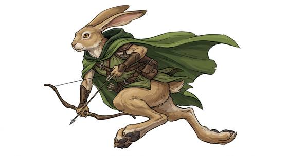

# Lagomorph folk

{.illus}

*Set: Core*

*aka: ______________________________*

*Family: [Lagomorph](../Species_Families/lagomorph.md)*

Rabbit and hare people, quick on their feet and quicker still to hear trouble coming. Rabbit-folk are small, sociable and alert, living in busy burrows with large families, kicking hard with their long hind feet when cornered. Hare-folk are taller and leaner, with longer ears, great sprinting speed and a solitary streak, and some of their lines keep a loud, boisterous warrior tradition. Pika-folk live in cold mountains and store hay for winter; jackrabbit-folk cool their long ears in the desert.

Some keep the old four-legged body and live in warrens full of songs and stories. Some wander as masterless swordsmen bound by a strict code. In mixed cities they are often treated as easy prey, and make up for it in wit, connections and speed.

## Not to be confused with

*[celestial rabbit](lagomorph-celestial-rabbit.md)*, the mythic rabbit of the moon; lagomorph folk are the ordinary rabbit and hare peoples of the world below.

## What sets this species apart

No different from the family: the ordinary rabbit and hare peoples are the family baseline. Differences such as the quadruped warren body or hare sprint speed belong at Breed/Race level.

## Breeds and races

Each block below is one set of numbers; breeds that share every number share a block (Species rules, rule 9). Attributes are final modifiers, the size trade-off included. Skills, powers and weapon groups are final levels after the family, species and breed layers.

### No. 555 Rabbit-folk *(genres: beast-folk: fur; starter)*

- **Size:** small · **Body:** biped+tailed
- **What it's like:** Quick, alert rabbit people with powerful jumping legs and very sharp hearing. (looks like: rabbit; good at: speed and agility, keen senses, sneaking)
- **Attributes:** STR −2 AGI +2 WIS +1 PER +2 COU −1
- **Skills:** [Jumping](../Skills/jumping.md) +3, [Danger Sense](../Skills/danger-sense.md) +2, [Running](../Skills/running.md) +2, [Stealth](../Skills/stealth.md) +1, [Lifting & Carrying](../Skills/lifting-and-carrying.md) −1, [Pain Tolerance](../Skills/pain-tolerance.md) −1, [Intimidation](../Skills/intimidation.md) −3
- **Natural attacks:** kick 1d6+1
- **For the Game Master only, this race as an NPC guard or soldier (not your character's numbers):** Attack 13 · Parry 10 · Dodge 11 · Damage longsword 1d6+1; kick 1d6-1 · Armour 2 · Life 15 · Threat 1 ([Bestiary roles](../bestiary.md))
- *Why:* Same as its species; the rabbit is the family baseline.

### No. 556 Hare-folk *(genres: beast-folk: fur, animal fable)*

- **Size:** medium · **Body:** biped+tailed
- **What it's like:** Long-legged, long-eared hare-folk built for blistering sprints, more solitary than their rabbit cousins and sometimes fiercely martial. (looks like: rabbit; good at: speed and agility, keen senses)
- **Attributes:** STR −1 AGI +2 WIS +1 PER +2 COU −1
- **Skills:** [Jumping](../Skills/jumping.md) +3, [Running](../Skills/running.md) +3, [Danger Sense](../Skills/danger-sense.md) +2, [Stealth](../Skills/stealth.md) +1, [Lifting & Carrying](../Skills/lifting-and-carrying.md) −1, [Pain Tolerance](../Skills/pain-tolerance.md) −1, [Intimidation](../Skills/intimidation.md) −3
- **Natural attacks:** kick 1d6+1
- **For the Game Master only, this race as an NPC guard or soldier (not your character's numbers):** Attack 14 · Parry 11 · Dodge 10 · Damage longsword 1d6+2; kick 1d6+2 · Armour 2 · Life 17 · Threat 1 ([Bestiary roles](../bestiary.md))
- *Why:* Exceptional sprinters.

### Pika-folk *(NPC only)*

- **Size:** tiny · **Body:** biped
- **Attributes:** STR −3 AGI +3 WIS +1 PER +2 COU −1
- **Skills:** [Jumping](../Skills/jumping.md) +3, [Danger Sense](../Skills/danger-sense.md) +2, [Running](../Skills/running.md) +2, [Survival: Mountain](../Skills/survival-mountain.md) +2, [Foraging](../Skills/foraging.md) +1, [Stealth](../Skills/stealth.md) +1, [Lifting & Carrying](../Skills/lifting-and-carrying.md) −1, [Pain Tolerance](../Skills/pain-tolerance.md) −1, [Intimidation](../Skills/intimidation.md) −3
- **Natural attacks:** kick 1d6+1
- **For the Game Master only, this race as an NPC guard or soldier (not your character's numbers):** Attack 13 · Parry 10 · Dodge 13 · Damage longsword 1d6+1; kick 1d6-2 · Armour 2 · Life 13 · Threat 1 ([Bestiary roles](../bestiary.md))
- *Why:* Cold, high-altitude dwellers that cache hay for winter.

### Jackrabbit-folk *(NPC only)*

- **Size:** medium · **Body:** biped+tailed
- **Attributes:** STR −1 AGI +2 WIS +1 PER +2 COU −1
- **Skills:** [Jumping](../Skills/jumping.md) +3, [Running](../Skills/running.md) +3, [Danger Sense](../Skills/danger-sense.md) +2, [Survival: Desert](../Skills/survival-desert.md) +2, [Stealth](../Skills/stealth.md) +1, [Lifting & Carrying](../Skills/lifting-and-carrying.md) −1, [Pain Tolerance](../Skills/pain-tolerance.md) −1, [Intimidation](../Skills/intimidation.md) −3
- **Natural attacks:** kick 1d6+1
- **For the Game Master only, this race as an NPC guard or soldier (not your character's numbers):** Attack 14 · Parry 11 · Dodge 10 · Damage longsword 1d6+2; kick 1d6+2 · Armour 2 · Life 17 · Threat 1 ([Bestiary roles](../bestiary.md))
- *Why:* Desert sprinters whose huge ears shed heat.

### No. 557 Warren-dwelling rabbit folk *(genres: animal fable)*

- **Size:** small · **Body:** quadruped
- **What it's like:** True rabbit-bodied folk who live in tight warren communities, wary and quick, with a rich spoken mythology of their own. (looks like: rabbit; good at: speed and agility, keen senses)
- **Attributes:** STR −2 AGI +2 WIS +1 PER +2 COU −1
- **Skills:** [Jumping](../Skills/jumping.md) +3, [Danger Sense](../Skills/danger-sense.md) +2, [Running](../Skills/running.md) +2, [Stealth](../Skills/stealth.md) +1, [Storytelling & Conversation](../Skills/storytelling-and-conversation.md) +1, [Lifting & Carrying](../Skills/lifting-and-carrying.md) −1, [Pain Tolerance](../Skills/pain-tolerance.md) −1, [Intimidation](../Skills/intimidation.md) −3, [Hand Tools](../Skills/hand-tools.md) Foreign Concept, [Riding](../Skills/riding.md) Foreign Concept
- **Natural attacks:** kick 1d6+1
- **For the Game Master only, this race as an NPC guard or soldier (not your character's numbers):** Attack 13 · Parry — · Dodge 11 · Damage kick 1d4 · Armour 0 · Life 13 · Threat minor ([Bestiary roles](../bestiary.md))
- *Why:* Keeps the four-legged rabbit body, with a rich oral mythology.
- *Note:* Storytelling is a culture line. No hands: held weapons unusable.

### No. 558 Samurai rabbit clan *(genres: beast-folk: fur)*

- **Size:** medium · **Body:** biped
- **What it's like:** Honour-bound rabbit-folk swordsmen of a feudal warrior code, their long ears catching the faintest sound. (looks like: rabbit; good at: fighting, keen senses)
- **Attributes:** STR −1 AGI +2 WIS +1 PER +2 COU −1
- **Skills:** [Jumping](../Skills/jumping.md) +3, [Danger Sense](../Skills/danger-sense.md) +2, [Running](../Skills/running.md) +2, [Stealth](../Skills/stealth.md) +1, [Lifting & Carrying](../Skills/lifting-and-carrying.md) −1, [Pain Tolerance](../Skills/pain-tolerance.md) −1, [Intimidation](../Skills/intimidation.md) −3
- **Natural attacks:** kick 1d6+1
- **For the Game Master only, this race as an NPC guard or soldier (not your character's numbers):** Attack 14 · Parry 11 · Dodge 10 · Damage longsword 1d6+2; kick 1d6+2 · Armour 2 · Life 17 · Threat 1 ([Bestiary roles](../bestiary.md))
- *Why:* Same as its species; swordsmanship and the warrior code are weapon-group and Culture matters.

### No. 559 Prey-caste rabbit-folk *(genres: beast-folk: fur)*

- **Size:** small · **Body:** biped
- **What it's like:** Small, twitchy rabbit people who leap and bolt at the first sign of danger. (looks like: rabbit; good at: speed and agility, keen senses)
- **Attributes:** STR −2 AGI +2 WIS +1 PER +2 CHA +1 COU −1
- **Skills:** [Jumping](../Skills/jumping.md) +3, [Danger Sense](../Skills/danger-sense.md) +2, [Running](../Skills/running.md) +2, [Persuasion](../Skills/persuasion.md) +1, [Stealth](../Skills/stealth.md) +1, [Lifting & Carrying](../Skills/lifting-and-carrying.md) −1, [Pain Tolerance](../Skills/pain-tolerance.md) −1, [Intimidation](../Skills/intimidation.md) −3
- **Natural attacks:** kick 1d6+1
- **For the Game Master only, this race as an NPC guard or soldier (not your character's numbers):** Attack 13 · Parry 10 · Dodge 11 · Damage longsword 1d6+1; kick 1d6-1 · Armour 2 · Life 15 · Threat 1 ([Bestiary roles](../bestiary.md))
- *Why:* Physically vulnerable but socially resourceful in a mixed society.

