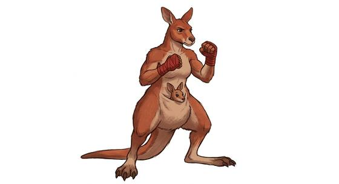

# Marsupial folk

{.illus}

*Set: Core*

*aka: ______________________________*

*Family: [Marsupial](../Species_Families/marsupial.md)*

The pouched peoples. Whatever their shape, they share one habit that sets them apart: the young are born tiny and finish growing in a warm pocket of the mother's belly, peering out at the world long before they walk in it. Beyond that they vary wildly. Some are tall leapers with thick tails that prop them up like a third leg and forearms made for boxing. Some are drowsy tree-climbers with iron grips, some stocky diggers with backsides hard as a shield, some small night scavengers who play dead when cornered, and a few glide from tree to tree on stretched skin.

They come from dry scrub, open grassland and old forest, and tend to be practical, hardy and unimpressed by strangers. Others find them odd company, and learn not to make fun of the pouch.

## Not to be confused with

the *[lagomorph folk](lagomorph-lagomorph-folk.md)*, who share the long hind legs and the leaping, but carry no pouch and raise their young in burrows.

## What sets this species apart

No different from the family: it is the family's only species, so the family lines already describe it. The wide spread (climbing tree-dwellers, burrowers, gliders, the extinct predator line) is carried at Breed/Race level.

## Breeds and races

Each block below is one set of numbers; breeds that share every number share a block (Species rules, rule 9). Attributes are final modifiers, the size trade-off included. Skills, powers and weapon groups are final levels after the family, species and breed layers.

### No. 560 Kangaroo-folk *(genres: beast-folk: fur; starter)*

- **Size:** large · **Body:** biped+tailed
- **What it's like:** Big-footed jumpers who leap huge distances and box with their fists. (looks like: kangaroo; good at: strength, speed and agility, wilderness)
- **Attributes:** STR +3 AGI −1 END +1 CHA −1
- **Skills:** [Jumping](../Skills/jumping.md) +3, [Balance](../Skills/balance.md) +1, [Caregiving](../Skills/caregiving.md) +1, [Survival: Desert](../Skills/survival-desert.md) +1, [Survival: Plains & Steppe](../Skills/survival-plains-and-steppe.md) +1, [Climbing](../Skills/climbing.md) −1, [Swimming](../Skills/swimming.md) −1
- **Weapon groups:** [Brawling](../Weapon_Groups/brawling.md) +1
- **Natural attacks:** kick 1d6+1
- **For the Game Master only, this race as an NPC guard or soldier (not your character's numbers):** Attack 14 · Parry 11 · Dodge 6 · Damage longsword 1d6+2; kick 1d6+4 · Armour 2 · Life 22 · Threat 2 ([Bestiary roles](../bestiary.md))
- *Why:* Powerful leapers that brace on a strong tail.
- *Note:* Boxing is a weapon-group matter.

### Wallaby-folk *(NPC only)*

- **Size:** medium · **Body:** biped+tailed
- **Attributes:** AGI +1 END +1 CHA −1
- **Skills:** [Jumping](../Skills/jumping.md) +2, [Caregiving](../Skills/caregiving.md) +1, [Survival: Desert](../Skills/survival-desert.md) +1, [Survival: Plains & Steppe](../Skills/survival-plains-and-steppe.md) +1, [Climbing](../Skills/climbing.md) −1, [Swimming](../Skills/swimming.md) −1
- **Weapon groups:** [Brawling](../Weapon_Groups/brawling.md) +1
- **Natural attacks:** kick 1d6+1
- **For the Game Master only, this race as an NPC guard or soldier (not your character's numbers):** Attack 14 · Parry 11 · Dodge 9 · Damage longsword 1d6+2; kick 1d6+2 · Armour 2 · Life 18 · Threat 1 ([Bestiary roles](../bestiary.md))
- *Why:* Same as its species; a smaller leaping build is an attribute matter.

### No. 561 Koala-folk *(genres: beast-folk: fur)*

- **Size:** medium · **Body:** biped+tailless
- **What it's like:** Round, sleepy tree-hugging folk who climb well and doze through the day. (looks like: koala; good at: climbing, wilderness)
- **Attributes:** END +1 CHA −1
- **Skills:** [Climbing](../Skills/climbing.md) +2, [Jumping](../Skills/jumping.md) +2, [Caregiving](../Skills/caregiving.md) +1, [Survival: Desert](../Skills/survival-desert.md) +1, [Survival: Plains & Steppe](../Skills/survival-plains-and-steppe.md) +1, [Swimming](../Skills/swimming.md) −1
- **Natural attacks:** claws 1d6+1
- **For the Game Master only, this race as an NPC guard or soldier (not your character's numbers):** Attack 14 · Parry 11 · Dodge 8 · Damage longsword 1d6+2; claws 1d6+2 · Armour 2 · Life 18 · Threat 1 ([Bestiary roles](../bestiary.md))
- *Why:* Strong climbing grip and a slow, low-energy metabolism.

### No. 562 Opossum-folk *(genres: beast-folk: fur)*

- **Size:** small · **Body:** biped+tailed
- **What it's like:** Small tree-climbers with gripping tails who play dead and shrug off poisons. (looks like: possum; good at: climbing, toughness)
- **Attributes:** STR −2 AGI +2 END +1 CHA −1
- **Skills:** [Jumping](../Skills/jumping.md) +2, [Acting](../Skills/acting.md) +1, [Caregiving](../Skills/caregiving.md) +1, [Climbing](../Skills/climbing.md) +1, [Survival: Desert](../Skills/survival-desert.md) +1, [Survival: Plains & Steppe](../Skills/survival-plains-and-steppe.md) +1, [Swimming](../Skills/swimming.md) −1
- **Powers:** [Poison & Disease Immunity](../Powers/poison-and-disease-immunity.md) 2
- **Natural attacks:** bite 1d6+1
- **For the Game Master only, this race as an NPC guard or soldier (not your character's numbers):** Attack 14 · Parry 11 · Dodge 11 · Damage longsword 1d6+1; bite 1d6-1 · Armour 2 · Life 16 · Threat 1 ([Bestiary roles](../bestiary.md))
- *Why:* Prehensile tail, a convincing play-dead instinct and resistance to toxins.

### Tasmanian devil-folk *(NPC only)*

- **Size:** small · **Body:** biped+tailed
- **Attributes:** STR −1 AGI +2 END +1 CHA −1 COU +1
- **Skills:** [Intimidation](../Skills/intimidation.md) +2, [Jumping](../Skills/jumping.md) +2, [Caregiving](../Skills/caregiving.md) +1, [Scavenging](../Skills/scavenging.md) +1, [Survival: Desert](../Skills/survival-desert.md) +1, [Survival: Plains & Steppe](../Skills/survival-plains-and-steppe.md) +1, [Climbing](../Skills/climbing.md) −1, [Swimming](../Skills/swimming.md) −1
- **Weapon groups:** [Brawling](../Weapon_Groups/brawling.md) +1
- **Natural attacks:** bite 1d6+1
- **For the Game Master only, this race as an NPC guard or soldier (not your character's numbers):** Attack 14 · Parry 11 · Dodge 11 · Damage longsword 1d6+2; bite 1d6+1 · Armour 2 · Life 16 · Threat 1 ([Bestiary roles](../bestiary.md))
- *Why:* A savage bite and loud aggressive displays.

### Wombat-folk *(NPC only)*

- **Size:** medium · **Body:** biped+tailless
- **Attributes:** STR +1 END +2 CHA −1
- **Skills:** [Caregiving](../Skills/caregiving.md) +1, [Survival: Desert](../Skills/survival-desert.md) +1, [Survival: Plains & Steppe](../Skills/survival-plains-and-steppe.md) +1, [Climbing](../Skills/climbing.md) −1, [Swimming](../Skills/swimming.md) −1
- **Powers:** [Burrowing](../Powers/burrowing.md) 2
- **Natural attacks:** claws 1d6+1
- **For the Game Master only, this race as an NPC guard or soldier (not your character's numbers):** Attack 14 · Parry 11 · Dodge 8 · Damage longsword 1d6+2; claws 1d6+2 · Armour 2 · Life 19 · Threat 1 ([Bestiary roles](../bestiary.md))
- *Why:* Powerful burrowers that walk rather than hop.
- *Note:* The armoured rump is lexicon detail.

### Sugar glider-folk *(NPC only)*

- **Size:** small · **Body:** biped+winged
- **Attributes:** STR −2 AGI +2 END +1 CHA −1
- **Skills:** [Jumping](../Skills/jumping.md) +2, [Parachuting & Gliding](../Skills/parachuting-and-gliding.md) +2, [Caregiving](../Skills/caregiving.md) +1, [Climbing](../Skills/climbing.md) +1, [Survival: Desert](../Skills/survival-desert.md) +1, [Survival: Plains & Steppe](../Skills/survival-plains-and-steppe.md) +1, [Swimming](../Skills/swimming.md) −1
- **Powers:** [Night & Spectrum Sight](../Powers/night-and-spectrum-sight.md) 1
- **For the Game Master only, this race as an NPC guard or soldier (not your character's numbers):** Attack 14 · Parry 11 · Dodge 11 · Damage longsword 1d6+1 · Armour 2 · Life 16 · Threat 1 ([Bestiary roles](../bestiary.md))
- *Why:* Nocturnal tree-dwellers that glide on membranes between their limbs.

### Thylacine-folk *(beast)*

- **Size:** medium · **Body:** biped+tailed
- **Attributes:** AGI +1 END +1 INT −3 WIS +1 CHA −1
- **Skills:** [Hunting](../Skills/hunting.md) +2, [Caregiving](../Skills/caregiving.md) +1, [Survival: Desert](../Skills/survival-desert.md) +1, [Survival: Plains & Steppe](../Skills/survival-plains-and-steppe.md) +1, [Climbing](../Skills/climbing.md) −1, [Swimming](../Skills/swimming.md) −1
- **Weapon groups:** [Brawling](../Weapon_Groups/brawling.md) +1
- **Natural attacks:** bite 1d6+1
- **For the Game Master only, this race as an NPC guard or soldier (not your character's numbers):** Attack 15 · Parry — · Dodge 9 · Damage bite 1d6+1 · Armour 0 · Life 16 · Threat minor ([Bestiary roles](../bestiary.md))
- *Why:* A wide-jawed predator that runs rather than hops.

