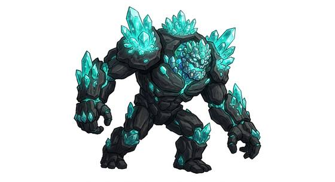

# Crystalline 4X lifeform

{.illus}

*Set: Core*

*aka: ______________________________*

*Family: [Mineral and crystalline](../Species_Families/mineral-and-crystalline.md)*

People grown from crystal and silicon rather than meat and water. They look like humanoid clusters of glassy stone, and their bodies do very little of what flesh does: they barely eat, catch no fevers, and need neither clean air nor gentle weather to thrive. Where other peoples build domes and filters, these simply walk out onto the rock.

Their lives are long and slow. They grow few young, and each generation takes a great while to come of age, so their cities expand like a glacier: steadily, patiently, and without much hurry. Diseases meant to wipe out a population pass through them without effect. Other spacefaring peoples find them hard to read, harder to threaten, and easy to underestimate until they notice how much of the map is slowly turning grey.

## Not to be confused with

the *[crystalline folk](mineral-and-crystalline-crystalline-folk.md)*, who are also living crystal but are prized for light and craft rather than for surviving anywhere.

## What sets this species apart

Silicon-based crystal bodies that shrug off disease and hostile surroundings and live very long. Lifespan (long-lived) is a lexicon detail, not a game number.

## Breeds and races

Each block below is one set of numbers; breeds that share every number share a block (Species rules, rule 9). Attributes are final modifiers, the size trade-off included. Skills, powers and weapon groups are final levels after the family, species and breed layers.

### No. 567 Crystalline silicon-based lifeform *(genres: space opera: strange aliens; starter)*

- **Size:** medium · **Body:** biped
- **What it's like:** A living being of stone and crystal, slow to tire and hard to hurt. (looks like: crystal; good at: toughness, strength, knowledge)
- **Attributes:** STR +2 AGI −3 END +2
- **Skills:** [Pain Tolerance](../Skills/pain-tolerance.md) +3, [Geology & Prospecting](../Skills/geology-and-prospecting.md) +2, [Composure](../Skills/composure.md) +1, [Acrobatics](../Skills/acrobatics.md) −2, [Running](../Skills/running.md) −2, [Stealth](../Skills/stealth.md) −2, [Swimming](../Skills/swimming.md) Foreign Concept
- **Powers:** [Armour Skin](../Powers/armour-skin.md) 3, [Poison & Disease Immunity](../Powers/poison-and-disease-immunity.md) 3, [Endurance Without Need](../Powers/endurance-without-need.md) 1, [Environmental Immunity](../Powers/environmental-immunity.md) 1
- **Weapon groups:** [Brawling](../Weapon_Groups/brawling.md) +1
- **Natural attacks:** stone fist 1d6+1
- **For the Game Master only, this race as an NPC guard or soldier (not your character's numbers):** Attack 13 · Parry 10 · Dodge 5 · Damage longsword 1d6+2; stone fist 1d6+2 · Armour 2 · Life 19 · Threat 2 ([Bestiary roles](../bestiary.md))

