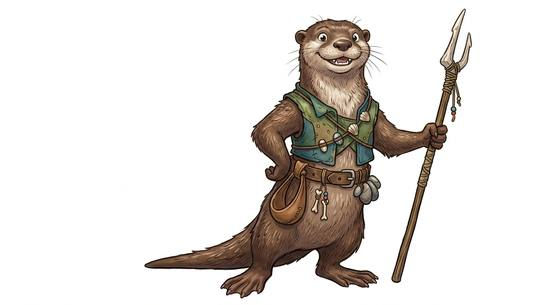

# Mustelid folk

{.illus}

*Set: Core*

*aka: ______________________________*

*Family: [Mustelid and small mammal](../Species_Families/mustelid-and-small-mammal.md)*

The weasel-kin: long, sleek, supple bodies, short legs, bright eyes and quick hands. They come in many coats and sizes, from playful river swimmers with dense waterproof fur to stubborn badgers that dig through a hillside, slender stoats who make fine thieves, and fierce wolverine-folk who fear nothing twice their size.

What they share is energy and nerve. They are curious, restless, clever with tools and hard to corner, and they fight far above their weight when pushed. Some are cheerful fisherfolk and riverside traders, some scholarly burrow-dwellers, some raiders with a bad name along every road. Others think of them as sly, which is partly fair, and partly envy at how easily they slip through a gap.

## Not to be confused with

the *[small mammal folk](mustelid-and-small-mammal-small-mammal-folk.md)*, rounder and stouter creatures such as skunks, raccoons and hedgehogs, who lack the long, slinky build.

## What sets this species apart

No different from the family: the weasel-kin are the family's baseline. Strong swimmers, diggers and the static-charged beast folk differ by Breed/Race.

## Breeds and races

Each block below is one set of numbers; breeds that share every number share a block (Species rules, rule 9). Attributes are final modifiers, the size trade-off included. Skills, powers and weapon groups are final levels after the family, species and breed layers.

### No. 569 Otter-folk *(genres: animal fable, beast-folk: fur; starter)*

- **Size:** medium · **Body:** biped+tailed
- **What it's like:** Playful, clever river folk who swim, fish and fight side by side. (looks like: otter; good at: swimming, sneaking, speed and agility)
- **Attributes:** STR −1 AGI +2 CHA −1 COU +1
- **Skills:** [Swimming](../Skills/swimming.md) +3, [Escape Artistry](../Skills/escape-artistry.md) +2, [Stealth](../Skills/stealth.md) +2, [Climbing](../Skills/climbing.md) +1, [Fishing](../Skills/fishing.md) +1, [Scavenging](../Skills/scavenging.md) +1, [Survival: Forest (Woodcraft)](../Skills/survival-forest-woodcraft.md) +1, [Intimidation](../Skills/intimidation.md) −2, [Lifting & Carrying](../Skills/lifting-and-carrying.md) −2
- **Natural attacks:** bite 1d6+1
- **For the Game Master only, this race as an NPC guard or soldier (not your character's numbers):** Attack 14 · Parry 11 · Dodge 10 · Damage longsword 1d6+2; bite 1d6+2 · Armour 2 · Life 17 · Threat 1 ([Bestiary roles](../bestiary.md))
- *Why:* Playful river swimmers with waterproof fur and a fishing way of life.

### Sea otter-folk *(NPC only)*

- **Size:** medium · **Body:** aquatic+tailed
- **Attributes:** STR −1 AGI +2 CHA −1 COU +1
- **Skills:** [Swimming](../Skills/swimming.md) +3, [Escape Artistry](../Skills/escape-artistry.md) +2, [Stealth](../Skills/stealth.md) +2, [Climbing](../Skills/climbing.md) +1, [Diving](../Skills/diving.md) +1, [Scavenging](../Skills/scavenging.md) +1, [Survival: Coast & Sea](../Skills/survival-coast-and-sea.md) +1, [Survival: Forest (Woodcraft)](../Skills/survival-forest-woodcraft.md) +1, [Intimidation](../Skills/intimidation.md) −2, [Lifting & Carrying](../Skills/lifting-and-carrying.md) −2
- **Natural attacks:** bite 1d6+1
- **For the Game Master only, this race as an NPC guard or soldier (not your character's numbers):** Attack 14 · Parry 11 · Dodge 10 · Damage longsword 1d6+2; bite 1d6+2 · Armour 2 · Life 17 · Threat 1 ([Bestiary roles](../bestiary.md))
- *Why:* Sea-living otters of the kelp forests, at home floating and diving offshore.

### No. 570 Badger-folk *(genres: animal fable, beast-folk: fur)*

- **Size:** medium · **Body:** biped+tailed
- **What it's like:** Stubborn, tough-skinned badger people who dig fast tunnels and refuse to give up a fight. (looks like: badger; good at: sneaking, toughness)
- **Attributes:** AGI +1 END +1 CHA −1 COU +1
- **Skills:** [Escape Artistry](../Skills/escape-artistry.md) +2, [Stealth](../Skills/stealth.md) +2, [Climbing](../Skills/climbing.md) +1, [Pain Tolerance](../Skills/pain-tolerance.md) +1, [Scavenging](../Skills/scavenging.md) +1, [Survival: Forest (Woodcraft)](../Skills/survival-forest-woodcraft.md) +1, [Swimming](../Skills/swimming.md) +1, [Intimidation](../Skills/intimidation.md) −2, [Lifting & Carrying](../Skills/lifting-and-carrying.md) −2
- **Powers:** [Burrowing](../Powers/burrowing.md) 1
- **Natural attacks:** bite 1d6+1, claws 1d6+1
- **For the Game Master only, this race as an NPC guard or soldier (not your character's numbers):** Attack 14 · Parry 11 · Dodge 9 · Damage longsword 1d6+2; bite 1d6+2 · Armour 2 · Life 18 · Threat 1 ([Bestiary roles](../bestiary.md))
- *Why:* Tough-hided diggers with strong claws.

### No. 571 Berserker badger folk *(genres: animal fable)*

- **Size:** large · **Body:** biped+tailed
- **What it's like:** The biggest of the badger clans: wise leaders who fly into a terrifying battle-rage when pushed. (looks like: badger; good at: fighting, strength)
- **Attributes:** STR +2 AGI −1 END +1 CHA −1 COU +2
- **Skills:** [Escape Artistry](../Skills/escape-artistry.md) +2, [Stealth](../Skills/stealth.md) +2, [Climbing](../Skills/climbing.md) +1, [Scavenging](../Skills/scavenging.md) +1, [Survival: Forest (Woodcraft)](../Skills/survival-forest-woodcraft.md) +1, [Swimming](../Skills/swimming.md) +1
- **Powers:** [Battle Fury](../Powers/battle-fury.md) 2
- **Natural attacks:** bite 1d6+1, claws 1d6+1
- **For the Game Master only, this race as an NPC guard or soldier (not your character's numbers):** Attack 15 · Parry 12 · Dodge 6 · Damage longsword 1d6+2; bite 1d6+4 · Armour 2 · Life 22 · Threat 2 ([Bestiary roles](../bestiary.md))
- *Why:* The largest woodland folk, given to berserk battle rage and not small enough to be dismissed.
- *Note:* The two Set 0 lines cancel the family's small-body penalties, as for other large breeds.

### Honey badger-folk *(NPC only)*

- **Size:** medium · **Body:** biped+tailed
- **Attributes:** AGI +2 END +2 CHA −1 COU +3
- **Skills:** [Escape Artistry](../Skills/escape-artistry.md) +2, [Pain Tolerance](../Skills/pain-tolerance.md) +2, [Stealth](../Skills/stealth.md) +2, [Climbing](../Skills/climbing.md) +1, [Composure](../Skills/composure.md) +1, [Scavenging](../Skills/scavenging.md) +1, [Survival: Forest (Woodcraft)](../Skills/survival-forest-woodcraft.md) +1, [Swimming](../Skills/swimming.md) +1, [Intimidation](../Skills/intimidation.md) −2, [Lifting & Carrying](../Skills/lifting-and-carrying.md) −2
- **Powers:** [Armour Skin](../Powers/armour-skin.md) 1
- **Natural attacks:** bite 1d6+1
- **For the Game Master only, this race as an NPC guard or soldier (not your character's numbers):** Attack 15 · Parry 12 · Dodge 10 · Damage longsword 1d6+2; bite 1d6+2 · Armour 2 · Life 19 · Threat 2 ([Bestiary roles](../bestiary.md))
- *Why:* Fearless and nearly indifferent to pain, with loose, bite-resistant skin.

### No. 572 Weasel-folk *(genres: animal fable)*

- **Size:** small · **Body:** biped+tailed
- **What it's like:** Quick, sly weasel folk with fast reflexes, more comfortable robbing you than fighting fair. (looks like: weasel; good at: speed and agility, sneaking)
- **Attributes:** STR −2 AGI +2 CHA −1 COU +1
- **Skills:** [Escape Artistry](../Skills/escape-artistry.md) +2, [Stealth](../Skills/stealth.md) +2, [Climbing](../Skills/climbing.md) +1, [Scavenging](../Skills/scavenging.md) +1, [Survival: Forest (Woodcraft)](../Skills/survival-forest-woodcraft.md) +1, [Swimming](../Skills/swimming.md) +1, [Intimidation](../Skills/intimidation.md) −2, [Lifting & Carrying](../Skills/lifting-and-carrying.md) −2
- **Natural attacks:** bite 1d6+1
- **For the Game Master only, this race as an NPC guard or soldier (not your character's numbers):** Attack 14 · Parry 11 · Dodge 11 · Damage longsword 1d6+1; bite 1d6-1 · Armour 2 · Life 15 · Threat 1 ([Bestiary roles](../bestiary.md))
- *Why:* Same as its species; the quick, slender weasel is the species baseline.

### No. 573 Ferret-folk *(genres: beast-folk: fur)*

- **Size:** small · **Body:** biped+tailed
- **What it's like:** Playful, wriggly ferret folk who can slip through impossibly tight gaps. (looks like: ferret; good at: sneaking, speed and agility)
- **Attributes:** STR −2 AGI +2 CHA −1 COU +1
- **Skills:** [Escape Artistry](../Skills/escape-artistry.md) +3, [Stealth](../Skills/stealth.md) +2, [Climbing](../Skills/climbing.md) +1, [Scavenging](../Skills/scavenging.md) +1, [Survival: Forest (Woodcraft)](../Skills/survival-forest-woodcraft.md) +1, [Swimming](../Skills/swimming.md) +1, [Intimidation](../Skills/intimidation.md) −2, [Lifting & Carrying](../Skills/lifting-and-carrying.md) −2
- **Natural attacks:** bite 1d6+1
- **For the Game Master only, this race as an NPC guard or soldier (not your character's numbers):** Attack 14 · Parry 11 · Dodge 11 · Damage longsword 1d6+1; bite 1d6-1 · Armour 2 · Life 15 · Threat 1 ([Bestiary roles](../bestiary.md))
- *Why:* An especially flexible, elongated body.

### No. 574 Wolverine-folk *(genres: beast-folk: fur)*

- **Size:** medium · **Body:** biped+tailed
- **What it's like:** Small but ferocious wolverine folk, tough enough for the deep cold and always ready for a fight. (looks like: wolverine; good at: fighting, toughness)
- **Attributes:** STR +1 AGI +1 CHA −2 COU +2
- **Skills:** [Escape Artistry](../Skills/escape-artistry.md) +2, [Stealth](../Skills/stealth.md) +2, [Survival: Arctic](../Skills/survival-arctic.md) +2, [Climbing](../Skills/climbing.md) +1, [Scavenging](../Skills/scavenging.md) +1, [Survival: Forest (Woodcraft)](../Skills/survival-forest-woodcraft.md) +1, [Swimming](../Skills/swimming.md) +1, [Lifting & Carrying](../Skills/lifting-and-carrying.md) −2
- **Natural attacks:** bite 1d6+1, claws 1d6+1
- **For the Game Master only, this race as an NPC guard or soldier (not your character's numbers):** Attack 15 · Parry 12 · Dodge 9 · Damage longsword 1d6+2; bite 1d6+2 · Armour 2 · Life 17 · Threat 2 ([Bestiary roles](../bestiary.md))
- *Why:* Frost-proof fur and a ferocity out of all proportion to size.

### Mink-folk *(NPC only)*

- **Size:** small · **Body:** biped+tailed
- **Attributes:** STR −2 AGI +2 CHA −1 COU +1
- **Skills:** [Escape Artistry](../Skills/escape-artistry.md) +2, [Stealth](../Skills/stealth.md) +2, [Swimming](../Skills/swimming.md) +2, [Climbing](../Skills/climbing.md) +1, [Hunting](../Skills/hunting.md) +1, [Scavenging](../Skills/scavenging.md) +1, [Survival: Forest (Woodcraft)](../Skills/survival-forest-woodcraft.md) +1, [Intimidation](../Skills/intimidation.md) −2, [Lifting & Carrying](../Skills/lifting-and-carrying.md) −2
- **Natural attacks:** bite 1d6+1
- **For the Game Master only, this race as an NPC guard or soldier (not your character's numbers):** Attack 14 · Parry 11 · Dodge 11 · Damage longsword 1d6+1; bite 1d6-1 · Armour 2 · Life 15 · Threat 1 ([Bestiary roles](../bestiary.md))
- *Why:* Semi-aquatic solitary hunters.

### No. 575 Espionage mustelid folk *(genres: space opera: beast-like aliens)*

- **Size:** medium · **Body:** biped+furred
- **What it's like:** Sharp-eyed weasel-faced folk who trade in secrets across the stars. (looks like: otter; good at: sneaking, people and talk)
- **Attributes:** STR −1 AGI +2 CHA −1 COU +1
- **Skills:** [Escape Artistry](../Skills/escape-artistry.md) +2, [Stealth](../Skills/stealth.md) +2, [Climbing](../Skills/climbing.md) +1, [Intrigue & Politics](../Skills/intrigue-and-politics.md) +1, [Scavenging](../Skills/scavenging.md) +1, [Survival: Forest (Woodcraft)](../Skills/survival-forest-woodcraft.md) +1, [Swimming](../Skills/swimming.md) +1, [Tradecraft](../Skills/tradecraft.md) +1, [Intimidation](../Skills/intimidation.md) −2, [Lifting & Carrying](../Skills/lifting-and-carrying.md) −2
- **Natural attacks:** bite 1d6+1
- **For the Game Master only, this race as an NPC guard or soldier (not your character's numbers):** Attack 14 · Parry 11 · Dodge 10 · Damage longsword 1d6+2; bite 1d6+2 · Armour 2 · Life 17 · Threat 1 ([Bestiary roles](../bestiary.md))
- *Why:* A galaxy-spanning people of information brokers.
- *Note:* Culture lines, inseparable from this people.

### No. 576 Den-clan mustelid folk *(genres: space opera: beast-like aliens)*

- **Size:** medium · **Body:** biped+furred
- **What it's like:** Long, sleek river-dwelling weasel folk who live in close-knit clans led by their mothers. (looks like: otter; good at: swimming, sneaking)
- **Attributes:** STR −1 AGI +2 CHA −1 COU +1
- **Skills:** [Escape Artistry](../Skills/escape-artistry.md) +2, [Stealth](../Skills/stealth.md) +2, [Swimming](../Skills/swimming.md) +2, [Climbing](../Skills/climbing.md) +1, [Scavenging](../Skills/scavenging.md) +1, [Survival: Forest (Woodcraft)](../Skills/survival-forest-woodcraft.md) +1, [Intimidation](../Skills/intimidation.md) −2, [Lifting & Carrying](../Skills/lifting-and-carrying.md) −2
- **Natural attacks:** bite 1d6+1
- **For the Game Master only, this race as an NPC guard or soldier (not your character's numbers):** Attack 14 · Parry 11 · Dodge 10 · Damage longsword 1d6+2; bite 1d6+2 · Armour 2 · Life 17 · Threat 1 ([Bestiary roles](../bestiary.md))
- *Why:* Semi-aquatic, with a matriarchal den-clan culture.
- *Note:* The clan culture is lexicon and Culture-step detail.

### No. 577 Storm-charged beast folk *(genres: beast-folk: fur)*

- **Size:** medium · **Body:** biped+tailed
- **What it's like:** Fierce beast-warriors who crackle with static electricity and prize a fine hairstyle almost as much as honour. (looks like: wolf; good at: fighting, powers and magic)
- **Attributes:** STR −1 AGI +2 CHA −1 COU +1
- **Skills:** [Escape Artistry](../Skills/escape-artistry.md) +2, [Stealth](../Skills/stealth.md) +2, [Climbing](../Skills/climbing.md) +1, [Grooming & Style](../Skills/grooming-and-style.md) +1, [Scavenging](../Skills/scavenging.md) +1, [Survival: Forest (Woodcraft)](../Skills/survival-forest-woodcraft.md) +1, [Swimming](../Skills/swimming.md) +1, [Intimidation](../Skills/intimidation.md) −2, [Lifting & Carrying](../Skills/lifting-and-carrying.md) −2
- **Powers:** [Lightning](../Powers/lightning.md) 2
- **Natural attacks:** bite 1d6+1
- **For the Game Master only, this race as an NPC guard or soldier (not your character's numbers):** Attack 14 · Parry 11 · Dodge 10 · Damage longsword 1d6+2; bite 1d6+2 · Armour 2 · Life 17 · Threat 1 ([Bestiary roles](../bestiary.md))
- *Why:* Charge and discharge static electricity as an attack; hairstyle marks status.

