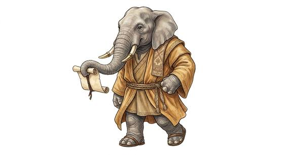

# Pachyderm folk

{.illus}

*Set: Core*

*aka: ______________________________*

*Family: [Pachyderm](../Species_Families/pachyderm.md)*

The great heavy peoples: elephants, rhinoceroses, hippopotamuses and their kin, standing tall on thick legs with hides like cured leather. Some carry trunks that can lift a log or pick a flower; some bear tusks or horns; some are half at home in the river. All of them are big, and all of them know it.

Elephant-folk live long and remember everything, and they gather in matriarchal herds that value wisdom over speed. Rhino-folk are short-sighted, keen-nosed and quick to charge. Hippo-folk are territorial and far more dangerous than their round shape suggests. Some smaller, rounder lines are gentle musicians with enormous ears. Others treat them with respect, and step aside in narrow streets.

## Not to be confused with

the *[bovine folk](ungulate-bovine-folk.md)*, heavy grazers with horns but lighter, cloven-hoofed bodies, lacking the trunk and the leathery thick hide.

## What sets this species apart

No different from the family: it is the family's only species, so the family lines already describe it. Semi-aquatic, trunked, horned and smaller alien builds differ by Breed/Race and are handled there.

## Breeds and races

Each block below is one set of numbers; breeds that share every number share a block (Species rules, rule 9). Attributes are final modifiers, the size trade-off included. Skills, powers and weapon groups are final levels after the family, species and breed layers.

### No. 582 Elephant-folk *(genres: beast-folk: fur; starter)*

- **Size:** huge · **Body:** biped+tailed
- **What it's like:** Big, gentle elephant people with a useful trunk and a memory that never fades. (looks like: elephant; good at: strength, toughness, knowledge)
- **Attributes:** STR +6 AGI −4 END +2 WIS +1
- **Skills:** [Lifting & Carrying](../Skills/lifting-and-carrying.md) +3, [Memory Training](../Skills/memory-training.md) +2, [Insight](../Skills/insight.md) +1, [Intimidation](../Skills/intimidation.md) +1, [Swimming](../Skills/swimming.md) +1, [Acrobatics](../Skills/acrobatics.md) −2, [Stealth](../Skills/stealth.md) −3, [Jumping](../Skills/jumping.md) Foreign Concept, [Riding](../Skills/riding.md) Foreign Concept
- **Powers:** [Toughness](../Powers/toughness.md) 1
- **Weapon groups:** [Wrestling & Grappling](../Weapon_Groups/wrestling-and-grappling.md) +1
- **Natural attacks:** tusks 1d6+3
- **For the Game Master only, this race as an NPC guard or soldier (not your character's numbers):** Attack 14 · Parry 11 · Dodge 2 · Damage tusks 2d6+1; longsword 1d6+5 · Armour 2 · Life 29 · Threat 2 ([Bestiary roles](../bestiary.md))
- *Why:* Long-lived.
- *Note:* Lifespan (long-lived) is a lexicon detail, not a game number.

### Mammoth-folk *(beast)*

- **Size:** huge · **Body:** biped+tailed
- **Attributes:** STR +6 AGI −4 END +2 INT −3 WIS +1
- **Skills:** [Lifting & Carrying](../Skills/lifting-and-carrying.md) +3, [Memory Training](../Skills/memory-training.md) +2, [Survival: Arctic](../Skills/survival-arctic.md) +2, [Insight](../Skills/insight.md) +1, [Intimidation](../Skills/intimidation.md) +1, [Swimming](../Skills/swimming.md) +1, [Acrobatics](../Skills/acrobatics.md) −2, [Stealth](../Skills/stealth.md) −3, [Jumping](../Skills/jumping.md) Foreign Concept, [Riding](../Skills/riding.md) Foreign Concept
- **Powers:** [Resist Element](../Powers/resist-element.md) 1, [Toughness](../Powers/toughness.md) 1
- **Weapon groups:** [Wrestling & Grappling](../Weapon_Groups/wrestling-and-grappling.md) +1
- **Natural attacks:** tusks 1d6+3
- **For the Game Master only, this race as an NPC guard or soldier (not your character's numbers):** Attack 14 · Parry — · Dodge 2 · Damage tusks 2d6+1 · Armour 0 · Life 27 · Threat 1 ([Bestiary roles](../bestiary.md))
- *Why:* A woolly, cold-adapted beast.

### No. 583 Rhinoceros-folk *(genres: beast-folk: fur)*

- **Size:** large · **Body:** biped+tailed
- **What it's like:** Massive, thick-hided rhino folk who charge horn-first and can barely see past their own excellent nose. (looks like: rhino; good at: strength, toughness)
- **Attributes:** STR +4 AGI −3 END +2 COU +1
- **Skills:** [Lifting & Carrying](../Skills/lifting-and-carrying.md) +3, [Memory Training](../Skills/memory-training.md) +2, [Insight](../Skills/insight.md) +1, [Intimidation](../Skills/intimidation.md) +1, [Swimming](../Skills/swimming.md) +1, Perception (attribute) −1, [Acrobatics](../Skills/acrobatics.md) −2, [Stealth](../Skills/stealth.md) −3, [Jumping](../Skills/jumping.md) Foreign Concept, [Riding](../Skills/riding.md) Foreign Concept
- **Powers:** [Enhanced Senses](../Powers/enhanced-senses.md) 2, [Toughness](../Powers/toughness.md) 1
- **Weapon groups:** [Wrestling & Grappling](../Weapon_Groups/wrestling-and-grappling.md) +1
- **Natural attacks:** horns 1d6+3
- **For the Game Master only, this race as an NPC guard or soldier (not your character's numbers):** Attack 14 · Parry 11 · Dodge 4 · Damage horns 2d6; longsword 1d6+5 · Armour 2 · Life 25 · Threat 2 ([Bestiary roles](../bestiary.md))
- *Why:* Horned, with poor eyes but a keen nose.

### No. 584 Hippopotamus-folk *(genres: beast-folk: fur, myth and legend)*

- **Size:** huge · **Body:** biped+tailed
- **What it's like:** Enormous, short-tempered hippo folk who spend half their life in the water and bite harder than almost anyone. (looks like: hippo; good at: strength, swimming)
- **Attributes:** STR +6 AGI −4 END +2 WIS +1 COU +1
- **Skills:** [Lifting & Carrying](../Skills/lifting-and-carrying.md) +3, [Diving](../Skills/diving.md) +2, [Memory Training](../Skills/memory-training.md) +2, [Insight](../Skills/insight.md) +1, [Intimidation](../Skills/intimidation.md) +1, [Swimming](../Skills/swimming.md) +1, [Acrobatics](../Skills/acrobatics.md) −2, [Stealth](../Skills/stealth.md) −3, [Jumping](../Skills/jumping.md) Foreign Concept, [Riding](../Skills/riding.md) Foreign Concept
- **Powers:** [Toughness](../Powers/toughness.md) 1
- **Weapon groups:** [Wrestling & Grappling](../Weapon_Groups/wrestling-and-grappling.md) +1
- **Natural attacks:** bite 1d6+1
- **For the Game Master only, this race as an NPC guard or soldier (not your character's numbers):** Attack 15 · Parry 12 · Dodge 2 · Damage bite 2d6; longsword 1d6+5 · Armour 2 · Life 29 · Threat 2 ([Bestiary roles](../bestiary.md))
- *Why:* Semi-aquatic, walking the river bottom, with a crushing bite.

### Rhino-headed enforcer folk *(NPC only)*

- **Size:** large · **Body:** biped
- **Attributes:** STR +6 AGI −3 END +2 INT −1 WIS +1 CHA −1
- **Skills:** [Lifting & Carrying](../Skills/lifting-and-carrying.md) +3, [Memory Training](../Skills/memory-training.md) +2, [Insight](../Skills/insight.md) +1, [Intimidation](../Skills/intimidation.md) +1, [Law](../Skills/law.md) +1, [Swimming](../Skills/swimming.md) +1, [Acrobatics](../Skills/acrobatics.md) −2, [Stealth](../Skills/stealth.md) −3, [Jumping](../Skills/jumping.md) Foreign Concept, [Riding](../Skills/riding.md) Foreign Concept
- **Powers:** [Toughness](../Powers/toughness.md) 1
- **Weapon groups:** [Wrestling & Grappling](../Weapon_Groups/wrestling-and-grappling.md) +1
- **Natural attacks:** horns 1d6+3
- **For the Game Master only, this race as an NPC guard or soldier (not your character's numbers):** Attack 15 · Parry 12 · Dodge 4 · Damage horns 2d6; longsword 1d6+5 · Armour 2 · Life 25 · Threat 2 ([Bestiary roles](../bestiary.md))
- *Why:* A people of rigid, procedure-bound enforcers.

### No. 585 Round musician folk *(genres: space opera: beast-like aliens)*

- **Size:** small · **Body:** biped
- **What it's like:** Small, round, big-eared folk with sharp hearing and a real gift for music. (looks like: seal; good at: keen senses, people and talk)
- **Attributes:** STR −2 END +2 WIS +1 PER +1 CHA +1
- **Skills:** [Lifting & Carrying](../Skills/lifting-and-carrying.md) +3, [Memory Training](../Skills/memory-training.md) +2, [Insight](../Skills/insight.md) +1, [Instrument (per instrument)](../Skills/instrument-per-instrument.md) +1, [Intimidation](../Skills/intimidation.md) +1, [Swimming](../Skills/swimming.md) +1, [Acrobatics](../Skills/acrobatics.md) −2, [Stealth](../Skills/stealth.md) −3, [Jumping](../Skills/jumping.md) Foreign Concept, [Riding](../Skills/riding.md) Foreign Concept
- **Powers:** [Toughness](../Powers/toughness.md) 1
- **Weapon groups:** [Wrestling & Grappling](../Weapon_Groups/wrestling-and-grappling.md) +1
- **For the Game Master only, this race as an NPC guard or soldier (not your character's numbers):** Attack 13 · Parry 10 · Dodge 9 · Damage longsword 1d6+1 · Armour 2 · Life 19 · Threat 1 ([Bestiary roles](../bestiary.md))
- *Why:* Sensitive-eared and a people of musicians.

### Trunk-snouted folk *(NPC only)*

- **Size:** large · **Body:** biped
- **Attributes:** STR +4 AGI −3 END +2 WIS +1
- **Skills:** [Lifting & Carrying](../Skills/lifting-and-carrying.md) +3, [Memory Training](../Skills/memory-training.md) +2, [Composure](../Skills/composure.md) +1, [Insight](../Skills/insight.md) +1, [Intimidation](../Skills/intimidation.md) +1, [Swimming](../Skills/swimming.md) +1, [Acrobatics](../Skills/acrobatics.md) −2, [Stealth](../Skills/stealth.md) −3, [Jumping](../Skills/jumping.md) Foreign Concept, [Riding](../Skills/riding.md) Foreign Concept
- **Powers:** [Toughness](../Powers/toughness.md) 1
- **Weapon groups:** [Wrestling & Grappling](../Weapon_Groups/wrestling-and-grappling.md) +1
- **For the Game Master only, this race as an NPC guard or soldier (not your character's numbers):** Attack 14 · Parry 11 · Dodge 4 · Damage longsword 1d6+2 · Armour 2 · Life 25 · Threat 2 ([Bestiary roles](../bestiary.md))
- *Why:* Slow and deliberate by temperament.

### Armored siege beast *(beast)*

- **Size:** huge · **Body:** quadruped
- **Attributes:** STR +6 AGI −4 END +2 INT −3 WIS +1
- **Skills:** [Lifting & Carrying](../Skills/lifting-and-carrying.md) +3, [Memory Training](../Skills/memory-training.md) +2, [Insight](../Skills/insight.md) +1, [Intimidation](../Skills/intimidation.md) +1, [Swimming](../Skills/swimming.md) +1, [Acrobatics](../Skills/acrobatics.md) −2, [Stealth](../Skills/stealth.md) −3, [Jumping](../Skills/jumping.md) Foreign Concept, [Riding](../Skills/riding.md) Foreign Concept
- **Powers:** [Armour Skin](../Powers/armour-skin.md) 2, [Toughness](../Powers/toughness.md) 1
- **Weapon groups:** [Wrestling & Grappling](../Weapon_Groups/wrestling-and-grappling.md) +1
- **Natural attacks:** stomp 1d6+2
- **For the Game Master only, this race as an NPC guard or soldier (not your character's numbers):** Attack 14 · Parry — · Dodge 2 · Damage stomp 2d6 · Armour 1 · Life 27 · Threat 2 ([Bestiary roles](../bestiary.md))
- *Why:* A living siege-shield with armoured hide.

