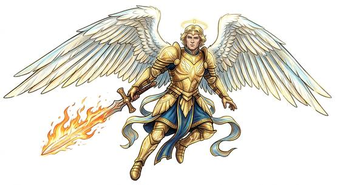

# Celestial-kind

{.illus}

*Set: Core*

*aka: ______________________________*

*Family: [Planar](../Species_Families/planar.md)*

Servants of order and light from the realms above the mortal world. They take many forms: tall winged warriors wrapped in radiance, masked spirits who dance at the edge of ceremony, calm beings who were present when the world was shaped, and warrior-maidens who ride over battlefields to choose the fallen. Their voices carry, their eyes seem to see further than eyes should, and the air around them feels clean.

They live very long, some forever, and most serve a higher purpose they rarely explain. Lies trouble them; they struggle to tell one and struggle to forgive one. Mortals greet them with awe, and sometimes with terror, because a being sent by the heavens is rarely sent to make anyone comfortable.

## Not to be confused with

the *[infernal/demonic-kind](planar-infernal-demonic-kind.md)*, their opposites from the realms below, who deceive easily and are at home in fire.

## What sets this species apart

Order-aligned divine servants: steeped in the sacred, radiant and long-lived, and ill at ease with lies. Flight is Set only for the winged breeds, at Breed/Race level. Lifespan (long-lived) is a lexicon detail, not a game number.

## Breeds and races

Each block below is one set of numbers; breeds that share every number share a block (Species rules, rule 9). Attributes are final modifiers, the size trade-off included. Skills, powers and weapon groups are final levels after the family, species and breed layers.

### No. 586 Radiant angel *(high-power: Game Master's approval; genres: heavens, hells and other planes; starter)*

- **Size:** medium · **Body:** biped+winged
- **What it's like:** A winged being of holy light who fights for goodness and order. (looks like: angel; good at: flying, powers and magic, healing)
- **Attributes:** END −1 WIS +1 CHA +2
- **Skills:** [Religion & Theology](../Skills/religion-and-theology.md) +3, [Otherworldly Dealings](../Skills/otherworldly-dealings.md) +2, [Arcana](../Skills/arcana.md) +1, [Cultures & Customs](../Skills/cultures-and-customs.md) −1, [Deception](../Skills/deception.md) −1, [Local Lore](../Skills/local-lore.md) −2
- **Powers:** [Detect Intent](../Powers/detect-intent.md) 2, [Flight](../Powers/flight.md) 2, [Radiant Smite](../Powers/radiant-smite.md) 2, [Blessing](../Powers/blessing.md) 1, [Tongues](../Powers/tongues.md) 1
- **For the Game Master only, this race as an NPC guard or soldier (not your character's numbers):** Attack 14 · Parry 11 · Dodge 8 · Damage longsword 1d6+2 · Armour 2 · Life 16 · Threat 1 ([Bestiary roles](../bestiary.md))
- *Why:* A winged, immortal angel of light with radiant magic.
- *Note:* Lifespan (very long-lived) is a lexicon detail, not a game number. High-power (Game Master's approval): suits super-powered or mythic campaigns.

### World-shaping angelic spirit *(NPC only; NPC-scale)*

- **Size:** medium · **Body:** biped
- **Attributes:** END −1 INT +3 WIS +3 CHA +4
- **Skills:** [Religion & Theology](../Skills/religion-and-theology.md) +3, [Otherworldly Dealings](../Skills/otherworldly-dealings.md) +2, [Arcana](../Skills/arcana.md) +1, [Cultures & Customs](../Skills/cultures-and-customs.md) −1, [Deception](../Skills/deception.md) −1, [Local Lore](../Skills/local-lore.md) −2
- **Powers:** [Cosmic Awareness](../Powers/cosmic-awareness.md) 3, [Detect Intent](../Powers/detect-intent.md) 2, [Self-Alteration](../Powers/self-alteration.md) 2, [Blessing](../Powers/blessing.md) 1, [Tongues](../Powers/tongues.md) 1
- **For the Game Master only, this race as an NPC guard or soldier (not your character's numbers):** Attack 14 · Parry 11 · Dodge 8 · Damage longsword 1d6+2 · Armour 2 · Life 16 · Threat 1 ([Bestiary roles](../bestiary.md))
- *Why:* A spirit from the world's making that takes bodily shape at will, with vast knowledge.
- *Note:* NPC-scale. Lifespan (ageless or immortal) is a lexicon detail, not a game number.

### Incarnate faith-spirit angel *(NPC only)*

- **Size:** large · **Body:** biped+winged
- **Attributes:** STR +2 AGI −2 END −1 WIS +1 CHA +4 COU +2
- **Skills:** [Religion & Theology](../Skills/religion-and-theology.md) +3, [Otherworldly Dealings](../Skills/otherworldly-dealings.md) +2, [Arcana](../Skills/arcana.md) +1, [Cultures & Customs](../Skills/cultures-and-customs.md) −1, [Deception](../Skills/deception.md) −1, [Local Lore](../Skills/local-lore.md) −2
- **Powers:** [Radiant Smite](../Powers/radiant-smite.md) 3, [Detect Intent](../Powers/detect-intent.md) 2, [Flight](../Powers/flight.md) 2, [Blessing](../Powers/blessing.md) 1, [Tongues](../Powers/tongues.md) 1
- **For the Game Master only, this race as an NPC guard or soldier (not your character's numbers):** Attack 14 · Parry 11 · Dodge 5 · Damage longsword 1d6+2 · Armour 2 · Life 20 · Threat 1 ([Bestiary roles](../bestiary.md))
- *Why:* A winged being of pure faith with vast radiant power held back by strict rules.
- *Note:* Non-interference rules limit when it may act.

### Dual-aspect ordered spirit *(NPC only)*

- **Size:** medium · **Body:** biped+winged
- **Attributes:** END −1 WIS +1 CHA +2
- **Skills:** [Religion & Theology](../Skills/religion-and-theology.md) +3, [Otherworldly Dealings](../Skills/otherworldly-dealings.md) +2, [Arcana](../Skills/arcana.md) +1, [Cultures & Customs](../Skills/cultures-and-customs.md) −1, [Deception](../Skills/deception.md) −1, [Local Lore](../Skills/local-lore.md) −2
- **Powers:** [Detect Intent](../Powers/detect-intent.md) 2, [Flight](../Powers/flight.md) 2, [Blessing](../Powers/blessing.md) 1, [Tongues](../Powers/tongues.md) 1
- **For the Game Master only, this race as an NPC guard or soldier (not your character's numbers):** Attack 14 · Parry 11 · Dodge 8 · Damage longsword 1d6+2 · Armour 2 · Life 16 · Threat 1 ([Bestiary roles](../bestiary.md))
- *Why:* A winged spirit of order with little combat power.

### No. 587 Masked kachina spirit *(genres: myth and legend)*

- **Size:** medium · **Body:** biped
- **What it's like:** Masked ancestor-spirits who step between people and the divine, blessing those who hold the right ceremony. (looks like: ghost; good at: powers and magic, people and talk)
- **Attributes:** END −1 WIS +1 CHA +2
- **Skills:** [Religion & Theology](../Skills/religion-and-theology.md) +3, [Otherworldly Dealings](../Skills/otherworldly-dealings.md) +2, [Arcana](../Skills/arcana.md) +1, [Dance](../Skills/dance.md) +1, [Ritual & Liturgy](../Skills/ritual-and-liturgy.md) +1, [Cultures & Customs](../Skills/cultures-and-customs.md) −1, [Deception](../Skills/deception.md) −1, [Local Lore](../Skills/local-lore.md) −2
- **Powers:** [Detect Intent](../Powers/detect-intent.md) 2, [Blessing](../Powers/blessing.md) 1, [Tongues](../Powers/tongues.md) 1
- **For the Game Master only, this race as an NPC guard or soldier (not your character's numbers):** Attack 14 · Parry 11 · Dodge 8 · Damage longsword 1d6+2 · Armour 2 · Life 16 · Threat 1 ([Bestiary roles](../bestiary.md))
- *Why:* A masked ancestral spirit who mediates between people and the divine in ceremony.

### No. 588 War-choosing valkyrie *(high-power: Game Master's approval; genres: myth and legend)*

- **Size:** medium · **Body:** biped+winged
- **What it's like:** Winged warrior-women of the divine who choose who falls in battle and fly the honoured dead to the next world. (looks like: human with wings; good at: flying, fighting)
- **Attributes:** STR +1 END −1 WIS +1 CHA +2
- **Skills:** [Religion & Theology](../Skills/religion-and-theology.md) +3, [Otherworldly Dealings](../Skills/otherworldly-dealings.md) +2, [Arcana](../Skills/arcana.md) +1, [Riding](../Skills/riding.md) +1, [Cultures & Customs](../Skills/cultures-and-customs.md) −1, [Deception](../Skills/deception.md) −1, [Local Lore](../Skills/local-lore.md) −2
- **Powers:** [Detect Intent](../Powers/detect-intent.md) 2, [Flight](../Powers/flight.md) 2, [Guide of Souls](../Powers/guide-of-souls.md) 2, [Blessing](../Powers/blessing.md) 1, [Tongues](../Powers/tongues.md) 1
- **For the Game Master only, this race as an NPC guard or soldier (not your character's numbers):** Attack 14 · Parry 11 · Dodge 8 · Damage longsword 1d6+2 · Armour 2 · Life 16 · Threat 1 ([Bestiary roles](../bestiary.md))
- *Why:* A winged warrior-rider who chooses the slain and leads them onward.
- *Note:* High-power (Game Master's approval): suits super-powered or mythic campaigns.

### No. 589 Deva (radiant celestial) *(genres: heavens, hells and other planes, myth and legend)*

- **Size:** medium · **Body:** biped
- **What it's like:** Glowing, kindly celestial beings, immensely long-lived and able to strike with pure light. (looks like: angel; good at: powers and magic, people and talk)
- **Attributes:** END −1 WIS +1 CHA +2
- **Skills:** [Religion & Theology](../Skills/religion-and-theology.md) +3, [Otherworldly Dealings](../Skills/otherworldly-dealings.md) +2, [Arcana](../Skills/arcana.md) +1, [Cultures & Customs](../Skills/cultures-and-customs.md) −1, [Deception](../Skills/deception.md) −1, [Local Lore](../Skills/local-lore.md) −2
- **Powers:** [Detect Intent](../Powers/detect-intent.md) 2, [Radiant Smite](../Powers/radiant-smite.md) 2, [Blessing](../Powers/blessing.md) 1, [Tongues](../Powers/tongues.md) 1
- **For the Game Master only, this race as an NPC guard or soldier (not your character's numbers):** Attack 14 · Parry 11 · Dodge 8 · Damage longsword 1d6+2 · Armour 2 · Life 16 · Threat 1 ([Bestiary roles](../bestiary.md))
- *Why:* Wingless, radiant and long-lived but not immortal.

