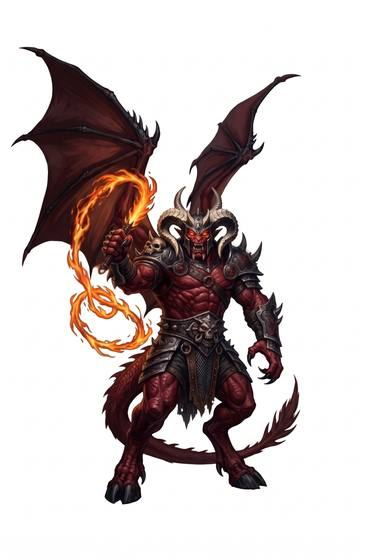

# Infernal/demonic-kind

{.illus}

*Set: Expansion*

*aka: ______________________________*

*Family: [Planar](../Species_Families/planar.md)*

The hellish outsiders. Some are hulking brutes, some crafty dealmakers in fine clothes, some swarming imps no bigger than a cat. Most have horns, many have tails, and all of them carry a faint whiff of smoke and brimstone. Fire does not trouble them; they were born in it.

They are cunning, patient and cruel, and above all they lie. A demon's word is a trap laid with care, and a devil's contract says exactly what it says and nothing more. Their greatest lords are ancient beings of terrible power who command legions and bargain for souls. Their least are errand-runners summoned by foolish wizards. A few of their offspring have turned against their own kind and walk among mortals, filing their horns flat and trying hard to be trusted.

## Not to be confused with

the *[celestial-kind](planar-celestial-kind.md)*, servants of order and light from above, who cannot lie easily and have no love of fire.

## What sets this species apart

Hellish outsiders: fearsome, deceitful and at home in fire. Resist Element is fire; cold-aligned breeds (e.g. the snow demon) swap the element at Breed/Race level. NPC-scale lords set their key powers at Breed/Race level.

## Breeds and races

Each block below is one set of numbers; breeds that share every number share a block (Species rules, rule 9). Attributes are final modifiers, the size trade-off included. Skills, powers and weapon groups are final levels after the family, species and breed layers.

### Devil-blooded outsider *(NPC-scale)*

- **Size:** medium · **Body:** biped+tailed
- **Attributes:** END −1 INT +1 WIS +1 CHA +1 COU +1
- **Skills:** [Intimidation](../Skills/intimidation.md) +2, [Otherworldly Dealings](../Skills/otherworldly-dealings.md) +2, [Religion & Theology](../Skills/religion-and-theology.md) +2, [Arcana](../Skills/arcana.md) +1, [Charm & Seduction](../Skills/charm-and-seduction.md) +1, [Deception](../Skills/deception.md) +1, [Cultures & Customs](../Skills/cultures-and-customs.md) −1, [Local Lore](../Skills/local-lore.md) −2
- **Powers:** [Detect Intent](../Powers/detect-intent.md) 2, [Resist Element](../Powers/resist-element.md) 2, [Tongues](../Powers/tongues.md) 1
- **For the Game Master only, this race as an NPC guard or soldier (not your character's numbers):** Attack 14 · Parry 11 · Dodge 8 · Damage longsword 1d6+2 · Armour 2 · Life 16 · Threat 1 ([Bestiary roles](../bestiary.md))
- *Why:* Devil-blooded mortals with a fiendish charm.

### True devil (lawful evil outsider) *(NPC only; NPC-scale)*

- **Size:** medium · **Body:** biped
- **Attributes:** INT +2 WIS +1 CHA +1 COU +1
- **Skills:** [Intimidation](../Skills/intimidation.md) +2, [Otherworldly Dealings](../Skills/otherworldly-dealings.md) +2, [Religion & Theology](../Skills/religion-and-theology.md) +2, [Arcana](../Skills/arcana.md) +1, [Deception](../Skills/deception.md) +1, [Law](../Skills/law.md) +1, [Cultures & Customs](../Skills/cultures-and-customs.md) −1, [Local Lore](../Skills/local-lore.md) −2
- **Powers:** [Resist Element](../Powers/resist-element.md) 3, [Detect Intent](../Powers/detect-intent.md) 2, [Pact](../Powers/pact.md) 2, [Tongues](../Powers/tongues.md) 1
- **For the Game Master only, this race as an NPC guard or soldier (not your character's numbers):** Attack 14 · Parry 11 · Dodge 8 · Damage longsword 1d6+2 · Armour 2 · Life 17 · Threat 1 ([Bestiary roles](../bestiary.md))
- *Why:* Bound by hierarchy and contract, and immune to fire.
- *Note:* Resist Element is fire.

### Chaotic evil outsider (demon) *(NPC only; NPC-scale)*

- **Size:** large · **Body:** biped
- **Attributes:** STR +3 AGI −2 END +1 INT −2 WIS −1 CHA +1 COU +1
- **Skills:** [Intimidation](../Skills/intimidation.md) +2, [Otherworldly Dealings](../Skills/otherworldly-dealings.md) +2, [Religion & Theology](../Skills/religion-and-theology.md) +2, [Arcana](../Skills/arcana.md) +1, [Deception](../Skills/deception.md) +1, [Cultures & Customs](../Skills/cultures-and-customs.md) −1, [Local Lore](../Skills/local-lore.md) −2
- **Powers:** [Battle Fury](../Powers/battle-fury.md) 2, [Detect Intent](../Powers/detect-intent.md) 2, [Healing Factor](../Powers/healing-factor.md) 2, [Resist Element](../Powers/resist-element.md) 2, [Tongues](../Powers/tongues.md) 1
- **For the Game Master only, this race as an NPC guard or soldier (not your character's numbers):** Attack 14 · Parry 11 · Dodge 5 · Damage longsword 1d6+2 · Armour 2 · Life 22 · Threat 2 ([Bestiary roles](../bestiary.md))
- *Why:* A feral, regenerating demon of destructive rage.

### Fallen fire-demon spirit *(NPC only; NPC-scale)*

- **Size:** huge · **Body:** biped+winged
- **Attributes:** STR +6 AGI −4 END −1 WIS +1 CHA +1 COU +3
- **Skills:** [Intimidation](../Skills/intimidation.md) +2, [Otherworldly Dealings](../Skills/otherworldly-dealings.md) +2, [Religion & Theology](../Skills/religion-and-theology.md) +2, [Arcana](../Skills/arcana.md) +1, [Deception](../Skills/deception.md) +1, [Cultures & Customs](../Skills/cultures-and-customs.md) −1, [Local Lore](../Skills/local-lore.md) −2
- **Powers:** [Elemental Aura](../Powers/elemental-aura.md) 3, [Resist Element](../Powers/resist-element.md) 3, [Detect Intent](../Powers/detect-intent.md) 2, [Fear](../Powers/fear.md) 2, [Tongues](../Powers/tongues.md) 1
- **For the Game Master only, this race as an NPC guard or soldier (not your character's numbers):** Attack 15 · Parry 12 · Dodge 2 · Damage longsword 1d6+2 · Armour 2 · Life 24 · Threat 2 ([Bestiary roles](../bestiary.md))
- *Why:* A fallen spirit wreathed in fire and shadow with a terrifying aura.
- *Note:* NPC-scale. Elemental Aura and Resist Element are fire.

### Lord of darkness *(NPC only; NPC-scale)*

- **Size:** huge · **Body:** biped+horned
- **Attributes:** STR +4 AGI −4 END −1 WIS +1 CHA +3 COU +3
- **Skills:** [Intimidation](../Skills/intimidation.md) +2, [Otherworldly Dealings](../Skills/otherworldly-dealings.md) +2, [Religion & Theology](../Skills/religion-and-theology.md) +2, [Arcana](../Skills/arcana.md) +1, [Deception](../Skills/deception.md) +1, [Cultures & Customs](../Skills/cultures-and-customs.md) −1, [Local Lore](../Skills/local-lore.md) −2
- **Powers:** [Darkness](../Powers/darkness.md) 3, [Detect Intent](../Powers/detect-intent.md) 2, [Fear](../Powers/fear.md) 2, [Resist Element](../Powers/resist-element.md) 2, [Tongues](../Powers/tongues.md) 1
- **Natural attacks:** horns 1d6+3
- **For the Game Master only, this race as an NPC guard or soldier (not your character's numbers):** Attack 15 · Parry 12 · Dodge 2 · Damage horns 2d6+1; longsword 1d6+5 · Armour 2 · Life 24 · Threat 2 ([Bestiary roles](../bestiary.md))
- *Why:* A demon lord who embodies darkness and dread.
- *Note:* NPC-scale.

### Half-demon paranormal investigator *(NPC-scale)*

- **Size:** large · **Body:** biped+horned
- **Attributes:** STR +4 AGI −2 END −1 WIS +1 COU +1
- **Skills:** [Intimidation](../Skills/intimidation.md) +2, [Otherworldly Dealings](../Skills/otherworldly-dealings.md) +2, [Religion & Theology](../Skills/religion-and-theology.md) +2, [Arcana](../Skills/arcana.md) +1, [Deception](../Skills/deception.md) +1
- **Powers:** [Detect Intent](../Powers/detect-intent.md) 2, [Resist Element](../Powers/resist-element.md) 2, [Toughness](../Powers/toughness.md) 2, [Tongues](../Powers/tongues.md) 1
- **Natural attacks:** stone fist 1d6+1
- **For the Game Master only, this race as an NPC guard or soldier (not your character's numbers):** Attack 15 · Parry 12 · Dodge 5 · Damage longsword 1d6+2; stone fist 1d6+4 · Armour 2 · Life 24 · Threat 2 ([Bestiary roles](../bestiary.md))
- *Why:* Raised among humans, so not a stranger to mortal life; his stone hand strikes with immense force.
- *Note:* The stone fist is his stone right hand.

### Sealed ward-bound demon *(NPC only; NPC-scale)*

- **Size:** varies · **Body:** biped
- **Attributes:** END −1 WIS +1 CHA +1 COU +1
- **Skills:** [Intimidation](../Skills/intimidation.md) +2, [Otherworldly Dealings](../Skills/otherworldly-dealings.md) +2, [Religion & Theology](../Skills/religion-and-theology.md) +2, [Arcana](../Skills/arcana.md) +1, [Deception](../Skills/deception.md) +1, [Cultures & Customs](../Skills/cultures-and-customs.md) −1, [Local Lore](../Skills/local-lore.md) −2
- **Powers:** [Detect Intent](../Powers/detect-intent.md) 2, [Resist Element](../Powers/resist-element.md) 2, [Tongues](../Powers/tongues.md) 1
- **For the Game Master only, this race as an NPC guard or soldier (not your character's numbers):** Attack 14 · Parry 11 · Dodge 8 · Damage longsword 1d6+2 · Armour 2 · Life 16 · Threat 1 ([Bestiary roles](../bestiary.md))
- *Note:* Forms vary; being sealed away is story, not a line.

### Div demon *(NPC only; NPC-scale)*

- **Size:** large · **Body:** biped
- **Attributes:** STR +3 AGI −2 END −1 INT −1 WIS +1 CHA +1 COU +1
- **Skills:** [Intimidation](../Skills/intimidation.md) +2, [Otherworldly Dealings](../Skills/otherworldly-dealings.md) +2, [Religion & Theology](../Skills/religion-and-theology.md) +2, [Arcana](../Skills/arcana.md) +1, [Deception](../Skills/deception.md) +1, [Cultures & Customs](../Skills/cultures-and-customs.md) −1, [Local Lore](../Skills/local-lore.md) −2
- **Powers:** [Detect Intent](../Powers/detect-intent.md) 2, [Resist Element](../Powers/resist-element.md) 2, [Tongues](../Powers/tongues.md) 1
- **Natural attacks:** horns 1d6+3, tusks 1d6+3
- **For the Game Master only, this race as an NPC guard or soldier (not your character's numbers):** Attack 14 · Parry 11 · Dodge 5 · Damage horns 2d6; tusks 1d6+6 · Armour 2 · Life 20 · Threat 2 ([Bestiary roles](../bestiary.md))
- *Why:* Horned and tusked.

### Descending star demon *(NPC only; NPC-scale)*

- **Size:** large · **Body:** biped
- **Attributes:** STR +2 AGI −2 END −1 WIS +1 CHA +1 COU +1
- **Skills:** [Intimidation](../Skills/intimidation.md) +2, [Otherworldly Dealings](../Skills/otherworldly-dealings.md) +2, [Religion & Theology](../Skills/religion-and-theology.md) +2, [Arcana](../Skills/arcana.md) +1, [Deception](../Skills/deception.md) +1, [Cultures & Customs](../Skills/cultures-and-customs.md) −1, [Local Lore](../Skills/local-lore.md) −2
- **Powers:** [Darkness](../Powers/darkness.md) 2, [Detect Intent](../Powers/detect-intent.md) 2, [Resist Element](../Powers/resist-element.md) 2, [Tongues](../Powers/tongues.md) 1
- **For the Game Master only, this race as an NPC guard or soldier (not your character's numbers):** Attack 14 · Parry 11 · Dodge 5 · Damage longsword 1d6+2 · Armour 2 · Life 20 · Threat 1 ([Bestiary roles](../bestiary.md))
- *Why:* A skeletal sky-demon that darkens the sun and moon in eclipse.

### Lesser demon *(NPC only; NPC-scale)*

- **Size:** small · **Body:** biped+tailed
- **Attributes:** STR −2 AGI +2 END −1 WIS +1 CHA +1 COU +1
- **Skills:** [Otherworldly Dealings](../Skills/otherworldly-dealings.md) +2, [Religion & Theology](../Skills/religion-and-theology.md) +2, [Arcana](../Skills/arcana.md) +1, [Deception](../Skills/deception.md) +1, [Cultures & Customs](../Skills/cultures-and-customs.md) −1, [Local Lore](../Skills/local-lore.md) −2
- **Powers:** [Detect Intent](../Powers/detect-intent.md) 2, [Resist Element](../Powers/resist-element.md) 2, [Tongues](../Powers/tongues.md) 1
- **For the Game Master only, this race as an NPC guard or soldier (not your character's numbers):** Attack 14 · Parry 11 · Dodge 11 · Damage longsword 1d6+1 · Armour 2 · Life 14 · Threat 1 ([Bestiary roles](../bestiary.md))
- *Why:* A small, weak imp-like demon with a leaning toward shadow.
- *Note:* Shadow Shaping is affinity.

### Greater demon *(NPC-scale)*

- **Size:** large · **Body:** biped+winged
- **Attributes:** STR +2 AGI −2 END −1 INT +1 WIS +1 CHA +1 COU +1
- **Skills:** [Intimidation](../Skills/intimidation.md) +2, [Otherworldly Dealings](../Skills/otherworldly-dealings.md) +2, [Religion & Theology](../Skills/religion-and-theology.md) +2, [Arcana](../Skills/arcana.md) +1, [Deception](../Skills/deception.md) +1, [Cultures & Customs](../Skills/cultures-and-customs.md) −1, [Local Lore](../Skills/local-lore.md) −2
- **Powers:** [Detect Intent](../Powers/detect-intent.md) 2, [Fire Blast](../Powers/fire-blast.md) 2, [Flight](../Powers/flight.md) 2, [Resist Element](../Powers/resist-element.md) 2, [Tongues](../Powers/tongues.md) 1
- **Natural attacks:** horns 1d6+3
- **For the Game Master only, this race as an NPC guard or soldier (not your character's numbers):** Attack 14 · Parry 11 · Dodge 5 · Damage longsword 1d6+2; horns 1d6+4 · Armour 2 · Life 20 · Threat 1 ([Bestiary roles](../bestiary.md))
- *Why:* A winged, ancient demon of fire magic.
- *Note:* Lifespan (very long-lived) is a lexicon detail, not a game number.

### Minor scamp/imp servant *(NPC only; NPC-scale)*

- **Size:** small · **Body:** biped+tailed
- **Attributes:** STR −2 AGI +2 END −1 WIS +1 CHA +1 COU −1
- **Skills:** [Otherworldly Dealings](../Skills/otherworldly-dealings.md) +2, [Religion & Theology](../Skills/religion-and-theology.md) +2, [Arcana](../Skills/arcana.md) +1, [Deception](../Skills/deception.md) +1, [Composure](../Skills/composure.md) −1, [Cultures & Customs](../Skills/cultures-and-customs.md) −1, [Local Lore](../Skills/local-lore.md) −2
- **Powers:** [Detect Intent](../Powers/detect-intent.md) 2, [Resist Element](../Powers/resist-element.md) 2, [Fire Blast](../Powers/fire-blast.md) 1, [Tongues](../Powers/tongues.md) 1
- **For the Game Master only, this race as an NPC guard or soldier (not your character's numbers):** Attack 13 · Parry 10 · Dodge 11 · Damage longsword 1d6+1 · Armour 2 · Life 14 · Threat 1 ([Bestiary roles](../bestiary.md))
- *Why:* A weak, cowardly summoned servant with a little fire magic.

### Large infernal shock-troop *(NPC only; NPC-scale)*

- **Size:** large · **Body:** biped
- **Attributes:** STR +4 AGI −2 END −1 INT −2 WIS +1 CHA +1 COU +1
- **Skills:** [Intimidation](../Skills/intimidation.md) +2, [Otherworldly Dealings](../Skills/otherworldly-dealings.md) +2, [Religion & Theology](../Skills/religion-and-theology.md) +2, [Arcana](../Skills/arcana.md) +1, [Cultures & Customs](../Skills/cultures-and-customs.md) −1, [Local Lore](../Skills/local-lore.md) −2
- **Powers:** [Detect Intent](../Powers/detect-intent.md) 2, [Resist Element](../Powers/resist-element.md) 2, [Fire Blast](../Powers/fire-blast.md) 1, [Tongues](../Powers/tongues.md) 1
- **For the Game Master only, this race as an NPC guard or soldier (not your character's numbers):** Attack 15 · Parry 12 · Dodge 5 · Damage longsword 1d6+2 · Armour 2 · Life 20 · Threat 2 ([Bestiary roles](../bestiary.md))
- *Why:* A brutish melee demon with a little fire magic and no guile.

### Elemental snow demon *(NPC only; NPC-scale)*

- **Size:** medium · **Body:** biped
- **Attributes:** END −1 WIS +1 CHA +1 COU +1
- **Skills:** [Intimidation](../Skills/intimidation.md) +2, [Otherworldly Dealings](../Skills/otherworldly-dealings.md) +2, [Religion & Theology](../Skills/religion-and-theology.md) +2, [Survival: Arctic](../Skills/survival-arctic.md) +2, [Arcana](../Skills/arcana.md) +1, [Deception](../Skills/deception.md) +1, [Cultures & Customs](../Skills/cultures-and-customs.md) −1, [Local Lore](../Skills/local-lore.md) −2
- **Powers:** [Detect Intent](../Powers/detect-intent.md) 2, [Resist Element](../Powers/resist-element.md) 2, [Tongues](../Powers/tongues.md) 1
- **For the Game Master only, this race as an NPC guard or soldier (not your character's numbers):** Attack 14 · Parry 11 · Dodge 8 · Damage longsword 1d6+2 · Armour 2 · Life 16 · Threat 1 ([Bestiary roles](../bestiary.md))
- *Why:* Cold-aligned instead of fire-aligned, from frozen lands.
- *Note:* Resist Element is cold, not fire (species note). Cold Blast is affinity.

### Utukku demon *(NPC only; NPC-scale)*

- **Size:** medium · **Body:** incorporeal
- **Attributes:** STR −3 END −1 WIS +1 CHA +1 COU +1
- **Skills:** [Intimidation](../Skills/intimidation.md) +2, [Otherworldly Dealings](../Skills/otherworldly-dealings.md) +2, [Religion & Theology](../Skills/religion-and-theology.md) +2, [Arcana](../Skills/arcana.md) +1, [Deception](../Skills/deception.md) +1, [Cultures & Customs](../Skills/cultures-and-customs.md) −1, [Local Lore](../Skills/local-lore.md) −2
- **Powers:** [Detect Intent](../Powers/detect-intent.md) 2, [Etherealness](../Powers/etherealness.md) 2, [Resist Element](../Powers/resist-element.md) 2, [Plane Shift](../Powers/plane-shift.md) 1, [Tongues](../Powers/tongues.md) 1
- **For the Game Master only, this race as an NPC guard or soldier (not your character's numbers):** Attack 13 · Parry — · Dodge 8 · Damage slam 1d4 · Armour 0 · Life 14 · Threat minor ([Bestiary roles](../bestiary.md))
- *Why:* A bodiless spirit-demon that roams between worlds.
- *Note:* Some are protective; temperament is not a line. No hands: held weapons unusable.

### Royal deformed offshoot *(NPC only; NPC-scale)*

- **Size:** medium · **Body:** biped+winged
- **Attributes:** END −1 WIS +1 CHA +1 COU +1
- **Skills:** [Intimidation](../Skills/intimidation.md) +2, [Otherworldly Dealings](../Skills/otherworldly-dealings.md) +2, [Religion & Theology](../Skills/religion-and-theology.md) +2, [Arcana](../Skills/arcana.md) +1, [Deception](../Skills/deception.md) +1, [Cultures & Customs](../Skills/cultures-and-customs.md) −1, [Local Lore](../Skills/local-lore.md) −2
- **Powers:** [Detect Intent](../Powers/detect-intent.md) 2, [Resist Element](../Powers/resist-element.md) 2, [Flight](../Powers/flight.md) 1, [Tongues](../Powers/tongues.md) 1
- **For the Game Master only, this race as an NPC guard or soldier (not your character's numbers):** Attack 14 · Parry 11 · Dodge 8 · Damage longsword 1d6+2 · Armour 2 · Life 16 · Threat 1 ([Bestiary roles](../bestiary.md))
- *Why:* A royal-born offshoot with horns and small wings.
- *Note:* Weak flight. Its latent great power is a story matter for the GM.

### Resurrected hellspawn soldier *(NPC-scale)*

- **Size:** medium · **Body:** biped+tailed
- **Attributes:** STR +1 END −1 WIS +1 CHA +1 COU +1
- **Skills:** [Intimidation](../Skills/intimidation.md) +2, [Otherworldly Dealings](../Skills/otherworldly-dealings.md) +2, [Religion & Theology](../Skills/religion-and-theology.md) +2, [Arcana](../Skills/arcana.md) +1, [Deception](../Skills/deception.md) +1, [Cultures & Customs](../Skills/cultures-and-customs.md) −1, [Local Lore](../Skills/local-lore.md) −2
- **Powers:** [Healing Factor](../Powers/healing-factor.md) 3, [Conjure Weapon & Armour](../Powers/conjure-weapon-and-armour.md) 2, [Detect Intent](../Powers/detect-intent.md) 2, [Resist Element](../Powers/resist-element.md) 2, [Monstrous Form](../Powers/monstrous-form.md) 1, [Tongues](../Powers/tongues.md) 1
- **For the Game Master only, this race as an NPC guard or soldier (not your character's numbers):** Attack 14 · Parry 11 · Dodge 8 · Damage longsword 1d6+2 · Armour 2 · Life 16 · Threat 1 ([Bestiary roles](../bestiary.md))
- *Why:* A dead soldier raised with fast regeneration, a living weapon and a monstrous stress form.
- *Note:* All three draw on a finite necroplasm reserve; Monstrous Form triggers under stress. Conjure Weapon & Armour is the living cape and chains.

### Feral mutated hellspawn *(NPC only; NPC-scale)*

- **Size:** huge · **Body:** biped+tailed
- **Attributes:** STR +5 AGI −4 INT −3 WIS −1 CHA +1 COU +1
- **Skills:** [Intimidation](../Skills/intimidation.md) +2, [Otherworldly Dealings](../Skills/otherworldly-dealings.md) +2, [Religion & Theology](../Skills/religion-and-theology.md) +2, [Arcana](../Skills/arcana.md) +1, [Deception](../Skills/deception.md) +1, [Cultures & Customs](../Skills/cultures-and-customs.md) −1, [Composure](../Skills/composure.md) −2, [Local Lore](../Skills/local-lore.md) −2
- **Powers:** [Detect Intent](../Powers/detect-intent.md) 2, [Healing Factor](../Powers/healing-factor.md) 2, [Resist Element](../Powers/resist-element.md) 2, [Tongues](../Powers/tongues.md) 1
- **Natural attacks:** claws 1d6+1, bite 1d6+1
- **For the Game Master only, this race as an NPC guard or soldier (not your character's numbers):** Attack 14 · Parry 11 · Dodge 2 · Damage claws 2d6; bite 1d6+6 · Armour 2 · Life 25 · Threat 2 ([Bestiary roles](../bestiary.md))
- *Why:* A hellspawn overrun by bestial mutation: clawed, regenerating and losing its reason.

### Infernal legion overlord *(NPC only; NPC-scale)*

- **Size:** huge · **Body:** biped+winged+tailed
- **Attributes:** STR +4 AGI −4 END −1 INT +1 WIS +1 CHA +3 COU +2
- **Skills:** [Intimidation](../Skills/intimidation.md) +2, [Leadership](../Skills/leadership.md) +2, [Otherworldly Dealings](../Skills/otherworldly-dealings.md) +2, [Religion & Theology](../Skills/religion-and-theology.md) +2, [Arcana](../Skills/arcana.md) +1, [Deception](../Skills/deception.md) +1, [Cultures & Customs](../Skills/cultures-and-customs.md) −1, [Local Lore](../Skills/local-lore.md) −2
- **Powers:** [Summon Creature](../Powers/summon-creature.md) 3, [Detect Intent](../Powers/detect-intent.md) 2, [Flight](../Powers/flight.md) 2, [Resist Element](../Powers/resist-element.md) 2, [Tongues](../Powers/tongues.md) 1
- **Natural attacks:** horns 1d6+3, tail 1d6+1
- **For the Game Master only, this race as an NPC guard or soldier (not your character's numbers):** Attack 14 · Parry 11 · Dodge 2 · Damage horns 2d6+1; tail 1d6+6 · Armour 2 · Life 24 · Threat 2 ([Bestiary roles](../bestiary.md))
- *Why:* A winged overlord who commands hellspawn legions.
- *Note:* NPC-scale. Summon Creature calls its legions.

### Wish-granting dungeon demon *(NPC only; NPC-scale)*

- **Size:** large · **Body:** biped+tailed
- **Attributes:** STR +2 AGI −2 END −1 INT +1 WIS +1 CHA +2 COU +1
- **Skills:** [Intimidation](../Skills/intimidation.md) +2, [Otherworldly Dealings](../Skills/otherworldly-dealings.md) +2, [Religion & Theology](../Skills/religion-and-theology.md) +2, [Arcana](../Skills/arcana.md) +1, [Deception](../Skills/deception.md) +1, [Cultures & Customs](../Skills/cultures-and-customs.md) −1, [Local Lore](../Skills/local-lore.md) −2
- **Powers:** [Wish Granting](../Powers/wish-granting.md) 3, [Detect Intent](../Powers/detect-intent.md) 2, [Pocket Realm](../Powers/pocket-realm.md) 2, [Resist Element](../Powers/resist-element.md) 2, [Tongues](../Powers/tongues.md) 1
- **For the Game Master only, this race as an NPC guard or soldier (not your character's numbers):** Attack 14 · Parry 11 · Dodge 5 · Damage longsword 1d6+2 · Armour 2 · Life 20 · Threat 1 ([Bestiary roles](../bestiary.md))
- *Why:* Grants wishes at a terrible price and reshapes the dungeon it haunts.
- *Note:* Pocket Realm is its dungeon domain.

### True-name demon lord *(NPC-scale)*

- **Size:** varies · **Body:** varies
- **Attributes:** STR +2 END −1 INT +1 WIS +1 CHA +3 COU +1
- **Skills:** [Intimidation](../Skills/intimidation.md) +2, [Otherworldly Dealings](../Skills/otherworldly-dealings.md) +2, [Religion & Theology](../Skills/religion-and-theology.md) +2, [Arcana](../Skills/arcana.md) +1, [Deception](../Skills/deception.md) +1, [Cultures & Customs](../Skills/cultures-and-customs.md) −1, [Local Lore](../Skills/local-lore.md) −2
- **Powers:** [Reality Warping](../Powers/reality-warping.md) 3, [Detect Intent](../Powers/detect-intent.md) 2, [Resist Element](../Powers/resist-element.md) 2, [Tongues](../Powers/tongues.md) 1
- **For the Game Master only, this race as an NPC guard or soldier (not your character's numbers):** Attack 15 · Parry 12 · Dodge 8 · Damage longsword 1d6+2 · Armour 2 · Life 16 · Threat 2 ([Bestiary roles](../bestiary.md))
- *Why:* A demon raised to a true-name rank of world-changing power.
- *Note:* NPC-scale in practice; a player character reaches this only as a campaign reward.

### Near-omniscient demon overlord *(NPC only; NPC-scale)*

- **Size:** varies · **Body:** varies
- **Attributes:** END −1 INT +3 WIS +4 CHA +3 COU +1
- **Skills:** [Intimidation](../Skills/intimidation.md) +2, [Otherworldly Dealings](../Skills/otherworldly-dealings.md) +2, [Religion & Theology](../Skills/religion-and-theology.md) +2, [Arcana](../Skills/arcana.md) +1, [Deception](../Skills/deception.md) +1, [Cultures & Customs](../Skills/cultures-and-customs.md) −1, [Local Lore](../Skills/local-lore.md) −2
- **Powers:** [Fate-Weaving](../Powers/fate-weaving.md) 5, [Cosmic Awareness](../Powers/cosmic-awareness.md) 3, [Detect Intent](../Powers/detect-intent.md) 2, [Resist Element](../Powers/resist-element.md) 2, [Tongues](../Powers/tongues.md) 1
- **For the Game Master only, this race as an NPC guard or soldier (not your character's numbers):** Attack 14 · Parry 11 · Dodge 8 · Damage longsword 1d6+2 · Armour 2 · Life 16 · Threat 1 ([Bestiary roles](../bestiary.md))
- *Why:* One of a god-like demon council that governs fate itself.
- *Note:* NPC-scale. Lifespan (ageless or immortal) is a lexicon detail, not a game number.

### Infernal ascendant champion *(NPC only; NPC-scale)*

- **Size:** medium · **Body:** biped
- **Attributes:** STR +1 WIS +1 CHA +1 COU +1
- **Skills:** [Intimidation](../Skills/intimidation.md) +2, [Otherworldly Dealings](../Skills/otherworldly-dealings.md) +2, [Religion & Theology](../Skills/religion-and-theology.md) +2, [Arcana](../Skills/arcana.md) +1, [Deception](../Skills/deception.md) +1, [Cultures & Customs](../Skills/cultures-and-customs.md) −1, [Local Lore](../Skills/local-lore.md) −2
- **Powers:** [Detect Intent](../Powers/detect-intent.md) 2, [Power Surge](../Powers/power-surge.md) 2, [Resist Element](../Powers/resist-element.md) 2, [Tongues](../Powers/tongues.md) 1
- **For the Game Master only, this race as an NPC guard or soldier (not your character's numbers):** Attack 14 · Parry 11 · Dodge 8 · Damage longsword 1d6+2 · Armour 2 · Life 17 · Threat 1 ([Bestiary roles](../bestiary.md))
- *Why:* A mortal exalted with infernal charms.
- *Note:* Power Surge stands for the infernal charms; they come with servitude.

### Bound demon-knight *(NPC-scale)*

- **Size:** large · **Body:** biped
- **Attributes:** STR +3 AGI −2 END −1 WIS +1 CHA +1 COU +1
- **Skills:** [Intimidation](../Skills/intimidation.md) +2, [Otherworldly Dealings](../Skills/otherworldly-dealings.md) +2, [Religion & Theology](../Skills/religion-and-theology.md) +2, [Arcana](../Skills/arcana.md) +1, [Deception](../Skills/deception.md) +1, [Cultures & Customs](../Skills/cultures-and-customs.md) −1, [Local Lore](../Skills/local-lore.md) −2
- **Powers:** [Detect Intent](../Powers/detect-intent.md) 2, [Fire Blast](../Powers/fire-blast.md) 2, [Resist Element](../Powers/resist-element.md) 2, [Pact](../Powers/pact.md) 1, [Tongues](../Powers/tongues.md) 1
- **For the Game Master only, this race as an NPC guard or soldier (not your character's numbers):** Attack 14 · Parry 11 · Dodge 5 · Damage longsword 1d6+2 · Armour 2 · Life 20 · Threat 1 ([Bestiary roles](../bestiary.md))
- *Why:* A pact-bound, very long-lived demon who hurls hellfire.
- *Note:* Lifespan (very long-lived) is a lexicon detail, not a game number.

### Soul-bargaining devil *(NPC only; NPC-scale)*

- **Size:** medium · **Body:** biped
- **Attributes:** END −1 INT +2 WIS +2 CHA +3 COU +1
- **Skills:** [Intimidation](../Skills/intimidation.md) +2, [Otherworldly Dealings](../Skills/otherworldly-dealings.md) +2, [Religion & Theology](../Skills/religion-and-theology.md) +2, [Arcana](../Skills/arcana.md) +1, [Deception](../Skills/deception.md) +1, [Cultures & Customs](../Skills/cultures-and-customs.md) −1, [Local Lore](../Skills/local-lore.md) −2
- **Powers:** [Pact](../Powers/pact.md) 3, [Detect Intent](../Powers/detect-intent.md) 2, [Resist Element](../Powers/resist-element.md) 2, [Toughness](../Powers/toughness.md) 2, [Self-Alteration](../Powers/self-alteration.md) 1, [Tongues](../Powers/tongues.md) 1
- **For the Game Master only, this race as an NPC guard or soldier (not your character's numbers):** Attack 14 · Parry 11 · Dodge 8 · Damage longsword 1d6+2 · Armour 2 · Life 20 · Threat 1 ([Bestiary roles](../bestiary.md))
- *Why:* A human-passing devil who trades in souls, subtly changes shape and shrugs off harm across centuries.
- *Note:* NPC-scale. Lifespan (very long-lived) is a lexicon detail, not a game number.

### Pocket-hell demon *(NPC only; NPC-scale)*

- **Size:** medium · **Body:** biped
- **Attributes:** STR +2 END −1 WIS +1 CHA +1 COU +1
- **Skills:** [Arcana](../Skills/arcana.md) +2, [Intimidation](../Skills/intimidation.md) +2, [Otherworldly Dealings](../Skills/otherworldly-dealings.md) +2, [Religion & Theology](../Skills/religion-and-theology.md) +2, [Deception](../Skills/deception.md) +1, [Cultures & Customs](../Skills/cultures-and-customs.md) −1, [Local Lore](../Skills/local-lore.md) −2
- **Powers:** [Detect Intent](../Powers/detect-intent.md) 2, [Resist Element](../Powers/resist-element.md) 2, [Tongues](../Powers/tongues.md) 1
- **Natural attacks:** claws 1d6+1
- **For the Game Master only, this race as an NPC guard or soldier (not your character's numbers):** Attack 15 · Parry 12 · Dodge 8 · Damage longsword 1d6+2; claws 1d6+2 · Armour 2 · Life 16 · Threat 2 ([Bestiary roles](../bestiary.md))
- *Why:* A clawed pocket-hell native with a little sorcery.

### Ancient sealed elder demon *(NPC only; NPC-scale)*

- **Size:** large · **Body:** biped
- **Attributes:** STR +3 AGI −2 END −1 INT +2 WIS +1 CHA +1 COU +1
- **Skills:** [Arcana](../Skills/arcana.md) +3, [Intimidation](../Skills/intimidation.md) +2, [Otherworldly Dealings](../Skills/otherworldly-dealings.md) +2, [Religion & Theology](../Skills/religion-and-theology.md) +2, [Deception](../Skills/deception.md) +1, [Cultures & Customs](../Skills/cultures-and-customs.md) −1, [Local Lore](../Skills/local-lore.md) −2
- **Powers:** [Detect Intent](../Powers/detect-intent.md) 2, [Resist Element](../Powers/resist-element.md) 2, [Tongues](../Powers/tongues.md) 1
- **For the Game Master only, this race as an NPC guard or soldier (not your character's numbers):** Attack 14 · Parry 11 · Dodge 5 · Damage longsword 1d6+2 · Armour 2 · Life 20 · Threat 1 ([Bestiary roles](../bestiary.md))
- *Why:* An ancient race of formidable sorcerers, dormant for ages.
- *Note:* Lifespan (very long-lived) is a lexicon detail, not a game number.

### Hell-lord's bound demon · Rival hell-lord's bound demon *(NPC only; NPC-scale)*

- **Size:** medium · **Body:** biped
- **Attributes:** STR +2 END −1 WIS +1 CHA +1 COU +1
- **Skills:** [Intimidation](../Skills/intimidation.md) +2, [Otherworldly Dealings](../Skills/otherworldly-dealings.md) +2, [Religion & Theology](../Skills/religion-and-theology.md) +2, [Arcana](../Skills/arcana.md) +1, [Deception](../Skills/deception.md) +1, [Cultures & Customs](../Skills/cultures-and-customs.md) −1, [Local Lore](../Skills/local-lore.md) −2
- **Powers:** [Detect Intent](../Powers/detect-intent.md) 2, [Resist Element](../Powers/resist-element.md) 2, [Fire Blast](../Powers/fire-blast.md) 1, [Tongues](../Powers/tongues.md) 1
- **For the Game Master only, this race as an NPC guard or soldier (not your character's numbers):** Attack 15 · Parry 12 · Dodge 8 · Damage longsword 1d6+2 · Armour 2 · Life 16 · Threat 2 ([Bestiary roles](../bestiary.md))
- *Hell-lord's bound demon:* A hell-court demon with minor hellfire sorcery.
- *Rival hell-lord's bound demon:* A rival hell-court demon with minor hellfire sorcery; only allegiance and court differ.

