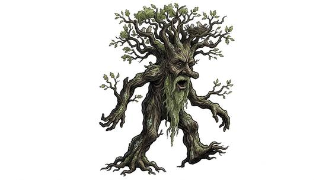

# Treant-kind

{.illus}

*Set: Core*

*aka: ______________________________*

*Family: [Plant-kind](../Species_Families/plant-kind.md)*

Trees that walk, or rather trees that have woken up and occasionally decide to go somewhere. They are enormous, with bark for skin, branches for arms and roots that pull free of the soil with a sound like tearing canvas. Their faces are knots and hollows, their eyes deep and green, and their voices creak and boom.

They live for thousands of years and think at the pace of seasons. Saying good morning can take them half the day. They guard old forests and have long memories for those who harm them, and when they are finally roused to anger they are terrifying: slow, unstoppable and strong enough to tear down a fortress. Some regrow from any wound. Woodcutters in their forests learn to ask permission first.

## Not to be confused with

the *[tree/nature spirit kind](plant-kind-tree-nature-spirit-kind.md)*, small place-bound spirits who live within a tree, where treants are the tree, grown huge and walking.

## What sets this species apart

Giant, ancient tree-beings: bark-armoured, patient beyond measure, and slower still on their feet. Regeneration is Set at Breed/Race level for the breeds that have it. The half-awakened grove breed is non-sentient. Lifespan (very long-lived) is a lexicon detail, not a game number. The slam is a blow from a woody limb.

## Breeds and races

Each block below is one set of numbers; breeds that share every number share a block (Species rules, rule 9). Attributes are final modifiers, the size trade-off included. Skills, powers and weapon groups are final levels after the family, species and breed layers.

### No. 606 Treant-folk *(genres: underworld and wild places; starter)*

- **Size:** huge · **Body:** biped+rooted
- **What it's like:** A walking, talking tree: slow, wise, enormously strong, and protective of forests. (looks like: tree; good at: strength, toughness, wilderness)
- **Attributes:** STR +6 AGI −4 END +2 WIS +2
- **Skills:** [Camouflage](../Skills/camouflage.md) +3, [Nature Lore](../Skills/nature-lore.md) +2, [Survival: Forest (Woodcraft)](../Skills/survival-forest-woodcraft.md) +2, [Composure](../Skills/composure.md) +1, [Swimming](../Skills/swimming.md) −1, [Fire-Making](../Skills/fire-making.md) −2, [Survival: Desert](../Skills/survival-desert.md) −2, [Running](../Skills/running.md) −3
- **Powers:** [Healing Factor](../Powers/healing-factor.md) 2, [Plant & Place Speech](../Powers/plant-and-place-speech.md) 2, [Armour Skin](../Powers/armour-skin.md) 1
- **Natural attacks:** slam 1d6+1
- **For the Game Master only, this race as an NPC guard or soldier (not your character's numbers):** Attack 14 · Parry 11 · Dodge 2 · Damage slam 2d6; longsword 1d6+5 · Armour 2 · Life 27 · Threat 2 ([Bestiary roles](../bestiary.md))
- *Why:* Regrows damage over time.

### Half-awakened grove folk *(beast)*

- **Size:** large · **Body:** biped
- **Attributes:** STR +4 AGI −3 END +2 INT −3 WIS +2 CHA −2
- **Skills:** [Camouflage](../Skills/camouflage.md) +3, [Survival: Forest (Woodcraft)](../Skills/survival-forest-woodcraft.md) +2, [Composure](../Skills/composure.md) +1, [Swimming](../Skills/swimming.md) −1, [Fire-Making](../Skills/fire-making.md) −2, [Survival: Desert](../Skills/survival-desert.md) −2, [Running](../Skills/running.md) −3
- **Powers:** [Entangle](../Powers/entangle.md) 2, [Armour Skin](../Powers/armour-skin.md) 1
- **Weapon groups:** [Wrestling & Grappling](../Weapon_Groups/wrestling-and-grappling.md) +1
- **Natural attacks:** slam 1d6+1
- **For the Game Master only, this race as an NPC guard or soldier (not your character's numbers):** Attack 14 · Parry 11 · Dodge 4 · Damage longsword 1d6+2; slam 1d6+4 · Armour 2 · Life 23 · Threat 2 ([Bestiary roles](../bestiary.md))
- *Why:* Half-awake, malicious trees that strangle and entangle; no lore or speech.

### Lost tree-shepherd mates *(NPC only)*

- **Size:** huge · **Body:** biped
- **Attributes:** STR +6 AGI −4 END +2 WIS +2
- **Skills:** [Camouflage](../Skills/camouflage.md) +3, [Nature Lore](../Skills/nature-lore.md) +2, [Survival: Forest (Woodcraft)](../Skills/survival-forest-woodcraft.md) +2, [Composure](../Skills/composure.md) +1, [Farming](../Skills/farming.md) +1, [Swimming](../Skills/swimming.md) −1, [Fire-Making](../Skills/fire-making.md) −2, [Survival: Desert](../Skills/survival-desert.md) −2, [Running](../Skills/running.md) −3
- **Powers:** [Healing Factor](../Powers/healing-factor.md) 2, [Plant & Place Speech](../Powers/plant-and-place-speech.md) 2, [Armour Skin](../Powers/armour-skin.md) 1
- **Natural attacks:** slam 1d6+1
- **For the Game Master only, this race as an NPC guard or soldier (not your character's numbers):** Attack 14 · Parry 11 · Dodge 2 · Damage slam 2d6; longsword 1d6+5 · Armour 2 · Life 27 · Threat 2 ([Bestiary roles](../bestiary.md))
- *Why:* Like the treant-folk, but tenders of orchards and gardens rather than wild forest.

### Elemental forest god *(NPC only; NPC-scale)*

- **Size:** huge · **Body:** other
- **Attributes:** STR +9 AGI −4 END +5 INT +2 WIS +5 CHA +2
- **Skills:** [Camouflage](../Skills/camouflage.md) +3, [Nature Lore](../Skills/nature-lore.md) +2, [Survival: Forest (Woodcraft)](../Skills/survival-forest-woodcraft.md) +2, [Composure](../Skills/composure.md) +1, [Swimming](../Skills/swimming.md) −1, [Fire-Making](../Skills/fire-making.md) −2, [Survival: Desert](../Skills/survival-desert.md) −2, [Running](../Skills/running.md) −3
- **Powers:** [Plant Growth](../Powers/plant-growth.md) 5, [Renewal at Death](../Powers/renewal-at-death.md) 3, [Plant & Place Speech](../Powers/plant-and-place-speech.md) 2, [Armour Skin](../Powers/armour-skin.md) 1
- **Natural attacks:** slam 1d6+1
- **For the Game Master only, this race as an NPC guard or soldier (not your character's numbers):** Attack 15 · Parry 12 · Dodge 2 · Damage slam 2d6; longsword 1d6+5 · Armour 2 · Life 30 · Threat 2 ([Bestiary roles](../bestiary.md))
- *Why:* A dormant nature god that regrows the world's greenery when it dies.
- *Note:* NPC-scale. Lifespan (ageless or immortal) is a lexicon detail, not a game number.

### No. 607 Sentient treefolk empire *(genres: underworld and wild places)*

- **Size:** large · **Body:** biped
- **What it's like:** Ancient, slow-moving tree people who talk to each other through their roots and stand like a wall in a fight. (looks like: tree; good at: toughness, wilderness)
- **Attributes:** STR +3 AGI −3 END +2 WIS +2
- **Skills:** [Camouflage](../Skills/camouflage.md) +3, [Nature Lore](../Skills/nature-lore.md) +2, [Survival: Forest (Woodcraft)](../Skills/survival-forest-woodcraft.md) +2, [Composure](../Skills/composure.md) +1, [Swimming](../Skills/swimming.md) −1, [Fire-Making](../Skills/fire-making.md) −2, [Survival: Desert](../Skills/survival-desert.md) −2, [Running](../Skills/running.md) −3
- **Powers:** [Plant & Place Speech](../Powers/plant-and-place-speech.md) 2, [Armour Skin](../Powers/armour-skin.md) 1, [Mind Link](../Powers/mind-link.md) 1
- **Natural attacks:** slam 1d6+1
- **For the Game Master only, this race as an NPC guard or soldier (not your character's numbers):** Attack 14 · Parry 11 · Dodge 4 · Damage longsword 1d6+2; slam 1d6+4 · Armour 2 · Life 23 · Threat 2 ([Bestiary roles](../bestiary.md))
- *Why:* Talk to one another through a root network.
- *Note:* Mind Link only with its own kind through connected roots.

