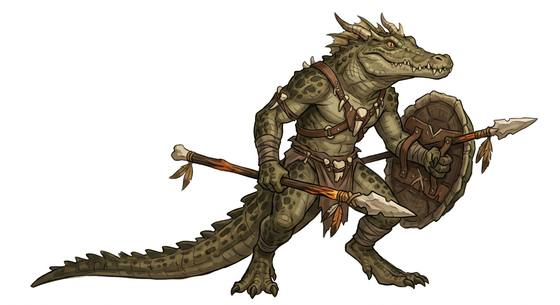

# Lizardfolk

{.illus}

*Set: Core*

*aka: ______________________________*

*Family: [Reptilian](../Species_Families/reptilian.md)*

Scaled, tailed people who walk upright on strong legs and look at the world with cold, unblinking eyes. They come in more shapes than any other reptile folk: tiny colour-changing tree-dwellers, gecko-folk who climb walls, crested iguana-folk basking on rocks, heavy-jawed monitors, armoured river crocodiles, spiny desert dwellers, and many peoples from other worlds who happen to share the scales.

Most of them love heat and grow sluggish in the cold. Many swim well, and many carry teeth and claws that make weapons almost unnecessary. Their cultures range from swamp tribes to star empires. Other peoples tend to find them hard to read, because a lizard's face shows nothing, and a lizard's patience can outlast almost anyone's.

## Not to be confused with

the *[serpent-bodied folk](reptilian-serpent-bodied-folk.md)*, legless reptiles who coil and crawl, where lizardfolk walk upright on legs.

## What sets this species apart

No shared difference: lizardfolk are the family's baseline, and their many breeds carry their own lines.

## Breeds and races

Each block below is one set of numbers; breeds that share every number share a block (Species rules, rule 9). Attributes are final modifiers, the size trade-off included. Skills, powers and weapon groups are final levels after the family, species and breed layers.

### No. 619 Chameleon lizardfolk *(genres: beast-folk: scales, feathers and shells)*

- **Size:** small · **Body:** biped+tailed
- **What it's like:** Small lizardfolk who change colour to vanish at rest and snatch prey with a long, sticky tongue. (looks like: chameleon; good at: sneaking, keen senses)
- **Attributes:** STR −1 AGI +1 END +1 WIS +1 PER +1 CHA −1
- **Skills:** [Survival: Jungle & Swamp](../Skills/survival-jungle-and-swamp.md) +2, [Composure](../Skills/composure.md) +1, [Pain Tolerance](../Skills/pain-tolerance.md) +1, [Stealth](../Skills/stealth.md) +1, [Survival: Desert](../Skills/survival-desert.md) +1, [Swimming](../Skills/swimming.md) +1, [Carousing](../Skills/carousing.md) −1, [Charm & Seduction](../Skills/charm-and-seduction.md) −1, [Running](../Skills/running.md) −1, [Survival: Arctic](../Skills/survival-arctic.md) −3
- **Powers:** Camouflage (power) 2
- **Natural attacks:** bite 1d6+1, tail 1d6+1, tongue 1d6
- **For the Game Master only, this race as an NPC guard or soldier (not your character's numbers):** Attack 14 · Parry 11 · Dodge 10 · Damage longsword 1d6+2; bite 1d6+1 · Armour 2 · Life 16 · Threat 1 ([Bestiary roles](../bestiary.md))
- *Why:* Colour-changing skin and independently swivelling eyes, paid for with slow, deliberate movement.
- *Note:* Camouflage (power) is the colour change; the tongue-strike is its tongue attack.

### No. 620 Gecko lizardfolk *(genres: beast-folk: scales, feathers and shells)*

- **Size:** small · **Body:** biped+tailed
- **What it's like:** Small, big-eyed lizardfolk who can stick to walls and ceilings and chirp to each other in the dark. (looks like: gecko; good at: climbing, keen senses)
- **Attributes:** STR −2 AGI +2 CHA −1
- **Skills:** [Survival: Jungle & Swamp](../Skills/survival-jungle-and-swamp.md) +2, [Composure](../Skills/composure.md) +1, [Pain Tolerance](../Skills/pain-tolerance.md) +1, [Stealth](../Skills/stealth.md) +1, [Survival: Desert](../Skills/survival-desert.md) +1, [Swimming](../Skills/swimming.md) +1, [Carousing](../Skills/carousing.md) −1, [Charm & Seduction](../Skills/charm-and-seduction.md) −1, [Survival: Arctic](../Skills/survival-arctic.md) −3
- **Powers:** [Wall Walking](../Powers/wall-walking.md) 2, [Night & Spectrum Sight](../Powers/night-and-spectrum-sight.md) 1
- **Natural attacks:** bite 1d6+1, tail 1d6+1
- **For the Game Master only, this race as an NPC guard or soldier (not your character's numbers):** Attack 14 · Parry 11 · Dodge 11 · Damage longsword 1d6+1; bite 1d6-1 · Armour 2 · Life 15 · Threat 1 ([Bestiary roles](../bestiary.md))
- *Why:* Sticky toe pads for walls and ceilings and big nocturnal eyes.
- *Note:* The one-time tail drop is an escape trick for the lexicon, not a line.

### No. 621 Iguana lizardfolk *(genres: beast-folk: scales, feathers and shells)*

- **Size:** medium · **Body:** biped+tailed
- **What it's like:** Crested, plant-eating lizardfolk who flash a big throat-frill to warn off trouble and whip with a strong tail. (looks like: lizard; good at: toughness, wilderness)
- **Attributes:** STR +1 END +1 CHA −1
- **Skills:** [Survival: Jungle & Swamp](../Skills/survival-jungle-and-swamp.md) +2, [Composure](../Skills/composure.md) +1, [Foraging](../Skills/foraging.md) +1, [Intimidation](../Skills/intimidation.md) +1, [Pain Tolerance](../Skills/pain-tolerance.md) +1, [Stealth](../Skills/stealth.md) +1, [Survival: Desert](../Skills/survival-desert.md) +1, [Swimming](../Skills/swimming.md) +1, [Carousing](../Skills/carousing.md) −1, [Charm & Seduction](../Skills/charm-and-seduction.md) −1, [Survival: Arctic](../Skills/survival-arctic.md) −3
- **Natural attacks:** bite 1d6+1, tail 1d6+1
- **For the Game Master only, this race as an NPC guard or soldier (not your character's numbers):** Attack 14 · Parry 11 · Dodge 8 · Damage longsword 1d6+2; bite 1d6+2 · Armour 2 · Life 18 · Threat 1 ([Bestiary roles](../bestiary.md))
- *Why:* Crest-and-dewlap threat display and a plant-eating diet.

### No. 622 Monitor lizardfolk *(genres: beast-folk: scales, feathers and shells)*

- **Size:** large · **Body:** biped+tailed
- **What it's like:** Big, heavy-jawed apex lizardfolk with a venomous bite and a nose that tracks prey for miles. (looks like: lizard; good at: swimming, keen senses)
- **Attributes:** STR +3 AGI −2 END +1 INT −1 CHA −1 COU +1
- **Skills:** [Survival: Jungle & Swamp](../Skills/survival-jungle-and-swamp.md) +2, [Swimming](../Skills/swimming.md) +2, [Composure](../Skills/composure.md) +1, [Pain Tolerance](../Skills/pain-tolerance.md) +1, [Stealth](../Skills/stealth.md) +1, [Survival: Desert](../Skills/survival-desert.md) +1, [Carousing](../Skills/carousing.md) −1, [Charm & Seduction](../Skills/charm-and-seduction.md) −1, [Diplomacy](../Skills/diplomacy.md) −1, [Survival: Arctic](../Skills/survival-arctic.md) −3
- **Powers:** [Enhanced Senses](../Powers/enhanced-senses.md) 2, [Poison Touch](../Powers/poison-touch.md) 1
- **Natural attacks:** bite 1d6+1, tail 1d6+1
- **For the Game Master only, this race as an NPC guard or soldier (not your character's numbers):** Attack 14 · Parry 11 · Dodge 5 · Damage longsword 1d6+2; bite 1d6+4 · Armour 2 · Life 22 · Threat 2 ([Bestiary roles](../bestiary.md))
- *Why:* Apex hunter: forked-tongue scent tracking, strong swimming and a mildly venomous bite, but poor at deference.
- *Note:* Enhanced Senses is the tongue-scent sense (keen nose standard).

### No. 623 Crocodilian folk *(genres: beast-folk: scales, feathers and shells)*

- **Size:** large · **Body:** biped+tailed
- **What it's like:** Armoured, broad-snouted crocodile folk who ambush from the water and finish fights with a bone-crushing bite. (looks like: crocodile; good at: swimming, fighting)
- **Attributes:** STR +4 AGI −2 END +2 INT −1 CHA −1
- **Skills:** [Survival: Jungle & Swamp](../Skills/survival-jungle-and-swamp.md) +2, [Swimming](../Skills/swimming.md) +2, [Composure](../Skills/composure.md) +1, [Pain Tolerance](../Skills/pain-tolerance.md) +1, [Stealth](../Skills/stealth.md) +1, [Survival: Desert](../Skills/survival-desert.md) +1, [Carousing](../Skills/carousing.md) −1, [Charm & Seduction](../Skills/charm-and-seduction.md) −1, [Running](../Skills/running.md) −1, [Survival: Arctic](../Skills/survival-arctic.md) −3
- **Powers:** [Armour Skin](../Powers/armour-skin.md) 2
- **Weapon groups:** [Wrestling & Grappling](../Weapon_Groups/wrestling-and-grappling.md) +1
- **Natural attacks:** bite 1d6+1, tail 1d6+1
- **For the Game Master only, this race as an NPC guard or soldier (not your character's numbers):** Attack 14 · Parry 11 · Dodge 5 · Damage longsword 1d6+2; bite 1d6+4 · Armour 2 · Life 23 · Threat 2 ([Bestiary roles](../bestiary.md))
- *Why:* Armoured ambushers from the water with a crushing bite and death-roll, slow on open land.

### Horned desert lizardfolk *(NPC only)*

- **Size:** small · **Body:** biped+tailed
- **Attributes:** STR −2 AGI +2 END +1 CHA −1
- **Skills:** [Survival: Desert](../Skills/survival-desert.md) +3, [Survival: Jungle & Swamp](../Skills/survival-jungle-and-swamp.md) +2, [Composure](../Skills/composure.md) +1, [Pain Tolerance](../Skills/pain-tolerance.md) +1, [Stealth](../Skills/stealth.md) +1, [Swimming](../Skills/swimming.md) +1, [Carousing](../Skills/carousing.md) −1, [Charm & Seduction](../Skills/charm-and-seduction.md) −1, [Survival: Arctic](../Skills/survival-arctic.md) −3
- **Powers:** [Armour Skin](../Powers/armour-skin.md) 1
- **Natural attacks:** bite 1d6+1, tail 1d6+1
- **For the Game Master only, this race as an NPC guard or soldier (not your character's numbers):** Attack 14 · Parry 11 · Dodge 11 · Damage longsword 1d6+1; bite 1d6-1 · Armour 2 · Life 16 · Threat 1 ([Bestiary roles](../bestiary.md))
- *Why:* Heat-adapted desert dwellers with a spiny horned crown.
- *Note:* The mythic blood-squirt deterrent is lexicon flavour.

### Frilled lizardfolk *(NPC only)*

- **Size:** small · **Body:** biped+tailed
- **Attributes:** STR −1 AGI +2 END +1 CHA −1 COU −1
- **Skills:** [Survival: Jungle & Swamp](../Skills/survival-jungle-and-swamp.md) +2, [Climbing](../Skills/climbing.md) +1, [Composure](../Skills/composure.md) +1, [Intimidation](../Skills/intimidation.md) +1, [Pain Tolerance](../Skills/pain-tolerance.md) +1, [Running](../Skills/running.md) +1, [Stealth](../Skills/stealth.md) +1, [Survival: Desert](../Skills/survival-desert.md) +1, [Swimming](../Skills/swimming.md) +1, [Carousing](../Skills/carousing.md) −1, [Charm & Seduction](../Skills/charm-and-seduction.md) −1, [Survival: Arctic](../Skills/survival-arctic.md) −3
- **Natural attacks:** bite 1d6+1, tail 1d6+1
- **For the Game Master only, this race as an NPC guard or soldier (not your character's numbers):** Attack 14 · Parry 11 · Dodge 11 · Damage longsword 1d6+2; bite 1d6+1 · Armour 2 · Life 16 · Threat 1 ([Bestiary roles](../bestiary.md))
- *Why:* Tree-dwelling sprinters that bluff with a flaring neck frill.

### Armored spined lizardfolk *(NPC only)*

- **Size:** small · **Body:** biped+tailed
- **Attributes:** STR −1 AGI +1 END +2 CHA −1
- **Skills:** [Survival: Jungle & Swamp](../Skills/survival-jungle-and-swamp.md) +2, [Composure](../Skills/composure.md) +1, [Pain Tolerance](../Skills/pain-tolerance.md) +1, [Stealth](../Skills/stealth.md) +1, [Survival: Desert](../Skills/survival-desert.md) +1, [Swimming](../Skills/swimming.md) +1, [Carousing](../Skills/carousing.md) −1, [Charm & Seduction](../Skills/charm-and-seduction.md) −1, [Running](../Skills/running.md) −1, [Survival: Arctic](../Skills/survival-arctic.md) −3
- **Powers:** [Armour Skin](../Powers/armour-skin.md) 3
- **Natural attacks:** bite 1d6+1, tail 1d6+1
- **For the Game Master only, this race as an NPC guard or soldier (not your character's numbers):** Attack 14 · Parry 11 · Dodge 10 · Damage longsword 1d6+2; bite 1d6+1 · Armour 2 · Life 17 · Threat 2 ([Bestiary roles](../bestiary.md))
- *Why:* Bony plating and a defensive curl make them walking fortresses, but slow.

### Gliding lizardfolk *(NPC only)*

- **Size:** small · **Body:** biped+winged
- **Attributes:** STR −2 AGI +2 END −1 CHA −1
- **Skills:** [Parachuting & Gliding](../Skills/parachuting-and-gliding.md) +3, [Survival: Jungle & Swamp](../Skills/survival-jungle-and-swamp.md) +2, [Climbing](../Skills/climbing.md) +1, [Composure](../Skills/composure.md) +1, [Pain Tolerance](../Skills/pain-tolerance.md) +1, [Stealth](../Skills/stealth.md) +1, [Survival: Desert](../Skills/survival-desert.md) +1, [Swimming](../Skills/swimming.md) +1, [Carousing](../Skills/carousing.md) −1, [Charm & Seduction](../Skills/charm-and-seduction.md) −1, [Survival: Arctic](../Skills/survival-arctic.md) −3
- **Natural attacks:** bite 1d6+1, tail 1d6+1
- **For the Game Master only, this race as an NPC guard or soldier (not your character's numbers):** Attack 14 · Parry 11 · Dodge 11 · Damage longsword 1d6+1; bite 1d6-1 · Armour 2 · Life 14 · Threat 1 ([Bestiary roles](../bestiary.md))
- *Why:* Rib-skin membranes for silent gliding between treetops; no powered flight.

### Marine iguana-folk *(NPC only)*

- **Size:** medium · **Body:** biped+tailed
- **Attributes:** STR +1 END +1 CHA −1
- **Skills:** [Swimming](../Skills/swimming.md) +3, [Diving](../Skills/diving.md) +2, [Survival: Jungle & Swamp](../Skills/survival-jungle-and-swamp.md) +2, [Composure](../Skills/composure.md) +1, [Pain Tolerance](../Skills/pain-tolerance.md) +1, [Stealth](../Skills/stealth.md) +1, [Survival: Coast & Sea](../Skills/survival-coast-and-sea.md) +1, [Survival: Desert](../Skills/survival-desert.md) +1, [Carousing](../Skills/carousing.md) −1, [Charm & Seduction](../Skills/charm-and-seduction.md) −1, [Survival: Arctic](../Skills/survival-arctic.md) −3
- **Natural attacks:** bite 1d6+1, tail 1d6+1
- **For the Game Master only, this race as an NPC guard or soldier (not your character's numbers):** Attack 14 · Parry 11 · Dodge 8 · Damage longsword 1d6+2; bite 1d6+2 · Armour 2 · Life 18 · Threat 1 ([Bestiary roles](../bestiary.md))
- *Why:* Sea-grazing coast dwellers: strong swimmers and divers.

### Burrowing skink-folk *(NPC only)*

- **Size:** small · **Body:** biped+tailed
- **Attributes:** STR −1 AGI +2 END +1 CHA −1
- **Skills:** [Survival: Caves & Underground](../Skills/survival-caves-and-underground.md) +2, [Survival: Jungle & Swamp](../Skills/survival-jungle-and-swamp.md) +2, [Composure](../Skills/composure.md) +1, [Pain Tolerance](../Skills/pain-tolerance.md) +1, [Stealth](../Skills/stealth.md) +1, [Survival: Desert](../Skills/survival-desert.md) +1, [Swimming](../Skills/swimming.md) +1, [Carousing](../Skills/carousing.md) −1, [Charm & Seduction](../Skills/charm-and-seduction.md) −1, [Running](../Skills/running.md) −1, [Survival: Arctic](../Skills/survival-arctic.md) −3
- **Powers:** [Burrowing](../Powers/burrowing.md) 1, [Enhanced Senses](../Powers/enhanced-senses.md) 1
- **Natural attacks:** bite 1d6+1, tail 1d6+1
- **For the Game Master only, this race as an NPC guard or soldier (not your character's numbers):** Attack 14 · Parry 11 · Dodge 11 · Damage longsword 1d6+2; bite 1d6+1 · Armour 2 · Life 16 · Threat 1 ([Bestiary roles](../bestiary.md))
- *Why:* Smooth burrowing bodies that feel vibration, clumsy on the surface.
- *Note:* Enhanced Senses is vibration sense.

### Venomous lizardfolk *(NPC only)*

- **Size:** small · **Body:** biped+tailed
- **Attributes:** STR −1 AGI +1 END +1 CHA −1
- **Skills:** [Survival: Desert](../Skills/survival-desert.md) +2, [Survival: Jungle & Swamp](../Skills/survival-jungle-and-swamp.md) +2, [Composure](../Skills/composure.md) +1, [Pain Tolerance](../Skills/pain-tolerance.md) +1, [Stealth](../Skills/stealth.md) +1, [Swimming](../Skills/swimming.md) +1, [Carousing](../Skills/carousing.md) −1, [Charm & Seduction](../Skills/charm-and-seduction.md) −1, [Running](../Skills/running.md) −1, [Survival: Arctic](../Skills/survival-arctic.md) −3
- **Powers:** [Poison Touch](../Powers/poison-touch.md) 2
- **Natural attacks:** bite 1d6+1, tail 1d6+1
- **For the Game Master only, this race as an NPC guard or soldier (not your character's numbers):** Attack 14 · Parry 11 · Dodge 10 · Damage longsword 1d6+2; bite 1d6+1 · Armour 2 · Life 16 · Threat 1 ([Bestiary roles](../bestiary.md))
- *Why:* Slow desert lizards with a strong neurotoxic bite.
- *Note:* Poison Touch is delivered by bite.

### No. 624 Kobold-type lizardfolk *(genres: classic fantasy)*

- **Size:** small · **Body:** biped+tailed
- **What it's like:** Small, quick lizardfolk who work in packs, setting clever traps rather than fighting fair. (looks like: lizard; good at: speed and agility, making and fixing)
- **Attributes:** STR −2 AGI +2 END +1 INT +1 CHA −1
- **Skills:** [Survival: Jungle & Swamp](../Skills/survival-jungle-and-swamp.md) +2, [Traps](../Skills/traps.md) +2, [Composure](../Skills/composure.md) +1, [Formation Fighting](../Skills/formation-fighting.md) +1, [Pain Tolerance](../Skills/pain-tolerance.md) +1, [Stealth](../Skills/stealth.md) +1, [Survival: Desert](../Skills/survival-desert.md) +1, [Swimming](../Skills/swimming.md) +1, [Carousing](../Skills/carousing.md) −1, [Charm & Seduction](../Skills/charm-and-seduction.md) −1, [Survival: Arctic](../Skills/survival-arctic.md) −3
- **Natural attacks:** bite 1d6+1, tail 1d6+1
- **For the Game Master only, this race as an NPC guard or soldier (not your character's numbers):** Attack 14 · Parry 11 · Dodge 11 · Damage longsword 1d6+1; bite 1d6-1 · Armour 2 · Life 16 · Threat 1 ([Bestiary roles](../bestiary.md))
- *Why:* Small pack-tribal lizards known for trap-making cunning.
- *Note:* Both lines are the pack way of life (non-human culture rule).

### Basilisk-folk *(NPC only)*

- **Size:** medium · **Body:** biped+tailed
- **Attributes:** STR +1 END +1 CHA −1 COU +1
- **Skills:** [Survival: Jungle & Swamp](../Skills/survival-jungle-and-swamp.md) +2, [Composure](../Skills/composure.md) +1, [Intimidation](../Skills/intimidation.md) +1, [Pain Tolerance](../Skills/pain-tolerance.md) +1, [Stealth](../Skills/stealth.md) +1, [Survival: Desert](../Skills/survival-desert.md) +1, [Swimming](../Skills/swimming.md) +1, [Carousing](../Skills/carousing.md) −1, [Charm & Seduction](../Skills/charm-and-seduction.md) −1, [Survival: Arctic](../Skills/survival-arctic.md) −3
- **Powers:** [Petrification](../Powers/petrification.md) 2, [Poison Touch](../Powers/poison-touch.md) 1
- **Natural attacks:** bite 1d6+1, tail 1d6+1
- **For the Game Master only, this race as an NPC guard or soldier (not your character's numbers):** Attack 14 · Parry 11 · Dodge 8 · Damage longsword 1d6+2; bite 1d6+2 · Armour 2 · Life 18 · Threat 1 ([Bestiary roles](../bestiary.md))
- *Why:* Crested, venomous and cursed with a petrifying gaze that makes others fear them.
- *Note:* Petrification works by gaze.

### Tiny anole lizardfolk *(NPC only)*

- **Size:** tiny · **Body:** biped+tailed
- **Attributes:** STR −2 AGI +3 END +1 CHA −1
- **Skills:** [Survival: Jungle & Swamp](../Skills/survival-jungle-and-swamp.md) +2, [Composure](../Skills/composure.md) +1, [Pain Tolerance](../Skills/pain-tolerance.md) +1, [Stealth](../Skills/stealth.md) +1, [Survival: Desert](../Skills/survival-desert.md) +1, [Swimming](../Skills/swimming.md) +1, [Carousing](../Skills/carousing.md) −1, [Charm & Seduction](../Skills/charm-and-seduction.md) −1, [Survival: Arctic](../Skills/survival-arctic.md) −3
- **Natural attacks:** bite 1d6+1, tail 1d6+1
- **For the Game Master only, this race as an NPC guard or soldier (not your character's numbers):** Attack 14 · Parry 11 · Dodge 13 · Damage longsword 1d6+1; bite 1d6-2 · Armour 2 · Life 14 · Threat 1 ([Bestiary roles](../bestiary.md))
- *Why:* Differs only in tiny size and bright colour; the dewlap display and twitchy speed are size and appearance.

### Tuatara-folk *(NPC only)*

- **Size:** small · **Body:** biped+tailed
- **Attributes:** STR −1 AGI +1 END +1 WIS +1 PER +1 CHA −1
- **Skills:** [Survival: Jungle & Swamp](../Skills/survival-jungle-and-swamp.md) +2, [Composure](../Skills/composure.md) +1, [Pain Tolerance](../Skills/pain-tolerance.md) +1, [Stealth](../Skills/stealth.md) +1, [Survival: Desert](../Skills/survival-desert.md) +1, [Swimming](../Skills/swimming.md) +1, [Carousing](../Skills/carousing.md) −1, [Charm & Seduction](../Skills/charm-and-seduction.md) −1, [Running](../Skills/running.md) −1, [Survival: Arctic](../Skills/survival-arctic.md) −3
- **Natural attacks:** bite 1d6+1, tail 1d6+1
- **For the Game Master only, this race as an NPC guard or soldier (not your character's numbers):** Attack 14 · Parry 11 · Dodge 10 · Damage longsword 1d6+2; bite 1d6+1 · Armour 2 · Life 16 · Threat 1 ([Bestiary roles](../bestiary.md))
- *Why:* Living-fossil lineage: very long-lived, with a third parietal eye, but very slow to act.
- *Note:* Perception stands for the parietal eye's sense. Lifespan (very long-lived) is a lexicon detail, not a game number.

### Fire-spitting goblin lizardfolk *(NPC only)*

- **Size:** small · **Body:** biped
- **Attributes:** STR −1 AGI +2 END +1 INT −1 CHA −1
- **Skills:** [Survival: Jungle & Swamp](../Skills/survival-jungle-and-swamp.md) +2, [Composure](../Skills/composure.md) +1, [Pain Tolerance](../Skills/pain-tolerance.md) +1, [Stealth](../Skills/stealth.md) +1, [Streetwise](../Skills/streetwise.md) +1, [Survival: Desert](../Skills/survival-desert.md) +1, [Swimming](../Skills/swimming.md) +1, [Carousing](../Skills/carousing.md) −1, [Charm & Seduction](../Skills/charm-and-seduction.md) −1, [Survival: Arctic](../Skills/survival-arctic.md) −3
- **Powers:** [Fire Blast](../Powers/fire-blast.md) 1
- **Natural attacks:** bite 1d6+1, tail 1d6+1
- **For the Game Master only, this race as an NPC guard or soldier (not your character's numbers):** Attack 14 · Parry 11 · Dodge 11 · Damage longsword 1d6+2; bite 1d6+1 · Armour 2 · Life 16 · Threat 1 ([Bestiary roles](../bestiary.md))
- *Why:* Small flame-spitting gang lizards.
- *Note:* Fire Blast is spat flame, short range.

### Ancient bioengineered reptilian folk *(NPC only)*

- **Size:** large · **Body:** biped
- **Attributes:** STR +3 AGI −2 END +1 INT +2 CHA −1
- **Skills:** [Biotechnology](../Skills/biotechnology.md) +2, [Survival: Jungle & Swamp](../Skills/survival-jungle-and-swamp.md) +2, [Composure](../Skills/composure.md) +1, [Pain Tolerance](../Skills/pain-tolerance.md) +1, [Stealth](../Skills/stealth.md) +1, [Survival: Desert](../Skills/survival-desert.md) +1, [Swimming](../Skills/swimming.md) +1, [Carousing](../Skills/carousing.md) −1, [Charm & Seduction](../Skills/charm-and-seduction.md) −1, [Survival: Arctic](../Skills/survival-arctic.md) −3
- **Natural attacks:** bite 1d6+1
- **For the Game Master only, this race as an NPC guard or soldier (not your character's numbers):** Attack 14 · Parry 11 · Dodge 5 · Damage longsword 1d6+2; bite 1d6+4 · Armour 2 · Life 22 · Threat 2 ([Bestiary roles](../bestiary.md))
- *Why:* An ancient caste people who grew their own living technology and constructs.
- *Note:* Their bio-constructs are gear; the line is their inseparable craft.

### Shapeshifting serpent-men *(NPC only)*

- **Size:** medium · **Body:** biped
- **Attributes:** STR +1 END +1 INT +1
- **Skills:** [Survival: Jungle & Swamp](../Skills/survival-jungle-and-swamp.md) +2, [Composure](../Skills/composure.md) +1, [Deception](../Skills/deception.md) +1, [Pain Tolerance](../Skills/pain-tolerance.md) +1, [Stealth](../Skills/stealth.md) +1, [Survival: Desert](../Skills/survival-desert.md) +1, [Swimming](../Skills/swimming.md) +1, [Carousing](../Skills/carousing.md) −1, [Charm & Seduction](../Skills/charm-and-seduction.md) −1, [Survival: Arctic](../Skills/survival-arctic.md) −3
- **Powers:** Disguise (power) 2, [Poison Touch](../Powers/poison-touch.md) 1
- **Natural attacks:** bite 1d6+1
- **For the Game Master only, this race as an NPC guard or soldier (not your character's numbers):** Attack 14 · Parry 11 · Dodge 8 · Damage longsword 1d6+2; bite 1d6+2 · Armour 2 · Life 18 · Threat 1 ([Bestiary roles](../bestiary.md))
- *Why:* Venomous, cunning serpent-worshippers who move among other peoples behind sorcerous disguises.
- *Note:* The disguise is innate sorcery; physical masks would be gear.

### Draconian folk *(NPC only)*

- **Size:** medium · **Body:** biped
- **Attributes:** STR +1 END +1 WIS −1 CHA −1 COU +1
- **Skills:** [Survival: Jungle & Swamp](../Skills/survival-jungle-and-swamp.md) +2, [Composure](../Skills/composure.md) +1, [Formation Fighting](../Skills/formation-fighting.md) +1, [Pain Tolerance](../Skills/pain-tolerance.md) +1, [Stealth](../Skills/stealth.md) +1, [Survival: Desert](../Skills/survival-desert.md) +1, [Swimming](../Skills/swimming.md) +1, [Carousing](../Skills/carousing.md) −1, [Charm & Seduction](../Skills/charm-and-seduction.md) −1, [Survival: Arctic](../Skills/survival-arctic.md) −3
- **Powers:** [Acid & Corrosion](../Powers/acid-and-corrosion.md) 1
- **Natural attacks:** bite 1d6+1
- **For the Game Master only, this race as an NPC guard or soldier (not your character's numbers):** Attack 14 · Parry 11 · Dodge 8 · Damage longsword 1d6+2; bite 1d6+2 · Armour 2 · Life 18 · Threat 1 ([Bestiary roles](../bestiary.md))
- *Why:* War-bred from corrupted dragon eggs, drilled soldiers whose bodies burst into a hazard when they die.
- *Note:* Acid & Corrosion fires only on death; stone-turning or other lineages swap it for their own effect at the same level.

### No. 625 Swamp/river lizardfolk *(genres: beast-folk: scales, feathers and shells, underworld and wild places; starter)*

- **Size:** medium · **Body:** biped+tailed
- **What it's like:** Scaly swamp hunters who swim well, hit hard and think like predators. (looks like: lizard; good at: swimming, wilderness, fighting)
- **Attributes:** STR +1 END +1 WIS +1 CHA −1
- **Skills:** [Survival: Jungle & Swamp](../Skills/survival-jungle-and-swamp.md) +2, [Swimming](../Skills/swimming.md) +2, [Composure](../Skills/composure.md) +1, [Pain Tolerance](../Skills/pain-tolerance.md) +1, [Stealth](../Skills/stealth.md) +1, [Survival: Desert](../Skills/survival-desert.md) +1, [Carousing](../Skills/carousing.md) −1, [Charm & Seduction](../Skills/charm-and-seduction.md) −1, [Survival: Arctic](../Skills/survival-arctic.md) −3
- **Powers:** [Armour Skin](../Powers/armour-skin.md) 1
- **Natural attacks:** bite 1d6+1, tail 1d6+1
- **For the Game Master only, this race as an NPC guard or soldier (not your character's numbers):** Attack 14 · Parry 11 · Dodge 8 · Damage longsword 1d6+2; bite 1d6+2 · Armour 2 · Life 18 · Threat 2 ([Bestiary roles](../bestiary.md))
- *Why:* The classic swamp lizardfolk: stronger swimmers with armoured scales.

### Swamp assassin lizardfolk *(NPC only)*

- **Size:** medium · **Body:** biped
- **Attributes:** STR +1 AGI +2 END +1 CHA −2
- **Skills:** [Stealth](../Skills/stealth.md) +2, [Survival: Jungle & Swamp](../Skills/survival-jungle-and-swamp.md) +2, [Composure](../Skills/composure.md) +1, [Pain Tolerance](../Skills/pain-tolerance.md) +1, [Survival: Desert](../Skills/survival-desert.md) +1, [Swimming](../Skills/swimming.md) +1, [Carousing](../Skills/carousing.md) −1, [Charm & Seduction](../Skills/charm-and-seduction.md) −1, [Survival: Arctic](../Skills/survival-arctic.md) −3
- **Powers:** Camouflage (power) 2, [Poison Touch](../Powers/poison-touch.md) 1
- **Natural attacks:** bite 1d6+1, tail 1d6+1
- **For the Game Master only, this race as an NPC guard or soldier (not your character's numbers):** Attack 15 · Parry 12 · Dodge 10 · Damage longsword 1d6+2; bite 1d6+2 · Armour 2 · Life 18 · Threat 2 ([Bestiary roles](../bestiary.md))
- *Why:* Magically bred killers with camouflage skin and a venomous bite.

### Cloned squat warrior folk *(NPC only)*

- **Size:** small · **Body:** biped
- **Attributes:** STR −1 AGI +2 END +2 INT −1 CHA −1 COU +1
- **Skills:** [Survival: Jungle & Swamp](../Skills/survival-jungle-and-swamp.md) +2, [Composure](../Skills/composure.md) +1, [Military Tactics](../Skills/military-tactics.md) +1, [Pain Tolerance](../Skills/pain-tolerance.md) +1, [Stealth](../Skills/stealth.md) +1, [Survival: Desert](../Skills/survival-desert.md) +1, [Swimming](../Skills/swimming.md) +1, [Carousing](../Skills/carousing.md) −1, [Charm & Seduction](../Skills/charm-and-seduction.md) −1, [Survival: Arctic](../Skills/survival-arctic.md) −3
- **Powers:** [Armour Skin](../Powers/armour-skin.md) 1
- **Natural attacks:** bite 1d6+1
- **For the Game Master only, this race as an NPC guard or soldier (not your character's numbers):** Attack 14 · Parry 11 · Dodge 11 · Damage longsword 1d6+2; bite 1d6+1 · Armour 2 · Life 17 · Threat 2 ([Bestiary roles](../bestiary.md))
- *Why:* Batch-cloned tough-hided soldiers raised for endless war.
- *Note:* The weak spot at the back of the neck is a Flaw; the short lifespan goes on the lexicon.

### Ancient burrowing reptile folk *(NPC only)*

- **Size:** medium · **Body:** biped
- **Attributes:** STR +1 END +1 INT +1 WIS +1 CHA −1
- **Skills:** [Survival: Caves & Underground](../Skills/survival-caves-and-underground.md) +2, [Survival: Jungle & Swamp](../Skills/survival-jungle-and-swamp.md) +2, [Composure](../Skills/composure.md) +1, [Pain Tolerance](../Skills/pain-tolerance.md) +1, [Stealth](../Skills/stealth.md) +1, [Survival: Desert](../Skills/survival-desert.md) +1, [Swimming](../Skills/swimming.md) +1, [Carousing](../Skills/carousing.md) −1, [Charm & Seduction](../Skills/charm-and-seduction.md) −1, [Survival: Arctic](../Skills/survival-arctic.md) −3
- **Powers:** [Endurance Without Need](../Powers/endurance-without-need.md) 1, [Enhanced Senses](../Powers/enhanced-senses.md) 1
- **Natural attacks:** bite 1d6+1
- **For the Game Master only, this race as an NPC guard or soldier (not your character's numbers):** Attack 14 · Parry 11 · Dodge 8 · Damage longsword 1d6+2; bite 1d6+2 · Armour 2 · Life 18 · Threat 1 ([Bestiary roles](../bestiary.md))
- *Why:* Underground pre-human civilisation with a third-eye sense organ and long hibernations.
- *Note:* Endurance Without Need stands for the long hibernation.

### Sea devil folk *(NPC only)*

- **Size:** medium · **Body:** biped
- **Attributes:** STR +1 END +1 CHA −1
- **Skills:** [Swimming](../Skills/swimming.md) +3, [Diving](../Skills/diving.md) +2, [Survival: Jungle & Swamp](../Skills/survival-jungle-and-swamp.md) +2, [Composure](../Skills/composure.md) +1, [Pain Tolerance](../Skills/pain-tolerance.md) +1, [Stealth](../Skills/stealth.md) +1, [Survival: Desert](../Skills/survival-desert.md) +1, [Carousing](../Skills/carousing.md) −1, [Charm & Seduction](../Skills/charm-and-seduction.md) −1, [Survival: Arctic](../Skills/survival-arctic.md) −3
- **Powers:** [Water Breathing](../Powers/water-breathing.md) 2
- **Natural attacks:** bite 1d6+1
- **For the Game Master only, this race as an NPC guard or soldier (not your character's numbers):** Attack 14 · Parry 11 · Dodge 8 · Damage longsword 1d6+2; bite 1d6+2 · Armour 2 · Life 18 · Threat 1 ([Bestiary roles](../bestiary.md))
- *Why:* The amphibious ocean branch of their people: they breathe water and live beneath the sea.

### Ice warrior folk *(NPC only)*

- **Size:** large · **Body:** biped
- **Attributes:** STR +5 AGI −2 END +1 CHA −1
- **Skills:** [Survival: Jungle & Swamp](../Skills/survival-jungle-and-swamp.md) +2, [Composure](../Skills/composure.md) +1, [Pain Tolerance](../Skills/pain-tolerance.md) +1, [Stealth](../Skills/stealth.md) +1, [Survival: Desert](../Skills/survival-desert.md) +1, [Swimming](../Skills/swimming.md) +1, [Carousing](../Skills/carousing.md) −1, [Charm & Seduction](../Skills/charm-and-seduction.md) −1, [Survival: Arctic](../Skills/survival-arctic.md) −1
- **Powers:** [Armour Skin](../Powers/armour-skin.md) 2
- **Natural attacks:** bite 1d6+1
- **For the Game Master only, this race as an NPC guard or soldier (not your character's numbers):** Attack 15 · Parry 12 · Dodge 5 · Damage longsword 1d6+2; bite 1d6+4 · Armour 2 · Life 22 · Threat 2 ([Bestiary roles](../bestiary.md))
- *Why:* Heavily armour-hided warrior caste from a cold, thin-aired world.
- *Note:* Vulnerable to sonic attack (Flaw). Arctic line undoes most of the family's cold penalty.

### Primitive reptilian folk *(NPC only)*

- **Size:** large · **Body:** biped
- **Attributes:** STR +5 AGI −2 END +3 INT −1 CHA −1
- **Skills:**, [Survival: Jungle & Swamp](../Skills/survival-jungle-and-swamp.md) +2, [Composure](../Skills/composure.md) +1, [Pain Tolerance](../Skills/pain-tolerance.md) +1, [Stealth](../Skills/stealth.md) +1, [Survival: Desert](../Skills/survival-desert.md) +1, [Swimming](../Skills/swimming.md) +1, [Carousing](../Skills/carousing.md) −1, [Charm & Seduction](../Skills/charm-and-seduction.md) −1, [Survival: Arctic](../Skills/survival-arctic.md) −3
- **Natural attacks:** bite 1d6+1
- **For the Game Master only, this race as an NPC guard or soldier (not your character's numbers):** Attack 15 · Parry 12 · Dodge 5 · Damage longsword 1d6+2; bite 1d6+4 · Armour 2 · Life 24 · Threat 2 ([Bestiary roles](../bestiary.md))
- *Why:* Tribal people of immense stamina; their strength is an attribute matter.
- *Note:* Their history as hosts to parasitic serpent-kind goes on the lexicon.

### Phase-shifted reptile folk *(NPC only)*

- **Size:** medium · **Body:** biped
- **Attributes:** STR +1 END +1 CHA −1
- **Skills:** [Survival: Jungle & Swamp](../Skills/survival-jungle-and-swamp.md) +2, [Composure](../Skills/composure.md) +1, [Pain Tolerance](../Skills/pain-tolerance.md) +1, [Stealth](../Skills/stealth.md) +1, [Survival: Desert](../Skills/survival-desert.md) +1, [Swimming](../Skills/swimming.md) +1, [Carousing](../Skills/carousing.md) −1, [Charm & Seduction](../Skills/charm-and-seduction.md) −1, [Survival: Arctic](../Skills/survival-arctic.md) −3
- **Powers:** [Invisibility](../Powers/invisibility.md) 2
- **Natural attacks:** bite 1d6+1
- **For the Game Master only, this race as an NPC guard or soldier (not your character's numbers):** Attack 14 · Parry 11 · Dodge 8 · Damage longsword 1d6+2; bite 1d6+2 · Armour 2 · Life 18 · Threat 1 ([Bestiary roles](../bestiary.md))
- *Why:* Naturally out of phase with normal space, so ordinary senses barely see them.
- *Note:* Invisibility is their phase state; phase-sensing tech or powers can see them.

### No. 626 Occupied warrior reptile folk *(genres: space opera: beast-like aliens)*

- **Size:** medium · **Body:** biped
- **What it's like:** Tenacious reptilian warriors shaped by conquest, resilient and slow to forgive an old grudge. (looks like: lizard; good at: fighting, toughness)
- **Attributes:** STR +1 END +1 CHA −1 COU +1
- **Skills:** [Pain Tolerance](../Skills/pain-tolerance.md) +2, [Survival: Jungle & Swamp](../Skills/survival-jungle-and-swamp.md) +2, [Composure](../Skills/composure.md) +1, [Stealth](../Skills/stealth.md) +1, [Survival: Desert](../Skills/survival-desert.md) +1, [Swimming](../Skills/swimming.md) +1, [Carousing](../Skills/carousing.md) −1, [Charm & Seduction](../Skills/charm-and-seduction.md) −1, [Survival: Arctic](../Skills/survival-arctic.md) −3
- **Natural attacks:** bite 1d6+1
- **For the Game Master only, this race as an NPC guard or soldier (not your character's numbers):** Attack 14 · Parry 11 · Dodge 8 · Damage longsword 1d6+2; bite 1d6+2 · Armour 2 · Life 18 · Threat 1 ([Bestiary roles](../bestiary.md))
- *Why:* A people hardened by occupation: tenacious and resilient.

### Heat-organ dominator folk *(NPC only)*

- **Size:** large · **Body:** biped
- **Attributes:** STR +3 AGI −2 END +1 INT +1 WIS −1 CHA +1
- **Skills:** [Survival: Jungle & Swamp](../Skills/survival-jungle-and-swamp.md) +2, [Composure](../Skills/composure.md) +1, [Intimidation](../Skills/intimidation.md) +1, [Pain Tolerance](../Skills/pain-tolerance.md) +1, [Stealth](../Skills/stealth.md) +1, [Survival: Desert](../Skills/survival-desert.md) +1, [Swimming](../Skills/swimming.md) +1, [Carousing](../Skills/carousing.md) −1, [Charm & Seduction](../Skills/charm-and-seduction.md) −1, [Survival: Arctic](../Skills/survival-arctic.md) −3
- **Powers:** [Mind Control](../Powers/mind-control.md) 2, [Inner Heat](../Powers/inner-heat.md) 1
- **Natural attacks:** bite 1d6+1
- **For the Game Master only, this race as an NPC guard or soldier (not your character's numbers):** Attack 14 · Parry 11 · Dodge 5 · Damage longsword 1d6+2; bite 1d6+4 · Armour 2 · Life 22 · Threat 2 ([Bestiary roles](../bestiary.md))
- *Why:* A heat-generating neural organ lets them dominate minds; imperial and overbearing.
- *Note:* Mind Control works through the projected heat at close range. The heat organ also leaves them vulnerable to cold (Flaw).

### Mutant lizardman soldier folk *(NPC only)*

- **Size:** medium · **Body:** biped+tailed
- **Attributes:** STR +1 END +1 INT +1 CHA −1
- **Skills:** [Survival: Jungle & Swamp](../Skills/survival-jungle-and-swamp.md) +2, [Composure](../Skills/composure.md) +1, [Military Tactics](../Skills/military-tactics.md) +1, [Pain Tolerance](../Skills/pain-tolerance.md) +1, [Stealth](../Skills/stealth.md) +1, [Survival: Desert](../Skills/survival-desert.md) +1, [Swimming](../Skills/swimming.md) +1, [Carousing](../Skills/carousing.md) −1, [Charm & Seduction](../Skills/charm-and-seduction.md) −1, [Survival: Arctic](../Skills/survival-arctic.md) −3
- **Natural attacks:** bite 1d6+1, tail 1d6+1
- **For the Game Master only, this race as an NPC guard or soldier (not your character's numbers):** Attack 14 · Parry 11 · Dodge 8 · Damage longsword 1d6+2; bite 1d6+2 · Armour 2 · Life 18 · Threat 1 ([Bestiary roles](../bestiary.md))
- *Why:* A mutant soldier faction with a scheming military discipline.

### Reptilian infiltrator folk *(NPC only)*

- **Size:** medium · **Body:** biped
- **Attributes:** STR +1 END +1
- **Skills:** [Survival: Jungle & Swamp](../Skills/survival-jungle-and-swamp.md) +2, [Composure](../Skills/composure.md) +1, [Deception](../Skills/deception.md) +1, [Disguise](../Skills/disguise.md) +1, [Pain Tolerance](../Skills/pain-tolerance.md) +1, [Stealth](../Skills/stealth.md) +1, [Survival: Desert](../Skills/survival-desert.md) +1, [Swimming](../Skills/swimming.md) +1, [Carousing](../Skills/carousing.md) −1, [Charm & Seduction](../Skills/charm-and-seduction.md) −1, [Survival: Arctic](../Skills/survival-arctic.md) −3
- **Natural attacks:** bite 1d6+1
- **For the Game Master only, this race as an NPC guard or soldier (not your character's numbers):** Attack 14 · Parry 11 · Dodge 8 · Damage longsword 1d6+2; bite 1d6+2 · Armour 2 · Life 18 · Threat 1 ([Bestiary roles](../bestiary.md))
- *Why:* A people whose way of life is passing as human among their prey.
- *Note:* The synthetic human skin is gear.

### No. 627 Hermaphroditic reptile folk *(genres: space opera: beast-like aliens)*

- **Size:** medium · **Body:** biped
- **What it's like:** Scripture-bound reptilian warriors who need no mate to have young, and give everything to a single clutch of eggs. (looks like: lizard; good at: fighting, knowledge)
- **Attributes:** STR +1 END +1 WIS +1 CHA −1
- **Skills:** [Survival: Jungle & Swamp](../Skills/survival-jungle-and-swamp.md) +2, [Composure](../Skills/composure.md) +1, [Pain Tolerance](../Skills/pain-tolerance.md) +1, [Religion & Theology](../Skills/religion-and-theology.md) +1, [Stealth](../Skills/stealth.md) +1, [Survival: Desert](../Skills/survival-desert.md) +1, [Swimming](../Skills/swimming.md) +1, [Carousing](../Skills/carousing.md) −1, [Charm & Seduction](../Skills/charm-and-seduction.md) −1, [Survival: Arctic](../Skills/survival-arctic.md) −3
- **Natural attacks:** bite 1d6+1
- **For the Game Master only, this race as an NPC guard or soldier (not your character's numbers):** Attack 14 · Parry 11 · Dodge 8 · Damage longsword 1d6+2; bite 1d6+2 · Armour 2 · Life 18 · Threat 1 ([Bestiary roles](../bestiary.md))
- *Why:* Self-fertilising honour-and-scripture warriors; their single-clutch life cycle goes on the lexicon.

### Conqueror reptile folk *(NPC only)*

- **Size:** large · **Body:** biped
- **Attributes:** STR +3 AGI −2 END +1 CHA −1 COU +1
- **Skills:** [Survival: Jungle & Swamp](../Skills/survival-jungle-and-swamp.md) +2, [Composure](../Skills/composure.md) +1, [Pain Tolerance](../Skills/pain-tolerance.md) +1, [Stealth](../Skills/stealth.md) +1, [Survival: Desert](../Skills/survival-desert.md) +1, [Swimming](../Skills/swimming.md) +1, [Carousing](../Skills/carousing.md) −1, [Charm & Seduction](../Skills/charm-and-seduction.md) −1, [Survival: Arctic](../Skills/survival-arctic.md) −3
- **Powers:** [Armour Skin](../Powers/armour-skin.md) 1
- **Natural attacks:** bite 1d6+1
- **For the Game Master only, this race as an NPC guard or soldier (not your character's numbers):** Attack 14 · Parry 11 · Dodge 5 · Damage longsword 1d6+2; bite 1d6+4 · Armour 2 · Life 22 · Threat 2 ([Bestiary roles](../bestiary.md))
- *Why:* Tough-hided conquerors.

### Light-sensitive reptile folk *(NPC only)*

- **Size:** medium · **Body:** biped
- **Attributes:** STR +1 END +1 CHA −1
- **Skills:** [Survival: Jungle & Swamp](../Skills/survival-jungle-and-swamp.md) +2, [Composure](../Skills/composure.md) +1, [Pain Tolerance](../Skills/pain-tolerance.md) +1, [Religion & Theology](../Skills/religion-and-theology.md) +1, [Stealth](../Skills/stealth.md) +1, [Survival: Desert](../Skills/survival-desert.md) +1, [Swimming](../Skills/swimming.md) +1, [Carousing](../Skills/carousing.md) −1, [Charm & Seduction](../Skills/charm-and-seduction.md) −1, [Survival: Arctic](../Skills/survival-arctic.md) −3
- **Powers:** [Night & Spectrum Sight](../Powers/night-and-spectrum-sight.md) 1
- **Natural attacks:** bite 1d6+1
- **For the Game Master only, this race as an NPC guard or soldier (not your character's numbers):** Attack 14 · Parry 11 · Dodge 8 · Damage longsword 1d6+2; bite 1d6+2 · Armour 2 · Life 18 · Threat 1 ([Bestiary roles](../bestiary.md))
- *Why:* Dark-adapted eyes that suffer in bright light, and a devout warrior faith.
- *Note:* Bright-light sensitivity is a Flaw.

### Frost-demon-race folk *(NPC only; NPC-scale)*

- **Size:** medium · **Body:** biped+tailed
- **Attributes:** STR +4 AGI +2 END +3 CHA −1 COU +2
- **Skills:** [Survival: Jungle & Swamp](../Skills/survival-jungle-and-swamp.md) +2, [Composure](../Skills/composure.md) +1, [Deception](../Skills/deception.md) +1, [Pain Tolerance](../Skills/pain-tolerance.md) +1, [Stealth](../Skills/stealth.md) +1, [Survival: Desert](../Skills/survival-desert.md) +1, [Swimming](../Skills/swimming.md) +1, [Carousing](../Skills/carousing.md) −1, [Charm & Seduction](../Skills/charm-and-seduction.md) −1, [Survival: Arctic](../Skills/survival-arctic.md) −3
- **Powers:** [Monstrous Form](../Powers/monstrous-form.md) 2, [Armour Skin](../Powers/armour-skin.md) 1
- **Natural attacks:** bite 1d6+1, tail 1d6+1
- **For the Game Master only, this race as an NPC guard or soldier (not your character's numbers):** Attack 16 · Parry 13 · Dodge 10 · Damage longsword 1d6+2; bite 1d6+2 · Armour 2 · Life 20 · Threat 2 ([Bestiary roles](../bestiary.md))
- *Why:* Armoured tyrants who hide further, stronger transformation stages behind a suppressed form.
- *Note:* Monstrous Form stands for the hidden transformation stages. NPC-scale villains may go higher.

### Wasteland-hide folk *(NPC only)*

- **Size:** medium · **Body:** biped
- **Attributes:** STR +1 END +2 CHA −1
- **Skills:** [Survival: Jungle & Swamp](../Skills/survival-jungle-and-swamp.md) +2, [Composure](../Skills/composure.md) +1, [Pain Tolerance](../Skills/pain-tolerance.md) +1, [Stealth](../Skills/stealth.md) +1, [Survival: Desert](../Skills/survival-desert.md) +1, [Survival: Ruins & Wasteland](../Skills/survival-ruins-and-wasteland.md) +1, [Swimming](../Skills/swimming.md) +1, [Carousing](../Skills/carousing.md) −1, [Charm & Seduction](../Skills/charm-and-seduction.md) −1, [Survival: Arctic](../Skills/survival-arctic.md) −3
- **Powers:** [Armour Skin](../Powers/armour-skin.md) 1
- **Natural attacks:** bite 1d6+1
- **For the Game Master only, this race as an NPC guard or soldier (not your character's numbers):** Attack 14 · Parry 11 · Dodge 8 · Damage longsword 1d6+2; bite 1d6+2 · Armour 2 · Life 19 · Threat 2 ([Bestiary roles](../bestiary.md))
- *Why:* Stocky, tough-hided labourers from an industrial wasteland.

### No. 628 Raider leatherhide folk *(genres: space opera: near-humans)*

- **Size:** medium · **Body:** biped
- **What it's like:** Leather-hided reptile pirates from sun-scorched shores, whose sealed ears need wetting to hear well elsewhere. (looks like: lizard; good at: fighting, wilderness)
- **Attributes:** STR +1 END +2 CHA −1
- **Skills:** [Survival: Desert](../Skills/survival-desert.md) +3, [Pain Tolerance](../Skills/pain-tolerance.md) +2, [Survival: Jungle & Swamp](../Skills/survival-jungle-and-swamp.md) +2, [Composure](../Skills/composure.md) +1, [Stealth](../Skills/stealth.md) +1, [Swimming](../Skills/swimming.md) +1, [Carousing](../Skills/carousing.md) −1, [Charm & Seduction](../Skills/charm-and-seduction.md) −1, [Survival: Arctic](../Skills/survival-arctic.md) −3
- **Natural attacks:** bite 1d6+1
- **For the Game Master only, this race as an NPC guard or soldier (not your character's numbers):** Attack 14 · Parry 11 · Dodge 8 · Damage longsword 1d6+2; bite 1d6+2 · Armour 2 · Life 19 · Threat 1 ([Bestiary roles](../bestiary.md))
- *Why:* Sun-hardened leathery desert raiders.
- *Note:* Sealed ears hear poorly away from home humidity (Flaw).

### Psychic-hunter folk *(NPC only)*

- **Size:** medium · **Body:** biped
- **Attributes:** STR +1 END +1 WIS +1 CHA −1 COU +1
- **Skills:** [Survival: Jungle & Swamp](../Skills/survival-jungle-and-swamp.md) +2, [Composure](../Skills/composure.md) +1, [Hunting](../Skills/hunting.md) +1, [Pain Tolerance](../Skills/pain-tolerance.md) +1, [Stealth](../Skills/stealth.md) +1, [Survival: Desert](../Skills/survival-desert.md) +1, [Swimming](../Skills/swimming.md) +1, [Carousing](../Skills/carousing.md) −1, [Charm & Seduction](../Skills/charm-and-seduction.md) −1, [Survival: Arctic](../Skills/survival-arctic.md) −3
- **Powers:** [Nondetection](../Powers/nondetection.md) 2
- **Natural attacks:** bite 1d6+1
- **For the Game Master only, this race as an NPC guard or soldier (not your character's numbers):** Attack 14 · Parry 11 · Dodge 8 · Damage longsword 1d6+2; bite 1d6+2 · Armour 2 · Life 18 · Threat 1 ([Bestiary roles](../bestiary.md))
- *Why:* Nearly invisible to power-sensing, they hunt power-users as prey.

### No. 629 Regenerating scaled hunter folk *(genres: space opera: beast-like aliens)*

- **Size:** large · **Body:** biped+tailed
- **What it's like:** Fearsome scaled hunters who grow back lost limbs, feared by neighbours for their slaving raids. (looks like: lizard; good at: fighting, healing)
- **Attributes:** STR +3 AGI −2 END +1 CHA −1
- **Skills:** [Survival: Jungle & Swamp](../Skills/survival-jungle-and-swamp.md) +2, [Composure](../Skills/composure.md) +1, [Hunting](../Skills/hunting.md) +1, [Pain Tolerance](../Skills/pain-tolerance.md) +1, [Stealth](../Skills/stealth.md) +1, [Survival: Desert](../Skills/survival-desert.md) +1, [Swimming](../Skills/swimming.md) +1, [Carousing](../Skills/carousing.md) −1, [Charm & Seduction](../Skills/charm-and-seduction.md) −1, [Survival: Arctic](../Skills/survival-arctic.md) −3
- **Powers:** [Limb Regrowth](../Powers/limb-regrowth.md) 2
- **Natural attacks:** bite 1d6+1, tail 1d6+1, claws 1d6+1
- **For the Game Master only, this race as an NPC guard or soldier (not your character's numbers):** Attack 14 · Parry 11 · Dodge 5 · Damage longsword 1d6+2; bite 1d6+4 · Armour 2 · Life 22 · Threat 2 ([Bestiary roles](../bestiary.md))
- *Why:* Scaled hunters with sharp claws and teeth who regrow lost limbs.

### No. 630 Green mountain tusked folk *(genres: space opera: beast-like aliens)*

- **Size:** medium · **Body:** biped
- **What it's like:** Tusked, leather-skinned mountain folk built to shrug off harsh dry heights. (looks like: lizard; good at: toughness, wilderness)
- **Attributes:** STR +1 AGI −1 END +2 CHA −1
- **Skills:** [Survival: Jungle & Swamp](../Skills/survival-jungle-and-swamp.md) +2, [Survival: Mountain](../Skills/survival-mountain.md) +2, [Composure](../Skills/composure.md) +1, [Pain Tolerance](../Skills/pain-tolerance.md) +1, [Stealth](../Skills/stealth.md) +1, [Survival: Desert](../Skills/survival-desert.md) +1, [Swimming](../Skills/swimming.md) +1, [Carousing](../Skills/carousing.md) −1, [Charm & Seduction](../Skills/charm-and-seduction.md) −1, [Survival: Arctic](../Skills/survival-arctic.md) −3
- **Natural attacks:** bite 1d6+1
- **For the Game Master only, this race as an NPC guard or soldier (not your character's numbers):** Attack 14 · Parry 11 · Dodge 7 · Damage longsword 1d6+2; bite 1d6+2 · Armour 2 · Life 19 · Threat 1 ([Bestiary roles](../bestiary.md))
- *Why:* Hardy clan of a harsh, dry mountain climate.

### No. 631 Red mountain lean tusked folk *(genres: space opera: beast-like aliens)*

- **Size:** medium · **Body:** biped
- **What it's like:** Leaner, quicker tusked mountain folk, built for agility rather than their bulkier green cousins' brawn. (looks like: lizard; good at: speed and agility, wilderness)
- **Attributes:** STR +1 AGI +1 CHA −1
- **Skills:** [Survival: Jungle & Swamp](../Skills/survival-jungle-and-swamp.md) +2, [Survival: Mountain](../Skills/survival-mountain.md) +2, [Climbing](../Skills/climbing.md) +1, [Composure](../Skills/composure.md) +1, [Pain Tolerance](../Skills/pain-tolerance.md) +1, [Stealth](../Skills/stealth.md) +1, [Survival: Desert](../Skills/survival-desert.md) +1, [Swimming](../Skills/swimming.md) +1, [Carousing](../Skills/carousing.md) −1, [Charm & Seduction](../Skills/charm-and-seduction.md) −1, [Survival: Arctic](../Skills/survival-arctic.md) −3
- **Natural attacks:** bite 1d6+1
- **For the Game Master only, this race as an NPC guard or soldier (not your character's numbers):** Attack 14 · Parry 11 · Dodge 9 · Damage longsword 1d6+2; bite 1d6+2 · Armour 2 · Life 17 · Threat 1 ([Bestiary roles](../bestiary.md))
- *Why:* Leaner mountain clan that trades bulk for nimble climbing.

### No. 632 Pale mountain hardy tusked folk *(genres: space opera: beast-like aliens)*

- **Size:** medium · **Body:** biped
- **What it's like:** Pale, hardy tusked mountain folk, the toughest of all the mountain clans. (looks like: lizard; good at: toughness, wilderness)
- **Attributes:** STR +1 AGI −1 END +3 CHA −1
- **Skills:** [Pain Tolerance](../Skills/pain-tolerance.md) +2, [Survival: Jungle & Swamp](../Skills/survival-jungle-and-swamp.md) +2, [Survival: Mountain](../Skills/survival-mountain.md) +2, [Composure](../Skills/composure.md) +1, [Stealth](../Skills/stealth.md) +1, [Survival: Desert](../Skills/survival-desert.md) +1, [Swimming](../Skills/swimming.md) +1, [Carousing](../Skills/carousing.md) −1, [Charm & Seduction](../Skills/charm-and-seduction.md) −1, [Survival: Arctic](../Skills/survival-arctic.md) −3
- **Natural attacks:** bite 1d6+1
- **For the Game Master only, this race as an NPC guard or soldier (not your character's numbers):** Attack 14 · Parry 11 · Dodge 7 · Damage longsword 1d6+2; bite 1d6+2 · Armour 2 · Life 20 · Threat 1 ([Bestiary roles](../bestiary.md))
- *Why:* The hardiest of the mountain clans.

### No. 633 Gilled aquatic tusked folk *(genres: space opera: beast-like aliens)*

- **Size:** medium · **Body:** biped
- **What it's like:** Gilled, webbed tusked folk perfectly at home breathing and swimming underwater. (looks like: lizard; good at: swimming, wilderness)
- **Attributes:** STR +1 END +1 CHA −1
- **Skills:** [Swimming](../Skills/swimming.md) +3, [Survival: Jungle & Swamp](../Skills/survival-jungle-and-swamp.md) +2, [Composure](../Skills/composure.md) +1, [Pain Tolerance](../Skills/pain-tolerance.md) +1, [Stealth](../Skills/stealth.md) +1, [Survival: Desert](../Skills/survival-desert.md) +1, [Carousing](../Skills/carousing.md) −1, [Charm & Seduction](../Skills/charm-and-seduction.md) −1, [Survival: Arctic](../Skills/survival-arctic.md) −3
- **Powers:** [Water Breathing](../Powers/water-breathing.md) 2
- **Natural attacks:** bite 1d6+1
- **For the Game Master only, this race as an NPC guard or soldier (not your character's numbers):** Attack 14 · Parry 11 · Dodge 8 · Damage longsword 1d6+2; bite 1d6+2 · Armour 2 · Life 18 · Threat 1 ([Bestiary roles](../bestiary.md))
- *Why:* Gilled, webbed swamp branch of the tusked clans that breathes water.

### No. 634 Mood-scaled folk *(genres: space opera: near-humans)*

- **Size:** medium · **Body:** biped
- **What it's like:** Scaled folk whose skin shifts colour with their mood, and whose calming scent makes them natural charmers. (looks like: lizard; good at: people and talk, powers and magic)
- **Attributes:** END +1 CHA +1
- **Skills:** [Survival: Jungle & Swamp](../Skills/survival-jungle-and-swamp.md) +2, [Charm & Seduction](../Skills/charm-and-seduction.md) +1, [Composure](../Skills/composure.md) +1, [Intrigue & Politics](../Skills/intrigue-and-politics.md) +1, [Pain Tolerance](../Skills/pain-tolerance.md) +1, [Stealth](../Skills/stealth.md) +1, [Survival: Desert](../Skills/survival-desert.md) +1, [Swimming](../Skills/swimming.md) +1, [Carousing](../Skills/carousing.md) −1, [Survival: Arctic](../Skills/survival-arctic.md) −3
- **Powers:** [Charm](../Powers/charm.md) 2
- **Natural attacks:** bite 1d6+1
- **For the Game Master only, this race as an NPC guard or soldier (not your character's numbers):** Attack 14 · Parry 11 · Dodge 8 · Damage longsword 1d6+2; bite 1d6+2 · Armour 2 · Life 18 · Threat 1 ([Bestiary roles](../bestiary.md))
- *Why:* Calming, attracting pheromones and mood-coloured skin, in a cunning political culture.
- *Note:* Charm is the pheromones. Skin that shows mood can betray them (Flaw, optional).

### No. 635 Desert-eyed folk *(genres: space opera: beast-like aliens)*

- **Size:** medium · **Body:** biped
- **What it's like:** Leathery desert lizardfolk with huge many-faceted eyes built for staring down the sun's glare. (looks like: lizard; good at: keen senses, wilderness)
- **Attributes:** STR +1 END +1 PER +1 CHA −1
- **Skills:** [Survival: Desert](../Skills/survival-desert.md) +3, [Survival: Jungle & Swamp](../Skills/survival-jungle-and-swamp.md) +2, [Composure](../Skills/composure.md) +1, [Pain Tolerance](../Skills/pain-tolerance.md) +1, [Stealth](../Skills/stealth.md) +1, [Swimming](../Skills/swimming.md) +1, [Carousing](../Skills/carousing.md) −1, [Charm & Seduction](../Skills/charm-and-seduction.md) −1, [Survival: Arctic](../Skills/survival-arctic.md) −3
- **Natural attacks:** bite 1d6+1
- **For the Game Master only, this race as an NPC guard or soldier (not your character's numbers):** Attack 14 · Parry 11 · Dodge 8 · Damage longsword 1d6+2; bite 1d6+2 · Armour 2 · Life 18 · Threat 1 ([Bestiary roles](../bestiary.md))
- *Why:* Large multifaceted eyes adapted to desert glare.
- *Note:* The citrus aversion is a Flaw.

### No. 636 Quick small reptilian folk *(genres: space opera: beast-like aliens)*

- **Size:** small · **Body:** biped
- **What it's like:** Small, lightning-quick lizardfolk whose reflexes outpace almost anyone. (looks like: lizard; good at: speed and agility, sneaking)
- **Attributes:** STR −2 AGI +3 CHA −1
- **Skills:** [Survival: Jungle & Swamp](../Skills/survival-jungle-and-swamp.md) +2, [Acrobatics](../Skills/acrobatics.md) +1, [Composure](../Skills/composure.md) +1, [Pain Tolerance](../Skills/pain-tolerance.md) +1, [Stealth](../Skills/stealth.md) +1, [Survival: Desert](../Skills/survival-desert.md) +1, [Swimming](../Skills/swimming.md) +1, [Carousing](../Skills/carousing.md) −1, [Charm & Seduction](../Skills/charm-and-seduction.md) −1, [Survival: Arctic](../Skills/survival-arctic.md) −3
- **Powers:** [Enhanced Reflexes](../Powers/enhanced-reflexes.md) 1
- **Natural attacks:** bite 1d6+1
- **For the Game Master only, this race as an NPC guard or soldier (not your character's numbers):** Attack 14 · Parry 12 · Dodge 13 · Damage longsword 1d6+1; bite 1d6-1 · Armour 2 · Life 15 · Threat 1 ([Bestiary roles](../bestiary.md))
- *Why:* Extreme quickness and reflexes beyond what their small size gives.

### Xenophobic pale reptilian folk *(NPC only)*

- **Size:** medium · **Body:** biped
- **Attributes:** STR +1 END +1 CHA −1
- **Skills:** [Survival: Jungle & Swamp](../Skills/survival-jungle-and-swamp.md) +2, [Composure](../Skills/composure.md) +1, [Pain Tolerance](../Skills/pain-tolerance.md) +1, [Stealth](../Skills/stealth.md) +1, [Survival: Desert](../Skills/survival-desert.md) +1, [Swimming](../Skills/swimming.md) +1, [Carousing](../Skills/carousing.md) −1, [Charm & Seduction](../Skills/charm-and-seduction.md) −1, [Diplomacy](../Skills/diplomacy.md) −2, [Survival: Arctic](../Skills/survival-arctic.md) −3
- **Natural attacks:** bite 1d6+1
- **For the Game Master only, this race as an NPC guard or soldier (not your character's numbers):** Attack 14 · Parry 11 · Dodge 8 · Damage longsword 1d6+2; bite 1d6+2 · Armour 2 · Life 18 · Threat 1 ([Bestiary roles](../bestiary.md))
- *Why:* A unified supremacist people whose xenophobia isolates them.

### No. 637 Deliberate scaled shipwright folk *(genres: space opera: strange aliens)*

- **Size:** medium · **Body:** biped
- **What it's like:** Slow, deliberate scaled folk who happen to build the finest ships around. (looks like: lizard; good at: making and fixing, wilderness)
- **Attributes:** STR +1 AGI −1 END +1 INT +1 CHA −1
- **Skills:** [Starship Engineering](../Skills/starship-engineering.md) +2, [Survival: Jungle & Swamp](../Skills/survival-jungle-and-swamp.md) +2, [Composure](../Skills/composure.md) +1, [Pain Tolerance](../Skills/pain-tolerance.md) +1, [Stealth](../Skills/stealth.md) +1, [Survival: Desert](../Skills/survival-desert.md) +1, [Swimming](../Skills/swimming.md) +1, [Carousing](../Skills/carousing.md) −1, [Charm & Seduction](../Skills/charm-and-seduction.md) −1, [Survival: Arctic](../Skills/survival-arctic.md) −3
- **Natural attacks:** bite 1d6+1
- **For the Game Master only, this race as an NPC guard or soldier (not your character's numbers):** Attack 14 · Parry 11 · Dodge 7 · Damage longsword 1d6+2; bite 1d6+2 · Armour 2 · Life 18 · Threat 1 ([Bestiary roles](../bestiary.md))
- *Why:* A slow, deliberate people of master shipwrights.
- *Note:* The shipwright line is their defining craft; the era block still applies.

### No. 638 Masked warrior folk *(genres: space opera: beast-like aliens)*

- **Size:** medium · **Body:** biped
- **What it's like:** Tough, leather-skinned tribal warriors who can take a beating and keep fighting. (looks like: lizard; good at: fighting, toughness)
- **Attributes:** STR +1 END +1 CHA −1 COU +1
- **Skills:** [Pain Tolerance](../Skills/pain-tolerance.md) +2, [Survival: Jungle & Swamp](../Skills/survival-jungle-and-swamp.md) +2, [Composure](../Skills/composure.md) +1, [Stealth](../Skills/stealth.md) +1, [Survival: Desert](../Skills/survival-desert.md) +1, [Swimming](../Skills/swimming.md) +1, [Carousing](../Skills/carousing.md) −1, [Charm & Seduction](../Skills/charm-and-seduction.md) −1, [Survival: Arctic](../Skills/survival-arctic.md) −3
- **Powers:** [Toughness](../Powers/toughness.md) 1
- **Natural attacks:** bite 1d6+1
- **For the Game Master only, this race as an NPC guard or soldier (not your character's numbers):** Attack 14 · Parry 11 · Dodge 8 · Damage longsword 1d6+2; bite 1d6+2 · Armour 2 · Life 20 · Threat 1 ([Bestiary roles](../bestiary.md))
- *Why:* Notably resilient bodies and a tribal warrior way.

### No. 639 Hunter-amphibian folk *(genres: space opera: beast-like aliens)*

- **Size:** medium · **Body:** biped
- **What it's like:** Big-eyed reptile-amphibian hunters from tribal cultures built around bringing down big game. (looks like: lizard; good at: wilderness, keen senses)
- **Attributes:** STR +1 END +1 WIS +1 PER +1 CHA −1
- **Skills:** [Hunting](../Skills/hunting.md) +2, [Survival: Jungle & Swamp](../Skills/survival-jungle-and-swamp.md) +2, [Composure](../Skills/composure.md) +1, [Pain Tolerance](../Skills/pain-tolerance.md) +1, [Stealth](../Skills/stealth.md) +1, [Survival: Desert](../Skills/survival-desert.md) +1, [Swimming](../Skills/swimming.md) +1, [Carousing](../Skills/carousing.md) −1, [Charm & Seduction](../Skills/charm-and-seduction.md) −1, [Survival: Arctic](../Skills/survival-arctic.md) −3
- **Natural attacks:** bite 1d6+1
- **For the Game Master only, this race as an NPC guard or soldier (not your character's numbers):** Attack 14 · Parry 11 · Dodge 8 · Damage longsword 1d6+2; bite 1d6+2 · Armour 2 · Life 18 · Threat 1 ([Bestiary roles](../bestiary.md))
- *Why:* Big-eyed tribal big-game hunters.

### No. 640 Inverted-limb racer folk *(genres: space opera: strange aliens)*

- **Size:** medium · **Body:** other
- **What it's like:** Reptile folk who run on their arms, built for blistering speed and fierce competition. (looks like: lizard; good at: speed and agility, fighting)
- **Attributes:** STR +1 AGI +1 END +1 CHA −1
- **Skills:** [Running](../Skills/running.md) +2, [Survival: Jungle & Swamp](../Skills/survival-jungle-and-swamp.md) +2, [Composure](../Skills/composure.md) +1, [Driving](../Skills/driving.md) +1, [Pain Tolerance](../Skills/pain-tolerance.md) +1, [Stealth](../Skills/stealth.md) +1, [Survival: Desert](../Skills/survival-desert.md) +1, [Swimming](../Skills/swimming.md) +1, [Carousing](../Skills/carousing.md) −1, [Charm & Seduction](../Skills/charm-and-seduction.md) −1, [Survival: Arctic](../Skills/survival-arctic.md) −3
- **Natural attacks:** bite 1d6+1
- **For the Game Master only, this race as an NPC guard or soldier (not your character's numbers):** Attack 14 · Parry 11 · Dodge 9 · Damage longsword 1d6+2; bite 1d6+2 · Armour 2 · Life 18 · Threat 1 ([Bestiary roles](../bestiary.md))
- *Why:* Arms serve as legs and feet as hands; very fast runners with a racing culture.

### No. 641 Crested saurian racer folk *(genres: space opera: beast-like aliens)*

- **Size:** medium · **Body:** biped+tailed
- **What it's like:** Crested saurian folk obsessed with high-speed racing. (looks like: lizard; good at: speed and agility, wilderness)
- **Attributes:** STR +1 END +1 CHA −1
- **Skills:** [Survival: Jungle & Swamp](../Skills/survival-jungle-and-swamp.md) +2, [Composure](../Skills/composure.md) +1, [Driving](../Skills/driving.md) +1, [Pain Tolerance](../Skills/pain-tolerance.md) +1, [Stealth](../Skills/stealth.md) +1, [Survival: Desert](../Skills/survival-desert.md) +1, [Swimming](../Skills/swimming.md) +1, [Carousing](../Skills/carousing.md) −1, [Charm & Seduction](../Skills/charm-and-seduction.md) −1, [Survival: Arctic](../Skills/survival-arctic.md) −3
- **Natural attacks:** bite 1d6+1, tail 1d6+1
- **For the Game Master only, this race as an NPC guard or soldier (not your character's numbers):** Attack 14 · Parry 11 · Dodge 8 · Damage longsword 1d6+2; bite 1d6+2 · Armour 2 · Life 18 · Threat 1 ([Bestiary roles](../bestiary.md))
- *Why:* Crested saurians with a competitive racing culture.

### No. 642 Ridged militarist folk *(genres: space opera: near-humans)*

- **Size:** medium · **Body:** biped
- **What it's like:** Ridge-plated reptile folk split between a strict military caste and a scholarly civilian one, often at odds. (looks like: lizard; good at: knowledge, fighting)
- **Attributes:** STR +1 END +1 CHA −1
- **Skills:** [Survival: Desert](../Skills/survival-desert.md) +2, [Survival: Jungle & Swamp](../Skills/survival-jungle-and-swamp.md) +2, [Composure](../Skills/composure.md) +1, [Pain Tolerance](../Skills/pain-tolerance.md) +1, [Stealth](../Skills/stealth.md) +1, [Swimming](../Skills/swimming.md) +1, [Carousing](../Skills/carousing.md) −1, [Charm & Seduction](../Skills/charm-and-seduction.md) −1, [Survival: Arctic](../Skills/survival-arctic.md) −3
- **For the Game Master only, this race as an NPC guard or soldier (not your character's numbers):** Attack 14 · Parry 11 · Dodge 8 · Damage longsword 1d6+2 · Armour 2 · Life 18 · Threat 1 ([Bestiary roles](../bestiary.md))
- *Why:* Arid-world bodies with a resource-conserving metabolism.
- *Note:* The military and civilian castes are handled in the Culture step. Near-human face and jaw: no biting weapon.

### No. 643 Engineered diplomat-servant folk *(genres: space opera: near-humans)*

- **Size:** medium · **Body:** biped
- **What it's like:** Reptilian folk engineered purely to serve as loyal diplomats and administrators. (looks like: lizard; good at: people and talk, knowledge)
- **Attributes:** CHA +1 COU −1
- **Skills:** [Diplomacy](../Skills/diplomacy.md) +2, [Survival: Jungle & Swamp](../Skills/survival-jungle-and-swamp.md) +2, [Administration](../Skills/administration.md) +1, [Composure](../Skills/composure.md) +1, [Pain Tolerance](../Skills/pain-tolerance.md) +1, [Stealth](../Skills/stealth.md) +1, [Survival: Desert](../Skills/survival-desert.md) +1, [Swimming](../Skills/swimming.md) +1, [Carousing](../Skills/carousing.md) −1, [Charm & Seduction](../Skills/charm-and-seduction.md) −1, [Survival: Arctic](../Skills/survival-arctic.md) −3
- **For the Game Master only, this race as an NPC guard or soldier (not your character's numbers):** Attack 13 · Parry 10 · Dodge 8 · Damage longsword 1d6+2 · Armour 2 · Life 17 · Threat 1 ([Bestiary roles](../bestiary.md))
- *Why:* Engineered for loyal service as administrators and diplomats.
- *Note:* Near-human face and jaw: no biting weapon.

### Engineered shock-trooper folk *(NPC only)*

- **Size:** medium · **Body:** biped
- **Attributes:** STR +2 AGI +1 END +1 INT −1 CHA −2 COU +2
- **Skills:** [Survival: Jungle & Swamp](../Skills/survival-jungle-and-swamp.md) +2, [Composure](../Skills/composure.md) +1, [Formation Fighting](../Skills/formation-fighting.md) +1, [Pain Tolerance](../Skills/pain-tolerance.md) +1, [Stealth](../Skills/stealth.md) +1, [Survival: Desert](../Skills/survival-desert.md) +1, [Swimming](../Skills/swimming.md) +1, [Carousing](../Skills/carousing.md) −1, [Charm & Seduction](../Skills/charm-and-seduction.md) −1, [Survival: Arctic](../Skills/survival-arctic.md) −3
- **Powers:** Camouflage (power) 2, [Enhanced Reflexes](../Powers/enhanced-reflexes.md) 1
- **Natural attacks:** bite 1d6+1
- **For the Game Master only, this race as an NPC guard or soldier (not your character's numbers):** Attack 15 · Parry 13 · Dodge 10 · Damage longsword 1d6+2; bite 1d6+2 · Armour 2 · Life 18 · Threat 2 ([Bestiary roles](../bestiary.md))
- *Why:* Engineered soldiers with heightened reflexes and, in some lineages, camouflage skin.
- *Note:* Camouflage (power) only in the lineages that have it; drop it otherwise. Drug dependency is a Flaw; the short lifespan goes on the lexicon.

### No. 644 Heavy-built reptilian brute folk *(genres: space opera: beast-like aliens)*

- **Size:** large · **Body:** biped
- **What it's like:** Big, thick-hided reptile brutes, slow-moving but frighteningly strong and quick to anger. (looks like: lizard; good at: strength, toughness)
- **Attributes:** STR +4 AGI −2 END +1 CHA −1
- **Skills:** [Survival: Jungle & Swamp](../Skills/survival-jungle-and-swamp.md) +2, [Composure](../Skills/composure.md) +1, [Pain Tolerance](../Skills/pain-tolerance.md) +1, [Stealth](../Skills/stealth.md) +1, [Survival: Desert](../Skills/survival-desert.md) +1, [Swimming](../Skills/swimming.md) +1, [Carousing](../Skills/carousing.md) −1, [Charm & Seduction](../Skills/charm-and-seduction.md) −1, [Running](../Skills/running.md) −1, [Survival: Arctic](../Skills/survival-arctic.md) −3
- **Powers:** [Armour Skin](../Powers/armour-skin.md) 2
- **Natural attacks:** bite 1d6+1
- **For the Game Master only, this race as an NPC guard or soldier (not your character's numbers):** Attack 14 · Parry 11 · Dodge 5 · Damage longsword 1d6+2; bite 1d6+4 · Armour 2 · Life 22 · Threat 2 ([Bestiary roles](../bestiary.md))
- *Why:* Thick-hided, slow-moving brutes.

### No. 645 Green-scaled agile saurian folk *(genres: space opera: beast-like aliens)*

- **Size:** medium · **Body:** biped
- **What it's like:** Green-scaled, near-human reptile folk who blend into any spacefaring crew without much fuss. (looks like: lizard; good at: wilderness, people and talk)
- **Attributes:** STR +1 END +1 CHA −1
- **Skills:** [Survival: Jungle & Swamp](../Skills/survival-jungle-and-swamp.md) +2, [Composure](../Skills/composure.md) +1, [Pain Tolerance](../Skills/pain-tolerance.md) +1, [Stealth](../Skills/stealth.md) +1, [Survival: Desert](../Skills/survival-desert.md) +1, [Swimming](../Skills/swimming.md) +1, [Carousing](../Skills/carousing.md) −1, [Charm & Seduction](../Skills/charm-and-seduction.md) −1, [Survival: Arctic](../Skills/survival-arctic.md) −3
- **For the Game Master only, this race as an NPC guard or soldier (not your character's numbers):** Attack 14 · Parry 11 · Dodge 8 · Damage longsword 1d6+2 · Armour 2 · Life 18 · Threat 1 ([Bestiary roles](../bestiary.md))
- *Why:* Same as its species; near-human proportions and green scales are appearance only.
- *Note:* Near-human face and jaw: no biting weapon.

### Aggressive reptilian splinter faction folk *(NPC only)*

- **Size:** medium · **Body:** biped
- **Attributes:** STR +1 END +1 WIS −1 CHA −1 COU +1
- **Skills:** [Survival: Jungle & Swamp](../Skills/survival-jungle-and-swamp.md) +2, [Intimidation](../Skills/intimidation.md) +1, [Pain Tolerance](../Skills/pain-tolerance.md) +1, [Stealth](../Skills/stealth.md) +1, [Survival: Desert](../Skills/survival-desert.md) +1, [Swimming](../Skills/swimming.md) +1, [Carousing](../Skills/carousing.md) −1, [Charm & Seduction](../Skills/charm-and-seduction.md) −1, [Survival: Arctic](../Skills/survival-arctic.md) −3
- **Natural attacks:** bite 1d6+1
- **For the Game Master only, this race as an NPC guard or soldier (not your character's numbers):** Attack 14 · Parry 11 · Dodge 8 · Damage longsword 1d6+2; bite 1d6+2 · Armour 2 · Life 18 · Threat 1 ([Bestiary roles](../bestiary.md))
- *Why:* Militaristic and easily goaded into aggression.

### Snake-headed delegate folk *(NPC only)*

- **Size:** medium · **Body:** biped
- **Attributes:** STR +1 END +1
- **Skills:** [Survival: Jungle & Swamp](../Skills/survival-jungle-and-swamp.md) +2, [Composure](../Skills/composure.md) +1, [Court Etiquette & Protocol](../Skills/court-etiquette-and-protocol.md) +1, [Pain Tolerance](../Skills/pain-tolerance.md) +1, [Stealth](../Skills/stealth.md) +1, [Survival: Desert](../Skills/survival-desert.md) +1, [Swimming](../Skills/swimming.md) +1, [Carousing](../Skills/carousing.md) −1, [Charm & Seduction](../Skills/charm-and-seduction.md) −1, [Survival: Arctic](../Skills/survival-arctic.md) −3
- **Natural attacks:** bite 1d6+1
- **For the Game Master only, this race as an NPC guard or soldier (not your character's numbers):** Attack 14 · Parry 11 · Dodge 8 · Damage longsword 1d6+2; bite 1d6+2 · Armour 2 · Life 18 · Threat 1 ([Bestiary roles](../bestiary.md))
- *Why:* Serpent-headed people with a formal delegate culture.

### Secretive reptilian rival power folk *(NPC only)*

- **Size:** medium · **Body:** biped
- **Attributes:** STR +1 END +1 INT +1 CHA −1
- **Skills:** [Survival: Jungle & Swamp](../Skills/survival-jungle-and-swamp.md) +2, [Composure](../Skills/composure.md) +1, [Deception](../Skills/deception.md) +1, [Pain Tolerance](../Skills/pain-tolerance.md) +1, [Stealth](../Skills/stealth.md) +1, [Survival: Desert](../Skills/survival-desert.md) +1, [Swimming](../Skills/swimming.md) +1, [Carousing](../Skills/carousing.md) −1, [Charm & Seduction](../Skills/charm-and-seduction.md) −1, [Diplomacy](../Skills/diplomacy.md) −1, [Survival: Arctic](../Skills/survival-arctic.md) −3
- **Natural attacks:** bite 1d6+1
- **For the Game Master only, this race as an NPC guard or soldier (not your character's numbers):** Attack 14 · Parry 11 · Dodge 8 · Damage longsword 1d6+2; bite 1d6+2 · Armour 2 · Life 18 · Threat 1 ([Bestiary roles](../bestiary.md))
- *Why:* Secretive, xenophobic rival power rarely understood by outsiders.

### No. 646 Desert lizardfolk *(genres: beast-folk: scales, feathers and shells, dark fantasy)*

- **Size:** medium · **Body:** biped+tailed
- **What it's like:** Heat-tough desert lizardfolk with natural armoured scales and a resilient tribal culture. (looks like: lizard; good at: toughness, wilderness)
- **Attributes:** STR +1 END +1 CHA −1
- **Skills:** [Survival: Desert](../Skills/survival-desert.md) +3, [Survival: Jungle & Swamp](../Skills/survival-jungle-and-swamp.md) +2, [Composure](../Skills/composure.md) +1, [Pain Tolerance](../Skills/pain-tolerance.md) +1, [Stealth](../Skills/stealth.md) +1, [Swimming](../Skills/swimming.md) +1, [Carousing](../Skills/carousing.md) −1, [Charm & Seduction](../Skills/charm-and-seduction.md) −1, [Survival: Arctic](../Skills/survival-arctic.md) −3
- **Powers:** [Armour Skin](../Powers/armour-skin.md) 1
- **Natural attacks:** bite 1d6+1, tail 1d6+1
- **For the Game Master only, this race as an NPC guard or soldier (not your character's numbers):** Attack 14 · Parry 11 · Dodge 8 · Damage longsword 1d6+2; bite 1d6+2 · Armour 2 · Life 18 · Threat 2 ([Bestiary roles](../bestiary.md))
- *Why:* Heat-tolerant desert tribes with natural armour.

### No. 647 Serpent-headed venom folk *(genres: dark fantasy)*

- **Size:** medium · **Body:** biped+tailed
- **What it's like:** Serpent-headed folk with a venomous bite and a faintly hypnotic stare, distrusted more than they deserve. (looks like: snake; good at: powers and magic, fighting)
- **Attributes:** STR +1 END +1 INT +1
- **Skills:** [Hypnotism](../Skills/hypnotism.md) +2, [Survival: Jungle & Swamp](../Skills/survival-jungle-and-swamp.md) +2, [Composure](../Skills/composure.md) +1, [Pain Tolerance](../Skills/pain-tolerance.md) +1, [Stealth](../Skills/stealth.md) +1, [Survival: Desert](../Skills/survival-desert.md) +1, [Swimming](../Skills/swimming.md) +1, [Carousing](../Skills/carousing.md) −1, [Charm & Seduction](../Skills/charm-and-seduction.md) −1, [Survival: Arctic](../Skills/survival-arctic.md) −3
- **Powers:** [Poison & Disease Immunity](../Powers/poison-and-disease-immunity.md) 2, [Poison Touch](../Powers/poison-touch.md) 1
- **Natural attacks:** bite 1d6+1, tail 1d6+1
- **For the Game Master only, this race as an NPC guard or soldier (not your character's numbers):** Attack 14 · Parry 11 · Dodge 8 · Damage longsword 1d6+2; bite 1d6+2 · Armour 2 · Life 18 · Threat 1 ([Bestiary roles](../bestiary.md))
- *Why:* Serpent-headed hybrids resistant to poison, with a venomous strike and a minor hypnotic gaze.

### No. 648 Desert-mystic reptile folk *(genres: beast-folk: scales, feathers and shells)*

- **Size:** medium · **Body:** biped+tailed
- **What it's like:** Desert-dwelling reptile folk with a strong shamanic streak and deep tribal roots. (looks like: lizard; good at: powers and magic, wilderness)
- **Attributes:** STR +1 END +1 WIS +1 CHA −1
- **Skills:** [Survival: Jungle & Swamp](../Skills/survival-jungle-and-swamp.md) +2, [Composure](../Skills/composure.md) +1, [Folk Magic](../Skills/folk-magic.md) +1, [Pain Tolerance](../Skills/pain-tolerance.md) +1, [Stealth](../Skills/stealth.md) +1, [Survival: Desert](../Skills/survival-desert.md) +1, [Swimming](../Skills/swimming.md) +1, [Trance & Spirit Work](../Skills/trance-and-spirit-work.md) +1, [Carousing](../Skills/carousing.md) −1, [Charm & Seduction](../Skills/charm-and-seduction.md) −1, [Survival: Arctic](../Skills/survival-arctic.md) −3
- **Natural attacks:** bite 1d6+1, tail 1d6+1
- **For the Game Master only, this race as an NPC guard or soldier (not your character's numbers):** Attack 14 · Parry 11 · Dodge 8 · Damage longsword 1d6+2; bite 1d6+2 · Armour 2 · Life 18 · Threat 1 ([Bestiary roles](../bestiary.md))
- *Why:* Tribal people with a primal, shamanic magic affinity.

### No. 649 Ancient serpent empire folk *(genres: dark fantasy)*

- **Size:** medium · **Body:** biped+tailed
- **What it's like:** Secretive, long-lived serpent-folk with a hypnotic gaze, last remnants of a forgotten ancient empire. (looks like: snake; good at: powers and magic, knowledge)
- **Attributes:** STR +1 END +1 INT +1 CHA −1
- **Skills:** [Survival: Jungle & Swamp](../Skills/survival-jungle-and-swamp.md) +2, [Arcana](../Skills/arcana.md) +1, [Composure](../Skills/composure.md) +1, [Pain Tolerance](../Skills/pain-tolerance.md) +1, [Stealth](../Skills/stealth.md) +1, [Survival: Desert](../Skills/survival-desert.md) +1, [Swimming](../Skills/swimming.md) +1, [Carousing](../Skills/carousing.md) −1, [Charm & Seduction](../Skills/charm-and-seduction.md) −1, [Survival: Arctic](../Skills/survival-arctic.md) −3
- **Natural attacks:** bite 1d6+1, tail 1d6+1
- **For the Game Master only, this race as an NPC guard or soldier (not your character's numbers):** Attack 14 · Parry 11 · Dodge 8 · Damage longsword 1d6+2; bite 1d6+2 · Armour 2 · Life 18 · Threat 1 ([Bestiary roles](../bestiary.md))
- *Why:* Scaled remnants of an ancient magic-using caste empire.

### No. 650 Warrior-caste reptilian folk *(genres: space opera: beast-like aliens)*

- **Size:** medium · **Body:** biped+tailed
- **What it's like:** Caste-bound reptile warriors, honour-driven and armed with natural claws and teeth. (looks like: lizard; good at: fighting, toughness)
- **Attributes:** STR +1 END +1 CHA −1 COU +1
- **Skills:** [Survival: Jungle & Swamp](../Skills/survival-jungle-and-swamp.md) +2, [Composure](../Skills/composure.md) +1, [Pain Tolerance](../Skills/pain-tolerance.md) +1, [Stealth](../Skills/stealth.md) +1, [Survival: Desert](../Skills/survival-desert.md) +1, [Swimming](../Skills/swimming.md) +1, [Carousing](../Skills/carousing.md) −1, [Charm & Seduction](../Skills/charm-and-seduction.md) −1, [Survival: Arctic](../Skills/survival-arctic.md) −3
- **Natural attacks:** bite 1d6+1, tail 1d6+1, claws 1d6+1
- **For the Game Master only, this race as an NPC guard or soldier (not your character's numbers):** Attack 14 · Parry 11 · Dodge 8 · Damage longsword 1d6+2; bite 1d6+2 · Armour 2 · Life 18 · Threat 1 ([Bestiary roles](../bestiary.md))
- *Why:* Built with heavier natural weapons, in a caste-driven honour culture.

### No. 651 Bred temple-guardian lizardfolk *(genres: beast-folk: scales, feathers and shells)*

- **Size:** medium · **Body:** biped+tailed
- **What it's like:** Armoured lizardfolk bred generations ago for one purpose: to guard an ancient temple with disciplined, unquestioning loyalty. (looks like: lizard; good at: fighting, toughness)
- **Attributes:** STR +1 END +1 CHA −1 COU +1
- **Skills:** [Survival: Jungle & Swamp](../Skills/survival-jungle-and-swamp.md) +2, [Composure](../Skills/composure.md) +1, [Formation Fighting](../Skills/formation-fighting.md) +1, [Pain Tolerance](../Skills/pain-tolerance.md) +1, [Stealth](../Skills/stealth.md) +1, [Survival: Desert](../Skills/survival-desert.md) +1, [Swimming](../Skills/swimming.md) +1, [Carousing](../Skills/carousing.md) −1, [Charm & Seduction](../Skills/charm-and-seduction.md) −1, [Survival: Arctic](../Skills/survival-arctic.md) −3
- **Powers:** [Armour Skin](../Powers/armour-skin.md) 1
- **Natural attacks:** bite 1d6+1, tail 1d6+1
- **For the Game Master only, this race as an NPC guard or soldier (not your character's numbers):** Attack 14 · Parry 11 · Dodge 8 · Damage longsword 1d6+2; bite 1d6+2 · Armour 2 · Life 18 · Threat 2 ([Bestiary roles](../bestiary.md))
- *Why:* Armoured warrior caste bred for disciplined war.

### No. 652 Engineer skink-folk *(genres: beast-folk: scales, feathers and shells)*

- **Size:** small · **Body:** biped
- **What it's like:** Small, frail skink-folk with sharp minds and clever hands for building things. (looks like: lizard; good at: knowledge, making and fixing)
- **Attributes:** STR −2 AGI +2 INT +2 CHA −1
- **Skills:** [Survival: Jungle & Swamp](../Skills/survival-jungle-and-swamp.md) +2, [Composure](../Skills/composure.md) +1, [Construction](../Skills/construction.md) +1, [Hand Tools](../Skills/hand-tools.md) +1, [Pain Tolerance](../Skills/pain-tolerance.md) +1, [Stealth](../Skills/stealth.md) +1, [Survival: Desert](../Skills/survival-desert.md) +1, [Swimming](../Skills/swimming.md) +1, [Carousing](../Skills/carousing.md) −1, [Charm & Seduction](../Skills/charm-and-seduction.md) −1, [Survival: Arctic](../Skills/survival-arctic.md) −3
- **Natural attacks:** bite 1d6+1, tail 1d6+1
- **For the Game Master only, this race as an NPC guard or soldier (not your character's numbers):** Attack 14 · Parry 11 · Dodge 11 · Damage longsword 1d6+1; bite 1d6-1 · Armour 2 · Life 15 · Threat 1 ([Bestiary roles](../bestiary.md))
- *Why:* Small, frail, clever tool-users and builders.

### No. 653 Irradiated mutant lizardfolk *(genres: after the fall)*

- **Size:** medium · **Body:** biped+tailed
- **What it's like:** Radiation-hardened mutant lizardfolk from a scarce, broken world, each hiding one unpredictable extra power. (looks like: lizard; good at: toughness, powers and magic)
- **Attributes:** STR +1 END +1 CHA −1
- **Skills:** [Survival: Jungle & Swamp](../Skills/survival-jungle-and-swamp.md) +2, [Composure](../Skills/composure.md) +1, [Pain Tolerance](../Skills/pain-tolerance.md) +1, [Stealth](../Skills/stealth.md) +1, [Survival: Desert](../Skills/survival-desert.md) +1, [Survival: Ruins & Wasteland](../Skills/survival-ruins-and-wasteland.md) +1, [Swimming](../Skills/swimming.md) +1, [Carousing](../Skills/carousing.md) −1, [Charm & Seduction](../Skills/charm-and-seduction.md) −1, [Survival: Arctic](../Skills/survival-arctic.md) −3
- **Powers:** [Resist Element](../Powers/resist-element.md) 2, [Armour Skin](../Powers/armour-skin.md) 1
- **Natural attacks:** bite 1d6+1, tail 1d6+1
- **For the Game Master only, this race as an NPC guard or soldier (not your character's numbers):** Attack 14 · Parry 11 · Dodge 8 · Damage longsword 1d6+2; bite 1d6+2 · Armour 2 · Life 18 · Threat 2 ([Bestiary roles](../bestiary.md))
- *Why:* Radiation-resistant, armour-scaled mutants of a scarce wasteland.
- *Note:* Resist Element is radiation. Each also rolls one random mutation power at Set 1 (Game Master's choice).

### No. 654 Regenerating amphibious lizardfolk *(genres: beast-folk: scales, feathers and shells)*

- **Size:** medium · **Body:** biped+tailed
- **What it's like:** Amphibious lizardfolk who resist poison and disease and slowly grow back a lost limb or tail. (looks like: lizard; good at: swimming, healing)
- **Attributes:** STR +1 END +1 CHA −1
- **Skills:** [Survival: Jungle & Swamp](../Skills/survival-jungle-and-swamp.md) +2, [Composure](../Skills/composure.md) +1, [Pain Tolerance](../Skills/pain-tolerance.md) +1, [Stealth](../Skills/stealth.md) +1, [Survival: Desert](../Skills/survival-desert.md) +1, [Swimming](../Skills/swimming.md) +1, [Carousing](../Skills/carousing.md) −1, [Charm & Seduction](../Skills/charm-and-seduction.md) −1, [Survival: Arctic](../Skills/survival-arctic.md) −3
- **Powers:** [Poison & Disease Immunity](../Powers/poison-and-disease-immunity.md) 2, [Water Breathing](../Powers/water-breathing.md) 2, [Limb Regrowth](../Powers/limb-regrowth.md) 1
- **Natural attacks:** bite 1d6+1, tail 1d6+1
- **For the Game Master only, this race as an NPC guard or soldier (not your character's numbers):** Attack 14 · Parry 11 · Dodge 8 · Damage longsword 1d6+2; bite 1d6+2 · Armour 2 · Life 18 · Threat 1 ([Bestiary roles](../bestiary.md))
- *Why:* Amphibious marsh lizards that breathe water, shrug off poison and disease, and slowly regrow limbs.

### No. 655 Sabertooth reptilian warrior race *(genres: space opera: beast-like aliens)*

- **Size:** large · **Body:** biped+tailed
- **What it's like:** Fanged predator-warriors with a fierce honour code and a cultural memory of breeding themselves into disaster. (looks like: lizard; good at: fighting, strength)
- **Attributes:** STR +4 AGI −2 END +1 INT −1 CHA −1 COU +1
- **Skills:** [Survival: Jungle & Swamp](../Skills/survival-jungle-and-swamp.md) +2, [Composure](../Skills/composure.md) +1, [Intimidation](../Skills/intimidation.md) +1, [Pain Tolerance](../Skills/pain-tolerance.md) +1, [Stealth](../Skills/stealth.md) +1, [Survival: Desert](../Skills/survival-desert.md) +1, [Swimming](../Skills/swimming.md) +1, [Carousing](../Skills/carousing.md) −1, [Charm & Seduction](../Skills/charm-and-seduction.md) −1, [Survival: Arctic](../Skills/survival-arctic.md) −3
- **Natural attacks:** bite 1d6+1, tail 1d6+1
- **For the Game Master only, this race as an NPC guard or soldier (not your character's numbers):** Attack 15 · Parry 12 · Dodge 5 · Damage longsword 1d6+2; bite 1d6+4 · Armour 2 · Life 22 · Threat 2 ([Bestiary roles](../bestiary.md))
- *Why:* Sabre-toothed predators with an aggressive honour-bound warrior way.

### No. 656 Stoic reptilian assassin-diplomat folk *(genres: space opera: near-humans)*

- **Size:** medium · **Body:** biped+tailed
- **What it's like:** Stoic scaled folk who bond deeply with a symbiotic partner to live far beyond their natural years. (looks like: lizard; good at: people and talk, sneaking)
- **Attributes:** STR +1 END +1 WIS +1 CHA −1
- **Skills:** [Survival: Jungle & Swamp](../Skills/survival-jungle-and-swamp.md) +2, [Composure](../Skills/composure.md) +1, [Diplomacy](../Skills/diplomacy.md) +1, [Insight](../Skills/insight.md) +1, [Pain Tolerance](../Skills/pain-tolerance.md) +1, [Stealth](../Skills/stealth.md) +1, [Survival: Desert](../Skills/survival-desert.md) +1, [Swimming](../Skills/swimming.md) +1, [Carousing](../Skills/carousing.md) −1, [Charm & Seduction](../Skills/charm-and-seduction.md) −1, [Survival: Arctic](../Skills/survival-arctic.md) −3
- **Natural attacks:** bite 1d6+1, tail 1d6+1
- **For the Game Master only, this race as an NPC guard or soldier (not your character's numbers):** Attack 14 · Parry 11 · Dodge 8 · Damage longsword 1d6+2; bite 1d6+2 · Armour 2 · Life 18 · Threat 1 ([Bestiary roles](../bestiary.md))
- *Why:* Stoic people with an empathic, bond-forming culture.
- *Note:* The short lifespan and its symbiotic extension go on the lexicon.

### Towering apex predator alien folk *(NPC only)*

- **Size:** huge · **Body:** biped+tailed
- **Attributes:** STR +8 AGI −4 END +4 CHA −1 COU +2
- **Skills:** [Intimidation](../Skills/intimidation.md) +2, [Survival: Jungle & Swamp](../Skills/survival-jungle-and-swamp.md) +2, [Composure](../Skills/composure.md) +1, [Pain Tolerance](../Skills/pain-tolerance.md) +1, [Stealth](../Skills/stealth.md) +1, [Survival: Desert](../Skills/survival-desert.md) +1, [Swimming](../Skills/swimming.md) +1, [Carousing](../Skills/carousing.md) −1, [Charm & Seduction](../Skills/charm-and-seduction.md) −1, [Survival: Arctic](../Skills/survival-arctic.md) −3
- **Natural attacks:** bite 1d6+1, tail 1d6+1, claws 1d6+1
- **For the Game Master only, this race as an NPC guard or soldier (not your character's numbers):** Attack 16 · Parry 13 · Dodge 2 · Damage bite 2d6; tail 1d6+6 · Armour 2 · Life 29 · Threat 2 ([Bestiary roles](../bestiary.md))
- *Why:* Massive scaled predators, near-unstoppable and feared everywhere.
- *Note:* NPC only; size and strength are attribute matters.

### No. 657 Armored honor-bound soldier folk *(genres: space opera: beast-like aliens)*

- **Size:** large · **Body:** biped+tailed
- **What it's like:** Mandible-jawed reptile soldiers of a rigid honour caste, fighting behind their own energy shields. (looks like: lizard; good at: fighting, toughness)
- **Attributes:** STR +3 AGI −2 END +1 CHA −1 COU +1
- **Skills:** [Survival: Jungle & Swamp](../Skills/survival-jungle-and-swamp.md) +2, [Composure](../Skills/composure.md) +1, [Military Tactics](../Skills/military-tactics.md) +1, [Pain Tolerance](../Skills/pain-tolerance.md) +1, [Stealth](../Skills/stealth.md) +1, [Survival: Desert](../Skills/survival-desert.md) +1, [Swimming](../Skills/swimming.md) +1, [Carousing](../Skills/carousing.md) −1, [Charm & Seduction](../Skills/charm-and-seduction.md) −1, [Survival: Arctic](../Skills/survival-arctic.md) −3
- **Natural attacks:** tail 1d6+1, mandibles 1d6+1
- **For the Game Master only, this race as an NPC guard or soldier (not your character's numbers):** Attack 14 · Parry 11 · Dodge 5 · Damage longsword 1d6+2; tail 1d6+4 · Armour 2 · Life 22 · Threat 2 ([Bestiary roles](../bestiary.md))
- *Why:* Mandibled soldiers of a rigid honour-caste society.
- *Note:* Their energy shields are gear.

### No. 658 Jungle warband beastfolk *(genres: beast-folk: scales, feathers and shells)*

- **Size:** medium · **Body:** biped
- **What it's like:** Jungle tribal warriors who transform into full beast form to fight. (looks like: lizard; good at: fighting, wilderness)
- **Attributes:** STR +1 END +1 CHA −1
- **Skills:** [Survival: Jungle & Swamp](../Skills/survival-jungle-and-swamp.md) +3, [Composure](../Skills/composure.md) +1, [Pain Tolerance](../Skills/pain-tolerance.md) +1, [Stealth](../Skills/stealth.md) +1, [Survival: Desert](../Skills/survival-desert.md) +1, [Swimming](../Skills/swimming.md) +1, [Carousing](../Skills/carousing.md) −1, [Charm & Seduction](../Skills/charm-and-seduction.md) −1, [Survival: Arctic](../Skills/survival-arctic.md) −3
- **Powers:** [Animal Form](../Powers/animal-form.md) 2
- **Natural attacks:** bite 1d6+1
- **For the Game Master only, this race as an NPC guard or soldier (not your character's numbers):** Attack 14 · Parry 11 · Dodge 8 · Damage longsword 1d6+2; bite 1d6+2 · Armour 2 · Life 18 · Threat 1 ([Bestiary roles](../bestiary.md))
- *Why:* Jungle tribes who fight in full beast form.
- *Note:* Animal Form is their own full beast form only.

### Created apex hunter *(beast)*

- **Size:** large · **Body:** biped+tailed
- **Attributes:** STR +4 END +1 INT −3 CHA −1
- **Skills:** [Survival: Jungle & Swamp](../Skills/survival-jungle-and-swamp.md) +2, [Composure](../Skills/composure.md) +1, [Pain Tolerance](../Skills/pain-tolerance.md) +1, [Stealth](../Skills/stealth.md) +1, [Survival: Desert](../Skills/survival-desert.md) +1, [Swimming](../Skills/swimming.md) +1, [Carousing](../Skills/carousing.md) −1, [Charm & Seduction](../Skills/charm-and-seduction.md) −1, [Survival: Arctic](../Skills/survival-arctic.md) −3
- **Powers:** Camouflage (power) 1
- **Natural attacks:** bite 1d6+1, tail 1d6+1, claws 1d6+1
- **For the Game Master only, this race as an NPC guard or soldier (not your character's numbers):** Attack 15 · Parry — · Dodge 7 · Damage bite 1d6+2; tail 1d6+4 · Armour 0 · Life 20 · Threat minor ([Bestiary roles](../bestiary.md))
- *Why:* Engineered predator with deadly claws and camouflage.

### No. 659 Trading desert reptile-folk *(genres: space opera: beast-like aliens)*

- **Size:** medium · **Body:** biped
- **What it's like:** Resourceful desert reptile-folk who turned a harsh homeworld into a thriving trading culture. (looks like: lizard; good at: people and talk, wilderness)
- **Attributes:** STR +1 END +1 INT +1 CHA −1
- **Skills:** [Survival: Desert](../Skills/survival-desert.md) +2, [Survival: Jungle & Swamp](../Skills/survival-jungle-and-swamp.md) +2, [Trading & Business](../Skills/trading-and-business.md) +2, [Composure](../Skills/composure.md) +1, [Pain Tolerance](../Skills/pain-tolerance.md) +1, [Stealth](../Skills/stealth.md) +1, [Swimming](../Skills/swimming.md) +1, [Carousing](../Skills/carousing.md) −1, [Charm & Seduction](../Skills/charm-and-seduction.md) −1, [Survival: Arctic](../Skills/survival-arctic.md) −3
- **Natural attacks:** bite 1d6+1
- **For the Game Master only, this race as an NPC guard or soldier (not your character's numbers):** Attack 14 · Parry 11 · Dodge 8 · Damage longsword 1d6+2; bite 1d6+2 · Armour 2 · Life 18 · Threat 1 ([Bestiary roles](../bestiary.md))
- *Why:* Resourceful mercantile people of a harsh desert world.

### No. 660 Honor-bound warrior alien reptile *(genres: space opera: beast-like aliens)*

- **Size:** large · **Body:** biped
- **What it's like:** Blunt, honour-bound reptile warriors from a tribal-militaristic culture, better at fighting than talking. (looks like: lizard; good at: fighting, strength)
- **Attributes:** STR +3 AGI −2 END +1 CHA −1 COU +1
- **Skills:** [Survival: Jungle & Swamp](../Skills/survival-jungle-and-swamp.md) +2, [Composure](../Skills/composure.md) +1, [Intimidation](../Skills/intimidation.md) +1, [Pain Tolerance](../Skills/pain-tolerance.md) +1, [Stealth](../Skills/stealth.md) +1, [Survival: Desert](../Skills/survival-desert.md) +1, [Swimming](../Skills/swimming.md) +1, [Carousing](../Skills/carousing.md) −1, [Charm & Seduction](../Skills/charm-and-seduction.md) −1, [Diplomacy](../Skills/diplomacy.md) −1, [Survival: Arctic](../Skills/survival-arctic.md) −3
- **Natural attacks:** bite 1d6+1
- **For the Game Master only, this race as an NPC guard or soldier (not your character's numbers):** Attack 14 · Parry 11 · Dodge 5 · Damage longsword 1d6+2; bite 1d6+4 · Armour 2 · Life 22 · Threat 2 ([Bestiary roles](../bestiary.md))
- *Why:* Tribal-militaristic honour warriors with a blunt manner.

### No. 661 Desert serpent-lizard empire folk *(genres: space opera: beast-like aliens)*

- **Size:** medium · **Body:** biped+tailed
- **What it's like:** Heat-tolerant desert reptile folk from an aggressive, ever-expanding empire. (looks like: lizard; good at: fighting, wilderness)
- **Attributes:** STR +1 END +1 CHA −1
- **Skills:** [Survival: Desert](../Skills/survival-desert.md) +3, [Survival: Jungle & Swamp](../Skills/survival-jungle-and-swamp.md) +2, [Composure](../Skills/composure.md) +1, [Pain Tolerance](../Skills/pain-tolerance.md) +1, [Stealth](../Skills/stealth.md) +1, [Swimming](../Skills/swimming.md) +1, [Carousing](../Skills/carousing.md) −1, [Charm & Seduction](../Skills/charm-and-seduction.md) −1, [Survival: Arctic](../Skills/survival-arctic.md) −3
- **Natural attacks:** bite 1d6+1, tail 1d6+1
- **For the Game Master only, this race as an NPC guard or soldier (not your character's numbers):** Attack 14 · Parry 11 · Dodge 8 · Damage longsword 1d6+2; bite 1d6+2 · Armour 2 · Life 18 · Threat 1 ([Bestiary roles](../bestiary.md))
- *Why:* Heat-tolerant desert empire-builders.

### Cobra-headed desert lizardfolk *(NPC only)*

- **Size:** medium · **Body:** biped+tailed
- **Attributes:** STR +1 END +1 CHA −1
- **Skills:** [Survival: Desert](../Skills/survival-desert.md) +2, [Survival: Jungle & Swamp](../Skills/survival-jungle-and-swamp.md) +2, [Composure](../Skills/composure.md) +1, [Pain Tolerance](../Skills/pain-tolerance.md) +1, [Poisons & Antidotes](../Skills/poisons-and-antidotes.md) +1, [Stealth](../Skills/stealth.md) +1, [Swimming](../Skills/swimming.md) +1, [Carousing](../Skills/carousing.md) −1, [Charm & Seduction](../Skills/charm-and-seduction.md) −1, [Survival: Arctic](../Skills/survival-arctic.md) −3
- **Powers:** [Poison Touch](../Powers/poison-touch.md) 1
- **Natural attacks:** bite 1d6+1, tail 1d6+1
- **For the Game Master only, this race as an NPC guard or soldier (not your character's numbers):** Attack 14 · Parry 11 · Dodge 8 · Damage longsword 1d6+2; bite 1d6+2 · Armour 2 · Life 18 · Threat 1 ([Bestiary roles](../bestiary.md))
- *Why:* Cobra-headed desert cultists with a venomous poison affinity.

### Ritual-scaled cultist folk *(NPC only)*

- **Size:** medium · **Body:** biped
- **Attributes:** STR +1 END +1 CHA −1
- **Skills:** [Survival: Jungle & Swamp](../Skills/survival-jungle-and-swamp.md) +2, [Composure](../Skills/composure.md) +1, [Pain Tolerance](../Skills/pain-tolerance.md) +1, [Ritual & Liturgy](../Skills/ritual-and-liturgy.md) +1, [Stealth](../Skills/stealth.md) +1, [Survival: Desert](../Skills/survival-desert.md) +1, [Swimming](../Skills/swimming.md) +1, [Carousing](../Skills/carousing.md) −1, [Charm & Seduction](../Skills/charm-and-seduction.md) −1, [Survival: Arctic](../Skills/survival-arctic.md) −3
- **For the Game Master only, this race as an NPC guard or soldier (not your character's numbers):** Attack 14 · Parry 11 · Dodge 8 · Damage longsword 1d6+2 · Armour 2 · Life 18 · Threat 1 ([Bestiary roles](../bestiary.md))
- *Why:* Partly reptilian people made and bound by a dark cult ritual.
- *Note:* Near-human face and jaw: no biting weapon.

### Horn-crested conqueror folk *(NPC only)*

- **Size:** medium · **Body:** biped
- **Attributes:** STR +1 END +1 INT +1 CHA −1
- **Skills:** [Survival: Jungle & Swamp](../Skills/survival-jungle-and-swamp.md) +2, [Biotechnology](../Skills/biotechnology.md) +1, [Composure](../Skills/composure.md) +1, [Pain Tolerance](../Skills/pain-tolerance.md) +1, [Stealth](../Skills/stealth.md) +1, [Survival: Desert](../Skills/survival-desert.md) +1, [Swimming](../Skills/swimming.md) +1, [Carousing](../Skills/carousing.md) −1, [Charm & Seduction](../Skills/charm-and-seduction.md) −1, [Diplomacy](../Skills/diplomacy.md) −1, [Survival: Arctic](../Skills/survival-arctic.md) −3
- **Natural attacks:** bite 1d6+1
- **For the Game Master only, this race as an NPC guard or soldier (not your character's numbers):** Attack 14 · Parry 11 · Dodge 8 · Damage longsword 1d6+2; bite 1d6+2 · Armour 2 · Life 18 · Threat 1 ([Bestiary roles](../bestiary.md))
- *Why:* Xenophobic conquerors whose science is bent on eugenics and suppressing others' powers.

### Crocodilian throwback mutate *(NPC only)*

- **Size:** large · **Body:** biped
- **Attributes:** STR +5 AGI −2 END +1 CHA −1
- **Skills:** [Survival: Jungle & Swamp](../Skills/survival-jungle-and-swamp.md) +2, [Composure](../Skills/composure.md) +1, [Pain Tolerance](../Skills/pain-tolerance.md) +1, [Stealth](../Skills/stealth.md) +1, [Survival: Desert](../Skills/survival-desert.md) +1, [Swimming](../Skills/swimming.md) +1, [Carousing](../Skills/carousing.md) −1, [Charm & Seduction](../Skills/charm-and-seduction.md) −1, [Survival: Arctic](../Skills/survival-arctic.md) −3
- **Powers:** [Toughness](../Powers/toughness.md) 2
- **Natural attacks:** bite 1d6+1
- **For the Game Master only, this race as an NPC guard or soldier (not your character's numbers):** Attack 15 · Parry 12 · Dodge 5 · Damage longsword 1d6+2; bite 1d6+4 · Armour 2 · Life 26 · Threat 2 ([Bestiary roles](../bestiary.md))
- *Why:* Humans with an atavistic reptile condition giving superhuman durability and bite force.

### No. 662 Psychic priest-caste skink *(genres: beast-folk: scales, feathers and shells)*

- **Size:** medium · **Body:** biped
- **What it's like:** Psychically gifted skink-folk, descendants of an ancient priest-caste, weaker in body than their forebears but still strong in mind. (looks like: lizard; good at: powers and magic, knowledge)
- **Attributes:** WIS +2 CHA −1
- **Skills:** [Survival: Jungle & Swamp](../Skills/survival-jungle-and-swamp.md) +2, [Composure](../Skills/composure.md) +1, [Pain Tolerance](../Skills/pain-tolerance.md) +1, [Ritual & Liturgy](../Skills/ritual-and-liturgy.md) +1, [Stealth](../Skills/stealth.md) +1, [Survival: Desert](../Skills/survival-desert.md) +1, [Swimming](../Skills/swimming.md) +1, [Carousing](../Skills/carousing.md) −1, [Charm & Seduction](../Skills/charm-and-seduction.md) −1, [Survival: Arctic](../Skills/survival-arctic.md) −3
- **Powers:** [Telepathy](../Powers/telepathy.md) 2
- **Natural attacks:** bite 1d6+1, tail 1d6+1
- **For the Game Master only, this race as an NPC guard or soldier (not your character's numbers):** Attack 14 · Parry 11 · Dodge 8 · Damage longsword 1d6+2; bite 1d6+2 · Armour 2 · Life 17 · Threat 1 ([Bestiary roles](../bestiary.md))
- *Why:* Diminished reincarnations of an ancient priest caste, still psychically gifted.

### Brute lizardfolk laborer *(NPC only)*

- **Size:** large · **Body:** biped
- **Attributes:** STR +6 AGI −2 END +2 INT −2 CHA −1
- **Skills:** [Survival: Jungle & Swamp](../Skills/survival-jungle-and-swamp.md) +2, [Composure](../Skills/composure.md) +1, [Pain Tolerance](../Skills/pain-tolerance.md) +1, [Stealth](../Skills/stealth.md) +1, [Survival: Desert](../Skills/survival-desert.md) +1, [Swimming](../Skills/swimming.md) +1, [Carousing](../Skills/carousing.md) −1, [Charm & Seduction](../Skills/charm-and-seduction.md) −1, [Survival: Arctic](../Skills/survival-arctic.md) −3
- **Powers:** [Armour Skin](../Powers/armour-skin.md) 2
- **Natural attacks:** bite 1d6+1, tail 1d6+1
- **For the Game Master only, this race as an NPC guard or soldier (not your character's numbers):** Attack 15 · Parry 12 · Dodge 5 · Damage longsword 1d6+2; bite 1d6+4 · Armour 2 · Life 23 · Threat 2 ([Bestiary roles](../bestiary.md))
- *Why:* Massive, thick-hided labourers; their size and strength are attribute matters.

### Ancient reptilian scholar-priest *(NPC only)*

- **Size:** medium · **Body:** biped
- **Attributes:** STR +1 END +1 INT +2 CHA −1
- **Skills:** [Survival: Jungle & Swamp](../Skills/survival-jungle-and-swamp.md) +2, [Arcana](../Skills/arcana.md) +1, [Composure](../Skills/composure.md) +1, [History](../Skills/history.md) +1, [Pain Tolerance](../Skills/pain-tolerance.md) +1, [Stealth](../Skills/stealth.md) +1, [Survival: Desert](../Skills/survival-desert.md) +1, [Swimming](../Skills/swimming.md) +1, [Carousing](../Skills/carousing.md) −1, [Charm & Seduction](../Skills/charm-and-seduction.md) −1, [Survival: Arctic](../Skills/survival-arctic.md) −3
- **Natural attacks:** bite 1d6+1
- **For the Game Master only, this race as an NPC guard or soldier (not your character's numbers):** Attack 14 · Parry 11 · Dodge 8 · Damage longsword 1d6+2; bite 1d6+2 · Armour 2 · Life 18 · Threat 1 ([Bestiary roles](../bestiary.md))
- *Why:* Scholarly remnants of a lost reptilian age.

### Feathered warrior-priest folk *(NPC only)*

- **Size:** medium · **Body:** biped
- **Attributes:** STR +1 END +1 WIS +1 CHA −1
- **Skills:** [Survival: Jungle & Swamp](../Skills/survival-jungle-and-swamp.md) +2, [Composure](../Skills/composure.md) +1, [Pain Tolerance](../Skills/pain-tolerance.md) +1, [Religion & Theology](../Skills/religion-and-theology.md) +1, [Stealth](../Skills/stealth.md) +1, [Survival: Desert](../Skills/survival-desert.md) +1, [Swimming](../Skills/swimming.md) +1, [Carousing](../Skills/carousing.md) −1, [Charm & Seduction](../Skills/charm-and-seduction.md) −1, [Survival: Arctic](../Skills/survival-arctic.md) −2
- **Natural attacks:** bite 1d6+1
- **For the Game Master only, this race as an NPC guard or soldier (not your character's numbers):** Attack 14 · Parry 11 · Dodge 8 · Damage longsword 1d6+2; bite 1d6+2 · Armour 2 · Life 18 · Threat 1 ([Bestiary roles](../bestiary.md))
- *Why:* Feathered warrior-priests: plumage takes the edge off the cold.

### Armored reptilian shock-trooper *(NPC only)*

- **Size:** medium · **Body:** biped
- **Attributes:** STR +1 END +1 CHA −1 COU +1
- **Skills:** [Survival: Jungle & Swamp](../Skills/survival-jungle-and-swamp.md) +2, [Composure](../Skills/composure.md) +1, [Formation Fighting](../Skills/formation-fighting.md) +1, [Pain Tolerance](../Skills/pain-tolerance.md) +1, [Stealth](../Skills/stealth.md) +1, [Survival: Desert](../Skills/survival-desert.md) +1, [Swimming](../Skills/swimming.md) +1, [Carousing](../Skills/carousing.md) −1, [Charm & Seduction](../Skills/charm-and-seduction.md) −1, [Survival: Arctic](../Skills/survival-arctic.md) −3
- **Powers:** [Armour Skin](../Powers/armour-skin.md) 2
- **Natural attacks:** bite 1d6+1
- **For the Game Master only, this race as an NPC guard or soldier (not your character's numbers):** Attack 14 · Parry 11 · Dodge 8 · Damage longsword 1d6+2; bite 1d6+2 · Armour 2 · Life 18 · Threat 2 ([Bestiary roles](../bestiary.md))
- *Why:* Disciplined warriors with natural armour plating.

### No. 663 Swamp-dwelling amphibian lizardfolk *(genres: beast-folk: scales, feathers and shells, underworld and wild places)*

- **Size:** medium · **Body:** biped+tailed
- **What it's like:** Webbed, swamp-dwelling lizardfolk of insular river-delta clans, distinct cousins of their desert kin. (looks like: lizard; good at: swimming, sneaking)
- **Attributes:** STR +1 END +1 CHA −1
- **Skills:** [Swimming](../Skills/swimming.md) +3, [Survival: Jungle & Swamp](../Skills/survival-jungle-and-swamp.md) +2, [Composure](../Skills/composure.md) +1, [Diving](../Skills/diving.md) +1, [Pain Tolerance](../Skills/pain-tolerance.md) +1, [Stealth](../Skills/stealth.md) +1, [Survival: Desert](../Skills/survival-desert.md) +1, [Carousing](../Skills/carousing.md) −1, [Charm & Seduction](../Skills/charm-and-seduction.md) −1, [Survival: Arctic](../Skills/survival-arctic.md) −3
- **Natural attacks:** bite 1d6+1, tail 1d6+1
- **For the Game Master only, this race as an NPC guard or soldier (not your character's numbers):** Attack 14 · Parry 11 · Dodge 8 · Damage longsword 1d6+2; bite 1d6+2 · Armour 2 · Life 18 · Threat 1 ([Bestiary roles](../bestiary.md))
- *Why:* Webbed, amphibious clans of swamps and river deltas.

### Green militarist patriarchal folk · Green militarist matriarchal folk *(NPC only)*

- **Size:** medium · **Body:** biped
- **Attributes:** STR +1 END +1 CHA −1 COU +1
- **Skills:** [Survival: Jungle & Swamp](../Skills/survival-jungle-and-swamp.md) +2, [Composure](../Skills/composure.md) +1, [Military Tactics](../Skills/military-tactics.md) +1, [Pain Tolerance](../Skills/pain-tolerance.md) +1, [Stealth](../Skills/stealth.md) +1, [Survival: Desert](../Skills/survival-desert.md) +1, [Swimming](../Skills/swimming.md) +1, [Carousing](../Skills/carousing.md) −1, [Charm & Seduction](../Skills/charm-and-seduction.md) −1, [Survival: Arctic](../Skills/survival-arctic.md) −3
- **Natural attacks:** bite 1d6+1
- **For the Game Master only, this race as an NPC guard or soldier (not your character's numbers):** Attack 14 · Parry 11 · Dodge 8 · Damage longsword 1d6+2; bite 1d6+2 · Armour 2 · Life 18 · Threat 1 ([Bestiary roles](../bestiary.md))
- *Green militarist patriarchal folk:* Militaristic caste of expansionist conquerors.
- *Green militarist matriarchal folk:* Same numbers as the patriarchal caste; sex and era of rule differ (lexicon).

### Serpent-descended survivor folk *(NPC only)*

- **Size:** medium · **Body:** biped
- **Attributes:** STR +1 END +1 CHA −1
- **Skills:** [Survival: Jungle & Swamp](../Skills/survival-jungle-and-swamp.md) +2, [Swimming](../Skills/swimming.md) +2, [Composure](../Skills/composure.md) +1, [Pain Tolerance](../Skills/pain-tolerance.md) +1, [Stealth](../Skills/stealth.md) +1, [Survival: Desert](../Skills/survival-desert.md) +1, [Carousing](../Skills/carousing.md) −1, [Charm & Seduction](../Skills/charm-and-seduction.md) −1, [Survival: Arctic](../Skills/survival-arctic.md) −3
- **For the Game Master only, this race as an NPC guard or soldier (not your character's numbers):** Attack 14 · Parry 11 · Dodge 8 · Damage longsword 1d6+2 · Armour 2 · Life 18 · Threat 1 ([Bestiary roles](../bestiary.md))
- *Why:* Remnants of a sunken continent, at home near the sea.
- *Note:* Near-human face and jaw: no biting weapon.

