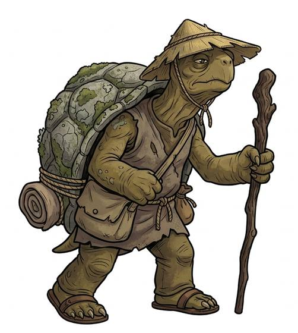

# Turtlefolk

{.illus}

*Set: Core*

*aka: ______________________________*

*Family: [Reptilian](../Species_Families/reptilian.md)*

Upright people with shells on their backs and fronts, plated like armour that grew rather than was made. They are heavy, calm and very hard to hurt. When danger comes, many simply pull in their heads and limbs and wait for it to pass, which works more often than the attackers expect.

They are slow on land. Land tortoises plod through deserts at the pace of a funeral; sea turtles glide across oceans but stumble on the beach. They live a very long time and have long views to match: they plant trees for their grandchildren and hold grudges for a century. A few rare lines are, against every expectation, astonishingly fast. Others think of turtlefolk as wise, stubborn and slightly dull, and they rarely bother to argue.

## Not to be confused with

the *[lizardfolk](reptilian-lizardfolk.md)*, scaled and tailed, quicker and more varied, but without the shell.

## What sets this species apart

Shelled folk: armoured and slow on land. The swift breed Sets Super Speed at Breed/Race level, which outweighs the Running penalty.

## Breeds and races

Each block below is one set of numbers; breeds that share every number share a block (Species rules, rule 9). Attributes are final modifiers, the size trade-off included. Skills, powers and weapon groups are final levels after the family, species and breed layers.

### No. 664 Turtle-folk · No. 666 Mutant turtle folk *(genres: beast-folk: scales, feathers and shells; starter)*

- **Size:** medium · **Body:** biped+shelled
- **What it's like:** Slow, patient shelled folk who can tuck in and shrug off blows. (looks like: turtle; good at: toughness, swimming, wilderness)
- **Attributes:** STR +1 AGI −1 END +2 CHA −1
- **Skills:** [Survival: Jungle & Swamp](../Skills/survival-jungle-and-swamp.md) +2, [Composure](../Skills/composure.md) +1, [Pain Tolerance](../Skills/pain-tolerance.md) +1, [Stealth](../Skills/stealth.md) +1, [Survival: Desert](../Skills/survival-desert.md) +1, [Swimming](../Skills/swimming.md) +1, [Carousing](../Skills/carousing.md) −1, [Charm & Seduction](../Skills/charm-and-seduction.md) −1, [Running](../Skills/running.md) −1, [Survival: Arctic](../Skills/survival-arctic.md) −3
- **Powers:** [Armour Skin](../Powers/armour-skin.md) 2
- **Natural attacks:** beak 1d6
- **For the Game Master only, this race as an NPC guard or soldier (not your character's numbers):** Attack 14 · Parry 11 · Dodge 7 · Damage longsword 1d6+2; beak 1d6+1 · Armour 2 · Life 19 · Threat 2 ([Bestiary roles](../bestiary.md))
- *Turtle-folk:* Withdraw into the shell and live long.
- *Note (Turtle-folk):* Lifespan (long-lived) is a lexicon detail, not a game number.
- *Note (Mutant turtle folk):* The mutagen origin is backstory and their martial training belongs to Profession.

### No. 665 Tortoise-folk *(genres: beast-folk: scales, feathers and shells)*

- **Size:** medium · **Body:** biped+shelled
- **What it's like:** Domed, heavily-shelled tortoise folk who live for centuries but never seem to be in a rush. (looks like: tortoise; good at: toughness, knowledge)
- **Attributes:** STR +1 AGI −2 END +2 WIS +1 CHA −1
- **Skills:** [Survival: Desert](../Skills/survival-desert.md) +2, [Survival: Jungle & Swamp](../Skills/survival-jungle-and-swamp.md) +2, [Composure](../Skills/composure.md) +1, [Pain Tolerance](../Skills/pain-tolerance.md) +1, [Stealth](../Skills/stealth.md) +1, [Swimming](../Skills/swimming.md) +1, [Carousing](../Skills/carousing.md) −1, [Charm & Seduction](../Skills/charm-and-seduction.md) −1, [Running](../Skills/running.md) −2, [Survival: Arctic](../Skills/survival-arctic.md) −3
- **Powers:** [Armour Skin](../Powers/armour-skin.md) 2
- **Natural attacks:** beak 1d6
- **For the Game Master only, this race as an NPC guard or soldier (not your character's numbers):** Attack 13 · Parry 10 · Dodge 6 · Damage longsword 1d6+2; beak 1d6+1 · Armour 2 · Life 19 · Threat 2 ([Bestiary roles](../bestiary.md))
- *Why:* Heavy-domed desert tortoises: extremely long-lived and very slow.
- *Note:* Lifespan (very long-lived) is a lexicon detail, not a game number.

### Sea turtle-folk *(NPC only)*

- **Size:** large · **Body:** aquatic+shelled
- **Attributes:** STR +3 AGI −2 END +2 CHA −1
- **Skills:** [Swimming](../Skills/swimming.md) +3, [Survival: Jungle & Swamp](../Skills/survival-jungle-and-swamp.md) +2, [Composure](../Skills/composure.md) +1, [Pain Tolerance](../Skills/pain-tolerance.md) +1, [Stealth](../Skills/stealth.md) +1, [Survival: Desert](../Skills/survival-desert.md) +1, [Wayfinding](../Skills/wayfinding.md) +1, [Carousing](../Skills/carousing.md) −1, [Charm & Seduction](../Skills/charm-and-seduction.md) −1, [Running](../Skills/running.md) −2, [Survival: Arctic](../Skills/survival-arctic.md) −3
- **Powers:** [Armour Skin](../Powers/armour-skin.md) 2
- **Natural attacks:** beak 1d6
- **For the Game Master only, this race as an NPC guard or soldier (not your character's numbers):** Attack 14 · Parry — · Dodge 5 · Damage beak 1d6+1 · Armour 1 · Life 21 · Threat minor ([Bestiary roles](../bestiary.md))
- *Why:* Flippered ocean migrants: superb swimmers, clumsy ashore.
- *Note:* Flipper limbs. No hands: held weapons unusable.

### No. 667 Swift turtle-folk *(high-power: Game Master's approval; genres: super-powered: mutants and the enhanced)*

- **Size:** medium · **Body:** biped
- **What it's like:** Shelled turtle folk who defy the slow stereotype completely, running at superhuman speed. (looks like: turtle; good at: speed and agility, toughness)
- **Attributes:** STR +1 END +2 CHA −1
- **Skills:** [Survival: Jungle & Swamp](../Skills/survival-jungle-and-swamp.md) +2, [Composure](../Skills/composure.md) +1, [Pain Tolerance](../Skills/pain-tolerance.md) +1, [Stealth](../Skills/stealth.md) +1, [Survival: Desert](../Skills/survival-desert.md) +1, [Swimming](../Skills/swimming.md) +1, [Carousing](../Skills/carousing.md) −1, [Charm & Seduction](../Skills/charm-and-seduction.md) −1, [Running](../Skills/running.md) −1, [Survival: Arctic](../Skills/survival-arctic.md) −3
- **Powers:** [Armour Skin](../Powers/armour-skin.md) 2, [Super Speed](../Powers/super-speed.md) 2
- **Natural attacks:** beak 1d6
- **For the Game Master only, this race as an NPC guard or soldier (not your character's numbers):** Attack 16 · Parry 13 · Dodge 8 · Damage longsword 1d6+2; beak 1d6+1 · Armour 2 · Life 19 · Threat 2 ([Bestiary roles](../bestiary.md))
- *Why:* Innate superhuman running speed.
- *Note:* Super Speed outweighs the species' Running penalty, as the species note intends. High-power (Game Master's approval): suits super-powered or mythic campaigns.

