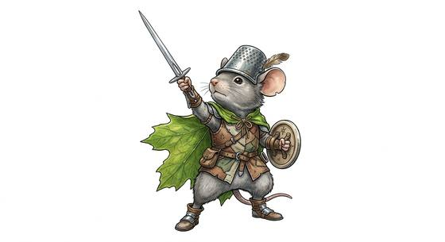

# Mouse and squirrel-kind

{.illus}

*Set: Core*

*aka: ______________________________*

*Family: [Rodent](../Species_Families/rodent.md)*

Small rodent folk with big ears, bright eyes and quick feet. Mice are tiny, watchful and brave despite it: farmers, cooks, abbey folk and, in some lands, sworn guards with needle-sharp blades and grey cloaks who patrol a world where everything is bigger than they are. Squirrels are climbers and jumpers with bushy tails that steer them through the treetops, and cheeks that carry a winter's worth of nuts.

They hear everything, notice everything and are gone before the danger arrives. Most live in close communities and look after their own. Bigger peoples tend to think of them as sweet and harmless, which is exactly the impression most of them prefer.

## Not to be confused with

the *[rat-kind](rodent-rat-kind.md)*, larger rodent folk with a keen nose, at home in sewers and tunnels rather than fields and trees.

## What sets this species apart

Mice and squirrels: sharp-eared, watchful and quick to leap.

## Breeds and races

Each block below is one set of numbers; breeds that share every number share a block (Species rules, rule 9). Attributes are final modifiers, the size trade-off included. Skills, powers and weapon groups are final levels after the family, species and breed layers.

### No. 679 Mouse-folk · No. 682 Civic rodent folk *(genres: animal fable; starter)*

- **Size:** tiny · **Body:** biped+tailed
- **What it's like:** Tiny, quick mouse people who are braver than anyone expects them to be. (looks like: mouse; good at: sneaking, speed and agility, keen senses)
- **Attributes:** STR −3 AGI +3 END +1 WIS +1 PER +1 COU −1
- **Skills:** [Scavenging](../Skills/scavenging.md) +2, [Stealth](../Skills/stealth.md) +2, [Climbing](../Skills/climbing.md) +1, [Escape Artistry](../Skills/escape-artistry.md) +1, [Jumping](../Skills/jumping.md) +1, [Survival: Ruins & Wasteland](../Skills/survival-ruins-and-wasteland.md) +1, [Etiquette](../Skills/etiquette.md) −1, [Intimidation](../Skills/intimidation.md) −2, [Lifting & Carrying](../Skills/lifting-and-carrying.md) −2
- **Powers:** [Poison & Disease Immunity](../Powers/poison-and-disease-immunity.md) 1
- **Natural attacks:** bite 1d6+1
- **For the Game Master only, this race as an NPC guard or soldier (not your character's numbers):** Attack 13 · Parry 10 · Dodge 13 · Damage longsword 1d6+1; bite 1d6-2 · Armour 2 · Life 14 · Threat 1 ([Bestiary roles](../bestiary.md))

### No. 680 Frontier guard mouse-folk *(genres: animal fable)*

- **Size:** tiny · **Body:** biped+tailed
- **What it's like:** Tiny, cloaked mouse-folk guards who face down much bigger predators with small blades and big courage. (looks like: mouse; good at: sneaking, fighting)
- **Attributes:** STR −3 AGI +3 END +1 WIS +1 PER +1 COU +1
- **Skills:** [Scavenging](../Skills/scavenging.md) +2, [Stealth](../Skills/stealth.md) +2, [Climbing](../Skills/climbing.md) +1, [Escape Artistry](../Skills/escape-artistry.md) +1, [Jumping](../Skills/jumping.md) +1, [Survival: Ruins & Wasteland](../Skills/survival-ruins-and-wasteland.md) +1, [Etiquette](../Skills/etiquette.md) −1, [Intimidation](../Skills/intimidation.md) −2, [Lifting & Carrying](../Skills/lifting-and-carrying.md) −2
- **Powers:** [Poison & Disease Immunity](../Powers/poison-and-disease-immunity.md) 1
- **Natural attacks:** bite 1d6+1
- **For the Game Master only, this race as an NPC guard or soldier (not your character's numbers):** Attack 14 · Parry 11 · Dodge 13 · Damage longsword 1d6+1; bite 1d6-2 · Armour 2 · Life 14 · Threat 1 ([Bestiary roles](../bestiary.md))
- *Note:* Blade skill belongs to the weapon-group pass.

### No. 681 Peaceable abbey mouse-folk *(genres: animal fable)*

- **Size:** small · **Body:** biped+tailed
- **What it's like:** Small, peaceable mouse-folk farmers and cooks who can still fight hard if truly pushed. (looks like: mouse; good at: sneaking, keen senses)
- **Attributes:** STR −2 AGI +2 END +1 WIS +1 PER +1
- **Skills:** [Scavenging](../Skills/scavenging.md) +2, [Stealth](../Skills/stealth.md) +2, [Climbing](../Skills/climbing.md) +1, [Cooking](../Skills/cooking.md) +1, [Escape Artistry](../Skills/escape-artistry.md) +1, [Jumping](../Skills/jumping.md) +1, [Survival: Ruins & Wasteland](../Skills/survival-ruins-and-wasteland.md) +1, [Etiquette](../Skills/etiquette.md) −1, [Intimidation](../Skills/intimidation.md) −2, [Lifting & Carrying](../Skills/lifting-and-carrying.md) −2
- **Powers:** [Poison & Disease Immunity](../Powers/poison-and-disease-immunity.md) 1
- **Natural attacks:** bite 1d6+1
- **For the Game Master only, this race as an NPC guard or soldier (not your character's numbers):** Attack 14 · Parry 11 · Dodge 11 · Damage longsword 1d6+1; bite 1d6-1 · Armour 2 · Life 16 · Threat 1 ([Bestiary roles](../bestiary.md))
- *Why:* A peaceable people of cooks and feasts.

### No. 683 Squirrel-folk *(genres: animal fable)*

- **Size:** small · **Body:** biped+tailed
- **What it's like:** Bushy-tailed squirrel folk, superb climbers and jumpers who never stop hoarding food. (looks like: squirrel; good at: climbing, speed and agility)
- **Attributes:** STR −2 AGI +2 END +1 WIS +1 PER +1 COU −1
- **Skills:** [Climbing](../Skills/climbing.md) +3, [Scavenging](../Skills/scavenging.md) +2, [Stealth](../Skills/stealth.md) +2, [Balance](../Skills/balance.md) +1, [Escape Artistry](../Skills/escape-artistry.md) +1, [Jumping](../Skills/jumping.md) +1, [Smuggling & Concealment](../Skills/smuggling-and-concealment.md) +1, [Survival: Ruins & Wasteland](../Skills/survival-ruins-and-wasteland.md) +1, [Etiquette](../Skills/etiquette.md) −1, [Intimidation](../Skills/intimidation.md) −2, [Lifting & Carrying](../Skills/lifting-and-carrying.md) −2
- **Powers:** [Poison & Disease Immunity](../Powers/poison-and-disease-immunity.md) 1
- **Natural attacks:** bite 1d6+1
- **For the Game Master only, this race as an NPC guard or soldier (not your character's numbers):** Attack 13 · Parry 10 · Dodge 11 · Damage longsword 1d6+1; bite 1d6-1 · Armour 2 · Life 16 · Threat 1 ([Bestiary roles](../bestiary.md))
- *Why:* An excellent climber with a balancing tail and cheek pouches.

### Squirrel-folk forest dwellers *(NPC only)*

- **Size:** small · **Body:** biped+tailed
- **Attributes:** STR −2 AGI +2 END +1 WIS +1 PER +1 COU −1
- **Skills:** [Climbing](../Skills/climbing.md) +3, [Scavenging](../Skills/scavenging.md) +2, [Stealth](../Skills/stealth.md) +2, [Escape Artistry](../Skills/escape-artistry.md) +1, [Jumping](../Skills/jumping.md) +1, [Survival: Forest (Woodcraft)](../Skills/survival-forest-woodcraft.md) +1, [Survival: Ruins & Wasteland](../Skills/survival-ruins-and-wasteland.md) +1, [Etiquette](../Skills/etiquette.md) −1, [Intimidation](../Skills/intimidation.md) −2, [Lifting & Carrying](../Skills/lifting-and-carrying.md) −2
- **Powers:** [Poison & Disease Immunity](../Powers/poison-and-disease-immunity.md) 1
- **Natural attacks:** bite 1d6+1
- **For the Game Master only, this race as an NPC guard or soldier (not your character's numbers):** Attack 13 · Parry 10 · Dodge 11 · Damage longsword 1d6+1; bite 1d6-1 · Armour 2 · Life 16 · Threat 1 ([Bestiary roles](../bestiary.md))
- *Why:* Treetop climbers of the forest.

### Flying squirrel-folk *(NPC only)*

- **Size:** small · **Body:** biped+winged
- **Attributes:** STR −2 AGI +2 END +1 WIS +1 PER +1 COU −1
- **Skills:** [Climbing](../Skills/climbing.md) +3, [Parachuting & Gliding](../Skills/parachuting-and-gliding.md) +2, [Scavenging](../Skills/scavenging.md) +2, [Stealth](../Skills/stealth.md) +2, [Escape Artistry](../Skills/escape-artistry.md) +1, [Jumping](../Skills/jumping.md) +1, [Survival: Ruins & Wasteland](../Skills/survival-ruins-and-wasteland.md) +1, [Etiquette](../Skills/etiquette.md) −1, [Intimidation](../Skills/intimidation.md) −2, [Lifting & Carrying](../Skills/lifting-and-carrying.md) −2
- **Powers:** [Poison & Disease Immunity](../Powers/poison-and-disease-immunity.md) 1
- **Natural attacks:** bite 1d6+1
- **For the Game Master only, this race as an NPC guard or soldier (not your character's numbers):** Attack 13 · Parry 10 · Dodge 11 · Damage longsword 1d6+1; bite 1d6-1 · Armour 2 · Life 16 · Threat 1 ([Bestiary roles](../bestiary.md))
- *Why:* Glides on skin membranes between the treetops.

