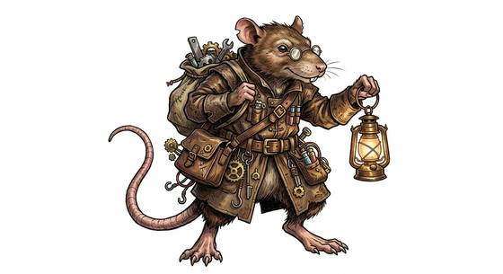

# Rat-kind

{.illus}

*Set: Core*

*aka: ______________________________*

*Family: [Rodent](../Species_Families/rodent.md)*

Rat-built people with long bare tails, twitching whiskers and sharp front teeth that never stop growing. Their noses are extraordinary: they can smell rot through a wall, a thief's fear across a crowded room, and fresh bread three streets away. They thrive where others would sicken, shrug off illness and dirt, and find their way through sewers, cellars and tunnels as easily as others walk a road.

They are adaptable, numerous and clever, and their cultures vary as much as any. Some are loyal members of city guilds, some honourable knights, some quiet labourers, and some plague-worshipping warrens that everyone else fears. Others treat rat-kind with suspicion, which rat-kind mostly return, and which they have found useful to exploit.

## Not to be confused with

the *[mouse and squirrel-kind](rodent-mouse-and-squirrel-kind.md)*, smaller and gentler rodent folk with sharp ears, where rat-kind are known for the nose and the underground.

## What sets this species apart

Rats: a keen nose, and at home in sewers and tunnels beneath towns.

## Breeds and races

Each block below is one set of numbers; breeds that share every number share a block (Species rules, rule 9). Attributes are final modifiers, the size trade-off included. Skills, powers and weapon groups are final levels after the family, species and breed layers.

### No. 673 Rat-folk *(genres: beast-folk: fur; starter)*

- **Size:** small · **Body:** biped+tailed
- **What it's like:** Small, clever rat people who survive anywhere by wits, teamwork and a keen nose. (looks like: rat; good at: sneaking, speed and agility, climbing)
- **Attributes:** STR −2 AGI +2 END +1 WIS +1 COU −1
- **Skills:** [Scavenging](../Skills/scavenging.md) +2, [Stealth](../Skills/stealth.md) +2, [Climbing](../Skills/climbing.md) +1, [Escape Artistry](../Skills/escape-artistry.md) +1, [Streetwise](../Skills/streetwise.md) +1, [Survival: Caves & Underground](../Skills/survival-caves-and-underground.md) +1, [Survival: Ruins & Wasteland](../Skills/survival-ruins-and-wasteland.md) +1, [Tracking](../Skills/tracking.md) +1, [Etiquette](../Skills/etiquette.md) −1, [Intimidation](../Skills/intimidation.md) −2, [Lifting & Carrying](../Skills/lifting-and-carrying.md) −2
- **Powers:** [Poison & Disease Immunity](../Powers/poison-and-disease-immunity.md) 1
- **Natural attacks:** bite 1d6+1
- **For the Game Master only, this race as an NPC guard or soldier (not your character's numbers):** Attack 13 · Parry 10 · Dodge 11 · Damage longsword 1d6+1; bite 1d6-1 · Armour 2 · Life 16 · Threat 1 ([Bestiary roles](../bestiary.md))
- *Why:* Town rats at home in the streets.

### No. 674 Chaos rat-man horde *(genres: dark fantasy)*

- **Size:** medium · **Body:** biped
- **What it's like:** Numerous, cunning rat-folk, twisted by dark corruption and dangerous mainly in overwhelming numbers. (looks like: rat; good at: sneaking, powers and magic)
- **Attributes:** STR −1 AGI +1 END +1 INT +1 WIS +1 COU −1
- **Skills:** [Scavenging](../Skills/scavenging.md) +2, [Stealth](../Skills/stealth.md) +2, [Climbing](../Skills/climbing.md) +1, [Deception](../Skills/deception.md) +1, [Escape Artistry](../Skills/escape-artistry.md) +1, [Survival: Caves & Underground](../Skills/survival-caves-and-underground.md) +1, [Survival: Ruins & Wasteland](../Skills/survival-ruins-and-wasteland.md) +1, [Tracking](../Skills/tracking.md) +1, [Composure](../Skills/composure.md) −1, [Etiquette](../Skills/etiquette.md) −1, [Intimidation](../Skills/intimidation.md) −2, [Lifting & Carrying](../Skills/lifting-and-carrying.md) −2
- **Powers:** [Poison & Disease Immunity](../Powers/poison-and-disease-immunity.md) 1
- **Natural attacks:** bite 1d6+1
- **For the Game Master only, this race as an NPC guard or soldier (not your character's numbers):** Attack 13 · Parry 10 · Dodge 9 · Damage longsword 1d6+2; bite 1d6+2 · Armour 2 · Life 18 · Threat 1 ([Bestiary roles](../bestiary.md))
- *Why:* Corrupted, cowardly and treacherous.

### No. 675 Small rat-folk labourer · No. 678 Civilization-founding rat folk · Underworld rat faction folk *(genres: beast-folk: fur)*

- **Size:** small · **Body:** biped
- **What it's like:** Small, quick-breeding rat-folk labourers, resourceful and often looked down on unfairly. (looks like: rat; good at: sneaking, keen senses)
- **Attributes:** STR −2 AGI +2 END +1 WIS +1 COU −1
- **Skills:** [Scavenging](../Skills/scavenging.md) +2, [Stealth](../Skills/stealth.md) +2, [Climbing](../Skills/climbing.md) +1, [Escape Artistry](../Skills/escape-artistry.md) +1, [Survival: Caves & Underground](../Skills/survival-caves-and-underground.md) +1, [Survival: Ruins & Wasteland](../Skills/survival-ruins-and-wasteland.md) +1, [Tracking](../Skills/tracking.md) +1, [Etiquette](../Skills/etiquette.md) −1, [Intimidation](../Skills/intimidation.md) −2, [Lifting & Carrying](../Skills/lifting-and-carrying.md) −2
- **Powers:** [Poison & Disease Immunity](../Powers/poison-and-disease-immunity.md) 1
- **Natural attacks:** bite 1d6+1
- **For the Game Master only, this race as an NPC guard or soldier (not your character's numbers):** Attack 13 · Parry 10 · Dodge 11 · Damage longsword 1d6+1; bite 1d6-1 · Armour 2 · Life 16 · Threat 1 ([Bestiary roles](../bestiary.md))

### Mutant rat sensei *(NPC only)*

- **Size:** medium · **Body:** biped
- **Attributes:** STR −1 AGI +2 END +1 WIS +3 COU +1
- **Skills:** [Scavenging](../Skills/scavenging.md) +2, [Stealth](../Skills/stealth.md) +2, [Climbing](../Skills/climbing.md) +1, [Escape Artistry](../Skills/escape-artistry.md) +1, [Survival: Caves & Underground](../Skills/survival-caves-and-underground.md) +1, [Survival: Ruins & Wasteland](../Skills/survival-ruins-and-wasteland.md) +1, [Tracking](../Skills/tracking.md) +1, [Etiquette](../Skills/etiquette.md) −1, [Intimidation](../Skills/intimidation.md) −2, [Lifting & Carrying](../Skills/lifting-and-carrying.md) −2
- **Powers:** [Poison & Disease Immunity](../Powers/poison-and-disease-immunity.md) 1
- **Natural attacks:** bite 1d6+1
- **For the Game Master only, this race as an NPC guard or soldier (not your character's numbers):** Attack 14 · Parry 11 · Dodge 10 · Damage longsword 1d6+2; bite 1d6+2 · Armour 2 · Life 18 · Threat 1 ([Bestiary roles](../bestiary.md))
- *Note:* Martial skill is Profession, not breed. NPC.

### Mechanized rat mutant *(NPC only)*

- **Size:** medium · **Body:** biped+tailed
- **Attributes:** STR −1 AGI +1 END +1 INT +1 WIS +1 COU −1
- **Skills:** [Scavenging](../Skills/scavenging.md) +2, [Stealth](../Skills/stealth.md) +2, [Climbing](../Skills/climbing.md) +1, [Escape Artistry](../Skills/escape-artistry.md) +1, [Survival: Caves & Underground](../Skills/survival-caves-and-underground.md) +1, [Survival: Ruins & Wasteland](../Skills/survival-ruins-and-wasteland.md) +1, [Tracking](../Skills/tracking.md) +1, [Etiquette](../Skills/etiquette.md) −1, [Intimidation](../Skills/intimidation.md) −2, [Lifting & Carrying](../Skills/lifting-and-carrying.md) −2
- **Powers:** [Poison & Disease Immunity](../Powers/poison-and-disease-immunity.md) 1
- **Natural attacks:** bite 1d6+1
- **For the Game Master only, this race as an NPC guard or soldier (not your character's numbers):** Attack 13 · Parry 10 · Dodge 9 · Damage longsword 1d6+2; bite 1d6+2 · Armour 2 · Life 18 · Threat 1 ([Bestiary roles](../bestiary.md))
- *Note:* Mechanical parts are gear. NPC.

### No. 676 Sewer-dwelling rat folk *(genres: space opera: beast-like aliens)*

- **Size:** small · **Body:** biped
- **What it's like:** Sharp-toothed rat-folk perfectly at home in the filthiest sewers and tunnels. (looks like: rat; good at: sneaking, toughness)
- **Attributes:** STR −2 AGI +2 END +1 WIS +1 COU −1
- **Skills:** [Scavenging](../Skills/scavenging.md) +2, [Stealth](../Skills/stealth.md) +2, [Climbing](../Skills/climbing.md) +1, [Escape Artistry](../Skills/escape-artistry.md) +1, [Survival: Caves & Underground](../Skills/survival-caves-and-underground.md) +1, [Survival: Ruins & Wasteland](../Skills/survival-ruins-and-wasteland.md) +1, [Tracking](../Skills/tracking.md) +1, [Etiquette](../Skills/etiquette.md) −1, [Intimidation](../Skills/intimidation.md) −2, [Lifting & Carrying](../Skills/lifting-and-carrying.md) −2
- **Powers:** [Poison & Disease Immunity](../Powers/poison-and-disease-immunity.md) 2
- **Natural attacks:** bite 1d6+1
- **For the Game Master only, this race as an NPC guard or soldier (not your character's numbers):** Attack 13 · Parry 10 · Dodge 11 · Damage longsword 1d6+1; bite 1d6-1 · Armour 2 · Life 16 · Threat 1 ([Bestiary roles](../bestiary.md))
- *Why:* Thrives in filth that would sicken other rats.

### No. 677 Spear-wielding rat-folk kingdom *(genres: beast-folk: fur)*

- **Size:** medium · **Body:** biped+tailed
- **What it's like:** Spear-carrying rat-folk knights with an honourable culture that turns the usual rat stereotype on its head. (looks like: rat; good at: fighting, speed and agility)
- **Attributes:** STR −1 AGI +1 END +1 WIS +1
- **Skills:** [Scavenging](../Skills/scavenging.md) +2, [Stealth](../Skills/stealth.md) +2, [Climbing](../Skills/climbing.md) +1, [Escape Artistry](../Skills/escape-artistry.md) +1, [Survival: Caves & Underground](../Skills/survival-caves-and-underground.md) +1, [Survival: Ruins & Wasteland](../Skills/survival-ruins-and-wasteland.md) +1, [Tracking](../Skills/tracking.md) +1, [Intimidation](../Skills/intimidation.md) −2, [Lifting & Carrying](../Skills/lifting-and-carrying.md) −2
- **Powers:** [Poison & Disease Immunity](../Powers/poison-and-disease-immunity.md) 1
- **Natural attacks:** bite 1d6+1
- **For the Game Master only, this race as an NPC guard or soldier (not your character's numbers):** Attack 14 · Parry 11 · Dodge 9 · Damage longsword 1d6+2; bite 1d6+2 · Armour 2 · Life 18 · Threat 1 ([Bestiary roles](../bestiary.md))
- *Why:* An honourable, knightly people.

### Assassin-cult ratfolk clan *(NPC only)*

- **Size:** medium · **Body:** biped+tailed
- **Attributes:** STR −1 AGI +3 END −1 WIS +1 COU −1
- **Skills:** [Scavenging](../Skills/scavenging.md) +2, [Stealth](../Skills/stealth.md) +2, [Climbing](../Skills/climbing.md) +1, [Escape Artistry](../Skills/escape-artistry.md) +1, [Poisons & Antidotes](../Skills/poisons-and-antidotes.md) +1, [Survival: Caves & Underground](../Skills/survival-caves-and-underground.md) +1, [Survival: Ruins & Wasteland](../Skills/survival-ruins-and-wasteland.md) +1, [Tracking](../Skills/tracking.md) +1, [Etiquette](../Skills/etiquette.md) −1, [Intimidation](../Skills/intimidation.md) −2, [Lifting & Carrying](../Skills/lifting-and-carrying.md) −2
- **Powers:** [Poison & Disease Immunity](../Powers/poison-and-disease-immunity.md) 1, [Shadow Shaping](../Powers/shadow-shaping.md) 1
- **Natural attacks:** bite 1d6+1
- **For the Game Master only, this race as an NPC guard or soldier (not your character's numbers):** Attack 14 · Parry 11 · Dodge 11 · Damage longsword 1d6+2; bite 1d6+2 · Armour 2 · Life 16 · Threat 1 ([Bestiary roles](../bestiary.md))
- *Why:* A poisoner clan with innate shadow magic.

### Beast-breeder ratfolk clan *(NPC only)*

- **Size:** medium · **Body:** biped+tailed
- **Attributes:** STR −1 AGI +1 END +1 INT +1 WIS +1 COU −1
- **Skills:** [Scavenging](../Skills/scavenging.md) +2, [Stealth](../Skills/stealth.md) +2, [Climbing](../Skills/climbing.md) +1, [Escape Artistry](../Skills/escape-artistry.md) +1, [Exotic Beasts](../Skills/exotic-beasts.md) +1, [Survival: Caves & Underground](../Skills/survival-caves-and-underground.md) +1, [Survival: Ruins & Wasteland](../Skills/survival-ruins-and-wasteland.md) +1, [Tracking](../Skills/tracking.md) +1, [Etiquette](../Skills/etiquette.md) −1, [Intimidation](../Skills/intimidation.md) −2, [Lifting & Carrying](../Skills/lifting-and-carrying.md) −2
- **Powers:** [Poison & Disease Immunity](../Powers/poison-and-disease-immunity.md) 1
- **Natural attacks:** bite 1d6+1
- **For the Game Master only, this race as an NPC guard or soldier (not your character's numbers):** Attack 13 · Parry 10 · Dodge 9 · Damage longsword 1d6+2; bite 1d6+2 · Armour 2 · Life 18 · Threat 1 ([Bestiary roles](../bestiary.md))
- *Why:* A clan of monster-breeders.

### Plague-cult ratfolk clan *(NPC only)*

- **Size:** medium · **Body:** biped+tailed
- **Attributes:** STR −1 AGI +1 END +3 WIS +1 CHA −2 COU −1
- **Skills:** [Scavenging](../Skills/scavenging.md) +2, [Stealth](../Skills/stealth.md) +2, [Climbing](../Skills/climbing.md) +1, [Escape Artistry](../Skills/escape-artistry.md) +1, [Survival: Caves & Underground](../Skills/survival-caves-and-underground.md) +1, [Survival: Ruins & Wasteland](../Skills/survival-ruins-and-wasteland.md) +1, [Tracking](../Skills/tracking.md) +1, [Etiquette](../Skills/etiquette.md) −1, [Intimidation](../Skills/intimidation.md) −2, [Lifting & Carrying](../Skills/lifting-and-carrying.md) −2
- **Powers:** [Poison & Disease Immunity](../Powers/poison-and-disease-immunity.md) 3, [Disease](../Powers/disease.md) 1
- **Natural attacks:** bite 1d6+1
- **For the Game Master only, this race as an NPC guard or soldier (not your character's numbers):** Attack 13 · Parry 10 · Dodge 9 · Damage longsword 1d6+2; bite 1d6+2 · Armour 2 · Life 20 · Threat 1 ([Bestiary roles](../bestiary.md))
- *Why:* Immune to its own plagues and spreads them.

### Warlock-engineer ratfolk clan *(NPC only)*

- **Size:** medium · **Body:** biped+tailed
- **Attributes:** STR −1 AGI +1 END +1 INT +2 COU −1
- **Skills:** [Scavenging](../Skills/scavenging.md) +2, [Stealth](../Skills/stealth.md) +2, [Climbing](../Skills/climbing.md) +1, [Escape Artistry](../Skills/escape-artistry.md) +1, [Jury-Rigging](../Skills/jury-rigging.md) +1, [Survival: Caves & Underground](../Skills/survival-caves-and-underground.md) +1, [Survival: Ruins & Wasteland](../Skills/survival-ruins-and-wasteland.md) +1, [Tracking](../Skills/tracking.md) +1, [Etiquette](../Skills/etiquette.md) −1, [Intimidation](../Skills/intimidation.md) −2, [Lifting & Carrying](../Skills/lifting-and-carrying.md) −2
- **Powers:** [Poison & Disease Immunity](../Powers/poison-and-disease-immunity.md) 1
- **Natural attacks:** bite 1d6+1
- **For the Game Master only, this race as an NPC guard or soldier (not your character's numbers):** Attack 13 · Parry 10 · Dodge 9 · Damage longsword 1d6+2; bite 1d6+2 · Armour 2 · Life 18 · Threat 1 ([Bestiary roles](../bestiary.md))
- *Why:* A clan of reckless inventors.
- *Note:* Their weapons and machines are gear. NPC.

