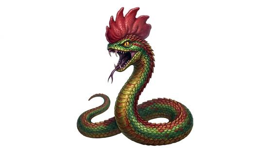

# Bestiary serpent

{.illus}

*Set: Expansion*

*aka: ______________________________*

*Family: [Serpentine](../Species_Families/serpentine.md)*

Small monster-serpents out of the old bestiaries, no longer than a man's arm and a great deal more dangerous than their size. They have no minds worth speaking of and no hands, only instinct, venom and something unnatural about them. One kind has a head at each end and slides either way without turning. Another, the most feared of all, carries death in its gaze or its breath, and the grass withers along its trail.

They haunt deserts, ruins and the wells of abandoned towns. Travellers carry mirrors, roosters or strange charms against them, and scholars argue over which of the stories are true. The wise simply give any small, crowned or two-headed snake a very wide berth.

## Not to be confused with

*[Snake folk](serpentine-snake-folk.md)* think, speak and trade; the bestiary serpent is a small, mindless monster from the old tales, and its danger lies in its uncanny nature rather than its size.

## What sets this species apart

No shared difference: small non-sentient monster serpents; the basilisk's death gaze goes at Breed/Race level. Non-sentient NPC creatures. Too small to constrict. No hands: held weapons unusable.

## Breeds and races

Each block below is one set of numbers; breeds that share every number share a block (Species rules, rule 9). Attributes are final modifiers, the size trade-off included. Skills, powers and weapon groups are final levels after the family, species and breed layers.

### Death-gazing basilisk *(beast)*

- **Size:** small · **Body:** serpentine
- **Attributes:** STR −2 AGI +2 END −1 INT −3 CHA +1
- **Skills:** [Escape Artistry](../Skills/escape-artistry.md) +2, [Stealth](../Skills/stealth.md) +2, [Climbing](../Skills/climbing.md) +1, [Hypnotism](../Skills/hypnotism.md) +1, [Running](../Skills/running.md) −2, [Jumping](../Skills/jumping.md) −3, [Riding](../Skills/riding.md) Foreign Concept
- **Powers:** [Death Touch](../Powers/death-touch.md) 3, [Night & Spectrum Sight](../Powers/night-and-spectrum-sight.md) 1, [Poison Touch](../Powers/poison-touch.md) 1
- **Natural attacks:** bite 1d6+1
- **For the Game Master only, this race as an NPC guard or soldier (not your character's numbers):** Attack 14 · Parry — · Dodge 11 · Damage bite 1d4 · Armour 0 · Life 12 · Threat minor ([Bestiary roles](../bestiary.md))
- *Why:* Its gaze or breath kills.

### Forward-backward amphisbaena *(beast)*

- **Size:** small · **Body:** serpentine
- **Attributes:** STR −2 AGI +2 END −1 INT −3 WIS +1 PER +1 CHA +1
- **Skills:** [Escape Artistry](../Skills/escape-artistry.md) +2, [Stealth](../Skills/stealth.md) +2, [Climbing](../Skills/climbing.md) +1, [Hypnotism](../Skills/hypnotism.md) +1, [Running](../Skills/running.md) −2, [Jumping](../Skills/jumping.md) −3, [Riding](../Skills/riding.md) Foreign Concept
- **Powers:** [Night & Spectrum Sight](../Powers/night-and-spectrum-sight.md) 1, [Poison Touch](../Powers/poison-touch.md) 1
- **Natural attacks:** bite 1d6+1
- **For the Game Master only, this race as an NPC guard or soldier (not your character's numbers):** Attack 14 · Parry — · Dodge 11 · Damage bite 1d4 · Armour 0 · Life 12 · Threat minor ([Bestiary roles](../bestiary.md))
- *Why:* A head at each end: it watches and moves both ways.

