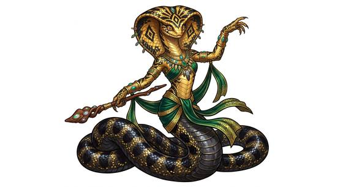

# Snake folk

{.illus}

*Set: Core*

*aka: ______________________________*

*Family: [Serpentine](../Species_Families/serpentine.md)*

Snake folk have the long, scaled body of a serpent and a mind as sharp as anyone's. Some rear upright on their coils with arms at the shoulder; others are serpents from snout to tail and handle the world with jaws and coils alone. Their lines follow the snakes of the wild: hooded folk who sway and flare, pit-faced folk who feel warmth in the dark, thick-bodied constrictors who crush, and slender swimmers of warm reefs.

They are patient, cold-mannered and easily misjudged. Many warm-blooded peoples fear them on sight, and they return that fear with quiet contempt. In the oldest ruins lie the traces of a serpent empire older than anyone's histories, and some snake folk still speak of it as if it were yesterday.

## Not to be confused with

*[Serpent-bodied folk](reptilian-serpent-bodied-folk.md)* are the reptilian family's snake-shaped peoples; snake folk belong to the serpentine family and take their venom, heat sense and coils straight from true snakes.

## What sets this species apart

No shared difference: the family already describes snake folk; venom strength, heat pits and constriction vary by breed.

## Breeds and races

Each block below is one set of numbers; breeds that share every number share a block (Species rules, rule 9). Attributes are final modifiers, the size trade-off included. Skills, powers and weapon groups are final levels after the family, species and breed layers.

### No. 691 Cobra-folk *(genres: beast-folk: scales, feathers and shells; starter)*

- **Size:** medium · **Body:** serpentine
- **What it's like:** Snake people with a venomous bite, a flaring hood and a hypnotic sway. (looks like: snake; good at: sneaking, powers and magic, fighting)
- **Attributes:** AGI +1 END −1 CHA +1
- **Skills:** [Escape Artistry](../Skills/escape-artistry.md) +2, [Hypnotism](../Skills/hypnotism.md) +2, [Stealth](../Skills/stealth.md) +2, [Climbing](../Skills/climbing.md) +1, [Intimidation](../Skills/intimidation.md) +1, [Running](../Skills/running.md) −2, [Jumping](../Skills/jumping.md) −3, [Riding](../Skills/riding.md) Foreign Concept
- **Powers:** [Night & Spectrum Sight](../Powers/night-and-spectrum-sight.md) 1, [Poison Touch](../Powers/poison-touch.md) 1
- **Weapon groups:** [Wrestling & Grappling](../Weapon_Groups/wrestling-and-grappling.md) +2
- **Natural attacks:** bite 1d6+1
- **For the Game Master only, this race as an NPC guard or soldier (not your character's numbers):** Attack 14 · Parry 11 · Dodge 9 · Damage longsword 1d6+2; bite 1d6+2 · Armour 2 · Life 16 · Threat 1 ([Bestiary roles](../bestiary.md))
- *Why:* Hood-flare threat display and a hypnotic sway.

### No. 692 Viper-folk *(genres: beast-folk: scales, feathers and shells)*

- **Size:** medium · **Body:** serpentine
- **What it's like:** Coiled viper-folk who strike fast with a potent venomous bite, sensing warm bodies in the dark. (looks like: snake; good at: fighting, keen senses)
- **Attributes:** AGI +2 END −1 CHA +1
- **Skills:** [Escape Artistry](../Skills/escape-artistry.md) +2, [Stealth](../Skills/stealth.md) +2, [Climbing](../Skills/climbing.md) +1, [Hypnotism](../Skills/hypnotism.md) +1, [Running](../Skills/running.md) −2, [Jumping](../Skills/jumping.md) −3, [Riding](../Skills/riding.md) Foreign Concept
- **Powers:** [Night & Spectrum Sight](../Powers/night-and-spectrum-sight.md) 2, [Poison Touch](../Powers/poison-touch.md) 2
- **Weapon groups:** [Wrestling & Grappling](../Weapon_Groups/wrestling-and-grappling.md) +2
- **Natural attacks:** bite 1d6+1
- **For the Game Master only, this race as an NPC guard or soldier (not your character's numbers):** Attack 14 · Parry — · Dodge 10 · Damage bite 1d6+1 · Armour 0 · Life 14 · Threat minor ([Bestiary roles](../bestiary.md))
- *Why:* Heat-sensing pits and potent venom.
- *Note:* Night & Spectrum Sight is heat sight. The limbless martial-artist lines are Profession. The limbless lines have no hands: held weapons unusable.

### No. 693 Python/constrictor-folk *(genres: beast-folk: scales, feathers and shells)*

- **Size:** large · **Body:** serpentine
- **What it's like:** Massive, muscular snake-folk who crush rather than bite, and can go a long time between meals. (looks like: snake; good at: strength, fighting)
- **Attributes:** STR +3 AGI −2 CHA +1
- **Skills:** [Escape Artistry](../Skills/escape-artistry.md) +2, [Stealth](../Skills/stealth.md) +2, [Climbing](../Skills/climbing.md) +1, [Hypnotism](../Skills/hypnotism.md) +1, [Running](../Skills/running.md) −2, [Jumping](../Skills/jumping.md) −3, [Riding](../Skills/riding.md) Foreign Concept
- **Powers:** [Endurance Without Need](../Powers/endurance-without-need.md) 1, [Night & Spectrum Sight](../Powers/night-and-spectrum-sight.md) 1
- **Weapon groups:** [Wrestling & Grappling](../Weapon_Groups/wrestling-and-grappling.md) +3
- **Natural attacks:** bite 1d6+1
- **For the Game Master only, this race as an NPC guard or soldier (not your character's numbers):** Attack 14 · Parry 11 · Dodge 5 · Damage longsword 1d6+2; bite 1d6+4 · Armour 2 · Life 21 · Threat 2 ([Bestiary roles](../bestiary.md))
- *Why:* Crushing constriction instead of venom, and a slow metabolism that feeds rarely.
- *Note:* The extra Wrestling & Grappling is the powerful constriction.

### Sea snake-folk *(NPC only)*

- **Size:** medium · **Body:** aquatic+serpentine
- **Attributes:** AGI +1 CHA +1
- **Skills:** [Swimming](../Skills/swimming.md) +3, [Diving](../Skills/diving.md) +2, [Escape Artistry](../Skills/escape-artistry.md) +2, [Stealth](../Skills/stealth.md) +2, [Climbing](../Skills/climbing.md) +1, [Hypnotism](../Skills/hypnotism.md) +1, [Running](../Skills/running.md) −2, [Jumping](../Skills/jumping.md) −3, [Riding](../Skills/riding.md) Foreign Concept
- **Powers:** [Poison Touch](../Powers/poison-touch.md) 2, [Night & Spectrum Sight](../Powers/night-and-spectrum-sight.md) 1
- **Weapon groups:** [Wrestling & Grappling](../Weapon_Groups/wrestling-and-grappling.md) +2
- **Natural attacks:** bite 1d6+1
- **For the Game Master only, this race as an NPC guard or soldier (not your character's numbers):** Attack 14 · Parry 11 · Dodge 9 · Damage longsword 1d6+2; bite 1d6+2 · Armour 2 · Life 17 · Threat 1 ([Bestiary roles](../bestiary.md))
- *Why:* Paddle-tailed reef swimmers with potent venom; they must surface to breathe.

### Rattlesnake-folk *(NPC only)*

- **Size:** medium · **Body:** serpentine
- **Attributes:** AGI +1 END −1 CHA +1
- **Skills:** [Escape Artistry](../Skills/escape-artistry.md) +2, [Stealth](../Skills/stealth.md) +2, [Survival: Desert](../Skills/survival-desert.md) +2, [Climbing](../Skills/climbing.md) +1, [Hypnotism](../Skills/hypnotism.md) +1, [Intimidation](../Skills/intimidation.md) +1, [Running](../Skills/running.md) −2, [Jumping](../Skills/jumping.md) −3, [Riding](../Skills/riding.md) Foreign Concept
- **Powers:** [Night & Spectrum Sight](../Powers/night-and-spectrum-sight.md) 2, [Poison Touch](../Powers/poison-touch.md) 1
- **Weapon groups:** [Wrestling & Grappling](../Weapon_Groups/wrestling-and-grappling.md) +2
- **Natural attacks:** bite 1d6+1
- **For the Game Master only, this race as an NPC guard or soldier (not your character's numbers):** Attack 14 · Parry 11 · Dodge 9 · Damage longsword 1d6+2; bite 1d6+2 · Armour 2 · Life 16 · Threat 1 ([Bestiary roles](../bestiary.md))
- *Why:* Desert rattlers with heat pits and a warning rattle.
- *Note:* Night & Spectrum Sight is heat sight.

### Giant serpent-folk *(beast)*

- **Size:** huge · **Body:** serpentine
- **Attributes:** STR +7 AGI −3 END +2 INT −3 CHA +1
- **Skills:** [Escape Artistry](../Skills/escape-artistry.md) +2, [Stealth](../Skills/stealth.md) +2, [Climbing](../Skills/climbing.md) +1, [Hypnotism](../Skills/hypnotism.md) +1, [Running](../Skills/running.md) −2, [Jumping](../Skills/jumping.md) −3, [Riding](../Skills/riding.md) Foreign Concept
- **Powers:** [Night & Spectrum Sight](../Powers/night-and-spectrum-sight.md) 1, [Poison Touch](../Powers/poison-touch.md) 1
- **Weapon groups:** [Wrestling & Grappling](../Weapon_Groups/wrestling-and-grappling.md) +3
- **Natural attacks:** bite 1d6+1
- **For the Game Master only, this race as an NPC guard or soldier (not your character's numbers):** Attack 15 · Parry — · Dodge 3 · Damage bite 2d6 · Armour 0 · Life 25 · Threat 1 ([Bestiary roles](../bestiary.md))
- *Why:* Monster serpent with crushing coils or heavier venom.

### Fire snake spirit *(NPC only)*

- **Size:** medium · **Body:** serpentine
- **Attributes:** AGI +1 END −1 WIS +2 CHA +1 COU +1
- **Skills:** [Escape Artistry](../Skills/escape-artistry.md) +2, [Stealth](../Skills/stealth.md) +2, [Climbing](../Skills/climbing.md) +1, [Hypnotism](../Skills/hypnotism.md) +1, [Survival: Forest (Woodcraft)](../Skills/survival-forest-woodcraft.md) +1, [Running](../Skills/running.md) −2, [Jumping](../Skills/jumping.md) −3, [Riding](../Skills/riding.md) Foreign Concept
- **Powers:** [Forest-Guarding](../Powers/forest-guarding.md) 2, [Resist Element](../Powers/resist-element.md) 2, [Fire Control](../Powers/fire-control.md) 1, [Night & Spectrum Sight](../Powers/night-and-spectrum-sight.md) 1, [Poison Touch](../Powers/poison-touch.md) 1
- **Weapon groups:** [Wrestling & Grappling](../Weapon_Groups/wrestling-and-grappling.md) +2
- **Natural attacks:** bite 1d6+1
- **For the Game Master only, this race as an NPC guard or soldier (not your character's numbers):** Attack 14 · Parry — · Dodge 9 · Damage bite 1d6+1 · Armour 0 · Life 14 · Threat minor ([Bestiary roles](../bestiary.md))
- *Why:* Fire-eyed forest guardian that punishes fire-setters.
- *Note:* Resist Element is fire. No hands: held weapons unusable.

### Ancient serpent empire folk *(NPC only)*

- **Size:** medium · **Body:** biped+tailed
- **Attributes:** AGI +1 END −1 INT +2 CHA +1
- **Skills:** [Escape Artistry](../Skills/escape-artistry.md) +2, [Stealth](../Skills/stealth.md) +2, [Climbing](../Skills/climbing.md) +1, [Hypnotism](../Skills/hypnotism.md) +1
- **Powers:** [Night & Spectrum Sight](../Powers/night-and-spectrum-sight.md) 1, [Poison Touch](../Powers/poison-touch.md) 1, [Suggestion](../Powers/suggestion.md) 1
- **Natural attacks:** bite 1d6+1
- **For the Game Master only, this race as an NPC guard or soldier (not your character's numbers):** Attack 14 · Parry 11 · Dodge 9 · Damage longsword 1d6+2; bite 1d6+2 · Armour 2 · Life 16 · Threat 1 ([Bestiary roles](../bestiary.md))
- *Why:* Legged, long-lived remnants of an ancient serpent empire with a minor hypnotic gaze.
- *Note:* Legs Mod Running and Jumping back and restore riding, per the family note. Suggestion is the gaze. Lifespan (long-lived) is a lexicon detail, not a game number. Legs, not coils: the family's constriction bonus is undone.

