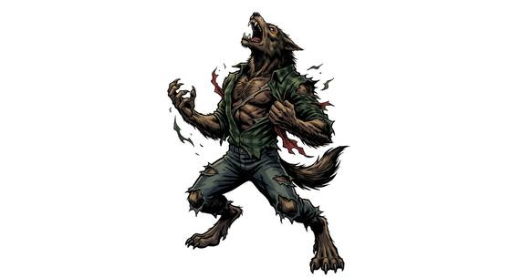

# Lycanthrope

{.illus}

*Set: Core*

*aka: ______________________________*

*Family: [Shapeshifter](../Species_Families/shapeshifter.md)*

People with a beast inside them. By day a lycanthrope looks like anyone else, perhaps a little hairier, a little hungrier, with a nose that notices too much. When the change comes, bones crack and stretch, fur or bristles push through the skin, and a wolf, a boar, a bear or a great cat stands where the person was.

Most carry a single beast and cannot choose another. Many change with the moon whether they like it or not, and some carry the curse in their bite. The hardest part is not the change but the temper that comes with it: the rage, the hunger, the urge to run and kill. Villages bar their doors on full-moon nights, and hunters keep a silver blade for luck.

## Not to be confused with

*[Werewolf-kind](shapeshifter-werewolf-kind.md)* live openly and change by their own will into a wolf alone; the lycanthrope carries any of several beasts, usually as a curse it struggles to master.

## What sets this species apart

They shift into one beast form rather than reshaping freely, keep a hunter's nose, and fight the beast's temper. The beast (wolf, boar, bear, big cat) and any moon trigger, silver weakness or regeneration are set per Breed.

## Breeds and races

Each block below is one set of numbers; breeds that share every number share a block (Species rules, rule 9). Attributes are final modifiers, the size trade-off included. Skills, powers and weapon groups are final levels after the family, species and breed layers.

### No. 696 Werewolf *(genres: gothic horror; starter)*

- **Size:** medium · **Body:** biped+tailed(shift)
- **What it's like:** An ordinary person by day who becomes a fierce wolf beast under the moon. (looks like: wolf; good at: powers and magic, keen senses, wilderness)
- **Attributes:** STR +1 AGI +1 END +1 WIS −1 CHA +1
- **Skills:** [Acting](../Skills/acting.md) +1, [Deception](../Skills/deception.md) +1, [Mimicry](../Skills/mimicry.md) +1, [Tracking](../Skills/tracking.md) +1, [Composure](../Skills/composure.md) −2
- **Powers:** [Animal Form](../Powers/animal-form.md) 3, [Enhanced Senses](../Powers/enhanced-senses.md) 2
- **For the Game Master only, this race as an NPC guard or soldier (not your character's numbers):** Attack 14 · Parry 11 · Dodge 9 · Damage longsword 1d6+2 · Armour 2 · Life 18 · Threat 1 ([Bestiary roles](../bestiary.md))
- *Why:* Its beast is the wolf, and it keeps the wolf's senses when shifted.
- *Note:* Enhanced Senses in wolf form. Moon-triggered change and silver weakness are flaws.

### No. 697 Wereboar *(genres: gothic horror)*

- **Size:** medium · **Body:** biped+tailed(shift)
- **What it's like:** People who shift into a tusked boar-warrior form and charge hard when the change takes them. (looks like: boar; good at: fighting, strength)
- **Attributes:** STR +1 AGI +1 END +1 WIS −1 CHA +1
- **Skills:** [Acting](../Skills/acting.md) +1, [Deception](../Skills/deception.md) +1, [Mimicry](../Skills/mimicry.md) +1, [Tracking](../Skills/tracking.md) +1, [Composure](../Skills/composure.md) −3
- **Powers:** [Animal Form](../Powers/animal-form.md) 3
- **For the Game Master only, this race as an NPC guard or soldier (not your character's numbers):** Attack 14 · Parry 11 · Dodge 9 · Damage longsword 1d6+2 · Armour 2 · Life 18 · Threat 1 ([Bestiary roles](../bestiary.md))
- *Why:* Its beast is the boar, and its temper runs hotter once shifted.
- *Note:* The boar's tusked charge comes with Animal Form.

### No. 698 Werebear *(genres: gothic horror)*

- **Size:** large · **Body:** biped+tailed(shift)
- **What it's like:** People who shift into a massive bear form, gaining huge strength and a fierce protective streak. (looks like: bear; good at: strength, fighting)
- **Attributes:** STR +4 AGI −2 END +1 WIS −1 CHA +1
- **Skills:** [Acting](../Skills/acting.md) +1, [Deception](../Skills/deception.md) +1, [Mimicry](../Skills/mimicry.md) +1, [Tracking](../Skills/tracking.md) +1, [Composure](../Skills/composure.md) −2
- **Powers:** [Animal Form](../Powers/animal-form.md) 3
- **For the Game Master only, this race as an NPC guard or soldier (not your character's numbers):** Attack 14 · Parry 11 · Dodge 5 · Damage longsword 1d6+2 · Armour 2 · Life 22 · Threat 2 ([Bestiary roles](../bestiary.md))
- *Why:* Its beast is the bear; beyond its greater bulk and strength (attribute step) it matches its species.

### No. 699 Weretiger/wereleopard *(genres: gothic horror)*

- **Size:** medium · **Body:** biped+tailed(shift)
- **What it's like:** People who shift into a big-cat form built for silent, deadly ambush. (looks like: cat; good at: sneaking, fighting)
- **Attributes:** STR +1 AGI +2 WIS −1 CHA +1
- **Skills:** [Stealth](../Skills/stealth.md) +2, [Acting](../Skills/acting.md) +1, [Deception](../Skills/deception.md) +1, [Mimicry](../Skills/mimicry.md) +1, [Tracking](../Skills/tracking.md) +1, [Composure](../Skills/composure.md) −2
- **Powers:** [Animal Form](../Powers/animal-form.md) 3
- **For the Game Master only, this race as an NPC guard or soldier (not your character's numbers):** Attack 15 · Parry 12 · Dodge 10 · Damage longsword 1d6+2 · Armour 2 · Life 17 · Threat 2 ([Bestiary roles](../bestiary.md))
- *Why:* Its beast is a big cat, and it hunts by stealth and ambush when shifted.
- *Note:* Stealth edge applies in cat form.

### No. 700 Beast-hybrid lycanthrope folk *(genres: beast-folk: fur, gothic horror)*

- **Size:** medium · **Body:** biped
- **What it's like:** Folk who only half-shift into animal form, keeping sharp senses and passing their curse on with a bite. (looks like: wolf; good at: keen senses, fighting)
- **Attributes:** STR +1 AGI +1 END +1 WIS −1 CHA +1
- **Skills:** [Acting](../Skills/acting.md) +1, [Deception](../Skills/deception.md) +1, [Mimicry](../Skills/mimicry.md) +1, [Tracking](../Skills/tracking.md) +1, [Composure](../Skills/composure.md) −2
- **Powers:** [Beast Aspect](../Powers/beast-aspect.md) 2, [Enhanced Senses](../Powers/enhanced-senses.md) 1, [Transform Others](../Powers/transform-others.md) 1
- **For the Game Master only, this race as an NPC guard or soldier (not your character's numbers):** Attack 14 · Parry 11 · Dodge 9 · Damage longsword 1d6+2 · Armour 2 · Life 18 · Threat 1 ([Bestiary roles](../bestiary.md))
- *Why:* Only partly shifts, taking on beast traits rather than a whole animal shape, and can pass the curse by bite.
- *Note:* Transform Others only by bite, passing the lycanthropic curse; the GM decides how it takes hold.

### Full-shift lycanthrope predator *(NPC only)*

- **Size:** large · **Body:** biped
- **Attributes:** STR +5 AGI −1 END +2 INT −2 WIS −1 CHA −1
- **Skills:** [Acting](../Skills/acting.md) +1, [Deception](../Skills/deception.md) +1, [Mimicry](../Skills/mimicry.md) +1, [Tracking](../Skills/tracking.md) +1, [Composure](../Skills/composure.md) −2
- **Powers:** [Animal Form](../Powers/animal-form.md) 3, [Healing Factor](../Powers/healing-factor.md) 3, [Transform Others](../Powers/transform-others.md) 1
- **For the Game Master only, this race as an NPC guard or soldier (not your character's numbers):** Attack 15 · Parry 12 · Dodge 6 · Damage longsword 1d6+2 · Armour 2 · Life 23 · Threat 2 ([Bestiary roles](../bestiary.md))
- *Why:* A fully bestial monster that regenerates wounds and spreads the curse by bite.
- *Note:* Healing Factor does not work on silver wounds. Transform Others only by bite. NPC.

