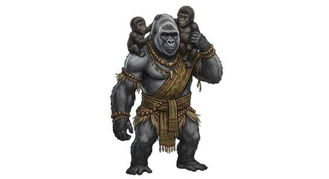

# Great ape folk

{.illus}

*Set: Core*

*aka: ______________________________*

*Family: [Simian](../Species_Families/simian.md)*

Big-shouldered, tailless ape-folk with long arms, heavy hands and faces that show every mood. Some are massive, gentle and slow to anger; some are wiry, clever and endlessly curious about tools; some are shaggy, red-haired and deliberate, happiest alone in the high trees. All of them can climb, though the heaviest prefer a sturdy trunk to a thin branch, and none of them tumble about like their smaller cousins.

They tend to live in troops and families bound by strong loyalties and clear ranks. In their cities, trades often follow body: the strongest work and soldier, the cleverest study and argue, the calmest judge and pray. Other peoples find them grave, dignified and far quicker of mind than their size suggests.

## Not to be confused with

*[Monkey folk](simian-monkey-folk.md)* are smaller, tailed and nimble; great ape folk are big, tailless and powerful, still climbers but more at home walking than tumbling.

## What sets this species apart

Heavy, tailless great-ape builds: still climbers, but less given to tumbling than monkeys.

## Breeds and races

Each block below is one set of numbers; breeds that share every number share a block (Species rules, rule 9). Attributes are final modifiers, the size trade-off included. Skills, powers and weapon groups are final levels after the family, species and breed layers.

### No. 721 Gorilla-folk *(genres: beast-folk: fur; starter)*

- **Size:** large · **Body:** biped+tailless
- **What it's like:** Powerful ape folk with mighty arms, a gentle nature and strong family bonds. (looks like: gorilla; good at: strength, climbing, fighting)
- **Attributes:** STR +5 AGI −2 END +1 INT −1 WIS −1
- **Skills:** [Climbing](../Skills/climbing.md) +2, [Acrobatics](../Skills/acrobatics.md) +1, [Balance](../Skills/balance.md) +1, [Throwing](../Skills/throwing.md) +1, [Composure](../Skills/composure.md) −1, [Etiquette](../Skills/etiquette.md) −1, [Swimming](../Skills/swimming.md) −2
- **For the Game Master only, this race as an NPC guard or soldier (not your character's numbers):** Attack 15 · Parry 12 · Dodge 5 · Damage longsword 1d6+2 · Armour 2 · Life 22 · Threat 2 ([Bestiary roles](../bestiary.md))
- *Why:* Heavy ground-walkers that climb less than other apes.

### No. 722 Brute ape warrior folk *(genres: space opera: beast-like aliens)*

- **Size:** large · **Body:** biped
- **What it's like:** Big, brutally strong ape warriors from a militarised tribal warband. (looks like: ape; good at: strength, fighting)
- **Attributes:** STR +5 AGI −1 INT −2 WIS −1 COU +1
- **Skills:** [Climbing](../Skills/climbing.md) +3, [Acrobatics](../Skills/acrobatics.md) +1, [Balance](../Skills/balance.md) +1, [Intimidation](../Skills/intimidation.md) +1, [Throwing](../Skills/throwing.md) +1, [Composure](../Skills/composure.md) −1, [Etiquette](../Skills/etiquette.md) −1, [Swimming](../Skills/swimming.md) −2
- **For the Game Master only, this race as an NPC guard or soldier (not your character's numbers):** Attack 15 · Parry 12 · Dodge 6 · Damage longsword 1d6+2 · Armour 2 · Life 21 · Threat 2 ([Bestiary roles](../bestiary.md))
- *Why:* Brutal warband apes.

### No. 723 Chimpanzee-folk *(genres: beast-folk: fur)*

- **Size:** medium · **Body:** biped+tailless
- **What it's like:** Clever, tool-using chimpanzee folk, strong climbers with a complex, sometimes scholarly society. (looks like: monkey; good at: climbing, knowledge)
- **Attributes:** STR +1 AGI +2 WIS −1
- **Skills:** [Climbing](../Skills/climbing.md) +3, [Acrobatics](../Skills/acrobatics.md) +2, [Balance](../Skills/balance.md) +1, [Hand Tools](../Skills/hand-tools.md) +1, [Throwing](../Skills/throwing.md) +1, [Composure](../Skills/composure.md) −1, [Etiquette](../Skills/etiquette.md) −1, [Swimming](../Skills/swimming.md) −2
- **For the Game Master only, this race as an NPC guard or soldier (not your character's numbers):** Attack 15 · Parry 12 · Dodge 10 · Damage longsword 1d6+2 · Armour 2 · Life 17 · Threat 2 ([Bestiary roles](../bestiary.md))
- *Why:* Lighter tool-users who tumble as well as monkeys.

### No. 724 Orangutan-folk *(genres: beast-folk: fur)*

- **Size:** large · **Body:** biped+tailless
- **What it's like:** Long-armed, patient orangutan folk, superb tree-climbers who often become judges or priests. (looks like: ape; good at: climbing, knowledge)
- **Attributes:** STR +4 AGI −1 INT −1 WIS +1
- **Skills:** [Climbing](../Skills/climbing.md) +4, [Acrobatics](../Skills/acrobatics.md) +1, [Balance](../Skills/balance.md) +1, [Survival: Jungle & Swamp](../Skills/survival-jungle-and-swamp.md) +1, [Throwing](../Skills/throwing.md) +1, [Etiquette](../Skills/etiquette.md) −1, [Swimming](../Skills/swimming.md) −2
- **For the Game Master only, this race as an NPC guard or soldier (not your character's numbers):** Attack 15 · Parry 12 · Dodge 6 · Damage longsword 1d6+2 · Armour 2 · Life 21 · Threat 2 ([Bestiary roles](../bestiary.md))
- *Why:* Long-armed, patient jungle tree-dwellers.

### Bonobo-folk *(NPC only)*

- **Size:** medium · **Body:** biped+tailless
- **Attributes:** STR +2 AGI +2 INT −1 WIS −1 CHA +2
- **Skills:** [Climbing](../Skills/climbing.md) +3, [Acrobatics](../Skills/acrobatics.md) +2, [Balance](../Skills/balance.md) +1, [Insight](../Skills/insight.md) +1, [Throwing](../Skills/throwing.md) +1, [Composure](../Skills/composure.md) −1, [Etiquette](../Skills/etiquette.md) −1, [Swimming](../Skills/swimming.md) −2
- **For the Game Master only, this race as an NPC guard or soldier (not your character's numbers):** Attack 15 · Parry 12 · Dodge 10 · Damage longsword 1d6+2 · Armour 2 · Life 17 · Threat 2 ([Bestiary roles](../bestiary.md))
- *Why:* Empathic, agile climbers.

### Philosopher ape folk *(NPC only)*

- **Size:** medium · **Body:** biped
- **Attributes:** STR +2 AGI +1 WIS +1
- **Skills:** [Climbing](../Skills/climbing.md) +3, [Acrobatics](../Skills/acrobatics.md) +1, [Balance](../Skills/balance.md) +1, [Philosophy & Logic](../Skills/philosophy-and-logic.md) +1, [Throwing](../Skills/throwing.md) +1, [Etiquette](../Skills/etiquette.md) −1, [Swimming](../Skills/swimming.md) −2
- **For the Game Master only, this race as an NPC guard or soldier (not your character's numbers):** Attack 15 · Parry 12 · Dodge 9 · Damage longsword 1d6+2 · Armour 2 · Life 17 · Threat 2 ([Bestiary roles](../bestiary.md))
- *Why:* Calm, reclusive philosophers.

### No. 725 Uplifted ape folk *(genres: uplifted animals)*

- **Size:** medium · **Body:** biped
- **What it's like:** Genetically uplifted ape folk, sharp-minded and nimble-fingered, serving as junior partners to their human patrons. (looks like: monkey; good at: knowledge, climbing)
- **Attributes:** STR +1 AGI +2 INT +1 WIS −1
- **Skills:** [Climbing](../Skills/climbing.md) +3, [Acrobatics](../Skills/acrobatics.md) +1, [Balance](../Skills/balance.md) +1, [Throwing](../Skills/throwing.md) +1, [Composure](../Skills/composure.md) −1, [Etiquette](../Skills/etiquette.md) −1, [Swimming](../Skills/swimming.md) −2
- **For the Game Master only, this race as an NPC guard or soldier (not your character's numbers):** Attack 15 · Parry 12 · Dodge 10 · Damage longsword 1d6+2 · Armour 2 · Life 17 · Threat 2 ([Bestiary roles](../bestiary.md))
- *Note:* Their raised intelligence and dexterity are attributes.

