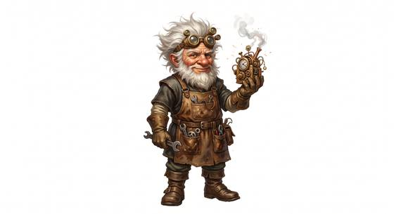

# Gnome-kind

{.illus}

*Set: Core*

*aka: ______________________________*

*Family: [Small folk](../Species_Families/small-folk.md)*

Small, bright-eyed folk with busy fingers and busier minds. Some live deep in the earth and move through stone as easily as others move through air. Others build in towers and workshops, forever fiddling with gears, springs, lenses and arcane crystals. A few are quiet and grim, dwelling in dark caverns; a few are cheerful scavengers of the wastes.

All of them share a knack for making things work, usually in ways nobody else would think of and often with more parts than strictly necessary. They live long, talk a great deal and are rarely short of opinions. Taller folk call them tinkers, meddlers and geniuses, and all three are usually true of the same gnome.

## Not to be confused with

*[Gnome-kind (mutant human-derived)](goblinoid-and-orc-kind-gnome-kind-mutant-human-derived.md)* is the goblinoid family's human-born gnome; gnome-kind are the true small folk, quick and inventive by nature.

## What sets this species apart

Small, quick, inventive folk with a knack for making things work.

## Breeds and races

Each block below is one set of numbers; breeds that share every number share a block (Species rules, rule 9). Attributes are final modifiers, the size trade-off included. Skills, powers and weapon groups are final levels after the family, species and breed layers.

### No. 733 Tinker gnome *(genres: classic fantasy; starter)*

- **Size:** small · **Body:** biped
- **What it's like:** Small, clever inventors who build odd gadgets and never stop asking questions. (looks like: gnome; good at: making and fixing, knowledge, sneaking)
- **Attributes:** STR −2 AGI +2 INT +2 WIS +1 CHA −1
- **Skills:** [Stealth](../Skills/stealth.md) +2, [Clockwork & Instruments](../Skills/clockwork-and-instruments.md) +1, [Cooking](../Skills/cooking.md) +1, [Jury-Rigging](../Skills/jury-rigging.md) +1, [Service & Hospitality](../Skills/service-and-hospitality.md) +1, [Sleight of Hand](../Skills/sleight-of-hand.md) +1, [Throwing](../Skills/throwing.md) +1, [Riding](../Skills/riding.md) −1, [Intimidation](../Skills/intimidation.md) −2, [Lifting & Carrying](../Skills/lifting-and-carrying.md) −2
- **For the Game Master only, this race as an NPC guard or soldier (not your character's numbers):** Attack 14 · Parry 11 · Dodge 11 · Damage longsword 1d6+1 · Armour 2 · Life 15 · Threat 1 ([Bestiary roles](../bestiary.md))
- *Why:* Long-lived clockwork tinkerers.
- *Note:* Lifespan (long-lived) is a lexicon detail, not a game number.

### No. 734 Deep gnome folk *(genres: underworld and wild places, classic fantasy)*

- **Size:** small · **Body:** biped
- **What it's like:** Small underground folk who vanish against stone and shrug off mind-tricks in the dark. (looks like: gnome; good at: sneaking, keen senses)
- **Attributes:** STR −2 AGI +2 END +1 INT +1 WIS +1 CHA −1
- **Skills:** [Camouflage](../Skills/camouflage.md) +2, [Stealth](../Skills/stealth.md) +2, [Cooking](../Skills/cooking.md) +1, [Jury-Rigging](../Skills/jury-rigging.md) +1, [Service & Hospitality](../Skills/service-and-hospitality.md) +1, [Sleight of Hand](../Skills/sleight-of-hand.md) +1, [Survival: Caves & Underground](../Skills/survival-caves-and-underground.md) +1, [Throwing](../Skills/throwing.md) +1, [Riding](../Skills/riding.md) −1, [Intimidation](../Skills/intimidation.md) −2, [Lifting & Carrying](../Skills/lifting-and-carrying.md) −2
- **Powers:** [Night & Spectrum Sight](../Powers/night-and-spectrum-sight.md) 2, [Mind Shield](../Powers/mind-shield.md) 1
- **For the Game Master only, this race as an NPC guard or soldier (not your character's numbers):** Attack 14 · Parry 11 · Dodge 11 · Damage longsword 1d6+1 · Armour 2 · Life 16 · Threat 1 ([Bestiary roles](../bestiary.md))
- *Why:* Underground gnomes: see in the dark, blend into stone and resist mind powers.

### No. 735 Dungeon-delving craft folk *(genres: classic fantasy)*

- **Size:** small · **Body:** biped
- **What it's like:** Short, sturdy dungeon-delving folk, practical crafters who aren't squeamish about eating what they kill. (looks like: dwarf; good at: making and fixing, toughness)
- **Attributes:** STR −2 AGI +2 END +1 INT +1 WIS +1
- **Skills:** [Stealth](../Skills/stealth.md) +2, [Butchery & Preserving](../Skills/butchery-and-preserving.md) +1, [Cooking](../Skills/cooking.md) +1, [Jury-Rigging](../Skills/jury-rigging.md) +1, [Service & Hospitality](../Skills/service-and-hospitality.md) +1, [Sleight of Hand](../Skills/sleight-of-hand.md) +1, [Survival: Caves & Underground](../Skills/survival-caves-and-underground.md) +1, [Throwing](../Skills/throwing.md) +1, [Riding](../Skills/riding.md) −1, [Intimidation](../Skills/intimidation.md) −2, [Lifting & Carrying](../Skills/lifting-and-carrying.md) −2
- **For the Game Master only, this race as an NPC guard or soldier (not your character's numbers):** Attack 14 · Parry 11 · Dodge 11 · Damage longsword 1d6+1 · Armour 2 · Life 16 · Threat 1 ([Bestiary roles](../bestiary.md))
- *Why:* Dungeon-delvers who live off the monsters they kill.

### No. 736 Tunnel-digging craft folk *(genres: classic fantasy)*

- **Size:** small · **Body:** biped
- **What it's like:** Stocky tunnelling folk, expert tinkerers who live happily alongside dwarves. (looks like: gnome; good at: making and fixing, wilderness)
- **Attributes:** STR −2 AGI +2 INT +1 WIS +1
- **Skills:** [Stealth](../Skills/stealth.md) +2, [Cooking](../Skills/cooking.md) +1, [Jury-Rigging](../Skills/jury-rigging.md) +1, [Mining & Quarrying](../Skills/mining-and-quarrying.md) +1, [Service & Hospitality](../Skills/service-and-hospitality.md) +1, [Sleight of Hand](../Skills/sleight-of-hand.md) +1, [Survival: Caves & Underground](../Skills/survival-caves-and-underground.md) +1, [Throwing](../Skills/throwing.md) +1, [Riding](../Skills/riding.md) −1, [Intimidation](../Skills/intimidation.md) −2, [Lifting & Carrying](../Skills/lifting-and-carrying.md) −2
- **For the Game Master only, this race as an NPC guard or soldier (not your character's numbers):** Attack 14 · Parry 11 · Dodge 11 · Damage longsword 1d6+1 · Armour 2 · Life 15 · Threat 1 ([Bestiary roles](../bestiary.md))
- *Why:* Tunnelling gnomes who live beside dwarves.

### No. 737 Arcane-tech scholar gnome *(genres: classic fantasy)*

- **Size:** small · **Body:** biped
- **What it's like:** Inventive gnome scholars who blend magic and machinery in their academies and clans. (looks like: gnome; good at: making and fixing, knowledge)
- **Attributes:** STR −2 AGI +2 END −1 INT +2 WIS +1
- **Skills:** [Stealth](../Skills/stealth.md) +2, [Arcana](../Skills/arcana.md) +1, [Cooking](../Skills/cooking.md) +1, [Jury-Rigging](../Skills/jury-rigging.md) +1, [Research](../Skills/research.md) +1, [Service & Hospitality](../Skills/service-and-hospitality.md) +1, [Sleight of Hand](../Skills/sleight-of-hand.md) +1, [Throwing](../Skills/throwing.md) +1, [Riding](../Skills/riding.md) −1, [Intimidation](../Skills/intimidation.md) −2, [Lifting & Carrying](../Skills/lifting-and-carrying.md) −2
- **For the Game Master only, this race as an NPC guard or soldier (not your character's numbers):** Attack 14 · Parry 11 · Dodge 11 · Damage longsword 1d6+1 · Armour 2 · Life 14 · Threat 1 ([Bestiary roles](../bestiary.md))
- *Why:* Academy gnomes who blend magic and machinery.

### No. 738 Magitech genius gnome *(genres: classic fantasy)*

- **Size:** small · **Body:** biped
- **What it's like:** Short, proud gnome geniuses who invent dazzling magic-powered machines. (looks like: gnome; good at: making and fixing, powers and magic)
- **Attributes:** STR −2 AGI +2 INT +3 CHA −1
- **Skills:** [Stealth](../Skills/stealth.md) +2, [Arcana](../Skills/arcana.md) +1, [Cooking](../Skills/cooking.md) +1, [Jury-Rigging](../Skills/jury-rigging.md) +1, [Mechanics](../Skills/mechanics.md) +1, [Service & Hospitality](../Skills/service-and-hospitality.md) +1, [Sleight of Hand](../Skills/sleight-of-hand.md) +1, [Throwing](../Skills/throwing.md) +1, [Riding](../Skills/riding.md) −1, [Intimidation](../Skills/intimidation.md) −2, [Lifting & Carrying](../Skills/lifting-and-carrying.md) −2
- **For the Game Master only, this race as an NPC guard or soldier (not your character's numbers):** Attack 14 · Parry 11 · Dodge 11 · Damage longsword 1d6+1 · Armour 2 · Life 15 · Threat 1 ([Bestiary roles](../bestiary.md))
- *Why:* Proud magitech inventors.

### No. 739 Earth elemental spirit gnome *(genres: heavens, hells and other planes, underworld and wild places)*

- **Size:** small · **Body:** biped
- **What it's like:** Earth-spirit gnomes who move through solid stone and soil as easily as walking through air. (looks like: gnome; good at: powers and magic, sneaking)
- **Attributes:** STR −2 AGI +2 END +2 WIS +1
- **Skills:** [Stealth](../Skills/stealth.md) +2, [Cooking](../Skills/cooking.md) +1, [Service & Hospitality](../Skills/service-and-hospitality.md) +1, [Sleight of Hand](../Skills/sleight-of-hand.md) +1, [Throwing](../Skills/throwing.md) +1, [Riding](../Skills/riding.md) −1, [Intimidation](../Skills/intimidation.md) −2, [Lifting & Carrying](../Skills/lifting-and-carrying.md) −2
- **Powers:** [Travel Through a Medium](../Powers/travel-through-a-medium.md) 2
- **For the Game Master only, this race as an NPC guard or soldier (not your character's numbers):** Attack 14 · Parry 11 · Dodge 11 · Damage longsword 1d6+1 · Armour 2 · Life 17 · Threat 1 ([Bestiary roles](../bestiary.md))
- *Why:* An earth spirit that moves through soil and stone as through air, not a tinkerer.
- *Note:* Travel Through a Medium is earth and stone only.

### No. 740 Tiny borrowing folk *(genres: fairy tale and folklore)*

- **Size:** tiny · **Body:** biped
- **What it's like:** Tiny folk, only a few inches tall, who live hidden in human homes and solve problems together as a community. (looks like: tiny person; good at: sneaking, making and fixing)
- **Attributes:** STR −3 AGI +3 END −1 INT +1 WIS +1
- **Skills:** [Stealth](../Skills/stealth.md) +3, [Scavenging](../Skills/scavenging.md) +2, [Cooking](../Skills/cooking.md) +1, [Jury-Rigging](../Skills/jury-rigging.md) +1, [Service & Hospitality](../Skills/service-and-hospitality.md) +1, [Sleight of Hand](../Skills/sleight-of-hand.md) +1, [Throwing](../Skills/throwing.md) +1, [Riding](../Skills/riding.md) −1, [Intimidation](../Skills/intimidation.md) −2, [Lifting & Carrying](../Skills/lifting-and-carrying.md) −2
- **For the Game Master only, this race as an NPC guard or soldier (not your character's numbers):** Attack 14 · Parry 11 · Dodge 13 · Damage longsword 1d6+1 · Armour 2 · Life 12 · Threat 1 ([Bestiary roles](../bestiary.md))
- *Why:* Inch-high folk who live hidden in human homes on what they borrow; the size is an attribute.

### Scavenger wasteland gnome *(NPC only)*

- **Size:** small · **Body:** biped
- **Attributes:** STR −2 AGI +2 END +1 WIS +1
- **Skills:** [Stealth](../Skills/stealth.md) +2, [Cooking](../Skills/cooking.md) +1, [Jury-Rigging](../Skills/jury-rigging.md) +1, [Scavenging](../Skills/scavenging.md) +1, [Service & Hospitality](../Skills/service-and-hospitality.md) +1, [Sleight of Hand](../Skills/sleight-of-hand.md) +1, [Survival: Ruins & Wasteland](../Skills/survival-ruins-and-wasteland.md) +1, [Throwing](../Skills/throwing.md) +1, [Riding](../Skills/riding.md) −1, [Intimidation](../Skills/intimidation.md) −2, [Lifting & Carrying](../Skills/lifting-and-carrying.md) −2
- **For the Game Master only, this race as an NPC guard or soldier (not your character's numbers):** Attack 14 · Parry 11 · Dodge 11 · Damage longsword 1d6+1 · Armour 2 · Life 16 · Threat 1 ([Bestiary roles](../bestiary.md))
- *Why:* Scavenger tribes of the wastes.

