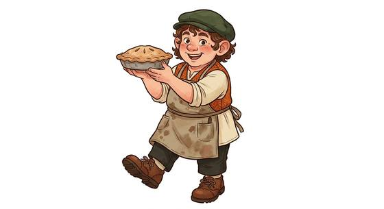

# Hearth small folk

{.illus}

*Set: Core*

*aka: ______________________________*

*Family: [Small folk](../Species_Families/small-folk.md)*

Small, round-faced folk who love home, a well-stocked pantry and a comfortable chair by the fire. They farm, keep inns, trade and sometimes wander, and they are half the height of a man with twice the appetite. Some lines are stout river boatmen, some slender hunters, some cheerful travellers with light fingers.

What surprises everyone is their courage. A hearth-folk farmer will face down a dragon to protect a neighbour's child, and dark magic that would send a knight running seems to glance off them. They are also remarkably lucky, often in ways that look like an accident. Taller folk underestimate them, which is exactly how the hearth folk like it.

## Not to be confused with

*[Tiny folk](humankind-tiny-folk.md)* are merely small humans; hearth small folk are their own people, homely and unusually hard to frighten.

## What sets this species apart

Hearth-loving small folk who are notably hard to frighten.

## Breeds and races

Each block below is one set of numbers; breeds that share every number share a block (Species rules, rule 9). Attributes are final modifiers, the size trade-off included. Skills, powers and weapon groups are final levels after the family, species and breed layers.

### No. 741 Lucky hearth folk *(genres: classic fantasy; starter)*

- **Size:** small · **Body:** biped
- **What it's like:** Small, cheerful home-lovers who stay brave and seem to get lucky breaks. (looks like: leprechaun; good at: sneaking, powers and magic, people and talk)
- **Attributes:** STR −2 AGI +2 WIS +1 COU +2
- **Skills:** [Composure](../Skills/composure.md) +2, [Stealth](../Skills/stealth.md) +2, [Cooking](../Skills/cooking.md) +1, [Service & Hospitality](../Skills/service-and-hospitality.md) +1, [Sleight of Hand](../Skills/sleight-of-hand.md) +1, [Throwing](../Skills/throwing.md) +1, [Riding](../Skills/riding.md) −1, [Intimidation](../Skills/intimidation.md) −2, [Lifting & Carrying](../Skills/lifting-and-carrying.md) −2
- **Powers:** [Chance-Mastery](../Powers/chance-mastery.md) 1
- **For the Game Master only, this race as an NPC guard or soldier (not your character's numbers):** Attack 14 · Parry 11 · Dodge 11 · Damage longsword 1d6+1 · Armour 2 · Life 15 · Threat 1 ([Bestiary roles](../bestiary.md))
- *Why:* Uncannily lucky and even braver than other hearth folk.
- *Note:* Chance-Mastery is self-only: the character's own lucky reroll.

### No. 742 Compulsively curious pocket-folk *(genres: classic fantasy)*

- **Size:** small · **Body:** biped
- **What it's like:** Small, fearless wanderers who can't resist picking things up, though it isn't stealing where they come from. (looks like: gnome; good at: sneaking, people and talk)
- **Attributes:** STR −2 AGI +2 COU +2
- **Skills:** [Composure](../Skills/composure.md) +2, [Sleight of Hand](../Skills/sleight-of-hand.md) +2, [Stealth](../Skills/stealth.md) +2, [Cooking](../Skills/cooking.md) +1, [Service & Hospitality](../Skills/service-and-hospitality.md) +1, [Throwing](../Skills/throwing.md) +1, [Riding](../Skills/riding.md) −1, [Intimidation](../Skills/intimidation.md) −2, [Lifting & Carrying](../Skills/lifting-and-carrying.md) −2
- **For the Game Master only, this race as an NPC guard or soldier (not your character's numbers):** Attack 14 · Parry 11 · Dodge 11 · Damage longsword 1d6+1 · Armour 2 · Life 15 · Threat 1 ([Bestiary roles](../bestiary.md))
- *Why:* Fearless, light-fingered wanderers.

### No. 743 Meadow-dwelling folk *(genres: classic fantasy)*

- **Size:** small · **Body:** biped
- **What it's like:** Comfort-loving meadow folk, quick and quiet on their feet, hard to scare or dominate by magic. (looks like: gnome; good at: sneaking, wilderness)
- **Attributes:** STR −2 AGI +2 WIS +1 COU +1
- **Skills:** [Stealth](../Skills/stealth.md) +3, [Composure](../Skills/composure.md) +1, [Cooking](../Skills/cooking.md) +1, [Farming](../Skills/farming.md) +1, [Service & Hospitality](../Skills/service-and-hospitality.md) +1, [Sleight of Hand](../Skills/sleight-of-hand.md) +1, [Throwing](../Skills/throwing.md) +1, [Riding](../Skills/riding.md) −1, [Intimidation](../Skills/intimidation.md) −2, [Lifting & Carrying](../Skills/lifting-and-carrying.md) −2
- **Powers:** [Mind Shield](../Powers/mind-shield.md) 1
- **For the Game Master only, this race as an NPC guard or soldier (not your character's numbers):** Attack 14 · Parry 11 · Dodge 11 · Damage longsword 1d6+1 · Armour 2 · Life 15 · Threat 1 ([Bestiary roles](../bestiary.md))
- *Why:* Quiet-footed farmers who resist magic that dominates the mind.

### No. 744 Merchant hearth-folk *(genres: classic fantasy)*

- **Size:** small · **Body:** biped
- **What it's like:** Nimble-fingered hearth folk who make natural innkeepers and traders, though often looked down on unfairly. (looks like: gnome; good at: people and talk, sneaking)
- **Attributes:** STR −2 AGI +2 WIS +1 COU +1
- **Skills:** [Stealth](../Skills/stealth.md) +2, [Composure](../Skills/composure.md) +1, [Cooking](../Skills/cooking.md) +1, [Haggling](../Skills/haggling.md) +1, [Service & Hospitality](../Skills/service-and-hospitality.md) +1, [Sleight of Hand](../Skills/sleight-of-hand.md) +1, [Throwing](../Skills/throwing.md) +1, [Riding](../Skills/riding.md) −1, [Intimidation](../Skills/intimidation.md) −2, [Lifting & Carrying](../Skills/lifting-and-carrying.md) −2
- **For the Game Master only, this race as an NPC guard or soldier (not your character's numbers):** Attack 14 · Parry 11 · Dodge 11 · Damage longsword 1d6+1 · Armour 2 · Life 15 · Threat 1 ([Bestiary roles](../bestiary.md))
- *Why:* Merchant and innkeeper folk.

### No. 745 Riverside broad-built folk *(genres: classic fantasy)*

- **Size:** small · **Body:** biped
- **What it's like:** Broad, strong little riverfolk and boatmen, slow travellers but excellent swimmers. (looks like: gnome; good at: swimming, strength)
- **Attributes:** STR −2 AGI +2 END +1 WIS +1 COU +1
- **Skills:** [Stealth](../Skills/stealth.md) +2, [Swimming](../Skills/swimming.md) +2, [Composure](../Skills/composure.md) +1, [Cooking](../Skills/cooking.md) +1, [Rowing & Paddling](../Skills/rowing-and-paddling.md) +1, [Service & Hospitality](../Skills/service-and-hospitality.md) +1, [Sleight of Hand](../Skills/sleight-of-hand.md) +1, [Throwing](../Skills/throwing.md) +1, [Riding](../Skills/riding.md) −1, [Intimidation](../Skills/intimidation.md) −2, [Lifting & Carrying](../Skills/lifting-and-carrying.md) −2
- **For the Game Master only, this race as an NPC guard or soldier (not your character's numbers):** Attack 14 · Parry 11 · Dodge 11 · Damage longsword 1d6+1 · Armour 2 · Life 16 · Threat 1 ([Bestiary roles](../bestiary.md))
- *Why:* Broad river hearth folk: good swimmers and boatmen.

### No. 746 Tall fair woodland folk *(genres: classic fantasy)*

- **Size:** small · **Body:** biped
- **What it's like:** The tallest, fairest of the hearth folk, skilled hunters and climbers who get on well with elves. (looks like: gnome; good at: climbing, wilderness)
- **Attributes:** STR −2 AGI +3 END −1 WIS +1 COU +1
- **Skills:** [Stealth](../Skills/stealth.md) +2, [Climbing](../Skills/climbing.md) +1, [Composure](../Skills/composure.md) +1, [Cooking](../Skills/cooking.md) +1, [Hunting](../Skills/hunting.md) +1, [Service & Hospitality](../Skills/service-and-hospitality.md) +1, [Sleight of Hand](../Skills/sleight-of-hand.md) +1, [Throwing](../Skills/throwing.md) +1, [Riding](../Skills/riding.md) −1, [Intimidation](../Skills/intimidation.md) −2, [Lifting & Carrying](../Skills/lifting-and-carrying.md) −2
- **For the Game Master only, this race as an NPC guard or soldier (not your character's numbers):** Attack 14 · Parry 11 · Dodge 12 · Damage longsword 1d6+1 · Armour 2 · Life 14 · Threat 1 ([Bestiary roles](../bestiary.md))
- *Why:* Tall woodland hearth folk: hunters and tree-climbers.

### Round farming folk · No. 747 Humble village folk *(NPC only)*

- **Size:** small · **Body:** biped
- **Attributes:** STR −2 AGI +2 WIS +1 COU +1
- **Skills:** [Stealth](../Skills/stealth.md) +2, [Composure](../Skills/composure.md) +1, [Cooking](../Skills/cooking.md) +1, [Farming](../Skills/farming.md) +1, [Service & Hospitality](../Skills/service-and-hospitality.md) +1, [Sleight of Hand](../Skills/sleight-of-hand.md) +1, [Throwing](../Skills/throwing.md) +1, [Riding](../Skills/riding.md) −1, [Intimidation](../Skills/intimidation.md) −2, [Lifting & Carrying](../Skills/lifting-and-carrying.md) −2
- **For the Game Master only, this race as an NPC guard or soldier (not your character's numbers):** Attack 14 · Parry 11 · Dodge 11 · Damage longsword 1d6+1 · Armour 2 · Life 15 · Threat 1 ([Bestiary roles](../bestiary.md))
- *Round farming folk:* Simple farming folk.
- *Humble village folk:* Humble farming villagers.

### No. 748 Elemental-touched hearth folk *(genres: dark fantasy)*

- **Size:** small · **Body:** biped
- **What it's like:** Hearth folk touched by the elements, resistant to fire and cold, with one branch living a very different jungle life. (looks like: gnome; good at: powers and magic, toughness)
- **Attributes:** STR −2 AGI +2 WIS +1 COU +1
- **Skills:** [Stealth](../Skills/stealth.md) +2, [Composure](../Skills/composure.md) +1, [Cooking](../Skills/cooking.md) +1, [Service & Hospitality](../Skills/service-and-hospitality.md) +1, [Sleight of Hand](../Skills/sleight-of-hand.md) +1, [Survival: Jungle & Swamp](../Skills/survival-jungle-and-swamp.md) +1, [Throwing](../Skills/throwing.md) +1, [Riding](../Skills/riding.md) −1, [Intimidation](../Skills/intimidation.md) −2, [Lifting & Carrying](../Skills/lifting-and-carrying.md) −2
- **Powers:** [Kindle & Quench](../Powers/kindle-and-quench.md) 1, [Resist Element](../Powers/resist-element.md) 1
- **For the Game Master only, this race as an NPC guard or soldier (not your character's numbers):** Attack 14 · Parry 11 · Dodge 11 · Damage longsword 1d6+1 · Armour 2 · Life 15 · Threat 1 ([Bestiary roles](../bestiary.md))
- *Why:* Hearth folk with elemental resistance, minor elemental magic and a jungle way of life.
- *Note:* Kindle & Quench stands for their minor elemental magic; the GM may swap in another minor elemental power.

