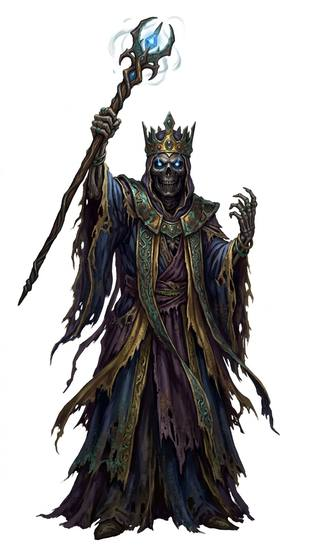

# Lich-kind

{.illus}

*Set: Expansion*

*aka: ______________________________*

*Family: [Undead and deathless](../Species_Families/undead-and-deathless.md)*

Sorcerers who refused to die. A lich was once a master of the dark arts who bound its own life to a ritual, gave up its flesh and kept its mind. What remains is a desiccated husk, skin like old paper over bone, eyes like coals in a cold hearth. It needs no food, no sleep and no warmth, and it has centuries in which to study.

The lich is drawn to the two things death offers the patient: the life it can draw out of others, and the dead it can raise to serve. Its lesser cousins are husks without the learning, wandering dry wastes and sucking the life from travellers. The greater ones hide the secret of their immortality somewhere safe, and armies have died looking for it.

## Not to be confused with

*[Mummy-kind](undead-and-deathless-mummy-kind.md)*, preserved by burial rites and a tomb's curse; the lich preserved itself, by its own necromancy.

## What sets this species apart

Desiccated husks sustained by necromancy, drawn to drain life and raise the dead. Phylactery immortality and a lich's magic are breed-level.

## Breeds and races

Each block below is one set of numbers; breeds that share every number share a block (Species rules, rule 9). Attributes are final modifiers, the size trade-off included. Skills, powers and weapon groups are final levels after the family, species and breed layers.

### Phylactery-bound lich *(NPC only; NPC-scale)*

- **Size:** medium · **Body:** biped
- **Attributes:** STR −1 AGI −1 END +2 INT +4 WIS +2 CHA −2 COU +2
- **Skills:** [Pain Tolerance](../Skills/pain-tolerance.md) +5, [Arcana](../Skills/arcana.md) +2, [Intimidation](../Skills/intimidation.md) +2, [Composure](../Skills/composure.md) +1, [Cooking](../Skills/cooking.md) −1, [Caregiving](../Skills/caregiving.md) −2, [Charm & Seduction](../Skills/charm-and-seduction.md) −2, [Animal Handling](../Skills/animal-handling.md) −3, [Carousing](../Skills/carousing.md) Foreign Concept
- **Powers:** [Animate Dead](../Powers/animate-dead.md) 3, [Poison & Disease Immunity](../Powers/poison-and-disease-immunity.md) 3, [Renewal at Death](../Powers/renewal-at-death.md) 3, [Endurance Without Need](../Powers/endurance-without-need.md) 2
- **For the Game Master only, this race as an NPC guard or soldier (not your character's numbers):** Attack 14 · Parry 11 · Dodge 7 · Damage longsword 1d6+2 · Armour 2 · Life 19 · Threat 1 ([Bestiary roles](../bestiary.md))
- *Why:* An immortal necromancer whose life is kept in a phylactery.
- *Note:* NPC-scale. Renewal at Death holds only while the phylactery survives. Lifespan (ageless or immortal) is a lexicon detail, not a game number.

### Desiccated husk undead *(NPC only)*

- **Size:** medium · **Body:** biped
- **Attributes:** STR −1 AGI −1 END +2 CHA −2 COU +2
- **Skills:** [Pain Tolerance](../Skills/pain-tolerance.md) +5, [Intimidation](../Skills/intimidation.md) +2, [Survival: Desert](../Skills/survival-desert.md) +2, [Composure](../Skills/composure.md) +1, [Cooking](../Skills/cooking.md) −1, [Caregiving](../Skills/caregiving.md) −2, [Charm & Seduction](../Skills/charm-and-seduction.md) −2, [Animal Handling](../Skills/animal-handling.md) −3, [Carousing](../Skills/carousing.md) Foreign Concept
- **Powers:** [Poison & Disease Immunity](../Powers/poison-and-disease-immunity.md) 3, [Endurance Without Need](../Powers/endurance-without-need.md) 2, [Life Drain](../Powers/life-drain.md) 2
- **For the Game Master only, this race as an NPC guard or soldier (not your character's numbers):** Attack 14 · Parry 11 · Dodge 7 · Damage longsword 1d6+2 · Armour 2 · Life 19 · Threat 1 ([Bestiary roles](../bestiary.md))
- *Why:* Life-draining husks of the dry lands.

