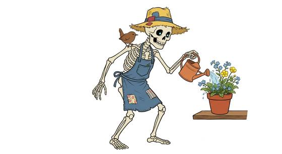

# Skeleton-kind

{.illus}

*Set: Core*

*aka: ______________________________*

*Family: [Undead and deathless](../Species_Families/undead-and-deathless.md)*

Bones, nothing more. No skin, no muscle, no breath, and yet the thing stands, turns its empty skull and walks. Magic holds it together, or will, or a debt owed to death. Many are mindless servants of necromancers, marching where they are told. Others have minds of their own, and a surprising number are gentle: patient, curious, and oddly calm about the subject that terrifies everyone else.

A skeleton cannot be poisoned or choked, and it has no need of air, so it can walk the bottom of a lake. It cannot swim, though; there is nothing in it to float, and it sinks like a dropped sword. No hood or cloak hides what it is for long. The rattle gives it away.

## Not to be confused with

*[Zombie-kind](undead-and-deathless-zombie-kind.md)*, which keeps its rotting flesh; and *[lich-kind](undead-and-deathless-lich-kind.md)*, whose bones hold a sorcerer's mind and magic.

## What sets this species apart

Bare bones with no flesh or breath: they sink, and cannot pass for living. Environmental Immunity covers not needing to breathe.

## Breeds and races

Each block below is one set of numbers; breeds that share every number share a block (Species rules, rule 9). Attributes are final modifiers, the size trade-off included. Skills, powers and weapon groups are final levels after the family, species and breed layers.

### No. 790 Gentle animate skeleton *(genres: gothic horror; starter)*

- **Size:** medium · **Body:** biped
- **What it's like:** A walking skeleton kept alive by magic, who never needs to eat or breathe. (looks like: skeleton; good at: toughness, fighting)
- **Attributes:** STR −1 END +2 CHA −2 COU +2
- **Skills:** [Pain Tolerance](../Skills/pain-tolerance.md) +5, [Intimidation](../Skills/intimidation.md) +2, [Composure](../Skills/composure.md) +1, [Cooking](../Skills/cooking.md) −1, [Caregiving](../Skills/caregiving.md) −2, [Charm & Seduction](../Skills/charm-and-seduction.md) −2, [Disguise](../Skills/disguise.md) −2, [Animal Handling](../Skills/animal-handling.md) −3, [Carousing](../Skills/carousing.md) Foreign Concept, [Swimming](../Skills/swimming.md) Foreign Concept
- **Powers:** [Poison & Disease Immunity](../Powers/poison-and-disease-immunity.md) 3, [Endurance Without Need](../Powers/endurance-without-need.md) 2, [Environmental Immunity](../Powers/environmental-immunity.md) 1
- **For the Game Master only, this race as an NPC guard or soldier (not your character's numbers):** Attack 14 · Parry 11 · Dodge 8 · Damage longsword 1d6+2 · Armour 2 · Life 19 · Threat 1 ([Bestiary roles](../bestiary.md))

### Mindless reanimated skeleton *(beast)*

- **Size:** medium · **Body:** biped
- **Attributes:** STR −1 END +2 INT −3 WIS −2 CHA −2 COU +2
- **Skills:** [Composure](../Skills/composure.md) +5, [Pain Tolerance](../Skills/pain-tolerance.md) +5, [Intimidation](../Skills/intimidation.md) +2, [Cooking](../Skills/cooking.md) −1, [Caregiving](../Skills/caregiving.md) −2, [Charm & Seduction](../Skills/charm-and-seduction.md) −2, [Disguise](../Skills/disguise.md) −2, [Animal Handling](../Skills/animal-handling.md) −3, [Carousing](../Skills/carousing.md) Foreign Concept, [Swimming](../Skills/swimming.md) Foreign Concept
- **Powers:** [Poison & Disease Immunity](../Powers/poison-and-disease-immunity.md) 3, [Endurance Without Need](../Powers/endurance-without-need.md) 2, [Environmental Immunity](../Powers/environmental-immunity.md) 1
- **For the Game Master only, this race as an NPC guard or soldier (not your character's numbers):** Attack 14 · Parry 11 · Dodge 8 · Damage longsword 1d6+2 · Armour 2 · Life 19 · Threat 1 ([Bestiary roles](../bestiary.md))
- *Why:* Mindless bones that know no fear.

### No. 791 Reincarnated bone-touched folk *(genres: gothic horror)*

- **Size:** medium · **Body:** biped
- **What it's like:** Calm, bone-pale folk who don't need to breathe and shrug off poison and dark magic alike. (looks like: skeleton; good at: toughness, powers and magic)
- **Attributes:** STR −1 END +2 CHA −2 COU +2
- **Skills:** [Pain Tolerance](../Skills/pain-tolerance.md) +5, [Composure](../Skills/composure.md) +2, [Intimidation](../Skills/intimidation.md) +2, [Cooking](../Skills/cooking.md) −1, [Caregiving](../Skills/caregiving.md) −2, [Charm & Seduction](../Skills/charm-and-seduction.md) −2, [Disguise](../Skills/disguise.md) −2, [Animal Handling](../Skills/animal-handling.md) −3, [Carousing](../Skills/carousing.md) Foreign Concept, [Swimming](../Skills/swimming.md) Foreign Concept
- **Powers:** [Poison & Disease Immunity](../Powers/poison-and-disease-immunity.md) 3, [Endurance Without Need](../Powers/endurance-without-need.md) 2, [Environmental Immunity](../Powers/environmental-immunity.md) 1, [Resist Element](../Powers/resist-element.md) 1
- **For the Game Master only, this race as an NPC guard or soldier (not your character's numbers):** Attack 14 · Parry 11 · Dodge 8 · Damage longsword 1d6+2 · Armour 2 · Life 19 · Threat 1 ([Bestiary roles](../bestiary.md))
- *Why:* Reborn folk who resist necrotic harm and are calm about death.
- *Note:* Resist Element is necrotic energy.

