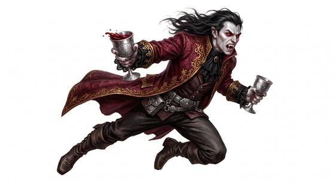

# Vampire-kind

{.illus}

*Set: Core*

*aka: ______________________________*

*Family: [Undead and deathless](../Species_Families/undead-and-deathless.md)*

The dead who do not stay dead, and who feed on the living to keep it that way. Most drink blood; some drink breath, colour or simple life, by a bite or a lingering touch. They are cold to the hand and often beautiful, with a predator's stillness that draws people closer instead of warning them away. Their eyes see clearly by night, and wounds that would kill a mortal close within the hour.

The oldest are nobles and philosophers, weary of centuries and courteous to the point of menace. Others hide monstrous true forms under borrowed human faces, and a few have learned to master the thirst entirely. Nearly all are wounded by daylight or holy things. In every age people have told stories about them, and the stories are always a little wrong.

## Not to be confused with

*[Ghoul-kind](undead-and-deathless-ghoul-kind.md)*, which eat the flesh of the dead rather than the life of the living; and *[lich-kind](undead-and-deathless-lich-kind.md)*, which endure through sorcery rather than feeding.

## What sets this species apart

Blood- and life-draining immortals with a predator's allure, night eyes and quick healing. Sunlight and similar weaknesses are flaws. Life Drain needs feeding by bite or touch. The feeding bite is a light attack.

## Breeds and races

Each block below is one set of numbers; breeds that share every number share a block (Species rules, rule 9). Attributes are final modifiers, the size trade-off included. Skills, powers and weapon groups are final levels after the family, species and breed layers.

### No. 782 Classic blood-drinking vampire folk *(high-power: Game Master's approval; genres: gothic horror; starter)*

- **Size:** medium · **Body:** biped
- **What it's like:** An ageless night noble who drinks blood and fears sunlight, garlic and stakes. (looks like: vampire; good at: powers and magic, toughness, people and talk)
- **Attributes:** STR +1 COU +2
- **Skills:** [Pain Tolerance](../Skills/pain-tolerance.md) +5, [Charm & Seduction](../Skills/charm-and-seduction.md) +2, [Intimidation](../Skills/intimidation.md) +2, [Composure](../Skills/composure.md) +1, [Stealth](../Skills/stealth.md) +1, [Cooking](../Skills/cooking.md) −1, [Caregiving](../Skills/caregiving.md) −2, [Animal Handling](../Skills/animal-handling.md) −3, [Carousing](../Skills/carousing.md) Foreign Concept
- **Powers:** [Poison & Disease Immunity](../Powers/poison-and-disease-immunity.md) 3, [Endurance Without Need](../Powers/endurance-without-need.md) 2, [Healing Factor](../Powers/healing-factor.md) 2, [Life Drain](../Powers/life-drain.md) 2, [Night & Spectrum Sight](../Powers/night-and-spectrum-sight.md) 2, [Charm](../Powers/charm.md) 1
- **Natural attacks:** bite 1d6+1
- **For the Game Master only, this race as an NPC guard or soldier (not your character's numbers):** Attack 15 · Parry 12 · Dodge 8 · Damage longsword 1d6+2; bite 1d6+2 · Armour 2 · Life 17 · Threat 2 ([Bestiary roles](../bestiary.md))
- *Why:* Immortal blood-drinking nobles who regenerate and can charm their prey.
- *Note:* Sunlight, garlic, holy symbols and stakes are flaws. Lifespan (very long-lived) is a lexicon detail, not a game number. High-power (Game Master's approval): suits super-powered or mythic campaigns.

### No. 783 Aristocratic immortal blood-drinker *(genres: gothic horror)*

- **Size:** medium · **Body:** biped
- **What it's like:** Immortal, aristocratic blood-drinkers of great strength and senses, burned by sunlight and prone to brooding. (looks like: vampire; good at: strength, keen senses)
- **Attributes:** STR +1 COU +2
- **Skills:** [Pain Tolerance](../Skills/pain-tolerance.md) +5, [Charm & Seduction](../Skills/charm-and-seduction.md) +2, [Intimidation](../Skills/intimidation.md) +2, [Composure](../Skills/composure.md) +1, [Philosophy & Logic](../Skills/philosophy-and-logic.md) +1, [Stealth](../Skills/stealth.md) +1, [Cooking](../Skills/cooking.md) −1, [Caregiving](../Skills/caregiving.md) −2, [Animal Handling](../Skills/animal-handling.md) −3, [Carousing](../Skills/carousing.md) Foreign Concept
- **Powers:** [Poison & Disease Immunity](../Powers/poison-and-disease-immunity.md) 3, [Endurance Without Need](../Powers/endurance-without-need.md) 2, [Enhanced Senses](../Powers/enhanced-senses.md) 2, [Life Drain](../Powers/life-drain.md) 2, [Night & Spectrum Sight](../Powers/night-and-spectrum-sight.md) 2
- **Natural attacks:** bite 1d6+1
- **For the Game Master only, this race as an NPC guard or soldier (not your character's numbers):** Attack 15 · Parry 12 · Dodge 8 · Damage longsword 1d6+2; bite 1d6+2 · Armour 2 · Life 17 · Threat 2 ([Bestiary roles](../bestiary.md))
- *Why:* Immortal, keen-sensed blood-drinkers with a brooding philosophical bent.
- *Note:* Burning in sunlight is a flaw. Lifespan (very long-lived) is a lexicon detail, not a game number.

### Decaying flesh-eating vampire *(NPC only)*

- **Size:** medium · **Body:** biped
- **Attributes:** STR +2 CHA −2 COU +2
- **Skills:** [Pain Tolerance](../Skills/pain-tolerance.md) +5, [Charm & Seduction](../Skills/charm-and-seduction.md) +2, [Intimidation](../Skills/intimidation.md) +2, [Composure](../Skills/composure.md) +1, [Stealth](../Skills/stealth.md) +1, [Cooking](../Skills/cooking.md) −1, [Caregiving](../Skills/caregiving.md) −2, [Animal Handling](../Skills/animal-handling.md) −3, [Carousing](../Skills/carousing.md) Foreign Concept
- **Powers:** [Poison & Disease Immunity](../Powers/poison-and-disease-immunity.md) 3, [Endurance Without Need](../Powers/endurance-without-need.md) 2, [Life Drain](../Powers/life-drain.md) 2, [Night & Spectrum Sight](../Powers/night-and-spectrum-sight.md) 2, Disguise (power) 1
- **Natural attacks:** bite 1d6+1, claws 1d6+1
- **For the Game Master only, this race as an NPC guard or soldier (not your character's numbers):** Attack 15 · Parry 12 · Dodge 8 · Damage longsword 1d6+2; bite 1d6+2 · Armour 2 · Life 17 · Threat 2 ([Bestiary roles](../bestiary.md))
- *Why:* A savage, rotting flesh-eater hiding behind a thin human disguise.
- *Note:* Feeds on flesh; Life Drain is by bite.

### Insectile parasite-possessed vampire *(NPC only)*

- **Size:** medium · **Body:** biped
- **Attributes:** STR +2 CHA −2 COU +2
- **Skills:** [Pain Tolerance](../Skills/pain-tolerance.md) +5, [Charm & Seduction](../Skills/charm-and-seduction.md) +2, [Intimidation](../Skills/intimidation.md) +2, [Composure](../Skills/composure.md) +1, [Stealth](../Skills/stealth.md) +1, [Cooking](../Skills/cooking.md) −1, [Caregiving](../Skills/caregiving.md) −2, [Animal Handling](../Skills/animal-handling.md) −3, [Carousing](../Skills/carousing.md) Foreign Concept
- **Powers:** [Poison & Disease Immunity](../Powers/poison-and-disease-immunity.md) 3, [Endurance Without Need](../Powers/endurance-without-need.md) 2, [Life Drain](../Powers/life-drain.md) 2, [Night & Spectrum Sight](../Powers/night-and-spectrum-sight.md) 2, [Super Strength](../Powers/super-strength.md) 2, [Monstrous Form](../Powers/monstrous-form.md) 1
- **Natural attacks:** bite 1d6+1
- **For the Game Master only, this race as an NPC guard or soldier (not your character's numbers):** Attack 15 · Parry 12 · Dodge 8 · Damage longsword 2d6; bite 1d6+4 · Armour 2 · Life 17 · Threat 2 ([Bestiary roles](../bestiary.md))
- *Why:* A host remade by an ancient parasite, with great strength and a monstrous true form.

### Glamour-cloaked energy vampire *(NPC only)*

- **Size:** medium · **Body:** biped
- **Attributes:** STR +1 CHA +1 COU +2
- **Skills:** [Pain Tolerance](../Skills/pain-tolerance.md) +5, [Charm & Seduction](../Skills/charm-and-seduction.md) +2, [Intimidation](../Skills/intimidation.md) +2, [Composure](../Skills/composure.md) +1, [Intrigue & Politics](../Skills/intrigue-and-politics.md) +1, [Stealth](../Skills/stealth.md) +1, [Cooking](../Skills/cooking.md) −1, [Caregiving](../Skills/caregiving.md) −2, [Animal Handling](../Skills/animal-handling.md) −3, [Carousing](../Skills/carousing.md) Foreign Concept
- **Powers:** [Poison & Disease Immunity](../Powers/poison-and-disease-immunity.md) 3, [Endurance Without Need](../Powers/endurance-without-need.md) 2, [Glamour](../Powers/glamour.md) 2, [Life Drain](../Powers/life-drain.md) 2, [Night & Spectrum Sight](../Powers/night-and-spectrum-sight.md) 2
- **For the Game Master only, this race as an NPC guard or soldier (not your character's numbers):** Attack 15 · Parry 12 · Dodge 8 · Damage longsword 1d6+2 · Armour 2 · Life 17 · Threat 2 ([Bestiary roles](../bestiary.md))
- *Why:* Feeds on life-energy and desire from behind a glamorous human seeming, within scheming courts.
- *Note:* Life Drain here feeds on life-energy or lust, not blood.

### No. 784 Disciplined self-controlled vampire *(genres: gothic horror)*

- **Size:** medium · **Body:** biped
- **What it's like:** Disciplined vampires who've trained themselves to master their bloodlust rather than give in to it. (looks like: vampire; good at: strength, keen senses)
- **Attributes:** STR +1 COU +2
- **Skills:** [Pain Tolerance](../Skills/pain-tolerance.md) +5, [Charm & Seduction](../Skills/charm-and-seduction.md) +2, [Composure](../Skills/composure.md) +2, [Intimidation](../Skills/intimidation.md) +2, [Stealth](../Skills/stealth.md) +1, [Cooking](../Skills/cooking.md) −1, [Caregiving](../Skills/caregiving.md) −2, [Animal Handling](../Skills/animal-handling.md) −3, [Carousing](../Skills/carousing.md) Foreign Concept
- **Powers:** [Poison & Disease Immunity](../Powers/poison-and-disease-immunity.md) 3, [Endurance Without Need](../Powers/endurance-without-need.md) 2, [Enhanced Senses](../Powers/enhanced-senses.md) 2, [Life Drain](../Powers/life-drain.md) 2, [Night & Spectrum Sight](../Powers/night-and-spectrum-sight.md) 2
- **Natural attacks:** bite 1d6+1
- **For the Game Master only, this race as an NPC guard or soldier (not your character's numbers):** Attack 15 · Parry 12 · Dodge 8 · Damage longsword 1d6+2; bite 1d6+2 · Armour 2 · Life 17 · Threat 2 ([Bestiary roles](../bestiary.md))
- *Why:* Long-lived, keen-sensed vampires who master their bloodlust through discipline.
- *Note:* Sunlight and garlic weaknesses are optional flaws. Lifespan (long-lived) is a lexicon detail, not a game number.

### No. 785 Glittering venom vampire *(genres: gothic horror)*

- **Size:** medium · **Body:** biped
- **What it's like:** Immortal vampires whose skin glitters rather than burns in daylight, blindingly fast and strong. (looks like: vampire; good at: speed and agility, strength)
- **Attributes:** STR +1 COU +2
- **Skills:** [Pain Tolerance](../Skills/pain-tolerance.md) +5, [Charm & Seduction](../Skills/charm-and-seduction.md) +2, [Intimidation](../Skills/intimidation.md) +2, [Composure](../Skills/composure.md) +1, [Stealth](../Skills/stealth.md) +1, [Cooking](../Skills/cooking.md) −1, [Caregiving](../Skills/caregiving.md) −2, [Animal Handling](../Skills/animal-handling.md) −3, [Carousing](../Skills/carousing.md) Foreign Concept
- **Powers:** [Poison & Disease Immunity](../Powers/poison-and-disease-immunity.md) 3, [Endurance Without Need](../Powers/endurance-without-need.md) 2, [Life Drain](../Powers/life-drain.md) 2, [Night & Spectrum Sight](../Powers/night-and-spectrum-sight.md) 2, [Super Speed](../Powers/super-speed.md) 2
- **Natural attacks:** bite 1d6+1
- **For the Game Master only, this race as an NPC guard or soldier (not your character's numbers):** Attack 17 · Parry 14 · Dodge 8 · Damage longsword 1d6+2; bite 1d6+2 · Armour 2 · Life 17 · Threat 2 ([Bestiary roles](../bestiary.md))
- *Why:* Immortal, superhumanly fast vampires whose venomous bite turns victims.
- *Note:* Sunlight makes the skin glitter, not burn: no sunlight flaw. Lifespan (very long-lived) is a lexicon detail, not a game number.

### No. 786 Color-draining half-demon vampire *(genres: gothic horror)*

- **Size:** medium · **Body:** biped
- **What it's like:** Half-demon undead who drain colour and life from their victims instead of blood, and can change their shape at will. (looks like: vampire; good at: powers and magic, strength)
- **Attributes:** STR +1 COU +2
- **Skills:** [Pain Tolerance](../Skills/pain-tolerance.md) +5, [Charm & Seduction](../Skills/charm-and-seduction.md) +2, [Intimidation](../Skills/intimidation.md) +2, [Composure](../Skills/composure.md) +1, [Stealth](../Skills/stealth.md) +1, [Cooking](../Skills/cooking.md) −1, [Caregiving](../Skills/caregiving.md) −2, [Animal Handling](../Skills/animal-handling.md) −3, [Carousing](../Skills/carousing.md) Foreign Concept
- **Powers:** [Poison & Disease Immunity](../Powers/poison-and-disease-immunity.md) 3, [Endurance Without Need](../Powers/endurance-without-need.md) 2, [Life Drain](../Powers/life-drain.md) 2, [Night & Spectrum Sight](../Powers/night-and-spectrum-sight.md) 2, [Self-Alteration](../Powers/self-alteration.md) 2
- **Natural attacks:** bite 1d6+1
- **For the Game Master only, this race as an NPC guard or soldier (not your character's numbers):** Attack 15 · Parry 12 · Dodge 8 · Damage longsword 1d6+2; bite 1d6+2 · Armour 2 · Life 17 · Threat 2 ([Bestiary roles](../bestiary.md))
- *Why:* Long-lived half-demons who drain colour and life force and can change shape.
- *Note:* Life Drain takes colour and life force, not blood. Lifespan (long-lived) is a lexicon detail, not a game number.

### Firefly shapeshifting vampire *(NPC only)*

- **Size:** tiny · **Body:** biped+other
- **Attributes:** STR −2 AGI +3 COU +2
- **Skills:** [Pain Tolerance](../Skills/pain-tolerance.md) +5, [Charm & Seduction](../Skills/charm-and-seduction.md) +2, [Intimidation](../Skills/intimidation.md) +2, [Composure](../Skills/composure.md) +1, [Stealth](../Skills/stealth.md) +1, [Cooking](../Skills/cooking.md) −1, [Caregiving](../Skills/caregiving.md) −2, [Animal Handling](../Skills/animal-handling.md) −3, [Carousing](../Skills/carousing.md) Foreign Concept
- **Powers:** [Poison & Disease Immunity](../Powers/poison-and-disease-immunity.md) 3, [Animal Form](../Powers/animal-form.md) 2, [Endurance Without Need](../Powers/endurance-without-need.md) 2, [Life Drain](../Powers/life-drain.md) 2, [Night & Spectrum Sight](../Powers/night-and-spectrum-sight.md) 2, [Possession](../Powers/possession.md) 2
- **For the Game Master only, this race as an NPC guard or soldier (not your character's numbers):** Attack 15 · Parry 12 · Dodge 13 · Damage longsword 1d6+1 · Armour 2 · Life 13 · Threat 1 ([Bestiary roles](../bestiary.md))
- *Why:* A tiny vampiric spirit that takes firefly form to slip into homes and possess hosts.
- *Note:* Animal Form is the firefly only.

### Finger-sucking small vampire *(NPC only)*

- **Size:** small · **Body:** biped
- **Attributes:** STR −1 AGI +2 CHA −2 COU +2
- **Skills:** [Pain Tolerance](../Skills/pain-tolerance.md) +5, [Intimidation](../Skills/intimidation.md) +2, [Stealth](../Skills/stealth.md) +2, [Composure](../Skills/composure.md) +1, [Cooking](../Skills/cooking.md) −1, [Caregiving](../Skills/caregiving.md) −2, [Animal Handling](../Skills/animal-handling.md) −3, [Carousing](../Skills/carousing.md) Foreign Concept
- **Powers:** [Poison & Disease Immunity](../Powers/poison-and-disease-immunity.md) 3, [Endurance Without Need](../Powers/endurance-without-need.md) 2, [Life Drain](../Powers/life-drain.md) 2, [Night & Spectrum Sight](../Powers/night-and-spectrum-sight.md) 2
- **For the Game Master only, this race as an NPC guard or soldier (not your character's numbers):** Attack 15 · Parry 12 · Dodge 11 · Damage longsword 1d6+2 · Armour 2 · Life 15 · Threat 1 ([Bestiary roles](../bestiary.md))
- *Why:* A small, hairy creeper that drains sleepers through their fingers, with no predator's allure.
- *Note:* Drains through the fingers, not by bite.

