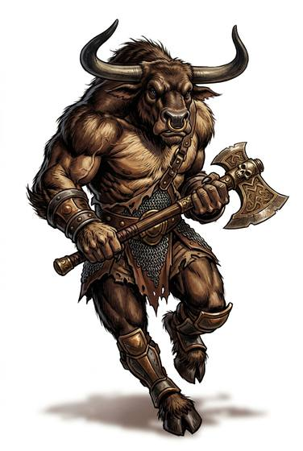

# Minotaur-kind

{.illus}

*Set: Core*

*aka: ______________________________*

*Family: [Ungulate](../Species_Families/ungulate.md)*

A bull's head on a giant's shoulders. The bull-headed are made for fighting, not grazing: towering, heavily muscled, crowned with horns that can open a man like a sack of grain. When one lowers its head and charges, walls give way. They are fearsome to look at, and they know it.

They are also heavy on their feet and quick to anger. Old stories cast them as lonely monsters prowling a maze, but most live in clans and some have built whole empires, with war-galleys crewed by bull-headed marines. Their honour is touchy and their tempers short. Allies value them in the front rank, learn not to laugh at them, and never stand between one and the exit.

## Not to be confused with

*[Bovine folk](ungulate-bovine-folk.md)*, the herd-dwelling cattle people; the bull-headed are warriors rather than grazers, larger, fiercer and slower on their feet.

## What sets this species apart

Bull-headed fighters rather than herd grazers: horned, fearsome, heavy-footed.

## Breeds and races

Each block below is one set of numbers; breeds that share every number share a block (Species rules, rule 9). Attributes are final modifiers, the size trade-off included. Skills, powers and weapon groups are final levels after the family, species and breed layers.

### No. 803 Minotaur *(genres: myth and legend, beast-folk: fur; starter)*

- **Size:** large · **Body:** biped
- **What it's like:** Huge bull-headed warriors of immense strength who charge horns first. (looks like: bull; good at: strength, fighting, wilderness)
- **Attributes:** STR +5 AGI −2 END +1 INT −1
- **Skills:** [Intimidation](../Skills/intimidation.md) +2, [Wayfinding](../Skills/wayfinding.md) +2, [Danger Sense](../Skills/danger-sense.md) +1, [Running](../Skills/running.md) +1, [Survival: Plains & Steppe](../Skills/survival-plains-and-steppe.md) +1, [Composure](../Skills/composure.md) −1, [Sleight of Hand](../Skills/sleight-of-hand.md) −1, [Stealth](../Skills/stealth.md) −1, [Climbing](../Skills/climbing.md) −2
- **Natural attacks:** hooves 1d6+2, horns 1d6+3
- **For the Game Master only, this race as an NPC guard or soldier (not your character's numbers):** Attack 15 · Parry 12 · Dodge 5 · Damage horns 2d6; longsword 1d6+5 · Armour 2 · Life 22 · Threat 2 ([Bestiary roles](../bestiary.md))
- *Why:* Never lost in a maze, but quick to lose its temper.

### No. 804 Seafaring minotaur clan *(genres: beast-folk: fur, sea and sky)*

- **Size:** large · **Body:** biped
- **What it's like:** Bull-headed minotaur seafarers whose warrior clans built a whole naval empire. (looks like: bull; good at: strength, fighting)
- **Attributes:** STR +5 AGI −2 END +1 INT −1
- **Skills:** [Intimidation](../Skills/intimidation.md) +2, [Danger Sense](../Skills/danger-sense.md) +1, [Running](../Skills/running.md) +1, [Sailing & Seamanship](../Skills/sailing-and-seamanship.md) +1, [Survival: Plains & Steppe](../Skills/survival-plains-and-steppe.md) +1, [Sleight of Hand](../Skills/sleight-of-hand.md) −1, [Stealth](../Skills/stealth.md) −1, [Climbing](../Skills/climbing.md) −2
- **Natural attacks:** hooves 1d6+2, horns 1d6+3
- **For the Game Master only, this race as an NPC guard or soldier (not your character's numbers):** Attack 15 · Parry 12 · Dodge 5 · Damage horns 2d6; longsword 1d6+5 · Armour 2 · Life 22 · Threat 2 ([Bestiary roles](../bestiary.md))
- *Why:* A seafaring warrior people.

