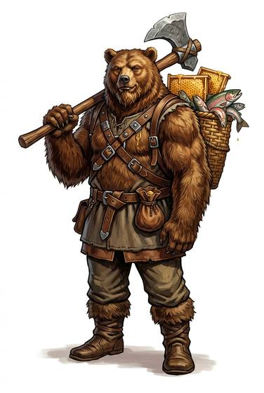

# Bear-folk

{.illus}

*Set: Core*

*aka: ______________________________*

*Family: [Ursine](../Species_Families/ursine.md)*

True bears on two legs: brown, black, white, shaggy or sleek, from the great humped grizzly to the small tropical forager with a long tongue for insects. Whatever their line, bear-folk are big, strong and omnivorous, with thick fur, heavy claws and a nose so fine it can smell a honey cache over the next ridge, or a stranger's fear across a crowded room.

Many sleep deeply through the cold months if they can. Forest and mountain breeds climb; the white bears swim the icy seas and hunt from the floes. Temperaments vary, but most are patient until they are not. In mixed towns bear-folk are welcome as woodcutters, guards and smiths, and feared as neighbours when the larder runs low.

## Not to be confused with

*[Arctic folk](ursine-arctic-folk.md)*, big furred cold-world people often grouped with bears; bear-folk are true bears, with the bear's nose and claws.

## What sets this species apart

True bears, with a bear's extraordinary nose.

## Breeds and races

Each block below is one set of numbers; breeds that share every number share a block (Species rules, rule 9). Attributes are final modifiers, the size trade-off included. Skills, powers and weapon groups are final levels after the family, species and breed layers.

### No. 820 Brown bear-folk · No. 824 Carnivore-caste bear-folk *(genres: beast-folk: fur; starter)*

- **Size:** large · **Body:** biped+tailed
- **What it's like:** Huge, furry forest folk with great strength, thick hide and a big appetite. (looks like: bear; good at: strength, toughness, fighting)
- **Attributes:** STR +4 AGI −2 END +2 INT −1
- **Skills:**, [Fishing](../Skills/fishing.md) +2, [Lifting & Carrying](../Skills/lifting-and-carrying.md) +2, [Foraging](../Skills/foraging.md) +1, [Intimidation](../Skills/intimidation.md) +1, [Survival: Forest (Woodcraft)](../Skills/survival-forest-woodcraft.md) +1, [Tracking](../Skills/tracking.md) +1, [Sleight of Hand](../Skills/sleight-of-hand.md) −1, [Stealth](../Skills/stealth.md) −1, [Acrobatics](../Skills/acrobatics.md) −2
- **Weapon groups:** [Wrestling & Grappling](../Weapon_Groups/wrestling-and-grappling.md) +2
- **Natural attacks:** claws 1d6+1, bite 1d6+1
- **For the Game Master only, this race as an NPC guard or soldier (not your character's numbers):** Attack 14 · Parry 11 · Dodge 5 · Damage longsword 1d6+2; claws 1d6+4 · Armour 2 · Life 23 · Threat 2 ([Bestiary roles](../bestiary.md))
- *Brown bear-folk:* Same as its species; hibernation and forest-mountain range are lexicon detail.
- *Carnivore-caste bear-folk:* Same as its species; predator stigma is a Culture matter.

### No. 821 Black bear-folk *(genres: beast-folk: fur)*

- **Size:** large · **Body:** biped+tailed
- **What it's like:** Agile black bear folk, strong climbers equally happy fishing or foraging in the forest. (looks like: bear; good at: climbing, strength)
- **Attributes:** STR +4 AGI −2 END +2 INT −1
- **Skills:** [Climbing](../Skills/climbing.md) +2, [Fishing](../Skills/fishing.md) +2, [Lifting & Carrying](../Skills/lifting-and-carrying.md) +2, [Foraging](../Skills/foraging.md) +1, [Intimidation](../Skills/intimidation.md) +1, [Survival: Forest (Woodcraft)](../Skills/survival-forest-woodcraft.md) +1, [Tracking](../Skills/tracking.md) +1, [Sleight of Hand](../Skills/sleight-of-hand.md) −1, [Stealth](../Skills/stealth.md) −1, [Acrobatics](../Skills/acrobatics.md) −2
- **Weapon groups:** [Wrestling & Grappling](../Weapon_Groups/wrestling-and-grappling.md) +2
- **Natural attacks:** claws 1d6+1, bite 1d6+1
- **For the Game Master only, this race as an NPC guard or soldier (not your character's numbers):** Attack 14 · Parry 11 · Dodge 5 · Damage longsword 1d6+2; claws 1d6+4 · Armour 2 · Life 23 · Threat 2 ([Bestiary roles](../bestiary.md))
- *Why:* Strong, agile climbers.

### No. 822 Polar bear-folk *(genres: beast-folk: fur)*

- **Size:** huge · **Body:** biped+tailed
- **What it's like:** Huge white bear folk built for the ice, powerful swimmers who ambush prey in freezing cold. (looks like: bear; good at: swimming, strength)
- **Attributes:** STR +6 AGI −4 END +2 INT −1
- **Skills:**, [Fishing](../Skills/fishing.md) +2, [Lifting & Carrying](../Skills/lifting-and-carrying.md) +2, [Survival: Arctic](../Skills/survival-arctic.md) +2, [Swimming](../Skills/swimming.md) +2, [Foraging](../Skills/foraging.md) +1, [Intimidation](../Skills/intimidation.md) +1, [Tracking](../Skills/tracking.md) +1, [Sleight of Hand](../Skills/sleight-of-hand.md) −1, [Stealth](../Skills/stealth.md) −1, [Acrobatics](../Skills/acrobatics.md) −2
- **Powers:** [Resist Element](../Powers/resist-element.md) 2
- **Weapon groups:** [Wrestling & Grappling](../Weapon_Groups/wrestling-and-grappling.md) +2
- **Natural attacks:** claws 1d6+1, bite 1d6+1
- **For the Game Master only, this race as an NPC guard or soldier (not your character's numbers):** Attack 14 · Parry 11 · Dodge 2 · Damage claws 2d6; bite 1d6+6 · Armour 2 · Life 27 · Threat 2 ([Bestiary roles](../bestiary.md))
- *Why:* Ice-hunting swimmers immune to cold, not forest dwellers.
- *Note:* Element is cold.

### No. 823 Grizzly-folk *(genres: beast-folk: fur)*

- **Size:** huge · **Body:** biped+tailed
- **What it's like:** Massive, hump-shouldered grizzly folk with long digging claws and a short temper about their territory. (looks like: bear; good at: strength, fighting)
- **Attributes:** STR +6 AGI −4 END +2 INT −1 COU +1
- **Skills:**, [Fishing](../Skills/fishing.md) +2, [Intimidation](../Skills/intimidation.md) +2, [Lifting & Carrying](../Skills/lifting-and-carrying.md) +2, [Foraging](../Skills/foraging.md) +1, [Survival: Forest (Woodcraft)](../Skills/survival-forest-woodcraft.md) +1, [Tracking](../Skills/tracking.md) +1, [Sleight of Hand](../Skills/sleight-of-hand.md) −1, [Stealth](../Skills/stealth.md) −1, [Acrobatics](../Skills/acrobatics.md) −2
- **Weapon groups:** [Wrestling & Grappling](../Weapon_Groups/wrestling-and-grappling.md) +2
- **Natural attacks:** claws 1d6+1, bite 1d6+1
- **For the Game Master only, this race as an NPC guard or soldier (not your character's numbers):** Attack 15 · Parry 12 · Dodge 2 · Damage claws 2d6; bite 1d6+6 · Armour 2 · Life 27 · Threat 2 ([Bestiary roles](../bestiary.md))
- *Why:* Long digging claws and fierce territorial defence.
- *Note:* Its long claws are the family's strong claws attack.

### Sun bear-folk *(NPC only)*

- **Size:** medium · **Body:** biped+tailed
- **Attributes:** STR +2 AGI −2 END +2 INT −1
- **Skills:**, [Fishing](../Skills/fishing.md) +2, [Foraging](../Skills/foraging.md) +2, [Lifting & Carrying](../Skills/lifting-and-carrying.md) +2, [Intimidation](../Skills/intimidation.md) +1, [Survival: Forest (Woodcraft)](../Skills/survival-forest-woodcraft.md) +1, [Survival: Jungle & Swamp](../Skills/survival-jungle-and-swamp.md) +1, [Tracking](../Skills/tracking.md) +1, [Sleight of Hand](../Skills/sleight-of-hand.md) −1, [Stealth](../Skills/stealth.md) −1, [Acrobatics](../Skills/acrobatics.md) −2
- **Weapon groups:** [Wrestling & Grappling](../Weapon_Groups/wrestling-and-grappling.md) +2
- **Natural attacks:** claws 1d6+1, bite 1d6+1
- **For the Game Master only, this race as an NPC guard or soldier (not your character's numbers):** Attack 14 · Parry 11 · Dodge 6 · Damage longsword 1d6+2; claws 1d6+2 · Armour 2 · Life 19 · Threat 1 ([Bestiary roles](../bestiary.md))
- *Why:* Tropical insect-foragers with long claws and tongue.

### Sloth bear-folk *(NPC only)*

- **Size:** medium · **Body:** biped+tailed
- **Attributes:** STR +2 AGI −2 END +2 INT −1
- **Skills:**, [Fishing](../Skills/fishing.md) +2, [Foraging](../Skills/foraging.md) +2, [Intimidation](../Skills/intimidation.md) +2, [Lifting & Carrying](../Skills/lifting-and-carrying.md) +2, [Survival: Forest (Woodcraft)](../Skills/survival-forest-woodcraft.md) +1, [Tracking](../Skills/tracking.md) +1, [Sleight of Hand](../Skills/sleight-of-hand.md) −1, [Stealth](../Skills/stealth.md) −1, [Acrobatics](../Skills/acrobatics.md) −2
- **Weapon groups:** [Wrestling & Grappling](../Weapon_Groups/wrestling-and-grappling.md) +2
- **Natural attacks:** claws 1d6+1, bite 1d6+1
- **For the Game Master only, this race as an NPC guard or soldier (not your character's numbers):** Attack 14 · Parry 11 · Dodge 6 · Damage longsword 1d6+2; claws 1d6+2 · Armour 2 · Life 19 · Threat 1 ([Bestiary roles](../bestiary.md))
- *Why:* Specialist insect-foragers with loud, startling calls.

### Cave bear-folk *(beast)*

- **Size:** huge · **Body:** biped+tailed
- **Attributes:** STR +7 AGI −4 END +2 INT −4
- **Skills:**, [Fishing](../Skills/fishing.md) +2, [Lifting & Carrying](../Skills/lifting-and-carrying.md) +2, [Foraging](../Skills/foraging.md) +1, [Intimidation](../Skills/intimidation.md) +1, [Survival: Forest (Woodcraft)](../Skills/survival-forest-woodcraft.md) +1, [Tracking](../Skills/tracking.md) +1, [Sleight of Hand](../Skills/sleight-of-hand.md) −1, [Stealth](../Skills/stealth.md) −1, [Acrobatics](../Skills/acrobatics.md) −2
- **Weapon groups:** [Wrestling & Grappling](../Weapon_Groups/wrestling-and-grappling.md) +2
- **Natural attacks:** claws 1d6+1, bite 1d6+1
- **For the Game Master only, this race as an NPC guard or soldier (not your character's numbers):** Attack 15 · Parry — · Dodge 2 · Damage claws 2d6; bite 1d6+6 · Armour 0 · Life 25 · Threat 1 ([Bestiary roles](../bestiary.md))
- *Why:* Same as its species; massive size is an attribute matter.

### Spectacled bear-folk *(NPC only)*

- **Size:** medium · **Body:** biped+tailed
- **Attributes:** STR +2 AGI −2 END +2 INT −1
- **Skills:** [Climbing](../Skills/climbing.md) +2, [Fishing](../Skills/fishing.md) +2, [Lifting & Carrying](../Skills/lifting-and-carrying.md) +2, [Foraging](../Skills/foraging.md) +1, [Intimidation](../Skills/intimidation.md) +1, [Survival: Forest (Woodcraft)](../Skills/survival-forest-woodcraft.md) +1, [Tracking](../Skills/tracking.md) +1, [Sleight of Hand](../Skills/sleight-of-hand.md) −1, [Stealth](../Skills/stealth.md) −1, [Acrobatics](../Skills/acrobatics.md) −2
- **Weapon groups:** [Wrestling & Grappling](../Weapon_Groups/wrestling-and-grappling.md) +2
- **Natural attacks:** claws 1d6+1, bite 1d6+1
- **For the Game Master only, this race as an NPC guard or soldier (not your character's numbers):** Attack 14 · Parry 11 · Dodge 6 · Damage longsword 1d6+2; claws 1d6+2 · Armour 2 · Life 19 · Threat 1 ([Bestiary roles](../bestiary.md))
- *Why:* Strong climbers.

### Moon bear-folk *(NPC only)*

- **Size:** medium · **Body:** biped+tailed
- **Attributes:** STR +2 AGI −2 END +2 INT −1
- **Skills:** [Climbing](../Skills/climbing.md) +2, [Fishing](../Skills/fishing.md) +2, [Lifting & Carrying](../Skills/lifting-and-carrying.md) +2, [Foraging](../Skills/foraging.md) +1, [Intimidation](../Skills/intimidation.md) +1, [Survival: Forest (Woodcraft)](../Skills/survival-forest-woodcraft.md) +1, [Tracking](../Skills/tracking.md) +1, [Sleight of Hand](../Skills/sleight-of-hand.md) −1, [Stealth](../Skills/stealth.md) −1, [Acrobatics](../Skills/acrobatics.md) −2
- **Powers:** [Night & Spectrum Sight](../Powers/night-and-spectrum-sight.md) 1
- **Weapon groups:** [Wrestling & Grappling](../Weapon_Groups/wrestling-and-grappling.md) +2
- **Natural attacks:** claws 1d6+1, bite 1d6+1
- **For the Game Master only, this race as an NPC guard or soldier (not your character's numbers):** Attack 14 · Parry 11 · Dodge 6 · Damage longsword 1d6+2; claws 1d6+2 · Armour 2 · Life 19 · Threat 1 ([Bestiary roles](../bestiary.md))
- *Why:* Strong climbers and night foragers.

