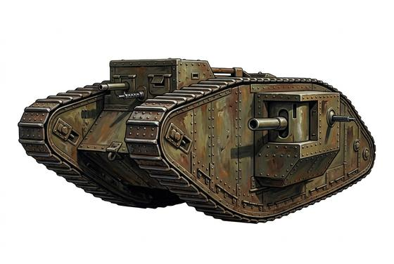

# Early Tank

{.illus}

*Set: Expansion*

*Electricity · Land vehicles*

Tracks carry it over trenches and rubble; its older gun does 2d6 less than a tank gun.

## Game block

- **Skill:** Driving
- **Needs:** electricity
- **Size:** huge
- **Speed:** 25 / 45
- **Crew:** 5
- **Passengers:** 0
- **Cargo:** 200 kg
- **Handling:** −2
- **Armour:** 10 front / 14 sides
- **Structure:** 200
- **Weapons:** 1 × Tank Gun, 2 × Mounted Machine Gun
- **Price:** 2000 G

