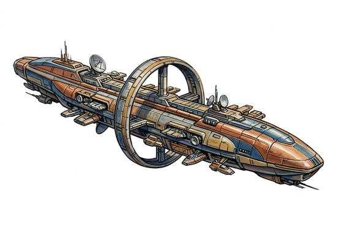

# Explorer Ship

{.illus}

*Set: Expansion*

*Far future · Spacecraft*

Labs, landers and long-range sensors for the unknown; built by governments and great houses.

## Game block

- **Skill:** Ship Command
- **Needs:** far future
- **Size:** gigantic
- **Speed:** jump: 5 light-years a day
- **Crew:** 20
- **Passengers:** 30
- **Cargo:** 200 t
- **Handling:** 0
- **Armour:** 15
- **Structure:** 1,200
- **Weapons:** 2 × Ship's Laser, 2 × Point-Defence Gun
- **Price:** —

