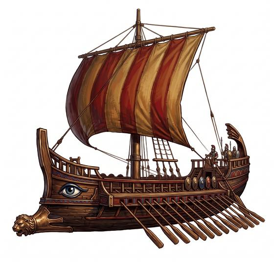

# Galley

{.illus}

*Set: Core*

*Iron to gunpowder · Boats and ships*

Rowed by three banks of oars; its bronze ram sinks ships (hits as 10d6 against a hull).

## Game block

- **Skill:** Ship Command
- **Needs:** iron
- **Size:** gigantic
- **Speed:** 8 / 17
- **Crew:** 170
- **Passengers:** 30
- **Cargo:** 10 t
- **Handling:** −1
- **Armour:** 5
- **Structure:** 300
- **Weapons:** —
- **Price:** 2000 G

