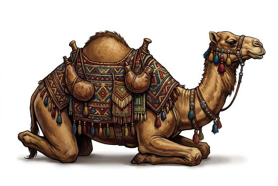

# Riding Camel

{.illus}

*Set: Core*

*Stone to bronze · Riding animals*

Goes a week without water; horses shy from its smell.

## Game block

- **Skill:** Riding
- **Needs:** agriculture
- **Size:** large
- **Speed:** 5 / 40
- **Crew:** 1
- **Passengers:** 0
- **Cargo:** 150 kg
- **Handling:** 0
- **Armour:** 0
- **Structure:** animal: see Bestiary (dromedary camel), Life 25
- **Weapons:** —
- **Price:** 25 G

