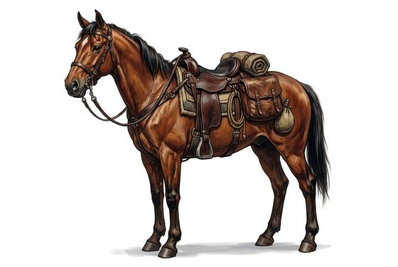

# Riding Horse

{.illus}

*Set: Core*

*Stone to bronze · Riding animals*

The everyday mount; a second small rider can sit behind at −1 handling.

## Game block

- **Skill:** Riding
- **Needs:** agriculture
- **Size:** large
- **Speed:** 8 / 60
- **Crew:** 1
- **Passengers:** 0
- **Cargo:** 30 kg
- **Handling:** +1
- **Armour:** 0
- **Structure:** animal: see Bestiary (riding horse), Life 21
- **Weapons:** —
- **Price:** 30 G

