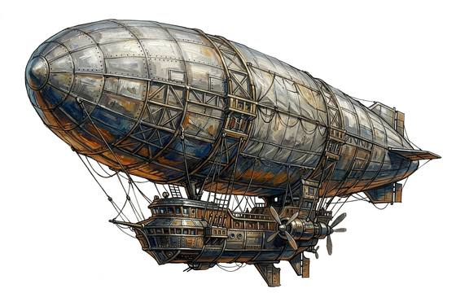

# Rigid Airship

{.illus}

*Set: Expansion*

*Electricity · Aircraft*

A gas-filled giant with a metal frame; owned by airlines; fare: 10 s a day's journey.

## Game block

- **Skill:** Aircraft Piloting
- **Needs:** electricity
- **Size:** gigantic
- **Speed:** 100 / 130
- **Crew:** 40
- **Passengers:** 50
- **Cargo:** 10 t
- **Handling:** −3
- **Armour:** 0
- **Structure:** 200
- **Weapons:** —
- **Price:** —

