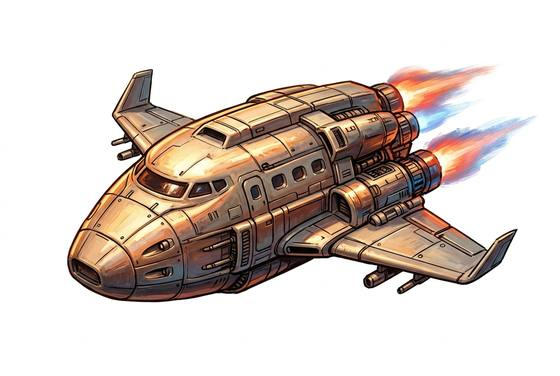

# Shuttle

{.illus}

*Set: Core*

*Spaceflight · Spacecraft*

Lands on a runway; fare: 20 s surface to orbit.

## Game block

- **Skill:** Spacecraft Piloting
- **Needs:** spaceflight
- **Size:** huge
- **Speed:** in-system: surface to orbit in minutes, weeks between planets
- **Crew:** 2
- **Passengers:** 10
- **Cargo:** 5 t
- **Handling:** −1
- **Armour:** 4
- **Structure:** 200
- **Weapons:** —
- **Price:** 1000 G

