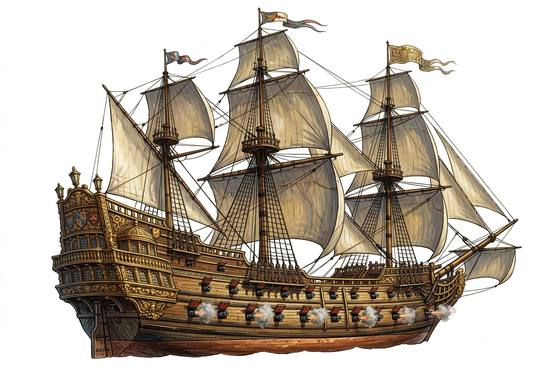

# War Galleon

{.illus}

*Set: Expansion*

*Iron to gunpowder · Boats and ships*

A floating fortress; costs a kingdom's treasure, so only crowns and navies own one.

## Game block

- **Skill:** Ship Command
- **Needs:** gunpowder
- **Size:** gigantic
- **Speed:** 7 / 15
- **Crew:** 200
- **Passengers:** 100
- **Cargo:** 400 t
- **Handling:** −2
- **Armour:** 10
- **Structure:** 400
- **Weapons:** 30 × Ship's Cannon, 4 × Swivel Gun
- **Price:** —

