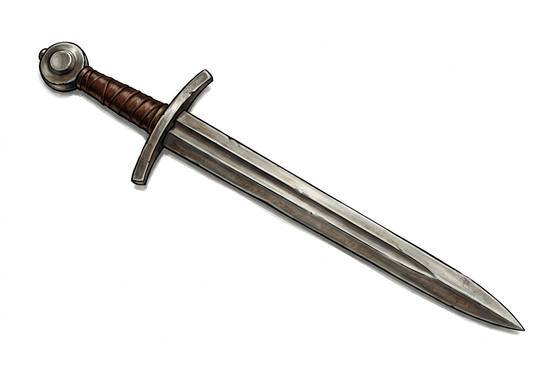

# Arming Sword

{.illus}

*Set: Core*

*aka: ______________________________*

*Era: Iron (needs iron) · Western kingdoms · Knightly and common warfare*

A straight, double-edged sword for one hand, with a cross-shaped guard and a round or wheel-shaped pommel. It is the knight's sword of everyday life, worn at the hip on a belt and used with a shield or a buckler. Men-at-arms, sergeants and wealthier townsfolk carry it too.

It cuts and thrusts equally well and is light enough to swing all day. In a mounted charge it follows the lance; on foot it is the companion of the shield. Against mail it struggles, and against plate it is little more than a steel bar, which is why the sword grew longer and more pointed as armour improved. Still, for most of its long life, it was simply the sword.

## Game block

- **Group:** [Swords](../Weapon_Groups/swords.md) · **Damage:** 1d6+1· **Strength number:** 10
- **Hands:** one · **Weight:** 1.1 kg · **Price:** 60 S
- **Notes:** the single-handed knightly sword
- **Techniques (from the group):** Half-Swording, Binding the Blade, Draw and Cut
- **Also appears as:** *Northern Sword* (Northern tribes)

## Not to be confused with

the *[Longsword](longsword.md)*, which has a longer grip and blade and can be used in two hands.

