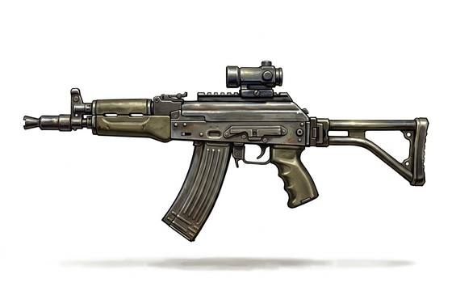

# Assault Rifle

{.illus}

*Set: Expansion*

*aka: ______________________________*

*Era: Electricity (needs electricity) · Modern armies and police*

A light rifle that can fire single shots or short bursts from a curved box magazine. It is the standard weapon of the modern soldier, and in some form the most common weapon ever made. Its rounds are smaller than those of old battle rifles, so a soldier carries more of them, and the gun is controllable enough to fire on the move.

It is rugged and forgiving. Some patterns will fire after being buried in mud, and a recruit can learn to take one apart blindfold in an afternoon. It turns up everywhere: in regular armies, in rebel camps, on the flags of new nations. Its outline is instantly recognised, and the sight of one changes how everyone in the room behaves.

## Game block

- **Group:** [Automatic Weapons](../Weapon_Groups/automatic-weapons.md) · **Damage:** 2d6· **Strength number:** 9
- **Hands:** two · **Range (m):** 5/50/200/400/600 · **Reload:** 30 shots, 1 round · **Weight:** 3.5 kg · **Price:** 10 S
- **Notes:** bursts or single shots
- **Techniques (from the group):** Controlled Burst, Suppressing Fire

## Not to be confused with

the *[Battle Rifle](battle-rifle.md)*, an older and heavier automatic rifle firing full-power rounds, harder to control but hitting harder and farther.

